```mermaid
graph LR
    A[入力] --> B[エンコーダ]
    B --> C[Attention]
    C --> D[デコーダ]
    D --> E[出力]
```

<div align="center">
 https://0h-n0.github.io/
</div>

# HOGEHOGE for MLE/DS

機械学習エンジニアとデータサイエンティストのための情報共有サイト。

## 📝 ML論文ブログ執筆ガイド

### 論文記事テンプレート

新しい論文解説記事を作成する際は、[`_drafts/paper-template.md`](_drafts/paper-template.md) をコピーして使用してください。

```bash
# テンプレートをコピーして新規記事作成
cp _drafts/paper-template.md _posts/blog/$(date +%Y-%m-%d)-paper-title.md
```

### 必須のfrontmatter設定

すべての記事には以下のfrontmatter設定が必要です：

```yaml
---
layout: post
title: "論文解説: [Title]"
description: "[Abstract要約]"
categories: [TechBlog]
tags: [ML, arXiv, ...]
math: true       # 数式を使用する場合は必須
mermaid: true    # 図表を使用する場合は必須
---
```

### 論文バッジの追加

記事冒頭に以下のバッジを追加することを推奨します：

```markdown

```

**利用可能なバッジ:**
- `arxiv`: arXiv ID（例: `2106.09685`）
- `github`: GitHub リポジトリ（例: `microsoft/LoRA`）
- `colab`: Google Colab URL
- `hf_space`: Hugging Face Space URL
- `paperswithcode`: Papers with Code スラッグ

### 数式の記述

MathJax を使用した数式レンダリングがサポートされています：

**インライン数式:**
```markdown
変数 $x$ と $y$ の関係は $E = mc^2$ で表されます。
```

**ディスプレイ数式:**
```markdown
$$
\mathcal{L} = -\sum_{i=1}^{N} y_i \log(\hat{y}_i)
$$
```

**変数定義を明記:**
```markdown
$$
\text{loss} = \frac{1}{N} \sum_{i=1}^{N} (y_i - \hat{y}_i)^2
$$

ここで、
- $N$: サンプル数
- $y_i$: 真のラベル
- $\hat{y}_i$: 予測値
```

### Mermaid図表の追加

システムアーキテクチャやフローチャートを Mermaid で記述できます：

````markdown

````

### インタラクティブグラフ（Plotly）

学習曲線やパフォーマンスグラフを Plotly で可視化できます：

**1. Python側でグラフを生成:**

```python
import plotly.graph_objects as go

fig = go.Figure(data=go.Scatter(
    x=[1, 2, 3, 4, 5],
    y=[0.5, 0.6, 0.7, 0.75, 0.8],
    mode='lines+markers',
    name='Training Loss'
))

fig.update_layout(
    title='Training Loss Curve',
    xaxis_title='Epoch',
    yaxis_title='Loss'
)

fig.write_html("assets/graphs/training_loss.html")
```

**2. 記事側で埋め込み:**

```markdown

```

### コードブロックの記述

コードブロックには自動的に行番号が表示されます：

````markdown
```python
# lora_layer.py
class LoRALayer(nn.Module):
    """Low-Rank Adaptation Layer"""

    def __init__(self, in_dim: int, out_dim: int, rank: int = 4):
        super().__init__()
        self.lora_A = nn.Parameter(torch.randn(in_dim, rank))
        self.lora_B = nn.Parameter(torch.zeros(rank, out_dim))

    def forward(self, x: torch.Tensor) -> torch.Tensor:
        return x @ self.lora_A @ self.lora_B
```
````

**推奨:**
- 型ヒント（Type Hints）を使用
- Docstring を記述
- ファイル名をコメントで明記

### ローカルプレビュー

```bash
# 依存関係インストール
bundle install

# プレビューサーバー起動（localhost:4000）
bundle exec jekyll serve

# 数式・図表の確認
open http://localhost:4000
```

### 記事品質基準

- **文字数**: 2500-4000文字（日本語）
- **数式**: 変数定義を明記
- **コード**: 型ヒント・Docstring必須
- **1次情報に忠実**: 論文・ブログの内容を正確に伝える
- **実装可能なレベル**: 読者がコードを書けるレベルの詳細度

## 🛠️ 開発

```bash
# Chirpy テーマのアセット取得
git submodule update --init --recursive

# ローカルサーバー起動
bundle exec jekyll serve
```

## 📚 参考資料

- [Jekyll Chirpy テーマ](https://github.com/cotes2020/jekyll-theme-chirpy)
- [MathJax ドキュメント](https://www.mathjax.org/)
- [Mermaid ドキュメント](https://mermaid.js.org/)
- [Plotly Python](https://plotly.com/python/)
