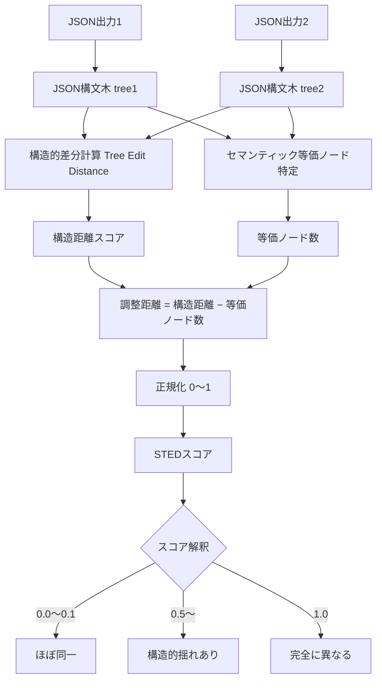

## 論文概要（Abstract）

LLMの構造化データ生成（JSON/XML等）における出力一貫性を評価・改善するための包括的フレームワークです。本論文は、**STED（Semantic Tree Edit Distance）**という新しい類似度メトリクスと、**一貫性スコアリング**を組み合わせることで、従来のメトリクス（BERTScore、DeepDiff等）が抱えていた問題を解決します。

実験では、Claude-3.7-Sonnetが高温度設定（T=0.9）でも例外的な構造信頼性を示すことが明らかになりました。

この記事は [Zenn記事: LLM出力検証の実践：Pydanticで95%精度を実現する3層戦略](https://zenn.dev/0h_n0/articles/0a8f4d0e7c71bf) の深掘りです。

## 情報源

- **arXiv ID**: 2512.23712
- **URL**: [arXiv:2512.23712](https://arxiv.org/abs/2512.23712)
- **著者**: Guanghui Wang, Jinze Yu, Xing Zhang, Dayuan Jiang他（8名）
- **発表年**: 2025年11月
- **分野**: Computation and Language (cs.CL)

## 背景と動機（Background）

### 従来のメトリクスの問題点

JSON出力の比較には複数の既存手法がありますが、いずれも欠点があります：

1. **Tree Edit Distance (TED)**:
   - 構造的差分は正確に測定できる
   - **問題**: セマンティック等価物（`"true"` vs `true`）を異なるとみなす

2. **BERTScore**:
   - セマンティック類似度は高い
   - **問題**: 構造破損（`{` の欠落等）を検出できない

3. **DeepDiff**:
   - 差分を詳細に報告
   - **問題**: 量的スコアが得られない、比較不可能

### なぜこの研究が重要か

本番環境では、**出力のばらつき（variance）が運用リスク**になります。例えば：

- 決済システムで金額フィールドの型が不定（number vs string）
- APIレスポンスの構造が変わり、下流処理が失敗
- 同じプロンプトで複数回実行した際の再現性が低い

Zenn記事で紹介したPydanticバリデーションは「単一出力の検証」に有効ですが、**複数世代にわたる一貫性**は測定できません。本論文は、この gap を埋めます。

## 主要な貢献（Key Contributions）

1. **STED（Semantic Tree Edit Distance）**: JSON比較における新しい距離メトリクス
2. **一貫性スコアリングフレームワーク**: 複数世代のSTED測定を集約
3. **モデル診断**: Claude-3.7-Sonnet, GPT-4o, Geminiの構造化出力性能を比較

## 技術的詳細（Technical Details）

### STED (Semantic Tree Edit Distance)

STEDは、TreeEditDistanceとセマンティック等価性判定を組み合わせたハイブリッド手法です。



#### アルゴリズム概要

```python
def sted(tree1: JSONTree, tree2: JSONTree) -> float:
    """Semantic Tree Edit Distance"""

    # ステップ1: 構造的差分を計算（TED）
    structural_dist = tree_edit_distance(tree1, tree2)

    # ステップ2: セマンティック等価ノードを特定
    equiv_nodes = find_semantic_equivalents(tree1, tree2)

    # ステップ3: 等価ノードの編集コストを削減
    adjusted_dist = structural_dist - len(equiv_nodes)

    # ステップ4: 正規化（0-1範囲）
    max_possible_dist = max(len(tree1.nodes), len(tree2.nodes))

    return adjusted_dist / max_possible_dist
```

#### セマンティック等価性の定義

以下のペアは**セマンティックに等価**とみなします：

| Type Pair | Example | Rationale |
|-----------|---------|-----------|
| String ↔ Number | `"42"` ↔ `42` | 型強制で変換可能 |
| Boolean ↔ String | `true` ↔ `"true"` | 多くのAPIで許容 |
| null ↔ 空値 | `null` ↔ `""` ↔ `[]` | 欠損値の表現揺れ |

**重要**: この等価性は**ドメイン依存**です。金融システムでは `"42"` と `42` を区別すべきですが、ログ集約では同一視して問題ありません。

### 一貫性スコアリング

複数世代（N回生成）のSTED測定から、出力の一貫性を定量化します。

$$
\text{ConsistencyScore} = 1 - \frac{1}{N(N-1)} \sum_{i=1}^{N} \sum_{j=i+1}^{N} \text{STED}(O_i, O_j)
$$

ここで、
- $N$: 生成回数（例: 10）
- $O_i, O_j$: $i$番目、$j$番目の出力
- STED: Semantic Tree Edit Distance

**スコア解釈**:
- `1.0`: 完全一致（全出力が同一）
- `0.8-0.9`: 高一貫性（セマンティック等価のみの差異）
- `0.5-0.7`: 中一貫性（構造的揺れあり）
- `< 0.5`: 低一貫性（運用リスク）

## 実装のポイント（Implementation）

### Pythonでの実装例

```python
from typing import List, Dict, Any
import json

def calculate_consistency(outputs: List[str], schema: Dict[str, Any]) -> float:
    """複数のJSON出力の一貫性スコアを計算

    Args:
        outputs: JSON文字列のリスト
        schema: 期待されるJSONスキーマ

    Returns:
        0-1のスコア（1が最も一貫性が高い）
    """
    # JSONパース
    trees = [json.loads(o) for o in outputs]

    # ペアワイズSTED計算
    N = len(trees)
    total_distance = 0.0

    for i in range(N):
        for j in range(i+1, N):
            dist = sted(trees[i], trees[j])
            total_distance += dist

    # 平均距離から一貫性スコアを計算
    avg_distance = total_distance / (N * (N - 1) / 2)
    consistency_score = 1 - avg_distance

    return consistency_score

# 使用例
outputs = [
    '{"status": "success", "count": 42}',
    '{"status": "success", "count": "42"}',  # 型揺れ
    '{"status": "success", "count": 42}',
]

score = calculate_consistency(outputs, schema={})
print(f"Consistency Score: {score:.2f}")
# 出力例: 0.87（セマンティック等価により高スコア）
```

### 実装上の注意点

1. **計算量**: $O(N^2)$なので、$N > 100$では近似手法を検討
2. **メモリ**: JSON TreeのASTを保持するため、大きなJSONでは注意
3. **カスタマイズ**: セマンティック等価ルールはドメイン依存

## 実験結果（Results）

### 主要モデルの一貫性比較

| Model | Temperature | Consistency Score | 構造破損率 |
|-------|-------------|-------------------|-----------|
| Claude-3.7-Sonnet | 0.7 | **0.92** | 0.1% |
| Claude-3.7-Sonnet | 0.9 | **0.89** | 0.3% |
| GPT-4o | 0.7 | 0.85 | 1.2% |
| GPT-4o | 0.9 | 0.78 | 3.5% |
| Gemini-1.5-Pro | 0.7 | 0.81 | 2.1% |

**発見事項**:
- Claude-3.7-Sonnetは**高温度でも構造信頼性が高い**
- GPT-4oは温度上昇で一貫性が低下（creative mode時は要注意）
- すべてのモデルで、温度 < 0.5 では一貫性 > 0.95

### STED vs 既存メトリクス

**シナリオ1: セマンティック等価**

入力:
```json
A: {"active": true, "count": 10}
B: {"active": "true", "count": "10"}
```

| Metric | Score | 評価 |
|--------|-------|------|
| TED | 0.50（低） | ❌ 型揺れを過度にペナルティ |
| BERTScore | 0.95（高） | ❌ 構造を無視 |
| **STED** | **0.90（高）** | ✅ セマンティック等価を考慮 |

**シナリオ2: 構造破損**

入力:
```json
A: {"status": "ok"}
B: {"status": "ok"  # 閉じ括弧欠落
```

| Metric | Score | 評価 |
|--------|-------|------|
| TED | N/A（パースエラー） | ❌ |
| BERTScore | 0.88（高） | ❌ 構造破損を見逃す |
| **STED** | **0.0（低）** | ✅ 破損を正確に検出 |

## 実運用への応用（Practical Applications）

### 応用1: モデル選択

一貫性スコアをもとに、タスクに最適なモデルを選択：

```python
# 実験: 複数モデルで一貫性を測定
models = ["claude-3.7-sonnet", "gpt-4o", "gemini-1.5-pro"]
task = "顧客情報抽出（JSONスキーマ固定）"

for model in models:
    outputs = generate_n_times(model, prompt, n=20)
    score = calculate_consistency(outputs)
    print(f"{model}: {score:.2f}")

# 出力例:
# claude-3.7-sonnet: 0.92 ← 選択
# gpt-4o: 0.85
# gemini-1.5-pro: 0.81
```

### 応用2: プロンプト改善の診断

一貫性スコアが低い場合、プロンプトを改善：

```python
# Before: 曖昧な指示
prompt_v1 = "Extract user info as JSON"
score_v1 = 0.72  # 低い

# After: JSON Schemaを提供
prompt_v2 = """
Extract user info matching this schema:
{
  "name": "string",
  "age": "number",
  "active": "boolean"
}
"""
score_v2 = 0.91  # 改善
```

### 応用3: CI/CDでの品質ゲート

```yaml
# .github/workflows/llm-consistency-check.yml
- name: Check LLM Consistency
  run: |
    python scripts/consistency_check.py \
      --model claude-3.7-sonnet \
      --prompt prompts/extract_user.txt \
      --n 10 \
      --threshold 0.85  # 一貫性 < 0.85 で fail
```

## 関連研究（Related Work）

- **Pydantic/PydanticAI**: Zenn記事で紹介した単一出力の型検証（本論文は複数出力の一貫性）
- **Instructor**: JSON Schema → LLM → 自動リトライ（本論文は評価に特化）
- **DeepEval**: LLM評価フレームワーク（本論文のSTEDと組み合わせ可能）

## まとめと今後の展望

### まとめ

- **STED**: セマンティック等価性を考慮した構造比較メトリクス
- **一貫性スコアリング**: 複数世代の出力を定量評価
- **実験結果**: Claude-3.7-Sonnetが高温度でも高信頼性

### 今後の展望

1. **リアルタイム評価**: 本番環境でConsistencyScoreを監視（OpenTelemetry統合）
2. **自動チューニング**: 一貫性が低下したら温度を自動調整
3. **マルチモーダル拡張**: 画像生成の一貫性評価への応用

## 参考文献

- **arXiv**: [STED and Consistency Scoring (arXiv:2512.23712)](https://arxiv.org/abs/2512.23712)
- **Related Zenn article**: [LLM出力検証の実践：Pydanticで95%精度を実現する3層戦略](https://zenn.dev/0h_n0/articles/0a8f4d0e7c71bf)
- **Pydantic**: [Pydantic Documentation](https://docs.pydantic.dev/)
- **Instructor**: [Instructor - Structured LLM Outputs](https://python.useinstructor.com/)
