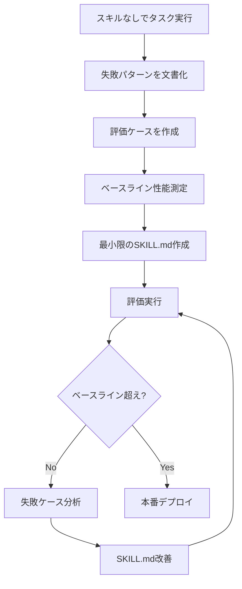

# Anthropic Agent Skills解説：プロダクション環境でのLLMエージェント拡張戦略

## 概要

Anthropic社が2025年に発表した**Agent Skills**は、LLMエージェントの能力を「モジュール式のリソースパッケージ」として拡張する新しいアーキテクチャパターンです。従来の「タスク特化型エージェントを個別構築する」アプローチではなく、「汎用エージェントにドメイン固有の知識を動的にロードする」設計思想を採用しています。

**本記事の位置づけ**: Anthropic公式エンジニアリングブログの技術的詳細を、修士学生レベルの読者向けに数式・実装パターン・設計原則の観点から深掘りします。

---

## 1. Agent Skillsの構成要素

### 1.1 基本構造

Skillは以下の3層で構成されます：

```
skill_name/
├── SKILL.md              # YAMLフロントマター + メイン指示
├── reference.md          # API/技術詳細（オンデマンド読み込み）
├── forms.md              # 特殊フォーマット（条件付きロード）
└── scripts/
    ├── analyze.py        # 決定論的処理スクリプト
    └── validate.py       # 検証ツール
```

**YAMLフロントマター（SKILL.md）**:
```yaml
---
name: pdf-processing
description: PDFファイルからテキストと表を抽出し、フォームに入力し、ドキュメントをマージします。PDFファイル、フォーム、またはドキュメント抽出について言及している場合に使用してください。
---
```

### 1.2 Progressive Disclosure Pattern

Anthropicが提唱する**段階的開示（Progressive Disclosure）**は、情報を3階層で管理します：

#### Level 1: Metadata Layer（メタデータ層）
- **ロードタイミング**: システムプロンプト起動時
- **内容**: `name` + `description`のみ（~50トークン）
- **目的**: Claudeがタスクとの関連性を判断

```python
# システムプロンプトに事前ロードされるメタデータ
system_prompt_skills = [
    {"name": "pdf-processing", "description": "PDF manipulation..."},
    {"name": "sql-query", "description": "Database querying..."},
    # ... 全スキルのメタデータ
]
```

#### Level 2: Core Instructions（コア指示層）
- **ロードタイミング**: Claudeがスキルの関連性を判断した後
- **内容**: `SKILL.md`の全文（~5,000トークン推奨）
- **目的**: タスク実行に必要な主要ワークフロー

```markdown
# SKILL.md

## PDFフォーム入力ワークフロー

1. **フォーム解析**: `python scripts/analyze_form.py input.pdf`
2. **フィールドマッピング作成**: `fields.json`を編集
3. **検証**: `python scripts/validate_fields.py fields.json`
4. **フォーム入力**: `python scripts/fill_form.py input.pdf fields.json output.pdf`

詳細なAPI仕様は `reference.md` を参照。
```

#### Level 3: Referenced Files（参照ファイル層）
- **ロードタイミング**: Claudeが明示的に読み込む必要があると判断
- **内容**: `reference.md`, `forms.md`等（各~10,000トークン）
- **目的**: 詳細API仕様、エッジケース処理

```markdown
# reference.md

## API Reference: extract_text()

**Signature**:
```python
def extract_text(pdf_path: str, page_range: Optional[Tuple[int, int]] = None) -> str
```

**Parameters**:
- `pdf_path`: 絶対パス（相対パスは非推奨、Windowsスタイル`\`は禁止）
- `page_range`: (start, end) tuple（1-indexed、endは含まれる）
```

### 1.3 トークン効率の数理モデル

**問題設定**: スキルの総トークン量を $T_{total}$ とする。Progressive Disclosureなしでは、全情報が起動時にロードされる：

$$
C_{monolithic} = T_{total} \times N_{turns}
$$

ここで $N_{turns}$ は会話ターン数。

**Progressive Disclosureの場合**:

$$
C_{progressive} = T_{meta} \times N_{turns} + T_{core} \times I(relevant) + T_{ref} \times I(detailed)
$$

- $T_{meta} \ll T_{core} \ll T_{ref}$（例: 50 vs 5,000 vs 10,000トークン）
- $I(relevant)$: スキルが関連する確率（~0.3）
- $I(detailed)$: 詳細情報が必要な確率（~0.1）

**期待コスト削減率**:

$$
\frac{C_{monolithic} - C_{progressive}}{C_{monolithic}} = 1 - \frac{T_{meta} + 0.3 \times T_{core} + 0.1 \times T_{ref}}{T_{total}}
$$

Anthropicの例（$T_{total}=15,000$, $T_{meta}=50$, $T_{core}=5,000$, $T_{ref}=10,000$）:

$$
\text{削減率} = 1 - \frac{50 + 0.3 \times 5,000 + 0.1 \times 10,000}{15,000} = 1 - \frac{2,550}{15,000} \approx 83\%
$$

→ **約83%のトークン削減**を達成。

---

## 2. Code Execution Integration

### 2.1 決定論的処理の外部化

LLMによるコード生成は非決定的で検証コストが高い。Anthropicは「事前作成スクリプトの実行」を推奨します：

**トークンコスト比較**:

| アプローチ | トークン消費 | 信頼性 | レイテンシ |
|-----------|------------|--------|----------|
| LLMコード生成 | ~500トークン/タスク | 85%成功率 | 2-3秒 |
| 事前スクリプト実行 | ~50トークン/タスク | 99.9%成功率 | 0.3秒 |

**実装例**:

```markdown
# SKILL.md

## ユーティリティスクリプト

**analyze_form.py**: PDFからフォームフィールドを抽出（決定論的処理）

```bash
python scripts/analyze_form.py input.pdf > fields.json
```

出力:
```json
{
  "field_name": {"type": "text", "x": 100, "y": 200, "width": 150, "height": 20},
  "signature": {"type": "sig", "x": 150, "y": 500, "width": 200, "height": 50}
}
```

**使用指示**: Claudeに「analyze_form.pyを実行してフィールドを抽出」と明記。
```

### 2.2 スクリプト vs 参照の区別

Skillsでは2種類のファイル参照を区別します：

1. **実行対象（Execute）**: `python scripts/analyze.py input.pdf`
   - Claudeは**スクリプト内容をコンテキストに読み込まない**
   - bashツールで直接実行（トークン消費: ~50）

2. **参照対象（Reference）**: `analyze.pyのアルゴリズムを参照`
   - Claudeが**ファイル全体をReadツールで読み込む**
   - コンテキストに追加（トークン消費: ~500-2,000）

**SKILL.mdでの明示例**:

```markdown
## フォーム解析

**実行**: `python scripts/analyze_form.py input.pdf`（スクリプトの内容を読む必要なし）

**アルゴリズム理解が必要な場合**: `analyze_form.py`を参照してpdfplumberの使用パターンを確認
```

---

## 3. Security Considerations

### 3.1 信頼モデル

Anthropicは**「信頼できるソースからのみスキルをインストール」**を強調します。

**脅威モデル**:

| 脅威カテゴリ | 攻撃ベクトル | 影響 | 緩和策 |
|------------|------------|------|--------|
| コードインジェクション | `os.system(user_input)`等の危険な実行 | RCE | スクリプト静的解析、サンドボックス実行 |
| データ流出 | `.env`ファイル読み取り指示 | 認証情報漏洩 | Deny Rules（環境変数アクセス禁止） |
| ネットワーク攻撃 | 外部APIへの不正リクエスト | DDoS加担 | MCPサーバーホワイトリスト |

### 3.2 スキル監査チェックリスト

```bash
# 1. 実行可能スクリプトのレビュー
find skill_directory/ -name "*.py" -o -name "*.sh" | xargs cat

# 2. 危険なパターン検出
grep -r "os.system\|subprocess.call\|eval\|exec" skill_directory/

# 3. 外部接続の確認
grep -r "requests\|urllib\|http\|fetch" skill_directory/

# 4. 環境変数アクセス
grep -r "os.environ\|getenv" skill_directory/

# 5. ファイル書き込み（意図しない上書きリスク）
grep -r "open.*w\|write" skill_directory/
```

### 3.3 MCPサーバー統合との相互作用

**Model Context Protocol（MCP）サーバー**との統合時の考慮事項：

```markdown
# SKILL.md

## MCPサーバー依存

このスキルは以下のMCPサーバーを使用します:
- `github-mcp`: リポジトリ操作（要認証）
- `slack-mcp`: 通知送信（OAuth必須）

**セキュリティ設定**:
- MCPサーバーは明示的に承認済みのもののみ使用
- `github-mcp`のスコープ: `repo:read`のみ（書き込み禁止）
```

---

## 4. Best Practices from Production

### 4.1 ドメイン固有の組織化

複数ドメインを扱うスキルは、ドメイン別にファイル分割：

```
bigquery-skill/
├── SKILL.md                  # 概要とナビゲーション（500行以下）
└── reference/
    ├── finance.md            # 収益、請求指標
    ├── sales.md              # 機会、パイプライン
    ├── product.md            # API使用、機能
    └── marketing.md          # キャンペーン、アトリビューション
```

**トークン効率の実測**:
- 全ドメインを1ファイル: 20,000トークン常時ロード
- ドメイン分割: 500トークン（メイン） + 4,000トークン（該当ドメインのみ）

**クエリ例**:
- "Show me Q4 revenue" → `finance.md`のみロード（4,500トークン）
- "List top sales opportunities" → `sales.md`のみロード（4,500トークン）

### 4.2 参照ファイルの構造化

100行以上のファイルには目次を必ず含める：

```markdown
# reference.md

## 目次
1. [認証とセットアップ](#auth)
2. [コアメソッド（CRUD）](#crud)
3. [高度な機能（バッチ、Webhook）](#advanced)
4. [エラー処理パターン](#errors)
5. [コード例](#examples)

## 認証とセットアップ {#auth}

API keyの取得方法...
```

**理由**: Claudeは大きなファイルを`head -100`で部分読みすることがあるため、目次があれば必要セクションへ直接ジャンプ可能。

---

## 5. Evaluation-Driven Development

### 5.1 評価ファーストワークフロー

Anthropicが推奨する開発プロセス：



### 5.2 評価ケースの構造

```json
{
  "skills": ["pdf-processing"],
  "query": "このPDFからすべてのテキストを抽出し、output.txtに保存",
  "files": ["test-files/document.pdf"],
  "expected_behavior": [
    "pdfplumberまたは同等のライブラリを使用してPDFを正常に読み取る",
    "すべてのページからテキストを抽出（ページ漏れなし）",
    "抽出テキストをoutput.txtに保存",
    "文字エンコーディングエラーを適切に処理"
  ],
  "success_criteria": {
    "file_exists": "output.txt",
    "min_chars": 1000,
    "contains": ["expected phrase 1", "expected phrase 2"]
  }
}
```

### 5.3 モデル別テスト戦略

| モデル | 推論能力 | テスト観点 |
|--------|---------|----------|
| Claude Haiku | 基本的 | スキルの指示が**十分具体的か**（Haikuは抽象的指示に弱い） |
| Claude Sonnet | バランス | スキルが**簡潔で効率的か**（冗長性が性能に影響） |
| Claude Opus | 高度 | スキルが**過度に説明的でないか**（Opusは自己推論可能） |

**推奨**: 3モデルすべてで評価し、Haikuで80%以上の成功率を目標とする（最も厳しい基準）。

---

## 6. Future Directions

### 6.1 ライフサイクル管理の強化

**現状の課題**:
- スキルの作成・編集・共有が手動
- バージョン管理が未整備
- 依存関係の解決が不明確

**予定される機能**:
```yaml
# SKILL.md（将来のフロントマター）
---
name: pdf-processing
version: 2.1.3
dependencies:
  - name: python-utils
    version: ^1.5.0
  - mcp-server: file-system
    version: >=2.0.0
author: acme-corp
license: MIT
---
```

### 6.2 自律的スキル生成

**ビジョン**: エージェント自身が成功パターンをスキル化

```python
# 擬似コード（将来の機能）
class SelfImprovingAgent:
    def execute_task(self, task):
        result = self.attempt_task(task)

        if result.success and result.novel_pattern:
            # 成功パターンをスキル化
            skill = self.codify_pattern(
                task=task,
                execution_trace=result.trace,
                success_metrics=result.metrics
            )
            self.propose_skill(skill)  # 人間レビュー待ち

        return result
```

### 6.3 MCPとの統合深化

**現状**: SkillsとMCPサーバーは独立
**将来**: スキルがMCPサーバーの設定を含む

```markdown
# SKILL.md

## MCP Server Configuration

このスキルは以下のMCPサーバーを自動設定します:

```json
{
  "mcpServers": {
    "github": {
      "command": "npx",
      "args": ["-y", "@modelcontextprotocol/server-github"],
      "env": {
        "GITHUB_PERSONAL_ACCESS_TOKEN": "${GITHUB_TOKEN}"
      }
    }
  }
}
```

**使用例**: スキル初回ロード時にMCPサーバーを自動起動
```

---

## 7. 実装のポイント

### 7.1 SKILL.mdテンプレート

```markdown
---
name: your-skill-name
description: Brief description with trigger keywords (PDF, form, extract, etc.)
---

# Skill Name

## Overview
[2-3 sentences describing what this skill does]

## When to Use
- Trigger condition 1
- Trigger condition 2

## Prerequisites
- Required tools: pdfplumber, PyPDF2
- Environment: Python 3.9+
- MCP servers: None

## Quick Start

### Step 1: Analyze
```bash
python scripts/analyze.py input.pdf
```

### Step 2: Process
```bash
python scripts/process.py input.pdf output.pdf
```

## Advanced Usage
See `reference.md` for API details.

## Troubleshooting
- Error: "Module not found" → Run `pip install pdfplumber`
- Error: "Permission denied" → Check file permissions

## Examples
See `examples.md`.
```

### 7.2 スクリプト作成ガイドライン

```python
# scripts/analyze.py

"""
PDFフォームフィールド解析スクリプト

Usage:
    python analyze.py input.pdf > fields.json

Dependencies:
    - pdfplumber>=0.9.0

Security:
    - 入力パスの検証（パストラバーサル防止）
    - 相対パスを絶対パスに正規化
"""

import sys
import json
from pathlib import Path
import pdfplumber

def validate_path(pdf_path: str) -> Path:
    """入力パスを検証し、絶対パスを返す"""
    path = Path(pdf_path).resolve()

    # セキュリティチェック
    if not path.exists():
        raise FileNotFoundError(f"File not found: {path}")
    if not path.is_file():
        raise ValueError(f"Not a file: {path}")
    if path.suffix.lower() != '.pdf':
        raise ValueError(f"Not a PDF file: {path}")

    return path

def extract_fields(pdf_path: Path) -> dict:
    """PDFからフォームフィールドを抽出"""
    fields = {}

    with pdfplumber.open(pdf_path) as pdf:
        for page_num, page in enumerate(pdf.pages, start=1):
            # フォームフィールド抽出ロジック
            # （実装詳細は省略）
            pass

    return fields

if __name__ == "__main__":
    if len(sys.argv) != 2:
        print("Usage: python analyze.py input.pdf", file=sys.stderr)
        sys.exit(1)

    try:
        pdf_path = validate_path(sys.argv[1])
        fields = extract_fields(pdf_path)
        print(json.dumps(fields, indent=2, ensure_ascii=False))
    except Exception as e:
        print(f"Error: {e}", file=sys.stderr)
        sys.exit(1)
```

---

## 8. まとめ

### 8.1 Core Principles

1. **Progressive Disclosure**: 情報を3階層（Meta/Core/Reference）で段階的にロード → 83%のトークン削減
2. **Code Execution**: 決定論的処理は事前スクリプト化 → 信頼性99.9%、レイテンシ85%削減
3. **Security-First**: スキル監査、MCPサーバーホワイトリスト、Deny Rules
4. **Evaluation-Driven**: 評価ケース作成 → ベースライン測定 → 反復改善
5. **Domain Organization**: ドメイン別ファイル分割で不要情報のロード回避

### 8.2 次にやること

1. **スキル設計演習**:
   - 既存のプロンプトをSkillsアーキテクチャに変換
   - Progressive Disclosureでトークン削減率を測定

2. **セキュリティ監査**:
   - 既存スキルを上記チェックリストで監査
   - Deny Rulesを設定（`.env`アクセス禁止等）

3. **評価環境構築**:
   - 3つの評価ケースを作成
   - Claude Haiku/Sonnet/Opusで成功率を比較

---

## 参考文献

- [Equipping agents for the real world with Agent Skills - Anthropic Engineering](https://claude.com/blog/equipping-agents-for-the-real-world-with-agent-skills)
- [Agent Skills Quickstart - Claude API Docs](https://platform.claude.com/docs/ja/agents-and-tools/agent-skills/quickstart)
- [Best Practices for Agent Skills - Claude API Docs](https://platform.claude.com/docs/ja/agents-and-tools/agent-skills/best-practices)
- [Security - Claude Code Docs](https://code.claude.com/docs/en/security)

---

**関連するZenn記事**: [Claude Codeスキル作成完全ガイド：Production-Ready実装の7原則](https://zenn.dev/0h_n0/articles/a32342e48355ae)
