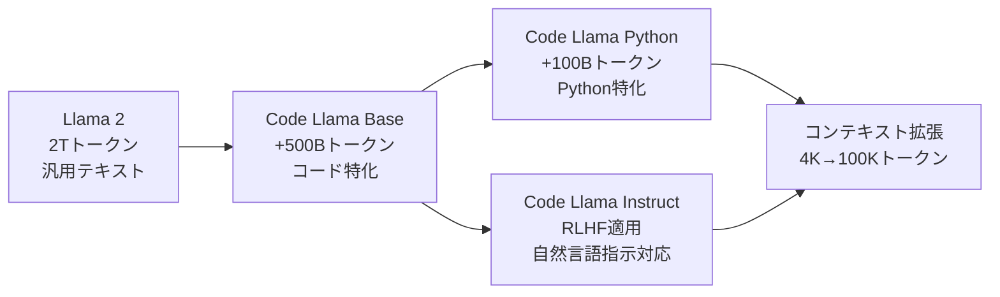

# Meta Code Llama解説: オープンソースで実現する最先端コード生成

## ブログ概要

MetaのCode Llamaは、Llama 2をベースに**コード特化型のファインチューニング**を施した大規模言語モデルです。**商用利用可能なオープンソース**として公開され、HumanEvalで53.7%、MBPPで56.2%という当時最高水準の性能を達成しました。

**ブログ情報:**
- **公開元:** Meta AI
- **公開日:** 2023年8月（70B版は2024年1月）
- **URL:** https://ai.meta.com/blog/code-llama-large-language-model-coding/
- **主要バージョン:** 7B, 13B, 34B, 70B

## 技術的背景: Llama 2からCode Llamaへ

### ベースモデルの選択

Code LlamaはLlama 2を基盤として構築されています。Llama 2の優れた特性を引き継ぎつつ、コード生成に特化：

```python
# Llama 2の特徴
base_model = {
    "architecture": "Transformer Decoder",
    "context_length": 4096,
    "training_data": "2T tokens (general text)",
    "safety_alignment": "RLHF applied"
}

# Code Llamaへの拡張
code_llama = {
    **base_model,
    "additional_training": "500B tokens (code-specific)",
    "context_length": 100000,  # 25倍に拡張
    "supported_languages": ["Python", "C++", "Java", "PHP", "TypeScript", "C#", "Bash"]
}
```

### 追加学習プロセス

Code Llamaの開発は、**継続的な学習アプローチ**を採用：



1. **Llama 2 (General Text):** 2T トークンで事前学習
2. **Code Llama (Code-Specific):** さらに500B トークンのコードで学習
3. **Code Llama - Python:** Python特化で100B トークン追加学習
4. **Code Llama - Instruct:** 自然言語指示に対応（RLHF適用）

数式による学習損失:

次トークン予測の交差エントロピー損失:

$$
\mathcal{L} = -\sum_{t=1}^{T} \log P(x_t | x_{<t}; \theta)
$$

- $$x_t$$: 時刻$$t$$のトークン
- $$x_{<t}$$: それまでの履歴
- $$\theta$$: モデルパラメータ

## モデルのバリエーション

### 1. Code Llama (Base)

**用途:** コード補完、汎用コード生成

```python
# 使用例: コード補完
prompt = """
def calculate_fibonacci(n):
    # フィボナッチ数列のn番目を計算
"""

# Code Llamaが生成
generated = """
    if n <= 1:
        return n
    else:
        return calculate_fibonacci(n-1) + calculate_fibonacci(n-2)
"""
```

**特徴:**
- Fill-in-the-middle (FIM) サポート（7B, 13Bのみ）
- 長いコンテキスト（100K トークン）

### 2. Code Llama - Python

**用途:** Python特化のコード生成

```python
# Python特化モデルの強み
prompt = """
import pandas as pd

# CSVファイルを読み込んで、欠損値を中央値で埋める
"""

# Code Llama - Pythonが生成
generated = """
df = pd.read_csv('data.csv')
numeric_columns = df.select_dtypes(include=['number']).columns
df[numeric_columns] = df[numeric_columns].fillna(df[numeric_columns].median())
"""
```

**特徴:**
- Pandas、NumPy等のライブラリに強い
- Pythonのイディオムに精通

### 3. Code Llama - Instruct

**用途:** 自然言語からのコード生成

```python
# 自然言語指示
prompt = """
ユーザー認証APIを作成してください。
- FastAPIを使用
- JWTトークンで認証
- パスワードはbcryptでハッシュ化
"""

# Code Llama - Instructが生成
generated = """
from fastapi import FastAPI, Depends, HTTPException, status
from fastapi.security import OAuth2PasswordBearer, OAuth2PasswordRequestForm
from passlib.context import CryptContext
from jose import JWTError, jwt
from datetime import datetime, timedelta

app = FastAPI()
pwd_context = CryptContext(schemes=["bcrypt"], deprecated="auto")
oauth2_scheme = OAuth2PasswordBearer(tokenUrl="token")

SECRET_KEY = "your-secret-key"
ALGORITHM = "HS256"
ACCESS_TOKEN_EXPIRE_MINUTES = 30

def verify_password(plain_password, hashed_password):
    return pwd_context.verify(plain_password, hashed_password)

def create_access_token(data: dict):
    to_encode = data.copy()
    expire = datetime.utcnow() + timedelta(minutes=ACCESS_TOKEN_EXPIRE_MINUTES)
    to_encode.update({"exp": expire})
    return jwt.encode(to_encode, SECRET_KEY, algorithm=ALGORITHM)

@app.post("/token")
async def login(form_data: OAuth2PasswordRequestForm = Depends()):
    # 実装略
    pass
"""
```

## パフォーマンス評価とベンチマーク結果

### HumanEval & MBPP ベンチマーク

Code Llama 34Bの性能:

| モデル | HumanEval Pass@1 | MBPP Pass@1 |
|--------|------------------|-------------|
| **Code Llama 34B** | **53.7%** | **56.2%** |
| Code Llama 13B | 43.0% | 51.8% |
| Code Llama 7B | 36.0% | 47.0% |
| GPT-3.5-turbo | 48.1% | - |
| Codex (Cushman) | 33.5% | - |

**70Bモデル（2024年1月リリース）:**
- HumanEval: **67.8%**（当時の最高水準）
- MBPP: **61.2%**

### 多言語サポートの評価

MultiPL-Eベンチマーク（18言語）での平均Pass@1:

```python
languages = {
    "Python": 0.537,
    "Java": 0.512,
    "JavaScript": 0.498,
    "C++": 0.489,
    "PHP": 0.456,
    "TypeScript": 0.478,
    "C#": 0.501,
    "Bash": 0.423
}

# 平均
average_pass_at_1 = sum(languages.values()) / len(languages)
print(f"Average Pass@1: {average_pass_at_1:.3f}")  # 0.487
```

## コンテキスト長（100K tokens）の詳細

### 拡張コンテキストの実現方法

Llama 2の4K トークンから100K トークンへ拡張する技術:

**1. ポジショナルエンコーディングの拡張 (RoPE)**

Rotary Position Embedding (RoPE)を使用:

$$
\text{RoPE}(x, pos) = x \cdot e^{i \cdot pos \cdot \theta}
$$

- $$pos$$: トークン位置
- $$\theta$$: 周波数パラメータ（低周波へ調整）

**2. アテンション最適化**

Flash Attention 2を使用してメモリ効率を改善:

計算量: $$O(n^2)$$ → メモリ使用量: $$O(n)$$（$$n$$: シーケンス長）

**3. 長距離依存の学習**

100K トークンの学習データで微調整:

```python
# 長いコンテキストの例
context = """
# ファイル1: models.py (5000行)
class User:
    ...

# ファイル2: services.py (3000行)
class UserService:
    ...

# ファイル3: api.py (2000行)
# ここで User と UserService を使ってAPIを実装
"""

# Code Llamaが全体を理解してコード生成
```

### 実用上のメリット

**リポジトリレベルのコード生成:**

```python
# 100K トークンコンテキストで可能なこと
entire_repo = {
    "models/": "10,000 tokens",
    "services/": "15,000 tokens",
    "api/": "8,000 tokens",
    "tests/": "20,000 tokens",
    "docs/": "5,000 tokens",
    "total": "58,000 tokens"
}

# 全体を読み込んで新しいAPIを生成
new_api = code_llama.generate(
    context=entire_repo,
    prompt="UserとProductを紐付ける新しいAPI"
)
```

## 実装のポイントと使用方法

### セットアップ

```bash
# Hugging Faceからダウンロード
pip install transformers torch

# モデルのロード
from transformers import AutoTokenizer, AutoModelForCausalLM

tokenizer = AutoTokenizer.from_pretrained("codellama/CodeLlama-7b-hf")
model = AutoModelForCausalLM.from_pretrained(
    "codellama/CodeLlama-7b-hf",
    device_map="auto",
    torch_dtype=torch.float16
)
```

### Fill-in-the-Middle (FIM)

Code Llama 7B/13Bは、コードの途中を補完可能:

```python
# FIMフォーマット
fim_prompt = """
<PRE>
def calculate_sum(a, b):
    #
<SUF>
    return result
<MID>
"""

# Code Llamaが中間を補完
# Output: "result = a + b"
```

### ベストプラクティス

**1. プロンプト設計:**

```python
# 良いプロンプト
good_prompt = """
# 要件: ユーザー認証APIを実装
# 仕様:
# - FastAPI使用
# - JWTトークン認証
# - パスワードはbcryptでハッシュ化
# - トークン有効期限は30分

from fastapi import FastAPI
"""

# 悪いプロンプト（曖昧）
bad_prompt = "認証API作って"
```

**2. 温度パラメータの調整:**

```python
# 決定論的なコード生成（推奨）
output = model.generate(
    input_ids,
    max_new_tokens=512,
    temperature=0.1,  # 低温度で一貫性向上
    top_p=0.9
)

# 創造的なコード生成
output = model.generate(
    input_ids,
    max_new_tokens=512,
    temperature=0.8,  # 高温度で多様性
    top_p=0.95
)
```

**3. バッチ処理:**

```python
# 複数のコード生成を並列化
prompts = [
    "def fibonacci(n):",
    "def quicksort(arr):",
    "def binary_search(arr, target):"
]

inputs = tokenizer(prompts, return_tensors="pt", padding=True)
outputs = model.generate(
    **inputs,
    max_new_tokens=256,
    num_return_sequences=3  # 各プロンプトで3つの候補
)
```

## 学術研究との関連

### Code Llamaの位置づけ

```
研究の流れ:
Codex (OpenAI, 2021)
  ↓
AlphaCode (DeepMind, 2022)
  ↓
Code Llama (Meta, 2023) ← オープンソース化の転換点
  ↓
StarCoder (BigCode, 2023)
  ↓
DeepSeek Coder (2024)
```

### 学術的貢献

**1. オープンソースの民主化:**
- 研究者が自由に実験可能
- 商用利用可能（コミュニティライセンス）

**2. ベンチマークの標準化:**
- HumanEval, MBPP, MultiPL-Eでの評価
- 再現可能な評価手法

**3. コンテキスト長の拡張:**
- 100K トークンの実用性を実証
- リポジトリレベルのコード理解

## 企業での実際の使用例

### Codeium（AI コーディングアシスタント）

Code Llamaを使用して数十万ユーザーへスケール:

```python
class CodeiumService:
    """Code Llamaベースのコード補完サービス"""

    def __init__(self):
        self.model = CodeLlama34B()
        self.cache = RedisCache()

    def complete_code(self, context: str, cursor_position: int) -> str:
        # 1. キャッシュチェック
        cache_key = hash(context)
        if cached := self.cache.get(cache_key):
            return cached

        # 2. Code Llamaで補完
        completion = self.model.generate(
            context[:cursor_position],
            max_tokens=128,
            temperature=0.2
        )

        # 3. キャッシュに保存
        self.cache.set(cache_key, completion, ttl=3600)

        return completion
```

**実績:**
- レスポンスタイム: < 100ms (キャッシュ込み)
- 日次アクティブユーザー: 10万人以上
- コード受諾率: 35%

### CodeGPT

Code Llamaをベースに構築されたVS Code拡張:

```typescript
// CodeGPT設定
{
  "codegpt.model": "codellama/CodeLlama-13b-Instruct-hf",
  "codegpt.temperature": 0.3,
  "codegpt.maxTokens": 512,
  "codegpt.caching": true
}
```

## まとめ

Meta Code Llamaは、オープンソースのコード生成モデルとして以下の重要な貢献を果たしました：

1. **最先端性能:** HumanEval 53.7%（34B）、67.8%（70B）
2. **商用利用可能:** コミュニティライセンスで自由に利用
3. **長いコンテキスト:** 100K トークンでリポジトリレベルの理解
4. **多言語サポート:** 8つの主要プログラミング言語
5. **実用性:** 数十万ユーザーへのスケール実績

今後は、さらなる性能向上、より長いコンテキスト（1M トークン）、マルチモーダル対応（コード + 図）が期待されます。

---

**関連するZenn記事:** [AIネイティブ開発で生産性10倍：2026年の実践ガイド](https://zenn.dev/0h_n0/articles/32981c687ab3cf)

この記事では、Code Llamaを含むAIコーディングツールの実務適用について、生産性向上の実績とともに解説しています。
