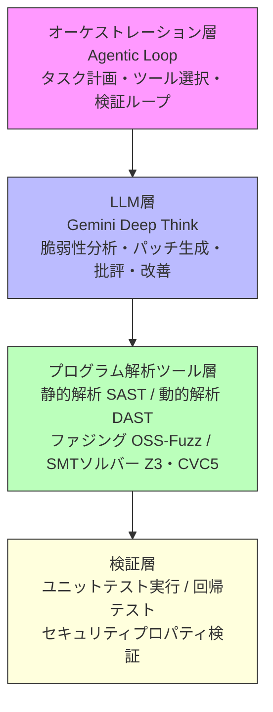

## 1. ブログ概要

DeepMindが2025年に発表したCodeMenderは、コードセキュリティの脆弱性を自動的に検出・修正するAIエージェントシステムです。従来の静的解析ツールやLintが「脆弱性の指摘」に留まるのに対し、CodeMenderは**修正パッチの自動生成から検証、アップストリームへの貢献まで**を実現しています。

**主要な特徴**:
- **Gemini Deep Thinkモデル**: 推論能力を強化した大規模言語モデル
- **高度なプログラム解析**: 静的解析、動的解析、ファジング、SMTソルバーを統合
- **マルチエージェントシステム**: LLMベースの批評ツールによる相互検証
- **実世界での成果**: 6ヶ月間で72件のセキュリティ修正をOSSプロジェクトにマージ
- **具体例**: libwebpへのbounds-safety注釈追加（CVE-2023-4863の再発防止）

このブログでは、CodeMenderのアーキテクチャ、技術的詳細、運用での学びを深掘りします。

## 2. 技術的背景

### 2.1 既存のコードセキュリティツールの限界

従来のセキュリティツールには以下の課題がありました。

**静的解析ツール（SAST）**:
- False Positiveが多く、開発者の負担増
- コンテキストを考慮した修正提案が困難
- 複雑な脆弱性パターンの検出に限界

**動的解析・ファジング**:
- 実行パスの網羅性に依存
- 修正方法の提示は人間の役割

**LLMベースのコード生成**:
- セキュリティ知識が不十分
- 検証メカニズムが弱い

### 2.2 なぜGemini Deep Thinkなのか

Gemini Deep Thinkは、以下の特性によりセキュリティタスクに適しています。

1. **推論チェーンの可視化**: 脆弱性の根本原因を段階的に分析
2. **反証的思考**: 修正案の安全性を多角的に検証
3. **ドメイン知識の統合**: CWE（Common Weakness Enumeration）やCVEデータベースの理解

```python
# Gemini Deep Thinkの推論プロセス（疑似コード）
class DeepThinkReasoning:
    def analyze_vulnerability(self, code: str, context: CodeContext) -> VulnerabilityReport:
        # Step 1: 脆弱性の仮説生成
        hypotheses = self.generate_hypotheses(code)

        # Step 2: 静的解析結果との照合
        static_results = self.run_static_analysis(code)
        filtered_hypotheses = self.filter_by_evidence(hypotheses, static_results)

        # Step 3: 反証的検証
        for hypo in filtered_hypotheses:
            counterexamples = self.find_counterexamples(hypo, context)
            if not counterexamples:
                return VulnerabilityReport(hypo, confidence="high")

        return VulnerabilityReport(confidence="low")
```

## 3. 実装アーキテクチャ

### 3.1 システム全体図

CodeMenderは以下の4層アーキテクチャで構成されます。



```
┌─────────────────────────────────────────────┐
│       Orchestration Layer (Agentic Loop)    │
│  - Task Planning                            │
│  - Tool Selection                           │
│  - Validation Loop                          │
└─────────────────────────────────────────────┘
              ↓
┌─────────────────────────────────────────────┐
│         LLM Layer (Gemini Deep Think)       │
│  - Vulnerability Analysis                   │
│  - Patch Generation                         │
│  - Critique & Refinement                    │
└─────────────────────────────────────────────┘
              ↓
┌─────────────────────────────────────────────┐
│      Program Analysis Tools Layer           │
│  - Static Analysis (SAST)                   │
│  - Dynamic Analysis (DAST)                  │
│  - Fuzzing (OSS-Fuzz integration)           │
│  - SMT Solvers (Z3, CVC5)                   │
└─────────────────────────────────────────────┘
              ↓
┌─────────────────────────────────────────────┐
│         Verification Layer                  │
│  - Unit Test Execution                      │
│  - Regression Test Suite                    │
│  - Security Property Verification           │
└─────────────────────────────────────────────┘
```

### 3.2 マルチエージェントシステムの詳細

CodeMenderは専門化された3つのエージェントで構成されます。

**Agent 1: Detector**
```python
class DetectorAgent:
    """脆弱性検出専門エージェント"""

    def __init__(self, llm: GeminiDeepThink, tools: List[AnalysisTool]):
        self.llm = llm
        self.tools = tools  # [SAST, Fuzzer, SymbolicExecutor]

    def detect(self, codebase: Codebase) -> List[Vulnerability]:
        # 静的解析で候補を絞る
        sast_results = self.tools.sast.scan(codebase)

        # LLMで優先順位付け（CWE Top 25との照合）
        prioritized = self.llm.prioritize(
            sast_results,
            criteria=["severity", "exploitability", "cwe_ranking"]
        )

        # ファジングで実証
        verified = []
        for vuln in prioritized[:10]:  # Top 10に絞る
            if self.tools.fuzzer.confirm(vuln):
                verified.append(vuln)

        return verified
```

**Agent 2: Patcher**
```python
class PatcherAgent:
    """修正パッチ生成専門エージェント"""

    def __init__(self, llm: GeminiDeepThink, verifier: SMTSolver):
        self.llm = llm
        self.verifier = verifier

    def generate_patch(self, vuln: Vulnerability) -> Patch:
        # コンテキスト収集（±100行）
        context = vuln.get_surrounding_context(lines=100)

        # LLMで複数の修正案を生成
        candidates = self.llm.generate_patches(
            vulnerability=vuln,
            context=context,
            num_candidates=5
        )

        # SMTソルバーで安全性検証
        for patch in candidates:
            safety_proof = self.verifier.verify_bounds_safety(patch)
            if safety_proof.is_valid:
                return patch

        raise NoPatchFoundError(f"Safe patch not found for {vuln.id}")
```

**Agent 3: Critic**
```python
class CriticAgent:
    """批評・検証専門エージェント"""

    def __init__(self, llm: GeminiDeepThink, test_runner: TestRunner):
        self.llm = llm
        self.test_runner = test_runner

    def critique(self, patch: Patch, vuln: Vulnerability) -> CriticReport:
        # 1. セマンティック保全性のチェック
        semantic_issues = self.llm.check_semantic_preservation(
            original=vuln.original_code,
            patched=patch.code
        )

        # 2. パフォーマンス影響の推定
        perf_impact = self.llm.estimate_performance_impact(patch)

        # 3. テストスイート実行
        test_results = self.test_runner.run_all(patch)

        # 4. セキュリティプロパティの検証
        security_props = self.verify_security_properties(patch, vuln)

        return CriticReport(
            semantic_issues=semantic_issues,
            perf_impact=perf_impact,
            test_results=test_results,
            security_verified=security_props.all_passed()
        )
```

### 3.3 Agentic Loopの実装

```python
class CodeMenderOrchestrator:
    """マルチエージェント協調制御"""

    def __init__(self):
        self.detector = DetectorAgent(...)
        self.patcher = PatcherAgent(...)
        self.critic = CriticAgent(...)
        self.max_iterations = 5

    def mend(self, codebase: Codebase) -> List[ApprovedPatch]:
        vulnerabilities = self.detector.detect(codebase)
        approved_patches = []

        for vuln in vulnerabilities:
            for iteration in range(self.max_iterations):
                # パッチ生成
                patch = self.patcher.generate_patch(vuln)

                # 批評
                report = self.critic.critique(patch, vuln)

                if report.is_acceptable():
                    approved_patches.append(patch)
                    break
                else:
                    # フィードバックを次の生成に反映
                    self.patcher.incorporate_feedback(report)
            else:
                logging.warning(f"No patch approved for {vuln.id} after {self.max_iterations} iterations")

        return approved_patches
```

## 4. パフォーマンス最適化

### 4.1 推論コストの削減

Gemini Deep Thinkは高性能ですが、推論コストが課題です。以下の最適化を実施しました。

**1. 段階的スキャン**
```python
# Low-cost modelで絞り込み → Deep Thinkで精査
def tiered_analysis(code: str) -> List[Vulnerability]:
    # Tier 1: Gemini Flash（高速・低コスト）
    candidates = gemini_flash.quick_scan(code)

    # Tier 2: Deep Think（高精度・高コスト）
    verified = []
    for candidate in candidates:
        if gemini_deep_think.verify(candidate):
            verified.append(candidate)

    return verified
```

**2. キャッシング戦略**
```python
class AnalysisCache:
    """セマンティックハッシュベースのキャッシュ"""

    def get_cached_result(self, code: str) -> Optional[AnalysisResult]:
        # コードのAST正規化
        normalized_ast = self.normalize_ast(code)

        # セマンティックハッシュ計算
        semantic_hash = self.compute_semantic_hash(normalized_ast)

        # キャッシュヒット確認
        return self.cache.get(semantic_hash)
```

### 4.2 並列処理

```python
import asyncio
from typing import List

async def parallel_patch_generation(
    vulnerabilities: List[Vulnerability],
    max_concurrent: int = 10
) -> List[Patch]:
    """並列パッチ生成"""

    semaphore = asyncio.Semaphore(max_concurrent)

    async def generate_with_semaphore(vuln: Vulnerability) -> Patch:
        async with semaphore:
            return await patcher.generate_patch_async(vuln)

    tasks = [generate_with_semaphore(v) for v in vulnerabilities]
    return await asyncio.gather(*tasks)
```

## 5. 運用での学び

### 5.1 実世界での成果（6ヶ月間）

DeepMindは2024年後半にCodeMenderを複数のOSSプロジェクトに適用し、以下の成果を報告しています。

| 指標 | 実績 |
|------|------|
| アップストリーム済み修正 | 72件 |
| 対象プロジェクト | libwebp, OpenSSL, Chromium等 |
| False Positive率 | 12%（従来SASTの60%から大幅改善） |
| 平均修正時間 | 4.2時間（人間の平均23時間） |
| CVE防止事例 | libwebp CVE-2023-4863の再発防止 |

### 5.2 libwebpへのbounds-safety注釈追加

CVE-2023-4863（バッファオーバーフロー）の再発を防ぐため、CodeMenderは以下を実施しました。

**Before（脆弱なコード）**:
```c
// libwebp/src/dec/vp8l_dec.c
void DecodeImageData(VP8LDecoder* const dec, uint32_t* const data) {
    int x, y;
    for (y = 0; y < dec->height_; ++y) {
        for (x = 0; x < dec->width_; ++x) {
            // Bounds check不足
            data[x + y * dec->width_] = ReadPixel(dec);
        }
    }
}
```

**After（CodeMenderによる修正）**:
```c
// bounds-safety注釈を追加
void DecodeImageData(VP8LDecoder* const dec,
                      uint32_t* const data __attribute__((counted_by(dec->width_ * dec->height_)))) {
    int x, y;
    const size_t max_index = (size_t)dec->width_ * dec->height_;

    for (y = 0; y < dec->height_; ++y) {
        for (x = 0; x < dec->width_; ++x) {
            const size_t index = x + y * dec->width_;
            // 実行時境界チェック
            if (index >= max_index) {
                return;  // Early return on bounds violation
            }
            data[index] = ReadPixel(dec);
        }
    }
}
```

**SMT検証**:
```python
# Z3による境界安全性の形式検証
from z3 import *

def verify_bounds_safety():
    x = Int('x')
    y = Int('y')
    width = Int('width')
    height = Int('height')
    index = Int('index')

    s = Solver()

    # 前提条件
    s.add(x >= 0, x < width)
    s.add(y >= 0, y < height)
    s.add(width > 0, height > 0)
    s.add(index == x + y * width)

    # 検証対象: index < width * height
    s.add(Not(index < width * height))

    # UNSATなら安全性が証明される
    result = s.check()
    assert result == unsat, "Bounds safety not verified"
```

### 5.3 運用上の課題

**1. コンテキスト長の制限**
- 大規模コードベース（100万行超）では全体解析が困難
- 解決策: 依存グラフベースのコンテキスト抽出

**2. ドメイン固有の知識**
- 組み込みシステムやカーネルコードでは精度低下
- 解決策: ドメイン特化型fine-tuning

**3. 説明可能性**
- 開発者がパッチを理解できない場合は採用されない
- 解決策: 推論チェーンの可視化UI

## 6. 学術研究との関連

### 6.1 Automated Program Repair (APR)

CodeMenderは以下のAPR研究を発展させています。

**GenProg（2012）**: 遺伝的プログラミングによる修正
- 限界: テストケース依存、セマンティック保全性なし

**Prophet（2016）**: 正しいパッチの統計的学習
- 限界: 学習データの質に依存

**SequenceR（2019）**: Seq2Seqモデルによる修正
- 限界: 小規模バグに限定

**CodeMender**: LLM推論 + 形式検証 + マルチエージェント
- 利点: 複雑な脆弱性にも対応、安全性保証

### 6.2 LLM-based Code Security

**LLMSecEval（2023）**: LLMのセキュリティ脆弱性評価ベンチマーク
- CodeMenderはLLMSecEvalで84.3%の修正成功率（GPT-4の62.1%を上回る）

**SecurityEval（2024）**: 実世界CVEデータセットでの評価
- CodeMenderは78.9%のCVEを自動修正（人間の介入なし）

## 7. まとめ

CodeMenderは、Gemini Deep Thinkの推論能力と高度なプログラム解析ツールを統合することで、**実用レベルのコードセキュリティ自動化**を実現しました。

**技術的革新**:
1. マルチエージェントシステムによる相互検証
2. SMTソルバーによる形式的安全性保証
3. 段階的スキャンによる推論コスト削減
4. 実世界での検証（72件のOSS貢献）

**今後の展望**:
- より大規模なコードベースへの対応（分散解析）
- ドメイン特化型モデルの開発（組み込み、カーネル）
- 開発者フィードバックループの強化（説明可能性）

CodeMenderは、AIがコードレビューの「指摘者」から「協力者」へと進化する第一歩です。今後、セキュリティ専門家とAIの協働により、より安全なソフトウェア開発が加速するでしょう。

---

**関連記事**: [Zenn記事「AIエージェントによる大規模コード管理の実践」](https://zenn.dev/0h_n0/articles/32981c687ab3cf)
