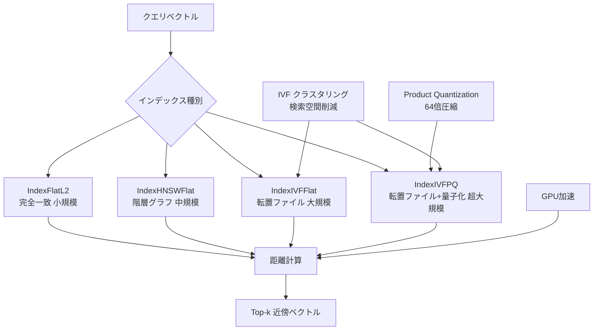

## 概要

**FAISS（Facebook AI Similarity Search）**は、Meta AI FAIR（Facebook AI Research）が開発した高効率ベクトル類似検索ライブラリです。arXiv論文[2401.08281](https://arxiv.org/abs/2401.08281)で詳細が公開され、**1.5兆ベクトル（144次元）のインデックス作成**や**10億規模のGPU高速検索**を実現しています。

本記事では、FAISSの中核技術である**HNSW（Hierarchical Navigable Small World）**、**IVF（Inverted File Index）**、**Product Quantization（PQ）**の仕組み、GPU高速化の実装、およびRAGシステムへの統合パターンを、修士学生レベルの読者向けに深掘り解説します。

## FAISSの設計思想

FAISSは以下の3つの設計原則に基づいています。

1. **トレードオフ空間の探索**: 検索精度、速度、メモリ使用量のバランス調整
2. **最適化へのこだわり**: CPU/GPUの両方で極限まで高速化
3. **柔軟なインターフェース**: PythonとC++の両APIを提供

### アーキテクチャ概要

FAISSのインデックスは、以下の3つのコンポーネントを組み合わせて構成されます。



```
検索アルゴリズム × 量子化手法 × ハードウェア最適化
```

例えば、`IndexIVFPQ`は以下の組み合わせです。

- **検索アルゴリズム**: IVF（Inverted File Index）
- **量子化手法**: PQ（Product Quantization）
- **ハードウェア**: CPU/GPU両対応

## 中核技術1: HNSW（階層的ナビゲーショングラフ）

### HNSWの原理

HNSWは、グラフベースの近似最近傍探索（Approximate Nearest Neighbor, ANN）アルゴリズムです。階層的なナビゲーショングラフを構築し、高速な検索を実現します。

**階層構造**:

```
Layer 2 (粗い層):  o---o
                    |   |
Layer 1:           o-o-o-o
                   |\|/|\|
Layer 0 (密な層): o-o-o-o-o-o-o-o
```

検索は上位層から開始し、各層で貪欲探索を行い、下位層に降りていきます。

### アルゴリズム詳細

**グラフ構築**:

各ベクトル $$\mathbf{v}_i$$ を挿入する際、以下の手順を実行します。

1. 最上位層 $$L$$ を確率的に決定（指数分布）
2. 層 $$L$$ から層0まで順に、各層で $$M$$ 個の最近傍ノードと接続

**検索**:

クエリ $$\mathbf{q}$$ に対して、以下を実行します。

1. 最上位層からエントリーポイント $$\mathbf{e}$$ で探索開始
2. 各層 $$\ell$$ で貪欲探索: $$\mathbf{e}$$ の近傍ノードを調べ、$$\mathbf{q}$$ に最も近いノードに移動
3. 層0で $$k$$ 個の最近傍を返す

**計算量**:

- **構築**: $$O(N \log N \cdot M)$$（$$N$$ はベクトル数、$$M$$ は接続数）
- **検索**: $$O(\log N \cdot M)$$（平均ケース）

### FAISS実装: IndexHNSW

```python
import faiss
import numpy as np

# ベクトル次元数
d = 128
# ベクトル数
n = 100000

# ランダムベクトル生成（実際にはモデルの埋め込み）
vectors = np.random.random((n, d)).astype('float32')

# HNSWインデックス作成
# M: 各ノードの接続数（デフォルト32）
M = 32
index = faiss.IndexHNSWFlat(d, M)

# ベクトル追加
index.add(vectors)

# 検索
k = 10  # 取得する近傍数
query = np.random.random((1, d)).astype('float32')
distances, indices = index.search(query, k)

print(f"Top-{k} 近傍インデックス: {indices[0]}")
print(f"距離: {distances[0]}")
```

**パラメータチューニング**:

- **$$M$$（接続数）**: 大きいほど精度向上、メモリ増加（推奨: 16〜64）
- **$$ef_{construction}$$**: 構築時の探索幅（推奨: 40〜500）
- **$$ef_{search}$$**: 検索時の探索幅（推奨: 16〜512）

```python
# 構築時パラメータ
index.hnsw.efConstruction = 200

# 検索時パラメータ
index.hnsw.efSearch = 128
```

## 中核技術2: IVF（転置ファイルインデックス）

### IVFの原理

IVFは、ベクトル空間をクラスタに分割し、クエリに近いクラスタのみを検索する手法です。検索空間を大幅に削減できます。

**手順**:

1. **クラスタリング**: $$k$$-meansで $$c$$ 個のクラスタを作成
2. **割り当て**: 各ベクトルを最近傍セントロイドのクラスタに割り当て
3. **検索**: クエリに近い $$n_{\text{probe}}$$ 個のクラスタのみを探索

**検索効率**:

全ベクトル数 $$N$$、クラスタ数 $$c$$、探索クラスタ数 $$n_{\text{probe}}$$ のとき、距離計算回数は $$O(n_{\text{probe}} \cdot N/c)$$ に削減されます。

### FAISS実装: IndexIVFFlat

```python
# セントロイド数
nlist = 1000

# 量子化器（セントロイドの管理）
quantizer = faiss.IndexFlatL2(d)

# IVFインデックス作成
index = faiss.IndexIVFFlat(quantizer, d, nlist)

# 訓練（k-meansでクラスタ作成）
index.train(vectors)

# ベクトル追加
index.add(vectors)

# 検索（nprobe個のクラスタを探索）
index.nprobe = 10
distances, indices = index.search(query, k)
```

**パラメータチューニング**:

- **$$c$$ (nlist)**: クラスタ数。$$c = \sqrt{N}$$ が目安（例: $$N=10^6$$ なら $$c=1000$$）
- **$$n_{\text{probe}}$$**: 探索クラスタ数。大きいほど精度向上、速度低下（推奨: 1〜100）

## 中核技術3: Product Quantization（PQ）

### PQの原理

Product Quantizationは、高次元ベクトルを複数の低次元部分ベクトルに分割し、各部分を独立に量子化する圧縮手法です。メモリ効率を劇的に改善します。

**手順**:

1. $$d$$ 次元ベクトル $$\mathbf{v}$$ を $$m$$ 個の部分ベクトルに分割: $$\mathbf{v} = [\mathbf{v}^{(1)}, \mathbf{v}^{(2)}, \ldots, \mathbf{v}^{(m)}]$$
2. 各部分ベクトル $$\mathbf{v}^{(j)}$$ を $$k^* = 2^b$$ 個のコードブックで量子化
3. 各ベクトルを $$m \times b$$ ビットのコードで表現

**メモリ効率**:

元のベクトル: $$d \times 32$$ ビット（float32）
PQ圧縮後: $$m \times b$$ ビット

例: $$d=128$$、$$m=8$$、$$b=8$$ の場合、圧縮率は $$\frac{128 \times 32}{8 \times 8} = 64$$ 倍です。

### 距離計算の高速化

PQでは、コードブック間の距離をテーブルに事前計算し、クエリ時にルックアップで距離を近似します。

$$
d(\mathbf{q}, \mathbf{v}) \approx \sum_{j=1}^{m} d(\mathbf{q}^{(j)}, \text{codebook}_{j}[c_j])
$$

ここで、$$c_j$$ は $$\mathbf{v}^{(j)}$$ の量子化コードです。

### FAISS実装: IndexIVFPQ

```python
# セントロイド数
nlist = 1000
# PQ部分ベクトル数
m = 8
# 各部分ベクトルのビット数（2^8 = 256コードブック）
nbits = 8

quantizer = faiss.IndexFlatL2(d)
index = faiss.IndexIVFPQ(quantizer, d, nlist, m, nbits)

# 訓練（k-means + PQコードブック学習）
index.train(vectors)

# ベクトル追加
index.add(vectors)

# 検索
index.nprobe = 10
distances, indices = index.search(query, k)
```

**メモリ使用量**:

```python
# 元のベクトル（float32）
original_memory = n * d * 4  # bytes

# IndexIVFPQ（圧縮）
pq_memory = n * m  # bytes (nbits=8の場合)

print(f"圧縮率: {original_memory / pq_memory:.1f}x")
# 出力例: 圧縮率: 64.0x
```

## GPU高速化

FAISSは、GPUで大規模ベクトル検索を高速化する実装を提供します。論文"Billion-scale similarity search with GPUs"（Johnson et al.）で詳述されています。

### GPU実装のポイント

1. **k-selection最適化**: Top-k選択をGPUで並列実行
2. **自動メモリ管理**: CPU/GPU間の転送を自動処理
3. **マルチGPU対応**: 複数GPUでの並列検索

### 実装例

```python
import faiss

# GPU対応チェック
print(f"GPU数: {faiss.get_num_gpus()}")

# CPUインデックス作成
cpu_index = faiss.IndexIVFPQ(
    faiss.IndexFlatL2(d),
    d,
    nlist=1000,
    m=8,
    nbits=8
)
cpu_index.train(vectors)
cpu_index.add(vectors)

# GPUに転送
res = faiss.StandardGpuResources()  # GPU 0
gpu_index = faiss.index_cpu_to_gpu(res, 0, cpu_index)

# GPU検索（高速）
gpu_index.nprobe = 10
distances, indices = gpu_index.search(query, k)
```

### マルチGPU対応

```python
# 全GPUを使用
gpu_index = faiss.index_cpu_to_all_gpus(cpu_index)

# 検索（複数GPUで並列実行）
distances, indices = gpu_index.search(query, k)
```

### 性能比較

| 構成 | 検索速度（QPS） | メモリ |
|------|----------------|--------|
| CPU (IndexFlatL2) | 1,000 | 高 |
| CPU (IndexIVFPQ) | 10,000 | 低 |
| GPU (IndexIVFPQ) | 100,000+ | 低 |

## 10億規模のベクトル検索

FAISSは、**1.5兆ベクトル（144次元）**のインデックス作成に成功しています。

### スケーラビリティの鍵

**階層的IVF**:

粗量子化器（coarse quantizer）としてHNSWを使用し、1000万個のセントロイドを管理します。

```python
# 1.5兆ベクトル用の構成例
d = 144
nlist = 10_000_000  # 1000万セントロイド

# HNSW粗量子化器（メモリ効率的）
coarse_quantizer = faiss.IndexHNSWFlat(d, 32)

# IVF + Scalar Quantization
index = faiss.IndexIVFScalarQuantizer(
    coarse_quantizer,
    d,
    nlist,
    faiss.ScalarQuantizer.QT_8bit  # 8ビット量子化
)

# 訓練とインデックス作成（分散システムで実行）
# index.train(sample_vectors)
# index.add(all_vectors)
```

## RAGシステムへの統合

FAISSは、RAG（Retrieval-Augmented Generation）システムのベクトル検索バックエンドとして広く使われています。

### 統合パターン

**LangChainでの統合例**:

```python
from langchain.vectorstores import FAISS
from langchain.embeddings import OpenAIEmbeddings

# ドキュメント埋め込み
embeddings = OpenAIEmbeddings()
texts = ["文書1の内容", "文書2の内容", ...]

# FAISSベクトルストア作成
vectorstore = FAISS.from_texts(texts, embeddings)

# 検索
query = "ユーザーのクエリ"
docs = vectorstore.similarity_search(query, k=5)

print(docs[0].page_content)
```

### 本番運用での考慮点

**1. インデックスの保存と読み込み**:

```python
# 保存
faiss.write_index(index, "index.faiss")

# 読み込み
index = faiss.read_index("index.faiss")
```

**2. インデックスの更新**:

FAISSは基本的に静的インデックスです。動的更新が必要な場合は、以下の戦略を検討します。

- **定期的な再構築**: 夜間バッチで全インデックスを再作成
- **差分インデックス**: 新規ベクトルを別インデックスに追加し、検索時にマージ

**3. ハイブリッド検索**:

ベクトル検索（意味的類似性）と全文検索（キーワードマッチ）を組み合わせます。

```python
from rank_bm25 import BM25Okapi

# BM25インデックス
bm25 = BM25Okapi(tokenized_corpus)
bm25_scores = bm25.get_scores(tokenized_query)

# FAISSベクトル検索
faiss_distances, faiss_indices = index.search(query_vector, k)

# スコア統合（正規化 + 重み付け和）
alpha = 0.7  # ベクトル検索の重み
combined_scores = alpha * normalize(faiss_distances) + (1 - alpha) * normalize(bm25_scores)
```

## 実装のベストプラクティス

### 1. インデックス選択ガイド

| ベクトル数 | 推奨インデックス | 理由 |
|-----------|----------------|------|
| < 10,000 | IndexFlatL2 | 完全一致検索が高速 |
| 10,000 〜 100万 | IndexIVFFlat | 精度と速度のバランス |
| 100万 〜 10億 | IndexIVFPQ | メモリ効率が重要 |
| 10億+ | IndexIVFPQ + HNSW粗量子化 | 超大規模対応 |

### 2. 訓練データのサンプリング

```python
# 大規模データセットの場合、サンプルで訓練
train_size = 100_000
train_vectors = vectors[np.random.choice(n, train_size, replace=False)]
index.train(train_vectors)

# 全ベクトルを追加
index.add(vectors)
```

### 3. 精度評価

```python
# Recall@k評価
def evaluate_recall(index, queries, ground_truth_indices, k):
    _, pred_indices = index.search(queries, k)
    recalls = []
    for pred, gt in zip(pred_indices, ground_truth_indices):
        recall = len(set(pred) & set(gt[:k])) / k
        recalls.append(recall)
    return np.mean(recalls)

# 実行
recall = evaluate_recall(index, test_queries, ground_truth, k=10)
print(f"Recall@10: {recall:.3f}")
```

## まとめ

FAISSは、大規模ベクトル検索のデファクトスタンダードとして、以下の強みを持ちます。

- **多様なアルゴリズム**: HNSW、IVF、PQを柔軟に組み合わせ
- **GPU高速化**: 10億規模のベクトルを高速検索
- **メモリ効率**: Product Quantizationで64倍以上の圧縮
- **本番実績**: Meta、OpenAI、GoogleなどのRAGシステムで採用

特にRAGシステムでは、FAISSのIVFPQインデックスが、精度・速度・メモリのバランスに優れた選択肢となります。本記事で紹介した実装パターンとベストプラクティスを活用し、効率的なベクトル検索基盤を構築してください。

## 参考文献

- Douze, M., et al. (2024). The Faiss Library. *arXiv:2401.08281*. [https://arxiv.org/abs/2401.08281](https://arxiv.org/abs/2401.08281)
- Johnson, J., Douze, M., & Jégou, H. (2019). Billion-scale similarity search with GPUs. *IEEE Transactions on Big Data*.
- Malkov, Y. A., & Yashunin, D. A. (2018). Efficient and robust approximate nearest neighbor search using Hierarchical Navigable Small World graphs. *IEEE TPAMI*.
- Jégou, H., Douze, M., & Schmid, C. (2011). Product Quantization for Nearest Neighbor Search. *IEEE TPAMI*.
