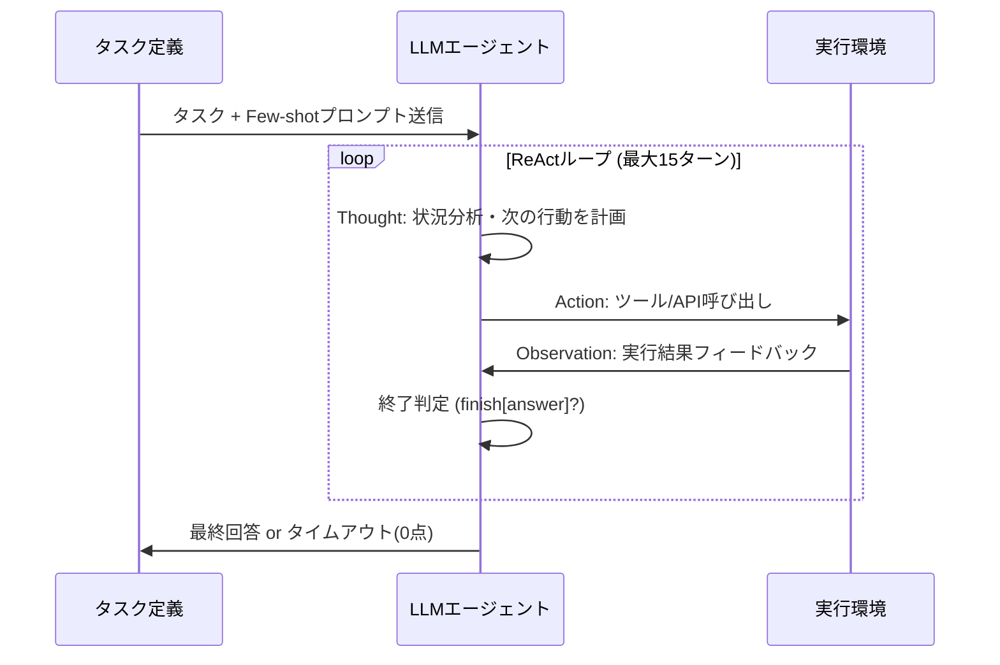

# 論文解説: AgentBench - LLMエージェント評価の決定版ベンチマーク

## 論文概要

**AgentBench: Evaluating LLMs as Agents** (arXiv:2308.10848, 2023年8月) は、Large Language Model (LLM) をエージェントとして評価するための包括的なベンチマークフレームワークです。従来のLLM評価が自然言語処理タスク（質問応答、要約、翻訳など）に焦点を当てていたのに対し、本論文は **インタラクティブな環境でのエージェント能力** を体系的に評価します。

**著者**: Xiao Liu et al. (Tsinghua University, Microsoft Research Asia)

**主要な貢献**:
- **8種類の多様な環境** でLLMエージェントを評価（OS操作、DB操作、知識グラフ推論、Webショッピング、Web閲覧、ゲーム、家庭用ロボット、デジタルカードゲーム）
- **25モデルの体系的評価** (GPT-4, Claude, Llama, etc.)
- **API呼び出し、マルチターン推論、長期計画** の3軸で能力分析
- **オープンソース実装** でコミュニティが再現・拡張可能

**実験結果の核心**:
- GPT-4が最高性能（API版 > Chat版）
- オープンソースLLM (Llama2-70B) はGPT-4の **半分以下の性能**
- エージェント能力は従来のNLPベンチマーク（MMLU等）と **相関が低い**（別の能力が必要）

---

## 背景と動機

### LLMエージェントの台頭

2023年以降、LLMは単なる言語理解ツールから **自律的に行動するエージェント** へと進化しました。ChatGPT Pluginsや AutoGPT などのツールが登場し、LLMが以下のタスクを実行できるようになりました:

- **ツール使用**: API呼び出し、データベースクエリ、ファイル操作
- **長期計画**: 複数ステップの計画を立て、中間結果を評価
- **環境フィードバックの活用**: エラーから学習し、戦略を修正

### 既存評価の限界

従来のLLMベンチマーク（MMLU, GSM8K, HumanEval等）は **静的タスク** に焦点を当てており、以下の能力を測定できませんでした:

1. **動的環境での適応**: 環境の変化に応じた戦略変更
2. **長期的な目標追求**: 複数ステップにわたる一貫した行動
3. **ツール統合**: 外部APIやツールの適切な利用

AgentBenchは、これらの **インタラクティブなエージェント能力** を評価するために設計されました。

---

## 技術的詳細

### 評価環境の設計原則

AgentBenchは以下の原則に基づいて8つの環境を選定しました:

1. **多様性**: 異なるドメイン（コード実行、知識推論、物理シミュレーション）を網羅
2. **現実性**: 実世界のタスクを反映（Webショッピング、DB操作等）
3. **難易度**: 人間でも挑戦的なタスク（複雑な推論、長期計画が必要）
4. **評価可能性**: 客観的な成功基準（タスク成功率、API呼び出し正確性）

### 8つの評価環境

#### 1. OS操作 (Operating System)

**タスク**: Bashコマンドでファイル操作、プロセス管理、ネットワーク設定を実行

**評価指標**: 144タスクの成功率

**難易度**: ファイルパスの推論、複数コマンドの連鎖が必要

**実装**: Docker環境でLinux VM、エージェントは `bash` ツールでコマンド実行

**代表的タスク例**:
```bash
# タスク: "Find all .log files modified in the last 24 hours and compress them"
find /var/log -name "*.log" -mtime -1 -exec gzip {} \;
```

#### 2. データベース操作 (Database)

**タスク**: SQL生成・実行、スキーマ理解、複雑なクエリ構築

**評価指標**: Bird ベンチマーク（知識グラフDB） + カスタムタスク

**難易度**: JOIN、サブクエリ、集計関数の適切な使用

**実装**: PostgreSQL/SQLiteバックエンド、エージェントはSQL文字列を生成・実行

**代表的タスク例**:
```sql
-- タスク: "Find the top 5 customers by total purchase amount in 2023"
SELECT customer_id, SUM(amount) as total
FROM purchases
WHERE YEAR(purchase_date) = 2023
GROUP BY customer_id
ORDER BY total DESC
LIMIT 5;
```

#### 3. 知識グラフ推論 (Knowledge Graph)

**タスク**: Wikidataグラフ上でマルチホップ推論、関係性探索

**評価指標**: HotPotQA, 2WikiMultiHopQA

**難易度**: 2-3ステップの推論チェーン構築

**実装**: SPARQL API、エージェントはクエリを生成して知識グラフを探索

**代表的タスク例**:
```sparql
# タスク: "Who is the spouse of the director of Inception?"
SELECT ?spouse WHERE {
  ?movie rdfs:label "Inception"@en .
  ?movie dbo:director ?director .
  ?director dbo:spouse ?spouse .
}
```

#### 4. Webショッピング (Web Shopping)

**タスク**: eコマースサイトで商品検索、比較、購入

**評価指標**: タスク完了率（正しい商品を購入できたか）

**難易度**: 価格比較、レビュー評価、フィルタリングの組み合わせ

**実装**: WebShop環境（SimpleHTML界面）、エージェントはクリック・検索アクションを選択

**代表的タスク例**:
```
タスク: "Buy the cheapest wireless mouse with at least 4-star rating"
アクション系列:
1. search["wireless mouse"]
2. click[item with 4.5 stars, $12.99]
3. click["Add to Cart"]
4. click["Checkout"]
```

#### 5. Web閲覧 (Web Browsing)

**タスク**: 複雑なWeb操作（フォーム入力、ナビゲーション、情報抽出）

**評価指標**: WebArena, Mind2Web

**難易度**: 動的コンテンツ、複数ページ遷移、CAPTCHAなし簡易版

**実装**: Selenium + HTMLパース、エージェントはXPath/CSS Selectorで要素操作

#### 6. ゲーム (ALFWorld)

**タスク**: テキストベース家庭用ロボットシミュレーション（物体操作、部屋移動）

**評価指標**: 134タスクの成功率

**難易度**: 空間推論、物体の状態管理（"open fridge", "take apple"）

**実装**: ALFWorld環境、エージェントはテキストコマンドで行動

#### 7. デジタルカードゲーム (Digital Card Game)

**タスク**: ルール理解、戦略立案、対戦相手の行動予測

**評価指標**: 勝率

**難易度**: 長期戦略（10ターン以上）、確率的意思決定

**実装**: カスタムゲームエンジン、エージェントはカードプレイアクション選択

#### 8. 家庭用ロボット (Household Robot)

**タスク**: 3Dシミュレーション環境でロボット制御（物体認識、経路計画）

**評価指標**: タスク完了率

**難易度**: 視覚情報処理、物理制約の理解

**実装**: PyBullet環境、エージェントは移動・把持アクションを生成

---

### エージェント実装: ReActフレームワーク

AgentBenchは **ReAct** (Reasoning + Acting) フレームワークを採用しました。これは以下の3ステップを繰り返すパターンです:

```
1. Thought (思考): 現在の状況を分析し、次の行動を計画
2. Action (行動): ツール/APIを呼び出す
3. Observation (観察): 環境からのフィードバックを受け取る
```

**具体例** (OS操作タスク):
```
Task: "Find all Python files in /home/user and count lines of code"

--- Turn 1 ---
Thought: I need to find all .py files first
Action: bash["find /home/user -name '*.py'"]
Observation: /home/user/script1.py\n/home/user/project/main.py

--- Turn 2 ---
Thought: Now I'll count lines in each file
Action: bash["wc -l /home/user/script1.py /home/user/project/main.py"]
Observation: 50 script1.py\n120 main.py\n170 total

--- Turn 3 ---
Thought: Task complete, total is 170 lines
Action: finish["170"]
```



---

## 実験結果

### モデル性能比較（全環境平均）

| モデル | 成功率 | 特徴 |
|--------|--------|------|
| **GPT-4 (API)** | **42.3%** | 最高性能、長期計画に強い |
| GPT-4 (Chat) | 38.1% | API版より劣る（プラグイン未対応） |
| Claude-2 | 35.7% | 推論能力高いが、ツール使用でGPT-4に劣る |
| GPT-3.5-turbo | 28.4% | コスト効率良いが複雑タスクで失敗 |
| Llama2-70B | **19.2%** | オープンソース最強だがGPT-4の半分以下 |
| Llama2-13B | 12.5% | 小規模モデルは厳しい |

### 環境別性能（GPT-4）

| 環境 | GPT-4 | Llama2-70B | 難易度分析 |
|------|-------|------------|-----------|
| OS操作 | 52.1% | 23.4% | 中、コマンド知識が重要 |
| Database | 48.9% | 18.7% | 高、スキーマ理解+SQL生成 |
| 知識グラフ | 61.3% | 31.2% | 中、推論チェーン構築 |
| Webショッピング | 34.2% | 12.8% | 高、長期計画が必要 |
| Web閲覧 | 29.5% | 8.9% | 最高、動的コンテンツ対応困難 |
| ゲーム | 45.7% | 22.1% | 中、空間推論が必要 |
| カードゲーム | 38.6% | 15.3% | 高、戦略的思考 |
| ロボット | 27.3% | 9.4% | 最高、視覚情報処理必須 |

**重要な知見**:
- **Web閲覧とロボット制御が最難関** (30%以下)
- **知識グラフ推論が比較的容易** (60%超)
- **Llama2-70BはGPT-4の半分程度** の性能（全環境で一貫）

### 失敗パターン分析

論文は失敗ケースを分類し、以下の3つの主要パターンを特定しました:

#### 1. API呼び出しエラー (35%)

**問題**: 不正なパラメータ、存在しないツール呼び出し

**例** (Database):
```python
# エージェント生成:
execute_sql("SELECT * FROM users WHERE age > {user_input}")
# エラー: SQLインジェクション脆弱性、パラメータ化なし
```

**原因**: モデルがAPIスキーマを正しく理解していない

#### 2. 長期計画の崩壊 (40%)

**問題**: 5ステップ以上のタスクで中間目標を忘れる、矛盾した行動

**例** (Webショッピング):
```
タスク: "Buy cheapest mouse with 4+ stars"
Turn 1: search["mouse"]
Turn 2: click[first item, 3 stars] ← 条件無視
Turn 3: click["Buy"] ← 価格比較せず購入
```

**原因**: コンテキストウィンドウ内での目標追跡失敗

#### 3. 環境理解の誤り (25%)

**問題**: フィードバックを誤解釈、状態を正しく把握できず

**例** (OS操作):
```
Observation: "Permission denied: /root/file.txt"
Thought: "File not found, I'll create it"
Action: bash["touch /root/file.txt"] ← 権限エラーを無視
```

**原因**: エラーメッセージの意味推論失敗

---

## 実装のポイント

### エージェントループの設計

AgentBenchの評価は以下のループで実行されます:

```python
def evaluate_agent(model, task, max_turns=15):
    state = task.reset()
    history = []

    for turn in range(max_turns):
        # 1. プロンプト構築
        prompt = build_prompt(task, state, history)

        # 2. モデル推論
        response = model.generate(prompt)
        thought, action = parse_response(response)

        # 3. 環境実行
        observation = task.step(action)
        history.append((thought, action, observation))

        # 4. 終了判定
        if task.is_done(state):
            return task.evaluate(state)

    return 0.0  # タイムアウト
```

### プロンプト設計

各環境は **Few-shot プロンプト** を使用しました:

```
You are an agent that can interact with the environment.

Available tools:
- bash[command]: Execute a bash command
- finish[answer]: Submit final answer

Examples:
Task: "Count files in /home"
Thought: I'll use ls to list files
Action: bash["ls /home | wc -l"]
Observation: 5
Thought: The answer is 5
Action: finish["5"]

Now solve this task:
Task: {user_task}
```

### 評価指標

各環境は独自の成功基準を定義:

- **OS操作**: 最終状態が期待状態と一致 (ファイル存在、内容一致)
- **Database**: クエリ結果が正解セットと一致
- **Webショッピング**: 購入商品が条件を満たす
- **ゲーム**: ゲームクリア判定

スコアは **Binary Success Rate** (0 or 1) で計算されます。

---

## 実運用への応用

### Claude Codeスキル開発への示唆

AgentBenchの知見は、Claude Codeスキル作成に直接応用できます:

#### 1. 評価ファーストの開発

**AgentBenchの教訓**: エージェント性能は実行して初めてわかる

**応用**:
```markdown
# SKILL.md

## 評価タスク

以下の3シナリオで成功率80%以上を目標:
1. PDFから表を抽出して CSV保存
2. フォームフィールドに自動入力
3. 複数PDFをマージして出力
```

**実装**: スキル作成前に評価タスクを定義し、ベースライン測定

#### 2. ツール使用の明示化

**AgentBenchの教訓**: API呼び出しエラーが35%を占める

**応用**:
```markdown
## ツール仕様

**analyze_form.py**:
- Input: PDF path (string)
- Output: JSON (field_name → type/position)
- Error: FileNotFoundError if path invalid
```

**実装**: スキルに各ツールの入出力型を明記

#### 3. 長期計画のチェックリスト化

**AgentBenchの教訓**: 5ステップ以上で計画崩壊

**応用**:
```markdown
## ワークフロー

Claudeが以下をコピーして進捗管理:
```
- [ ] Step 1: PDFを分析 (analyze_form.py)
- [ ] Step 2: フィールドマップ作成 (fields.json)
- [ ] Step 3: 検証 (validate_fields.py)
- [ ] Step 4: フォーム入力 (fill_form.py)
```
```

**実装**: 複雑タスクをチェックリストに分解

#### 4. エラーハンドリングの強化

**AgentBenchの教訓**: 環境理解誤りが25%

**応用**:
```markdown
## エラー対処

**FileNotFoundError**:
→ パスを確認、相対パス vs 絶対パス

**ValidationError**:
→ fields.json のフィールド型をチェック
```

**実装**: 予想されるエラーと対処法を明記

---

## 関連研究との比較

### 従来ベンチマークとの違い

| ベンチマーク | タスク種類 | 評価軸 | AgentBenchとの関係 |
|------------|-----------|--------|------------------|
| MMLU | 静的QA | 知識量 | エージェント能力と相関**低** |
| HumanEval | コード生成 | 構文正確性 | ツール使用の一部をカバー |
| BIG-Bench | 多様なNLP | 推論能力 | 長期計画は評価せず |
| WebArena | Web操作 | インタラクション | AgentBenchに**包含** |

**重要**: MMLU高スコアでもAgentBenchで低スコア（Llama2-70B: MMLU 68.9%, AgentBench 19.2%）

### 後続研究への影響

AgentBench公開後、以下の研究が派生しました:

- **Agent-Pro** (2024): ポリシーレベルの自己進化機構
- **ToolLLM** (2023): 16,000+ API統合エージェント
- **AppAgent** (2023): スマートフォン操作特化

---

## まとめ

### 本論文の貢献

1. **体系的評価フレームワーク**: 8環境 × 25モデルで初の大規模エージェント評価
2. **性能ギャップの定量化**: オープンソースLLMはGPT-4の半分以下
3. **失敗パターンの特定**: API呼び出し、長期計画、環境理解の3つが主要課題
4. **コミュニティリソース**: オープンソース実装で再現・拡張可能

### 今後の課題

- **マルチモーダル対応**: 画像・音声入力への拡張
- **ヒューマンフィードバック**: 人間との協調タスク評価
- **セキュリティ評価**: プロンプトインジェクション耐性テスト

### Claude Codeスキル開発者へのメッセージ

AgentBenchは **「エージェント能力は測定して初めてわかる」** ことを示しました。スキル開発時は:

1. **評価タスクを先に定義** （テスト駆動開発）
2. **ツール仕様を明示** （API呼び出しエラー削減）
3. **複雑タスクはチェックリスト化** （長期計画サポート）
4. **エラー対処を文書化** （環境理解支援）

これらの原則に従えば、AgentBenchで示された失敗パターンを回避し、**本番環境で機能するスキル** を構築できます。

---

## 参考文献

- 論文: [AgentBench: Evaluating LLMs as Agents](https://arxiv.org/abs/2308.10848)
- コード: [THUDM/AgentBench](https://github.com/THUDM/AgentBench)
- 関連Zenn記事: [Claude Codeスキル作成完全ガイド](https://zenn.dev/0h_n0/articles/a32342e48355ae)
