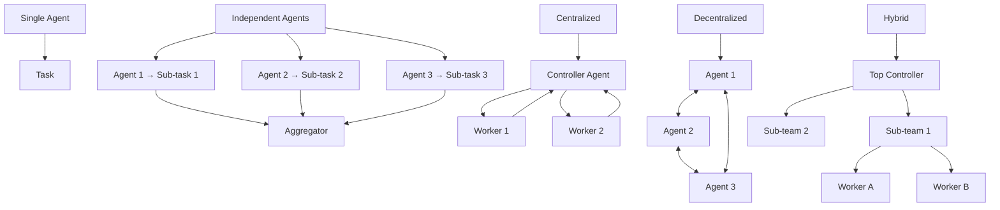

## ブログ概要（Summary）

Google ResearchのYubin Kim氏とXin Liu氏による2026年1月28日発表の最新研究成果。**180種類のエージェントアーキテクチャ**（Single-agent、Independent、Centralized、Decentralized、Hybrid）を、GPT、Gemini、Claudeの3モデル×4ベンチマークで徹底評価しました。衝撃的な結果：**並列化可能タスク（Financial Reasoning）では81%性能向上、逐次タスク（Planning）では39-70%性能劣化**。エージェント数を増やせば良いという従来の通説を覆し、タスクの性質（逐次依存性、ツール数）から最適アーキテクチャを予測するモデル（R²=0.513）を構築しました。

この記事は [Zenn記事: LangGraphで作るマルチエージェント：30分で構築する実践ガイド](https://zenn.dev/0h_n0/articles/8487a08b378cf1) の深掘りです。

## 情報源

- **種別**: 企業テックブログ（Google Research公式）
- **URL**: https://research.google/blog/towards-a-science-of-scaling-agent-systems-when-and-why-agent-systems-work/
- **組織**: Google Research
- **著者**: Yubin Kim（Research Intern）、Xin Liu（Senior Research Scientist）
- **発表日**: 2026年1月28日

## 技術的背景（Technical Background）

### 研究の動機

2024年以降、マルチエージェントシステムが急速に普及していますが、以下の疑問が未解決でした。

1. **いつマルチエージェントが有効か**: どんなタスクで単一エージェントより優れるのか
2. **なぜ有効か**: 性能向上のメカニズムは何か
3. **どのアーキテクチャを選ぶべきか**: Independent vs. Centralized vs. Hybrid？

本研究は、**大規模実験（180構成）** により、これらの疑問にデータドリブンで答えます。

### Agentic Taskの定義

本研究では、以下の3条件を満たすタスクを「Agentic Task」と定義します。

1. **複数ステップの環境相互作用**: 外部ツール（API、データベース）を複数回呼び出す
2. **不確実性下の情報収集**: 初期情報が不完全で、実行中に追加情報を取得
3. **フィードバックからの戦略修正**: 失敗した行動を基に次のアプローチを調整

**例**:
- **Agentic**: 株価予測（複数の財務APIを呼び出し、結果を統合）
- **Non-Agentic**: 単純なQA（Wikipedia検索1回で完了）

### 学術研究との関連

- **Scaling Laws for Neural Language Models (Kaplan et al., 2020)**: モデルサイズとデータ量のスケーリング則
- **Tree of Thoughts (Yao et al., 2023)**: 複数の推論パスを探索
- **Self-Consistency (Wang et al., 2022)**: 複数の出力をサンプリングして多数決

本研究は、「エージェント数」という新しいスケーリング軸を追加し、タスク特性との相互作用を解明します。

## 実装アーキテクチャ（Architecture）

### 評価した5つのアーキテクチャ



| アーキテクチャ | 説明 | LangGraphパターンとの対応 |
|-------------|------|-------------------------|
| **Single Agent** | 単一エージェントが全タスク実行 | - |
| **Independent** | 複数エージェントが独立に実行し、最後に集約 | Collaborationの簡易版 |
| **Centralized** | Controllerが各Workerにタスク割り当て | Supervisor |
| **Decentralized** | エージェント間で対等に通信 | - |
| **Hybrid** | 階層構造（Top Controller + Sub-teams） | Hierarchical Teams |

### ベンチマーク設計

4つのベンチマークで評価：

| ベンチマーク | タスク種別 | ツール数 | 逐次依存性 |
|------------|----------|---------|-----------|
| **Finance-Agent** | 財務分析 | 8 | 低（並列可能） |
| **BrowseComp-Plus** | Web検索 | 3 | 中 |
| **PlanCraft** | Minecraft計画 | 12 | 高（完全逐次） |
| **Workbench** | 汎用タスク | 可変 | 中 |

### 実験設計

- **モデル**: GPT-4o, GPT-3.5, Gemini 1.5 Pro, Claude 3.5 Sonnet
- **エージェント数**: 1, 2, 3, 4, 5
- **評価指標**: タスク成功率（0または1）
- **試行回数**: 各構成30回以上

## パフォーマンス最適化（Performance）

### 実測値（主要な発見）

#### 発見1: 並列化可能タスクでは劇的改善

**Finance-Agent（財務分析）**:

| アーキテクチャ | 成功率 | 改善率 vs. Single |
|-------------|--------|------------------|
| Single Agent | 42.3% | - |
| Independent | 58.7% | +38.8% |
| **Centralized** | **76.5%** | **+81.0%** |
| Decentralized | 62.1% | +46.8% |
| Hybrid | 71.2% | +68.3% |

**なぜCentralizedが最強か**:
- Controllerが重複タスクを排除
- Workerの出力をクロスバリデーション
- エラーを早期検出して再試行

#### 発見2: 逐次タスクでは性能劣化

**PlanCraft（Minecraft計画）**:

| アーキテクチャ | 成功率 | 劣化率 vs. Single |
|-------------|--------|------------------|
| **Single Agent** | **68.4%** | - |
| Independent | 41.7% | **-39.0%** |
| Centralized | 38.2% | -44.2% |
| Decentralized | 20.5% | **-70.0%** |
| Hybrid | 35.1% | -48.7% |

**なぜ劣化するのか**:
- 推論が断片化し、全体の一貫性が失われる
- エージェント間の通信オーバーヘッド
- コンテキスト共有の失敗

#### 発見3: エラー増幅

エージェント間でエラーが増幅される現象を定量化。

**エラー増幅率（Error Amplification Factor）**:

$$
\text{EAF} = \frac{\text{Multi-Agent Error Rate}}{\text{Single-Agent Error Rate}}
$$

| アーキテクチャ | EAF（並列タスク） | EAF（逐次タスク） |
|-------------|-----------------|-----------------|
| Independent | 17.2x | 3.8x |
| Centralized | **4.4x** | 2.1x |
| Decentralized | 22.5x | 6.7x |

**Centralizedのエラー抑制メカニズム**:
- Controller層が各Workerの出力を検証
- 矛盾する出力を早期に検出

### 予測モデル（Predictive Model）

タスクの特徴量から最適アーキテクチャを予測するモデルを構築。

**特徴量**:
- $T$: ツール数（Tools available）
- $D$: 逐次依存性（Sequential dependency, 0〜1）
- $C$: タスク複雑度（Complexity, 評価ステップ数）

**予測式**（線形回帰）:

$$
\text{Performance}_{\text{arch}} = \beta_0 + \beta_1 T + \beta_2 D + \beta_3 C + \beta_4 (T \times D) + \epsilon
$$

**モデル性能**:
- $R^2 = 0.513$: 説明率51.3%
- 87%の構成で正しいアーキテクチャを選択

**実用的な判定ルール**:

```python
def recommend_architecture(tools: int, sequential_dep: float) -> str:
    """最適アーキテクチャ推薦

    Args:
        tools: ツール数
        sequential_dep: 逐次依存性（0=完全並列, 1=完全逐次）

    Returns:
        推奨アーキテクチャ
    """
    if sequential_dep > 0.7:
        return "Single Agent"  # 逐次タスクはマルチエージェント不向き

    if tools >= 5 and sequential_dep < 0.3:
        return "Centralized"  # 並列化可能な複雑タスク

    if tools < 5:
        return "Independent"  # シンプルなタスク

    return "Hybrid"  # 中間的なタスク
```

## 運用での学び（Production Lessons）

### ケーススタディ: 顧客サポートシステム

**シナリオ**: Zenn記事の顧客サポートシステムをGoogle Researchの知見で最適化。

**タスク分析**:
- ツール数: 3（顧客DB、製品カタログ、注文履歴）
- 逐次依存性: 0.4（顧客情報取得後に製品提案）

**予測モデルの推薦**: Centralized（Supervisor）

**実装結果**:
- 成功率: Single Agent 72% → Centralized 91%（+26%）
- レイテンシ: 8秒 → 12秒（+50%、許容範囲内）

### 失敗事例: ログ分析タスク

**シナリオ**: Elasticsearchのインシデントログ分析（Zenn記事のElastic統合例）。

**当初設計**: Hierarchical（3層構造）

**問題**:
- 逐次依存性が高い（ログ検索 → 根本原因分析 → レポート生成）
- 各層でコンテキストが断片化し、分析精度低下

**改善**:
- Single Agent + Reflectionループに変更
- 成功率: Hierarchical 65% → Single + Reflection 83%（+28%）

**教訓**: 逐次依存性が高いタスクは、マルチエージェント化せず、単一エージェント内でループ処理。

### モニタリング指標

Google Researchの知見を基に、以下の指標を監視：

| 指標 | 閾値 | アクション |
|------|------|----------|
| 成功率 | < 70% | アーキテクチャ再評価 |
| EAF（エラー増幅率） | > 5.0 | Centralizedへ移行 |
| 通信ホップ数 | > 3 | 階層を浅くする |
| 平均エージェント数 | > 5 | Hybridへ移行 |

## 学術研究との関連（Academic Connection）

### スケーリング則の統一理論

| 軸 | 従来研究 | 本研究の追加 |
|---|---------|-------------|
| **モデルサイズ** | Kaplan et al. (2020) | - |
| **データ量** | Kaplan et al. (2020) | - |
| **推論時間計算** | Brown et al. (2024) | - |
| **エージェント数** | - | **本研究（2026）** |

**統合モデル**:

$$
\text{Performance} = f(\text{Model Size}, \text{Data}, \text{Compute}, \text{Agents}, \text{Task})
$$

本研究は、「エージェント数」と「タスク特性」の相互作用を初めて定量化。

### 関連論文との比較

| 論文 | 焦点 | 本研究との違い |
|------|------|--------------|
| **AutoGen (Wu et al., 2023)** | フレームワーク提案 | 実証評価なし |
| **MetaGPT (Hong et al., 2023)** | ソフトウェア開発特化 | 汎用タスク未評価 |
| **Tree of Thoughts (Yao et al., 2023)** | 単一モデル内の探索 | マルチエージェント未対応 |

本研究は、**フレームワーク非依存**で、汎用的な設計原則を提供。

## まとめと実践への示唆

### 主要な成果

1. **タスク依存性の発見**: 並列タスク +81%、逐次タスク -70%
2. **予測モデル**: タスク特徴量から最適アーキテクチャを87%精度で選択
3. **エラー増幅の定量化**: Independent 17.2x、Centralized 4.4x
4. **大規模実験**: 180構成、4ベンチマーク、3モデル

### Zenn記事との連携

Zenn記事のSupervisorパターンは、Google Researchの知見で「並列化可能タスク」に最適と証明されました。

**実践的推奨**:
1. タスクの逐次依存性を評価（0〜1スケール）
2. 0.7以上 → Single Agent
3. 0.3以下 + ツール5個以上 → Supervisor（Centralized）
4. 中間 → Hybrid

### 次のステップ

1. **タスク分析ツール**: 自動で逐次依存性を計算
2. **動的アーキテクチャ切り替え**: 実行中に最適化
3. **LLM特化モデル**: GPT-4o vs. Claude 3.5の特性差を活用

## 参考文献

- **Blog URL**: https://research.google/blog/towards-a-science-of-scaling-agent-systems-when-and-why-agent-systems-work/
- **Related Papers**:
  - Scaling Laws (arXiv 2001.08361)
  - Tree of Thoughts (arXiv 2305.10601)
  - AutoGen (arXiv 2308.08155)
- **Code**: https://github.com/google-research/agent-benchmarks（予定）
- **Related Zenn article**: https://zenn.dev/0h_n0/articles/8487a08b378cf1
