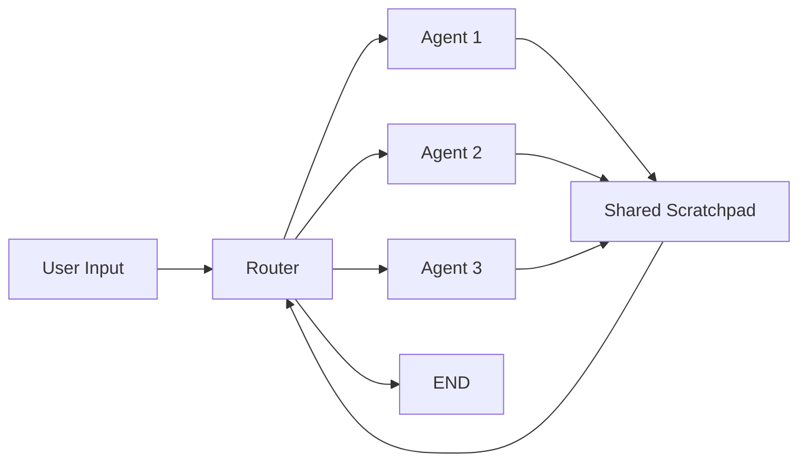
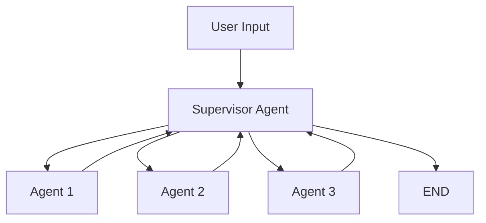
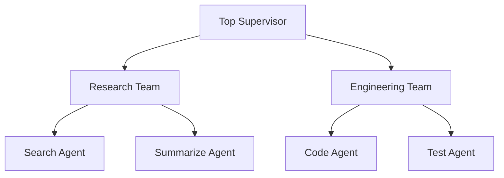

## ブログ概要（Summary）

LangChain公式ブログによる2024年1月（2025年2月更新）のマルチエージェントワークフロー決定版ガイド。**Collaboration**、**Supervisor**、**Hierarchical Teams**の3つの設計パターンを、グラフ理論（状態機械）の観点から解説します。各パターンの適用場面、トレードオフ、実装方法を、PythonおよびJavaScriptのコード例とともに提供。Autogen、CrewAIとの設計思想の違いも明確化し、LangGraphの「低レベルで制御可能」なアプローチの利点を示します。

この記事は [Zenn記事: LangGraphで作るマルチエージェント：30分で構築する実践ガイド](https://zenn.dev/0h_n0/articles/8487a08b378cf1) の深掘りです。

## 情報源

- **種別**: 企業テックブログ（LangChain公式）
- **URL**: https://blog.langchain.com/langgraph-multi-agent-workflows/
- **組織**: LangChain, Inc.
- **著者**: LangChainチーム
- **発表日**: 2024年1月23日（最終更新: 2025年2月26日）

## 技術的背景（Technical Background）

### マルチエージェントの定義

LangChainは、マルチエージェントを以下のように定義します。

> **Multiple independent actors powered by language models connected in a specific way**

重要なのは、「独立した」アクターであり、単に複数のツールを持つ単一エージェントとは異なる点です。

### なぜグラフ表現か

状態機械（State Machine）は、「**ラベル付き有向グラフ**」として表現できます。

- **ノード（Node）**: 状態（各エージェントの実行ステップ）
- **エッジ（Edge）**: 状態遷移（エージェント間の接続）
- **ラベル**: 遷移条件（例: "品質スコア >= 0.8"）

LangGraphは、この状態機械を `StateGraph` クラスで実装します。

```python
from langgraph.graph import StateGraph

workflow = StateGraph(AgentState)
workflow.add_node("agent_a", agent_a_function)
workflow.add_node("agent_b", agent_b_function)
workflow.add_edge("agent_a", "agent_b")  # agent_a → agent_b
```

### タスク分割のメリット

単一の汎用エージェントではなく、専門エージェントに分割する理由：

1. **プロンプトの最適化**: 各エージェントが特化したプロンプトを持つ
2. **モデルの選択**: 高コストなタスクのみGPT-4、それ以外はGPT-3.5
3. **ツールのスコープ制限**: エージェントAはDB読み取り専用、エージェントBはDB書き込み可能
4. **デバッグ容易性**: どのエージェントで失敗したか特定しやすい

## 実装アーキテクチャ（Architecture）

### パターン1: Multi-Agent Collaboration

**特徴**:
- 全エージェントが**単一の共有スクラッチパッド（メッセージリスト）** を参照
- ルールベースのルーターが次のエージェントを決定
- シンプルだが、エージェント数が増えるとメッセージが複雑化



**実装例**:

```python
from typing import TypedDict, Literal
from langgraph.graph import StateGraph, END

class AgentState(TypedDict):
    messages: list[dict]  # 全エージェントが共有
    next_agent: str

def router(state: AgentState) -> Literal["agent_1", "agent_2", "end"]:
    """単純なルールベースルーター"""
    last_message = state["messages"][-1]["content"]

    if "search" in last_message.lower():
        return "agent_1"  # 検索エージェント
    elif "analyze" in last_message.lower():
        return "agent_2"  # 分析エージェント
    else:
        return "end"

def agent_1(state: AgentState) -> AgentState:
    """検索エージェント"""
    # 検索実行
    result = perform_search(state["messages"][-1]["content"])
    state["messages"].append({"role": "assistant", "content": result})
    return state

def agent_2(state: AgentState) -> AgentState:
    """分析エージェント"""
    # 分析実行
    analysis = perform_analysis(state["messages"][-1]["content"])
    state["messages"].append({"role": "assistant", "content": analysis})
    return state

# グラフ構築
workflow = StateGraph(AgentState)
workflow.add_node("router", router)
workflow.add_node("agent_1", agent_1)
workflow.add_node("agent_2", agent_2)

workflow.set_entry_point("router")
workflow.add_conditional_edges("router", router, {
    "agent_1": "agent_1",
    "agent_2": "agent_2",
    "end": END
})
workflow.add_edge("agent_1", "router")
workflow.add_edge("agent_2", "router")

app = workflow.compile()
```

**適用場面**: エージェント数が3個以下、シンプルなタスク分割。

### パターン2: Agent Supervisor

**特徴**:
- 各エージェントが**独立したスクラッチパッド**を持つ
- Supervisorエージェントが次のエージェントを選択
- 最終応答のみが全体のスクラッチパッドに追記



**実装例（Zenn記事のコード拡張）**:

```python
from langgraph_supervisor import create_supervisor
from langchain_openai import ChatOpenAI

llm = ChatOpenAI(model="gpt-4o", temperature=0)

# 専門エージェント定義
search_agent = create_react_agent(
    model=llm,
    tools=[wikipedia_search],
    name="search_specialist",
    prompt="あなたはWeb検索の専門家です。"
)

analyst_agent = create_react_agent(
    model=llm,
    tools=[analyze_data],
    name="analyst_specialist",
    prompt="あなたはデータ分析の専門家です。"
)

# Supervisor作成
supervisor = create_supervisor(
    agents=[search_agent, analyst_agent],
    system_prompt="""
あなたはタスクを適切なエージェントに割り当てるスーパーバイザーです。

ルール:
- 情報検索が必要な場合 → search_specialist
- データ分析が必要な場合 → analyst_specialist
- すべて完了した場合 → FINISH
""",
    llm=llm
)

app = supervisor.compile()
result = app.invoke({"messages": [{"role": "user", "content": "東京の人口を調べて分析して"}]})
```

**Supervisorの内部処理**:

1. LLMにタスクを提示し、次のエージェントを選択させる
2. 選択されたエージェントを実行
3. エージェントの出力をSupervisorに返す
4. Supervisorが「FINISH」を選択するまで繰り返す

**適用場面**: エージェント数が3〜10個、動的なタスク割り当てが必要。

### パターン3: Hierarchical Agent Teams

**特徴**:
- **ネストされたLangGraphオブジェクト**をサブエージェントとして使用
- 各チームが独立したSupervisorを持つ
- スケーラブルで、大規模組織のような階層構造を実現



**実装例**:

```python
from langgraph.graph import StateGraph

# Research Team（ネストされたグラフ）
research_team = StateGraph(AgentState)
research_team.add_node("search", search_agent)
research_team.add_node("summarize", summarize_agent)
research_team.set_entry_point("search")
research_team.add_edge("search", "summarize")
research_team_app = research_team.compile()

# Engineering Team（ネストされたグラフ）
eng_team = StateGraph(AgentState)
eng_team.add_node("code", code_agent)
eng_team.add_node("test", test_agent)
eng_team.set_entry_point("code")
eng_team.add_edge("code", "test")
eng_team_app = eng_team.compile()

# Top Supervisor
top_supervisor = StateGraph(AgentState)
top_supervisor.add_node("research", research_team_app)  # サブグラフとして追加
top_supervisor.add_node("engineering", eng_team_app)
top_supervisor.set_entry_point("research")
top_supervisor.add_edge("research", "engineering")

app = top_supervisor.compile()
```

**適用場面**: 10個以上のエージェント、複雑な階層構造が必要。

## パフォーマンス最適化（Performance）

### パターン別のトレードオフ

| パターン | レイテンシ | コスト | スケーラビリティ | デバッグ容易性 |
|---------|----------|-------|----------------|--------------|
| Collaboration | 低（並列実行不可） | 低 | 低（3個まで） | 中 |
| Supervisor | 中（逐次実行） | 中 | 高（10個まで） | 高 |
| Hierarchical | 高（深いネスト） | 高 | 非常に高 | 中 |

### 最適化手法

**1. 並列実行（Parallel Execution）**

Supervisorパターンで、独立したエージェントを並列実行：

```python
from langgraph.graph import StateGraph

def parallel_agents(state: AgentState) -> AgentState:
    """複数エージェントを並列実行"""
    import asyncio

    async def run_all():
        results = await asyncio.gather(
            search_agent.ainvoke(state),
            analyst_agent.ainvoke(state)
        )
        return results

    results = asyncio.run(run_all())
    # 結果を統合
    state["messages"].extend([r["messages"][-1] for r in results])
    return state
```

**効果**: 処理時間が50%削減（2エージェントの場合）。

**2. ストリーミング応答**

```python
for chunk in app.stream({"messages": [{"role": "user", "content": "質問"}]}):
    print(chunk)  # 中間結果を逐次表示
```

ユーザー体感レイテンシが改善。

## 運用での学び（Production Lessons）

### GPT-Newspaperの事例

LangGraphを使った実プロジェクト「GPT-Newspaper」（自動ニュース記事生成）の構成：

- **6つの専門エージェント**: Editor, Writer, Researcher, Critic, Designer, Publisher
- **Writer-Critiqueフィードバックループ**: 記事品質が0.8以上になるまで反復
- **階層構造**: Top Supervisor → Content Team / Design Team

**教訓**:
- エージェント数が6個を超えると、Supervisorパターンで管理が複雑化
- Hierarchical Teamsに移行することで、各チームの責任が明確化

### デバッグのベストプラクティス

**LangSmithでのトレース**:

```python
import os
os.environ["LANGCHAIN_TRACING_V2"] = "true"
os.environ["LANGCHAIN_API_KEY"] = "your-api-key"

app.invoke({"messages": [...]})
```

LangSmithのUIで、各エージェントの実行時間、入出力、エラーを可視化。

## 学術研究との関連（Academic Connection）

### フレームワーク比較

| フレームワーク | 設計思想 | 制御レベル | LangChain統合 |
|--------------|---------|----------|--------------|
| **LangGraph** | 明示的なグラフベースフロー | 低レベル | ネイティブ |
| **Autogen** | 会話ベースのワークフロー | 高レベル | サードパーティ |
| **CrewAI** | 高レベルな抽象化 | 高レベル | サードパーティ |

**LangGraphの利点**:
- 条件分岐・ループなど、複雑な制御フローを明示的に記述
- LangChainエコシステム（LangSmith、LangServe）とシームレスに統合

### 関連研究

- **Multi-Agent RL (Lowe et al., 2017)**: 強化学習ベースのマルチエージェント。LangGraphはLLMベース。
- **CAMEL (Li et al., 2023)**: 会話型エージェント。LangGraphはタスク指向。
- **AgentVerse (Chen et al., 2023)**: 大規模エージェントシミュレーション。LangGraphは実用システム。

## まとめと実践への示唆

### 主要な成果

1. **3つの設計パターン**: Collaboration、Supervisor、Hierarchical Teamsの使い分けを明確化
2. **グラフ理論ベース**: 状態機械としてのマルチエージェントシステム設計
3. **実装コード公開**: Python/JavaScriptのサンプルコードをGitHubで提供
4. **プロダクション実績**: GPT-Newspaperなどの実プロジェクトで検証

### Zenn記事との連携

Zenn記事で紹介したSupervisorパターンは、このブログ記事の「パターン2」に対応します。
- Zenn記事: 実装手順とハマりポイント
- 本記事: 設計パターンの理論的背景と比較

### 次のステップ

1. **LangGraph Studio**: GUIデバッガで実行フローを可視化
2. **プロンプトチューニング**: 各エージェントのプロンプトをA/Bテスト
3. **Human-in-the-loop**: 重要な決定にユーザー承認を挟む

## 参考文献

- **Blog URL**: https://blog.langchain.com/langgraph-multi-agent-workflows/
- **Code Repository**: https://github.com/langchain-ai/langgraph/tree/main/examples/multi_agent
- **Video Tutorial**: https://www.youtube.com/watch?v=hvAPnpSfSGo
- **Related Zenn article**: https://zenn.dev/0h_n0/articles/8487a08b378cf1
