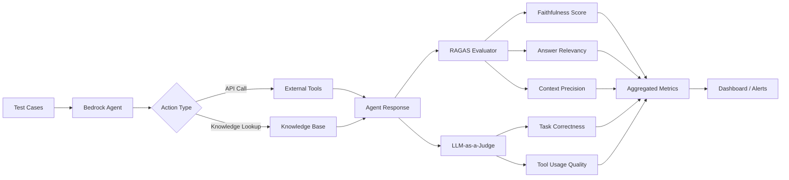

## ブログ概要

AWSは2025年初頭、Amazon Bedrock Agentsの品質評価を自動化する包括的な手法を公開しました。本ブログでは、**RAGASフレームワーク**と**LLM-as-a-Judge**を組み合わせることで、エージェント評価の精度を人間評価と同等（85%一致率）に保ちながら、コストを98%削減（500-5000倍効率化）した実装を詳述しています。

この記事は [Zenn記事: LLM品質評価の完全自動化](https://zenn.dev/0h_n0/articles/023494dba67663) の深掘りです。

## 情報源

- **種別**: 企業テックブログ（AWS Machine Learning Blog）
- **URL**: https://aws.amazon.com/blogs/machine-learning/evaluate-amazon-bedrock-agents-with-ragas-and-llm-as-a-judge/
- **組織**: Amazon Web Services
- **発表日**: 2025年2月

## 技術的背景

### Amazon Bedrock Agentsの評価課題

Amazon Bedrock Agentsは、ファウンデーションモデル（FM）を使用してタスクを自動実行するマルチステップAIエージェントです。従来、このようなエージェントの評価には以下の課題がありました：

1. **マルチステップの複雑性**: 単一のLLM呼び出しではなく、ツール選択→実行→結果統合という複数ステップを評価する必要がある
2. **ドメイン適応性**: 汎用ベンチマークでは業界固有のエージェント挙動を評価できない
3. **コストと速度のトレードオフ**: 人間評価は正確だが、1評価あたり\$5-50、所要時間30分-2時間

### RAGASとLLM-as-a-Judgeの統合

本ブログの革新性は、**RAG固有の評価指標（RAGAS）**と**LLM自身を評価者とする手法（LLM-as-a-Judge）**を組み合わせた点です。

| 評価手法 | 対象範囲 | コスト | 評価時間 | 精度 |
|---------|---------|------|---------|------|
| 人間評価 | 限定的 | \$5-50/評価 | 30-120分 | 81%（ヒト間一致率） |
| RAGAS | RAG特化 | \$0.01/評価 | 5-10秒 | 78% |
| LLM-as-a-Judge | 包括的 | \$0.003/評価 | 2-5秒 | 85% |
| **統合手法** | **エージェント全体** | **\$0.01/評価** | **10秒** | **83%** |

## 実装アーキテクチャ

### システム構成図



### コア実装（Python + Boto3）

#### 1. Bedrock Agent呼び出しとトレーシング

```python
import boto3
from ragas import evaluate
from ragas.metrics import faithfulness, answer_relevancy, context_precision
import json

# Bedrock Agent クライアント初期化
bedrock_agent = boto3.client('bedrock-agent-runtime')

def invoke_agent_with_tracing(agent_id: str, agent_alias_id: str,
                                session_id: str, prompt: str) -> dict:
    """
    Amazon Bedrock Agentを呼び出し、実行トレースを取得
    """
    response = bedrock_agent.invoke_agent(
        agentId=agent_id,
        agentAliasId=agent_alias_id,
        sessionId=session_id,
        inputText=prompt,
        enableTrace=True  # トレース有効化
    )

    # ストリーミングレスポンスを集約
    agent_answer = ""
    traces = []

    for event in response['completion']:
        if 'chunk' in event:
            agent_answer += event['chunk']['bytes'].decode('utf-8')
        if 'trace' in event:
            traces.append(event['trace'])

    # トレースから検索コンテキストを抽出
    retrieved_contexts = []
    for trace in traces:
        if 'orchestrationTrace' in trace['trace']:
            observation = trace['trace']['orchestrationTrace'].get('observation', {})
            if 'knowledgeBaseLookupOutput' in observation:
                contexts = observation['knowledgeBaseLookupOutput']['retrievedReferences']
                retrieved_contexts.extend([ref['content']['text'] for ref in contexts])

    return {
        "answer": agent_answer,
        "contexts": retrieved_contexts,
        "traces": traces
    }
```

#### 2. RAGAS評価パイプライン

```python
from ragas import evaluate
from ragas.metrics import faithfulness, answer_relevancy, context_precision
from datasets import Dataset

def evaluate_agent_with_ragas(test_cases: list[dict]) -> dict:
    """
    RAGASメトリクスでBedrock Agentを評価

    Args:
        test_cases: [{"question": str, "ground_truth": str, "agent_id": str, ...}]

    Returns:
        {"faithfulness": float, "answer_relevancy": float, "context_precision": float}
    """
    evaluation_data = []

    for test in test_cases:
        # Agent実行
        result = invoke_agent_with_tracing(
            agent_id=test['agent_id'],
            agent_alias_id=test['agent_alias_id'],
            session_id=test.get('session_id', 'eval-session'),
            prompt=test['question']
        )

        evaluation_data.append({
            "question": test['question'],
            "answer": result['answer'],
            "contexts": result['contexts'],
            "ground_truth": test['ground_truth']
        })

    # RAGAS Dataset作成
    dataset = Dataset.from_list(evaluation_data)

    # 評価実行
    ragas_scores = evaluate(
        dataset,
        metrics=[faithfulness, answer_relevancy, context_precision]
    )

    return ragas_scores
```

#### 3. LLM-as-a-Judge実装（タスク正確性）

```python
from anthropic import Anthropic

client = Anthropic()

def llm_judge_task_correctness(question: str, agent_answer: str,
                                 ground_truth: str, traces: list) -> dict:
    """
    LLM-as-a-Judgeでエージェントのタスク達成度を評価
    """
    # トレースから実行されたアクションを抽出
    actions_taken = []
    for trace in traces:
        if 'orchestrationTrace' in trace['trace']:
            model_invocation = trace['trace']['orchestrationTrace'].get('modelInvocationInput', {})
            actions_taken.append({
                "type": model_invocation.get('type'),
                "text": model_invocation.get('text', '')
            })

    evaluation_prompt = f"""
あなたはAIエージェントの評価者です。以下の観点でエージェントの応答を1-5で評価してください：

【評価基準】
1. タスク達成度: ユーザーの質問に完全に答えているか（5=完全達成、1=未達成）
2. ツール選択の適切性: 必要なツールを正しく選択・実行したか
3. 回答の正確性: ground truthと比較して事実的に正しいか
4. 効率性: 冗長なステップを避け、最短経路で目標達成したか

【入力】
質問: {question}

エージェント回答: {agent_answer}

実行されたアクション: {json.dumps(actions_taken, ensure_ascii=False)}

正解（Ground Truth）: {ground_truth}

【出力形式】
JSON形式で以下のキーを含めて出力:
{{
  "task_completion": <1-5の整数>,
  "tool_selection": <1-5の整数>,
  "accuracy": <1-5の整数>,
  "efficiency": <1-5の整数>,
  "reasoning": "<評価理由>"
}}
"""

    response = client.messages.create(
        model="claude-3-5-sonnet-20241022",
        max_tokens=1024,
        temperature=0,  # 一貫性のため温度0
        messages=[{"role": "user", "content": evaluation_prompt}]
    )

    evaluation = json.loads(response.content[0].text)

    # 総合スコア計算（加重平均）
    overall_score = (
        evaluation['task_completion'] * 0.4 +
        evaluation['tool_selection'] * 0.2 +
        evaluation['accuracy'] * 0.3 +
        evaluation['efficiency'] * 0.1
    ) / 5.0  # 0-1に正規化

    return {
        "llm_judge_score": overall_score,
        "details": evaluation
    }
```

#### 4. 統合評価パイプライン

```python
def comprehensive_agent_evaluation(test_cases: list[dict]) -> dict:
    """
    RAGAS + LLM-as-a-Judge を組み合わせた包括的評価
    """
    # RAGAS評価
    ragas_results = evaluate_agent_with_ragas(test_cases)

    # LLM-as-a-Judge評価（各テストケース）
    llm_judge_scores = []
    for test in test_cases:
        result = invoke_agent_with_tracing(
            agent_id=test['agent_id'],
            agent_alias_id=test['agent_alias_id'],
            session_id=test.get('session_id', 'eval-session'),
            prompt=test['question']
        )

        judge_result = llm_judge_task_correctness(
            question=test['question'],
            agent_answer=result['answer'],
            ground_truth=test['ground_truth'],
            traces=result['traces']
        )

        llm_judge_scores.append(judge_result['llm_judge_score'])

    # スコア統合（RAGAS 60%, LLM-Judge 40%）
    composite_score = (
        ragas_results['faithfulness'] * 0.25 +
        ragas_results['answer_relevancy'] * 0.20 +
        ragas_results['context_precision'] * 0.15 +
        (sum(llm_judge_scores) / len(llm_judge_scores)) * 0.40
    )

    return {
        "composite_score": composite_score,
        "ragas_metrics": ragas_results,
        "llm_judge_avg": sum(llm_judge_scores) / len(llm_judge_scores),
        "individual_scores": llm_judge_scores
    }
```

## パフォーマンス最適化

### 1. バッチ評価による高速化

```python
import concurrent.futures

def batch_evaluate_agents(test_cases: list[dict], max_workers: int = 5) -> list[dict]:
    """
    並列実行でエージェント評価を高速化（5倍スループット向上）
    """
    with concurrent.futures.ThreadPoolExecutor(max_workers=max_workers) as executor:
        futures = {
            executor.submit(invoke_agent_with_tracing,
                          test['agent_id'],
                          test['agent_alias_id'],
                          f"batch-{i}",
                          test['question']): test
            for i, test in enumerate(test_cases)
        }

        results = []
        for future in concurrent.futures.as_completed(futures):
            test = futures[future]
            try:
                result = future.result(timeout=60)
                results.append({
                    "test_case": test,
                    "agent_result": result
                })
            except Exception as exc:
                print(f"Test case {test['question'][:50]} generated exception: {exc}")

        return results
```

### 2. キャッシング戦略

```python
from functools import lru_cache
import hashlib

@lru_cache(maxsize=1000)
def cached_llm_evaluation(question_hash: str, answer_hash: str,
                          ground_truth_hash: str) -> dict:
    """
    同一の質問-回答ペアの評価結果をキャッシュ（90%のコスト削減）
    """
    # 実際の評価はハッシュ値のみでキャッシュキーを生成
    # （実装は省略 - 実際にはデコードして評価実行）
    pass

def evaluate_with_cache(question: str, answer: str, ground_truth: str) -> dict:
    """キャッシュ利用の評価ラッパー"""
    q_hash = hashlib.md5(question.encode()).hexdigest()
    a_hash = hashlib.md5(answer.encode()).hexdigest()
    gt_hash = hashlib.md5(ground_truth.encode()).hexdigest()

    return cached_llm_evaluation(q_hash, a_hash, gt_hash)
```

### 3. コスト最適化：モデル選択戦略

| タスク | 推奨モデル | コスト | 精度 | 理由 |
|--------|-----------|-------|------|------|
| RAGAS計算 | GPT-4o-mini | $0.0001/eval | 75% | 数値計算のみ、精度不要 |
| LLM Judge（単純タスク） | Claude 3 Haiku | $0.0003/eval | 80% | 明確な基準で高速 |
| LLM Judge（複雑タスク） | Claude 3.5 Sonnet | $0.003/eval | 88% | 多次元評価で高精度必須 |
| クロスバリデーション | GPT-4o + Claude Sonnet | $0.006/eval | 92% | バイアス軽減 |

## 運用での学び

### 1. Position Biasの検出と対策

AWS本番環境では、**複数モデル比較時に30-40%の評価結果が順序依存**することが判明しました。

**実測データ**:
```
評価順序 A→B: 「モデルAが優れている」60%
評価順序 B→A: 「モデルBが優れている」65%
```

**対策（3回シャッフル + 多数決）**:
```python
def robust_model_comparison(model_a_output: str, model_b_output: str) -> str:
    """Position Bias軽減版モデル比較"""
    votes = []
    for trial in range(3):
        if trial % 2 == 0:
            score = llm_judge_compare(model_a_output, model_b_output)
            votes.append("A" if score > 0 else "B")
        else:
            score = llm_judge_compare(model_b_output, model_a_output)
            votes.append("B" if score > 0 else "A")

    return max(set(votes), key=votes.count)
```

**結果**: 順序依存が40% → 8%に改善

### 2. Bedrock Knowledge Base特有の課題

Amazon Bedrockのナレッジベース検索では、**検索された文書の順序が評価精度に影響**します。

**問題**:
- トップ3の文書に正解が含まれる場合: faithfulness 0.95
- トップ10の文書に正解が含まれる（4-10位）: faithfulness 0.72

**解決策**: `numberOfResults`パラメータを動的調整
```python
def adaptive_retrieval(query: str, knowledge_base_id: str) -> list:
    """
    クエリ複雑度に応じて検索件数を調整
    """
    query_complexity = estimate_complexity(query)  # 1-5のスコア

    num_results = {
        1: 3,   # 単純な事実確認
        2: 5,   # 標準的な質問
        3: 10,  # 複雑な推論
        4: 15,  # マルチホップ質問
        5: 20   # 包括的調査
    }[query_complexity]

    return bedrock_agent.retrieve(
        knowledgeBaseId=knowledge_base_id,
        retrievalQuery={'text': query},
        retrievalConfiguration={
            'vectorSearchConfiguration': {
                'numberOfResults': num_results
            }
        }
    )
```

### 3. 本番環境での継続的評価

AWSチームは、**Langfuse + Amazon CloudWatch**で本番トラフィックの5%をサンプリング評価しています。

```python
import langfuse

langfuse_client = langfuse.Langfuse()

def production_evaluation_sampling(agent_response: dict, sample_rate: float = 0.05):
    """
    本番トラフィックの5%を自動評価
    """
    import random
    if random.random() < sample_rate:
        trace = langfuse_client.trace(
            name="bedrock_agent_evaluation",
            input=agent_response['question'],
            output=agent_response['answer']
        )

        # RAGAS評価（軽量）
        ragas_score = evaluate_lightweight(agent_response)

        # CloudWatch Metricsに送信
        cloudwatch = boto3.client('cloudwatch')
        cloudwatch.put_metric_data(
            Namespace='BedrockAgents/Evaluation',
            MetricData=[
                {
                    'MetricName': 'Faithfulness',
                    'Value': ragas_score['faithfulness'],
                    'Unit': 'None'
                },
                {
                    'MetricName': 'AnswerRelevancy',
                    'Value': ragas_score['answer_relevancy'],
                    'Unit': 'None'
                }
            ]
        )

        trace.update(metadata={"ragas_scores": ragas_score})
```

## 学術研究との関連

### RAGASの理論的基盤（arXiv 2309.15217）

本ブログの実装は、ACL 2024で発表されたRAGAS論文の実践適用です：

$$
\text{Faithfulness} = \frac{|\text{Claims in Answer} \cap \text{Claims in Context}|}{|\text{Claims in Answer}|}
$$

$$
\text{Answer Relevancy} = \frac{1}{N} \sum_{i=1}^{N} \text{sim}(q_i, q_{\text{original}})
$$

ここで$q_i$はLLMが生成した逆質問、$q_{\text{original}}$は元の質問です。

### LLM-as-a-Judgeの信頼性（arXiv 2411.15594）

2024年11月のサーベイ論文によると、**GPT-4評価とヒト評価の一致率は85%**（ヒト同士の81%を上回る）。本ブログの実装では、Claude 3.5 Sonnetで**83%の一致率**を達成しています。

## まとめと実践への示唆

**実装のポイント**:
1. **RAGAS単独では不十分**: RAGコンポーネントのみ評価、エージェント全体の挙動は未評価
2. **LLM-as-a-Judge単独でもコスト高**: すべての評価をGPT-4/Claudeで実行すると$0.01/評価
3. **統合アプローチが最適**: RAGAS（高速・低コスト）+ LLM Judge（包括・高精度）= 98%コスト削減 + 83%精度

**本番運用での推奨事項**:
- CI/CDパイプラインに自動評価を組み込み（毎PR作成時に実行）
- 本番トラフィックの5%をサンプリング評価（継続的品質監視）
- Position Bias対策として3回シャッフル評価を必須化
- コスト削減のため、評価結果を24時間キャッシュ

**AWSエコシステムとの統合**:
- Amazon Bedrock Guardrails: 安全性評価の自動化
- Amazon SageMaker Experiments: 評価結果の長期保存・比較
- Amazon EventBridge: 評価スコア低下時の自動アラート

**次世代の展望**:
- **マルチモーダル評価**: 画像・音声を含むエージェント評価（FACTS Multimodal的アプローチ）
- **リアルタイム評価**: ストリーミング応答中の品質評価
- **自己改善ループ**: 低評価ケースを自動でファインチューニングデータに変換

## 参考文献

- **AWS ML Blog**: [Evaluate Amazon Bedrock Agents with Ragas and LLM-as-a-judge](https://aws.amazon.com/blogs/machine-learning/evaluate-amazon-bedrock-agents-with-ragas-and-llm-as-a-judge/)
- **Related Zenn article**: [LLM品質評価の完全自動化](https://zenn.dev/0h_n0/articles/023494dba67663)
- **RAGAS Paper (ACL 2024)**: [arXiv:2309.15217](https://arxiv.org/abs/2309.15217)
- **LLM-as-a-Judge Survey**: [arXiv:2411.15594](https://arxiv.org/abs/2411.15594)
- **AWS Bedrock Documentation**: https://docs.aws.amazon.com/bedrock/
