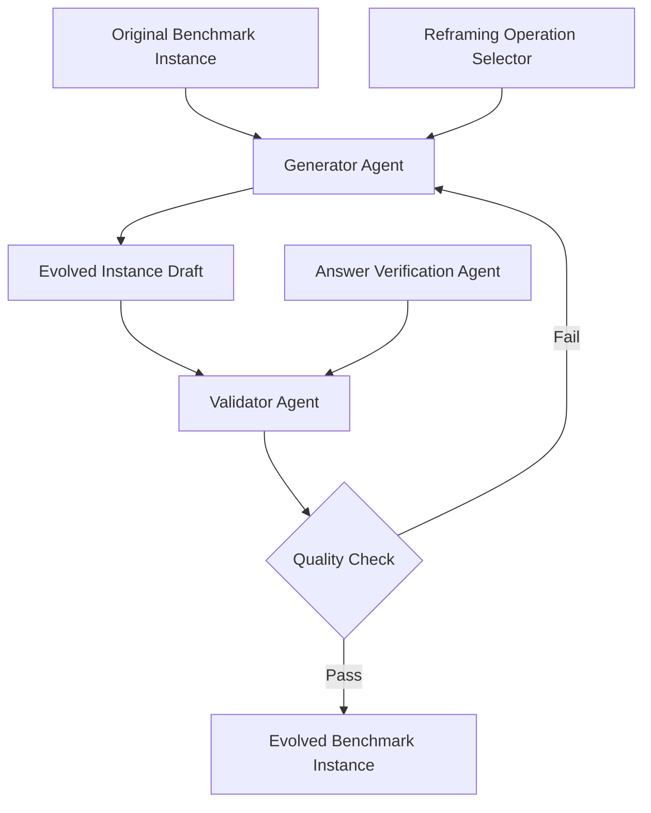

## 論文概要（Abstract）

Benchmark Self-Evolvingは、マルチエージェントシステムを活用して**既存のベンチマークを動的に拡張**するフレームワークである。6つのリフレーミング操作を定義し、元のベンチマーク問題から派生する新しい評価インスタンスを自動生成する。これにより、データ汚染（data contamination）によるスコア膨張を回避し、LLMの**真の問題解決能力**をより正確に測定する。実験の結果、ほとんどのLLMが元のベンチマークスコアに対して性能低下を示し、モデル間・タスク間の性能差がより明確になることが確認された。

この記事は [Zenn記事: LLMアプリのCI/CDパイプライン構築：Promptfoo×GitHub Actionsで品質を自動検証する](https://zenn.dev/0h_n0/articles/75c05ecd0ff579) の深掘りです。

## 情報源

- **会議名**: COLING 2025（31st International Conference on Computational Linguistics）
- **年**: 2025
- **開催地**: Abu Dhabi, UAE
- **URL**: [https://aclanthology.org/2025.coling-main.223/](https://aclanthology.org/2025.coling-main.223/)
- **著者**: Siyuan Wang, Zhuohan Long, Zhihao Fan, Xuanjing Huang, Zhongyu Wei
- **ページ**: 3310–3328

## カンファレンス情報

**COLINGについて**:
- COLINGは計算言語学分野の主要国際会議の1つで、1965年から開催される歴史ある会議
- 自然言語処理（NLP）の基礎研究から応用研究まで幅広くカバー
- 2025年はAbu Dhabi（UAE）で開催
- ACL、EMNLP、NAACLと並ぶNLP分野の4大会議の1つ

## 背景と動機

### データ汚染問題

LLMの急速な進歩に伴い、ベンチマークスコアのインフレーションが深刻化している。LLMの大規模な訓練コーパスにベンチマークのテストデータが含まれてしまう**データ汚染（data contamination）**により、ベンチマークスコアがモデルの真の能力を反映しなくなる。

例えば、あるモデルがGSM8K（数学推論ベンチマーク）で95%のスコアを達成したとしても、訓練データにGSM8Kの問題が含まれていた場合、このスコアは**暗記（memorization）の結果であり、推論能力の反映ではない**可能性がある。

### CI/CDパイプラインへの影響

この問題はCI/CDパイプラインにも深刻な影響を及ぼす。Zenn記事で解説したPromptfooの品質ゲートが**静的なベンチマーク**に依存している場合、データ汚染によりスコアが膨張し、**実際には品質が低下しているのに品質ゲートを通過してしまう**リスクがある。

Benchmark Self-Evolvingは、この問題に対する根本的な解決策を提示する。ベンチマーク自体を動的に進化させることで、データ汚染に耐性のある評価を実現する。

### 既存アプローチの限界

従来のデータ汚染対策には以下のアプローチがあった：

1. **新規ベンチマーク作成**: コストが高く、作成後すぐに汚染されるリスク
2. **Canary文字列検出**: 訓練データにベンチマークが含まれているか検出するが、偽陰性が多い
3. **Temporal分割**: 訓練データの締切日以降に作成された問題のみ使用するが、締切日の正確な把握が困難

Benchmark Self-Evolvingは、これらの限界を**ベンチマーク自体の動的生成**で克服する。

## 技術的詳細（Technical Details）

### 6つのリフレーミング操作

本論文の中核は、元のベンチマーク問題を変換する6つのリフレーミング操作の定義である。

$$
f_i: \mathcal{Q} \rightarrow \mathcal{Q}', \quad i \in \{1, 2, ..., 6\}
$$

ここで $\mathcal{Q}$ は元の問題集合、$\mathcal{Q}'$ は変換後の問題集合、$f_i$ は第$i$リフレーミング操作である。

**操作1: パラフレーズ変換（Paraphrase Reframing）**

問題の表現を変えつつ、求める回答は同じにする。LLMが表面的なパターンマッチングではなく、意味理解に基づいて回答できるかを検証する。

$$
f_1(q) = \text{Paraphrase}(q) \quad \text{s.t.} \quad \text{answer}(f_1(q)) = \text{answer}(q)
$$

**操作2: 条件変更（Condition Modification）**

問題の前提条件や制約を変更し、新しい正解を導出する。暗記した回答パターンでは対応できないため、真の推論能力を評価できる。

**操作3: 否定変換（Negation Reframing）**

「〜ではないものを選べ」「正しくない選択肢はどれか」のように、問題の論理構造を反転させる。

**操作4: 複雑化（Complexity Escalation）**

元の問題にステップを追加し、より高度な推論を要求する。例えば、1段階の計算問題を2段階に拡張する。

**操作5: 分解（Decomposition）**

複合問題を部分問題に分解し、各部分の理解度を個別に評価する。

**操作6: ショートカットバイアス検出（Shortcut Bias Probing）**

LLMが利用しがちな表面的なショートカット（例: 最も長い選択肢が正解）を意図的に含むか除去することで、ショートカット依存度を測定する。

### マルチエージェントアーキテクチャ

リフレーミング操作の実行には、マルチエージェントシステムを採用している。



**Generator Agent**: 指定されたリフレーミング操作に基づいて、新しい問題インスタンスを生成する。プロンプトには元の問題、操作の定義、および生成品質基準が含まれる。

**Validator Agent**: 生成された問題の品質を検証する。具体的には：
- 元の問題と十分に異なること（表面的なコピーでないこと）
- 正解が一意に決定可能であること
- リフレーミング操作の意図に合致していること

**Answer Verification Agent**: 生成された問題に対して、独立にゴールド回答を導出し、Generator Agentが提示した正解と一致するかを検証する。

### 品質保証アルゴリズム

生成された進化インスタンスの品質を保証するため、以下のフィルタリングパイプラインを適用する。

```python
from dataclasses import dataclass
from enum import Enum

class ReframingOp(Enum):
    """6つのリフレーミング操作"""
    PARAPHRASE = "paraphrase"
    CONDITION_MOD = "condition_modification"
    NEGATION = "negation"
    COMPLEXITY = "complexity_escalation"
    DECOMPOSITION = "decomposition"
    SHORTCUT_BIAS = "shortcut_bias_probing"

@dataclass
class EvolvedInstance:
    """進化ベンチマークインスタンス"""
    original_question: str
    evolved_question: str
    evolved_answer: str
    reframing_op: ReframingOp
    confidence_score: float

def validate_evolved_instance(
    instance: EvolvedInstance,
    validator_llm: str = "gpt-4",
    min_confidence: float = 0.8,
    max_similarity: float = 0.7,
) -> bool:
    """進化インスタンスの品質検証

    Args:
        instance: 検証対象のインスタンス
        validator_llm: 検証に使用するLLMモデル
        min_confidence: 最小信頼度スコア
        max_similarity: 元問題との最大類似度（これ以下であること）

    Returns:
        品質基準を満たす場合True
    """
    # 1. 元の問題との類似度チェック
    similarity = compute_semantic_similarity(
        instance.original_question, instance.evolved_question
    )
    if similarity > max_similarity:
        return False  # 表面的なコピーを排除

    # 2. 回答の一意性チェック
    independent_answer = generate_answer(
        validator_llm, instance.evolved_question
    )
    if independent_answer != instance.evolved_answer:
        return False  # 回答が一意でない

    # 3. 信頼度スコアチェック
    if instance.confidence_score < min_confidence:
        return False

    return True
```

## 実験結果（Results）

### 主要な知見

**知見1: 全モデルで性能低下が観測される**

元のベンチマークスコアに対して、進化ベンチマークでは**ほとんどのLLMが性能低下**を示した。これは、元のベンチマークスコアの一部がデータ汚染または表面的なパターンマッチングによるものであることを示唆している。

**知見2: モデル間の性能差がより明確になる**

元のベンチマークでは上位モデルのスコアが収束する傾向があったが、進化ベンチマークでは**モデル間の差がより大きく**なった。これは、進化ベンチマークがモデルの真の能力をより精緻に弁別できることを意味する。

**知見3: リフレーミング操作の難易度に差がある**

6つのリフレーミング操作の中で、**条件変更**と**複雑化**が最もスコア低下を引き起こした。これは、LLMが元の問題パターンに過適合（overfit）しており、条件の微修正に弱いことを示す。

### CI/CDパイプラインへの応用

この結果は、CI/CDパイプラインでの品質ゲート設計に重要な示唆を与える：

1. **静的ベンチマークだけでは不十分**: 同じテストケースを繰り返し使用すると、プロンプト最適化がテストケースに過適合する可能性がある
2. **動的テスト生成の導入**: Benchmark Self-Evolvingの手法をPromptfoo等の評価フレームワークに組み込み、テストケースを自動的に進化させることで、過適合を防止できる
3. **リフレーミング操作の選択**: 条件変更と複雑化を優先的に適用することで、最も情報量の多い評価が可能

## 実装のポイント（Implementation）

### CI/CDへの統合方法

Benchmark Self-Evolvingの手法をPromptfoo等のCI/CDパイプラインに統合する際の実装方針：

**方針1: テストケースの定期的進化**

```yaml
# promptfooconfig.yaml の拡張（概念設計）
tests:
  - vars:
      question: "Pythonでリストを逆順にする方法は？"
    assert:
      - type: llm-rubric
        value: "正確にリスト操作を説明している"
    evolve:
      operations: [paraphrase, condition_modification]
      frequency: weekly  # 週次でテストケースを進化させる
```

**方針2: 動的テスト生成パイプライン**

```python
def generate_evolved_test_suite(
    original_tests: list[dict],
    operations: list[ReframingOp],
    n_variants: int = 3,
) -> list[dict]:
    """テストスイートを動的に進化させる

    Args:
        original_tests: 元のテストケース
        operations: 適用するリフレーミング操作
        n_variants: 各テストから生成するバリアント数

    Returns:
        進化テストスイート
    """
    evolved_tests = []
    for test in original_tests:
        for op in operations:
            for _ in range(n_variants):
                evolved = apply_reframing(test, op)
                if validate_evolved_instance(evolved):
                    evolved_tests.append(evolved)
    return evolved_tests
```

### 計算コストの考慮

進化ベンチマークの生成にはLLM呼び出しが必要であり、追加コストが発生する。CI/CDパイプラインでは以下の戦略でコストを制御する：

1. **バッチ生成**: 進化テストケースはナイトリービルドで事前生成し、キャッシュ
2. **段階的進化**: 全テストを毎回進化させるのではなく、ランダムに20%を選択して進化
3. **進化の頻度制御**: テストケースの進化は週次程度に制限し、CI実行毎ではなく定期バッチで実行

## 実運用への応用（Practical Applications）

### A/Bテストの信頼性向上

プロンプト変更のA/Bテストで、テストケースが固定だと「テストケースへの最適化」が進む。動的テスト生成を組み込むことで、プロンプトの**汎化性能**をより正確に評価できる。

### モデルスワップの安全性検証

GPT-4からClaude 4.5への移行時、固定ベンチマークでは差が見えにくいケースがある。進化ベンチマークでは、モデルの弱点がより明確に浮き彫りになるため、移行判断の精度が向上する。

### Red teamingの強化

Zenn記事のLayer 3（Red teaming）に、リフレーミング操作を適用することで、攻撃パターンの多様性を自動的に拡大できる。特に、ショートカットバイアス検出操作は、プロンプトインジェクション攻撃の変種生成に応用可能。

## 関連研究（Related Work）

- **DynaBench** (Kiela et al., 2021): 人間参加型の動的ベンチマーク。Benchmark Self-Evolvingは人間の代わりにLLMエージェントを使用し、スケーラビリティを向上
- **CheckList** (Ribeiro et al., 2020, ACL): NLPモデルのための行動テストフレームワーク。リフレーミング操作の一部（パラフレーズ変換）はCheckListの方法論を拡張
- **PromptBench** (Zhu et al., 2023): 敵対的攻撃によるロバスト性評価。Benchmark Self-Evolvingはロバスト性だけでなく、能力の深さを測定する点で補完的

## まとめ

Benchmark Self-Evolvingは、**ベンチマークをモデルの進化に合わせて動的に進化させる**という新しいパラダイムを提示した。6つのリフレーミング操作とマルチエージェント品質保証により、データ汚染に耐性のある評価を実現する。

CI/CDパイプラインの文脈では、Promptfoo等の評価フレームワークに動的テスト生成を組み込むことで、**プロンプト最適化のテストケースへの過適合**を防止できる。Zenn記事で構築した3層評価アーキテクチャの各層に進化的テスト生成を追加することで、評価の信頼性を大幅に向上させる可能性がある。

## 参考文献

- **Conference URL**: [https://aclanthology.org/2025.coling-main.223/](https://aclanthology.org/2025.coling-main.223/)
- **Related Papers**: Kiela et al., "Dynabench: Rethinking Benchmarking in NLP" (NAACL 2021); Ribeiro et al., "Beyond Accuracy: Behavioral Testing of NLP Models with CheckList" (ACL 2020)
- **Related Zenn article**: [https://zenn.dev/0h_n0/articles/75c05ecd0ff579](https://zenn.dev/0h_n0/articles/75c05ecd0ff579)
