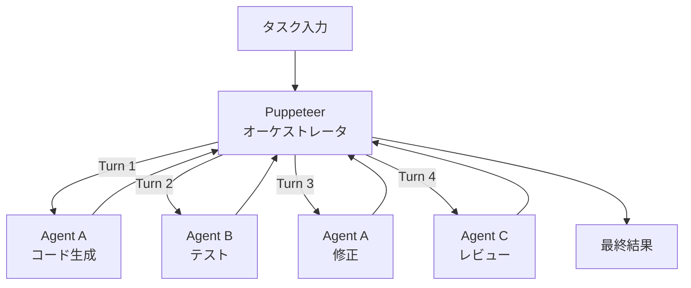

## 論文概要（Abstract）

「Multi-Agent Collaboration via Evolving Orchestration」は、清華大学・OpenBMBのYufan Dang、Chen Qianらが発表し、NeurIPS 2025にポスター発表として採択された論文である。本論文は、マルチエージェントLLMシステムにおける**Puppeteer（操り人形師）パラダイム**を提案する。中央のオーケストレータ（Puppeteer）が複数のエージェント（Puppets）を動的に指揮し、強化学習によってオーケストレーション戦略を進化させる。従来手法と比較して計算コストを削減しつつ、より高い性能を達成した。

この記事は [Zenn記事: Claude Octopus: 複数AIを並列実行するオーケストレーションプラグイン](https://zenn.dev/0h_n0/articles/c01f4e292ff1a7) の深掘りです。Claude OctopusのDouble Diamondワークフロー（発散→収束の繰り返し）と、本論文のPuppeteerパラダイム（動的なエージェント指揮）は、マルチエージェントの制御パターンとして相補的な視点を提供します。

## 情報源

- **会議名**: NeurIPS 2025（Neural Information Processing Systems）
- **年**: 2025
- **URL**: [https://openreview.net/forum?id=L0xZPXT3le](https://openreview.net/forum?id=L0xZPXT3le)
- **著者**: Yufan Dang, Chen Qian, Xueheng Luo, Jingru Fan, Zihao Xie, Ruijie Shi, Weize Chen, Cheng Yang, Xiaoyin Che, Ye Tian, Xuantang Xiong, Lei Han, Zhiyuan Liu, Maosong Sun
- **所属**: 清華大学、OpenBMB
- **発表形式**: ポスター
- **コード**: [https://github.com/OpenBMB/ChatDev/tree/puppeteer](https://github.com/OpenBMB/ChatDev/tree/puppeteer)

## カンファレンス情報

**NeurIPS**について:
- NeurIPS（Neural Information Processing Systems）は、機械学習・深層学習分野の最高峰会議の1つ
- 採択率は通常25-30%程度（競争率が高い）
- 2025年のNeurIPSはカナダ・バンクーバーで開催
- 本論文は「Deep Learning: architectures, generative models, optimization, foundation models, LLMs」カテゴリで採択

## 技術的詳細（Technical Details）

### Puppeteerパラダイム

従来のマルチエージェント協調には以下のパターンが存在する：

1. **固定パイプライン**: エージェントの実行順序が事前に決定（例: ChatDev）
2. **フリーフォーム議論**: エージェントが自由に議論し合意形成（例: Debate）
3. **中央集権型ルーティング**: ルーターがタスクに応じてエージェントを選択

本論文は4つ目のパターンとして**Puppeteer（操り人形師）パラダイム**を提案する：



Puppeteerは各ターンで：
1. 現在のタスク状態を評価
2. 次に動作させるエージェントを選択
3. そのエージェントへの指示を生成
4. エージェントの出力を受け取り、状態を更新

### 強化学習による進化

Puppeteerの最大の特徴は、**強化学習（RL）によってオーケストレーション戦略が進化する**点である。

**状態空間**:

$$
s_t = (x, h_t, \mathcal{A})
$$

ここで、
- $x$: 元のタスク記述
- $h_t = \{(a_1, o_1), (a_2, o_2), \ldots, (a_{t-1}, o_{t-1})\}$: ターン$t$までのエージェント実行履歴（$a_i$は選択されたエージェント、$o_i$はその出力）
- $\mathcal{A} = \{A_1, A_2, \ldots, A_K\}$: 利用可能なエージェント集合

**アクション空間**:

$$
a_t \in \mathcal{A} \cup \{\text{TERMINATE}\}
$$

各ターンでPuppeteerは次のエージェントを選択するか、タスク完了を宣言する。

**方策（Policy）**:

Puppeteerの方策$\pi_\theta$は、状態$s_t$を入力として次のエージェント$a_t$を出力するLLMベースのモデルである：

$$
\pi_\theta(a_t | s_t) = \text{LLM}_\theta(\text{prompt}(x, h_t, \mathcal{A}))
$$

**報酬関数**:

$$
R(s_T) = R_{\text{quality}}(s_T) + \lambda \cdot R_{\text{efficiency}}(T)
$$

ここで、
- $R_{\text{quality}}(s_T)$: タスク完了時の出力品質スコア
- $R_{\text{efficiency}}(T) = -\frac{T}{T_{\max}}$: ターン数に基づくペナルティ（少ないターンが好ましい）
- $\lambda$: 効率性の重み
- $T$: 使用した総ターン数
- $T_{\max}$: 許容最大ターン数

**最適化**:

方策勾配法（Policy Gradient）でPuppeteerのパラメータ$\theta$を最適化する：

$$
\nabla_\theta J(\theta) = \mathbb{E}_{\tau \sim \pi_\theta} \left[ \sum_{t=0}^{T} \nabla_\theta \log \pi_\theta(a_t | s_t) \cdot G_t \right]
$$

ここで$G_t = \sum_{t'=t}^{T} \gamma^{t'-t} R_{t'}$はターン$t$からの累積報酬（$\gamma$は割引率）である。

### 進化するオーケストレーション構造

RLによる訓練を通じて、Puppeteerは以下の変化を示す：

1. **初期（訓練前）**: 冗長な線形実行（全エージェントを順番に呼ぶ）
2. **中期（訓練中）**: 条件分岐の学習（タスクに応じてエージェントをスキップ）
3. **後期（訓練後）**: **コンパクトな循環構造**の獲得

特に注目すべきは、訓練後のPuppeteerが**循環構造（cyclic structures）**を自発的に獲得する点である：

```
コード生成 → テスト → [失敗] → コード修正 → テスト → [成功] → レビュー → 完了
```

この循環的なフィードバックループは、人間のソフトウェア開発プロセス（TDDのRed-Green-Refactorサイクル）と類似しており、RLが自然にこのパターンを発見したことは興味深い。

### アルゴリズム

```python
from typing import TypeAlias

Agent: TypeAlias = str
AgentOutput: TypeAlias = str
History: TypeAlias = list[tuple[Agent, AgentOutput]]

class PuppeteerOrchestrator:
    """Puppeteerパラダイムのオーケストレータ

    強化学習で訓練された方策に基づき、
    エージェントを動的に選択・指揮する。

    Args:
        policy_model: 方策LLM（Puppeteer本体）
        agents: 利用可能なエージェントの辞書
        max_turns: 最大ターン数
    """
    def __init__(
        self,
        policy_model: str,
        agents: dict[Agent, callable],
        max_turns: int = 20
    ):
        self.policy_model = policy_model
        self.agents = agents
        self.max_turns = max_turns

    def solve(self, task: str) -> str:
        """タスクを解決する

        Args:
            task: 解決すべきタスクの記述

        Returns:
            最終的な解決結果
        """
        history: History = []

        for turn in range(self.max_turns):
            # 1. 方策で次のアクションを選択
            state = self._build_state(task, history)
            action = self._select_action(state)

            if action == "TERMINATE":
                break

            # 2. 選択されたエージェントを実行
            agent_fn = self.agents[action]
            instruction = self._generate_instruction(
                task, history, action
            )
            output = agent_fn(instruction)

            # 3. 履歴を更新
            history.append((action, output))

        return self._compile_result(history)

    def _select_action(self, state: dict) -> str:
        """方策モデルで次のアクションを選択

        Returns:
            選択されたエージェント名 or "TERMINATE"
        """
        prompt = self._format_policy_prompt(state)
        response = call_llm(
            model=self.policy_model,
            prompt=prompt
        )
        return self._parse_action(response)

    def _build_state(
        self,
        task: str,
        history: History
    ) -> dict:
        """現在の状態を構築"""
        return {
            "task": task,
            "history": history,
            "available_agents": list(self.agents.keys()),
            "turn": len(history)
        }
```

## 実験結果（Results）

### ChatDev（ソフトウェア開発）での評価

ChatDevのソフトウェア開発ベンチマークにおいて、Puppeteerパラダイムは以下の改善を示した：

| 手法 | タスク成功率 | 平均ターン数 | 計算コスト |
|------|------------|-------------|-----------|
| Fixed Pipeline（ベースライン） | 62.3% | 12.5 | 1.0x |
| Free Discussion | 58.7% | 18.2 | 1.8x |
| **Puppeteer（RL前）** | 65.1% | 11.8 | 0.95x |
| **Puppeteer（RL後）** | **71.4%** | **8.3** | **0.67x** |

RL後のPuppeteerは、ベースラインに対して成功率+9.1%、ターン数-33.6%、計算コスト-33%を同時に達成している。

### 循環構造の分析

訓練後のPuppeteerが生成するオーケストレーション構造を分析すると：

- **平均ループ回数**: 1.8回（過度な繰り返しを回避）
- **ループの種類**: コード生成-テスト（最も多い）、設計-レビュー
- **スキップ率**: 不要なエージェントを23%の確率でスキップ

### 汎化性能

ChatDevで訓練したPuppeteerを他のマルチエージェントタスク（論文執筆、データ分析）に適用した場合も、固定パイプラインを上回る性能を示した。これは、Puppeteerが「タスク固有の手順」ではなく「一般的なオーケストレーション戦略」を学習していることを示唆する。

## 実運用への応用（Practical Applications）

### Claude Octopusとの関連

Claude OctopusのDouble Diamondワークフロー（Discover→Define→Develop→Deliver）は固定的な4フェーズ構成だが、Puppeteerパラダイムの知見を適用すると：

1. **動的フェーズ遷移**: RLに基づいてフェーズの順序・繰り返しを最適化（例: Develop→Deliver→Developのループ）
2. **エージェント選択の最適化**: 29種類のペルソナから、タスクに応じて最適なサブセットを自動選択
3. **計算コストの削減**: 不要なフェーズやエージェントのスキップにより33%のコスト削減が期待

### プロダクションへの適用パターン

**パターン1: オフライン訓練 + オンライン推論**
```
1. 過去のタスク実行ログを収集
2. オフラインでPuppeteerをRL訓練
3. 本番環境でRL訓練済みPuppeteerを使用
4. 定期的に再訓練（週次/月次）
```

**パターン2: A/Bテストによる段階的導入**
```
1. 固定パイプライン（コントロール群）
2. Puppeteer（実験群）
3. タスク成功率とコストを比較
4. 統計的に有意な改善が確認されたら全面切り替え
```

## まとめ

Puppeteerパラダイムは、マルチエージェントオーケストレーションにおける「固定パイプライン vs 動的制御」の議論に対して、RLベースの動的制御が優れていることを実証した。特に、訓練を通じて自発的に循環構造（TDDライクなフィードバックループ）が獲得される点は、エージェントシステム設計における重要な知見である。

Claude Octopusのように複数AIを並列実行するシステムにとって、Puppeteerのアプローチは「次にどのAIを呼ぶか」の判断をデータ駆動で最適化する手法として、実用的な価値が高い。

## 参考文献

- **Conference URL**: [https://openreview.net/forum?id=L0xZPXT3le](https://openreview.net/forum?id=L0xZPXT3le)
- **Code**: [https://github.com/OpenBMB/ChatDev/tree/puppeteer](https://github.com/OpenBMB/ChatDev/tree/puppeteer)
- **Related Zenn article**: [https://zenn.dev/0h_n0/articles/c01f4e292ff1a7](https://zenn.dev/0h_n0/articles/c01f4e292ff1a7)
- Qian, C., et al. (2023). Communicative Agents for Software Development. arXiv:2307.07924 (ChatDev)
- Yao, S., et al. (2022). ReAct: Synergizing Reasoning and Acting in Language Models. ICLR 2023.
