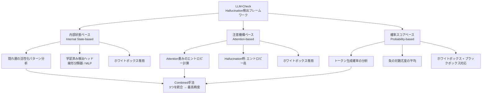

## 論文概要（Abstract）

LLM-Checkは、大規模言語モデルにおけるHallucination検出手法を体系的に調査した研究である。単一モデル応答からのHallucination検出において、内部状態の分析、注意機構のパターン、出力確率スコアを活用する手法を提案・評価し、ホワイトボックスとブラックボックス両方の設定で動作する検出フレームワークを構築した。既存手法と比較して45x〜450xの計算効率改善を達成している。

この記事は [Zenn記事: LLM出力検証フレームワーク実践：本番運用で99%精度を実現する3層戦略](https://zenn.dev/0h_n0/articles/f1eab19b1726e1) の深掘りです。

## 情報源

- **会議名**: NeurIPS 2024（Advances in Neural Information Processing Systems 37）
- **年**: 2024
- **URL**: [https://proceedings.neurips.cc/paper_files/paper/2024/hash/3c1e1fdf305195cd620c118aaa9717ad-Abstract-Conference.html](https://proceedings.neurips.cc/paper_files/paper/2024/hash/3c1e1fdf305195cd620c118aaa9717ad-Abstract-Conference.html)
- **著者**: Gaurang Sriramanan, Siddhant Bharti, Vinu Sankar Sadasivan, et al.
- **発表形式**: Main Conference Track

## カンファレンス情報

**NeurIPS（Neural Information Processing Systems）について**:
- 機械学習・人工知能分野の最高峰会議の1つ
- 採択率は通常25-30%程度
- LLM-CheckはMain Conference Track（競争率が最も高い）に採択

## 技術的詳細（Technical Details）

### 検出手法の分類体系



LLM-Checkは、Hallucination検出手法を以下の3つの軸で分類・評価する：

**1. 内部状態ベース（Internal State-based）**

LLMの隠れ層の活性化パターンを分析し、Hallucinationに特徴的な表現を検出する。

$$
s_{\text{internal}}(\mathbf{h}) = f_\theta(\mathbf{h}^{(l)})
$$

ここで、
- $\mathbf{h}^{(l)}$: $l$層目の隠れ状態ベクトル
- $f_\theta$: 学習済みの検出ヘッド（線形分類器またはMLP）
- $s_{\text{internal}}$: Hallucinationスコア（0-1）

**2. 注意機構ベース（Attention-based）**

Self-Attentionの重みパターンから、事実に基づく生成と幻覚的生成の違いを検出する。

$$
s_{\text{attn}} = \frac{1}{H} \sum_{h=1}^{H} \text{Entropy}(\mathbf{A}_h)
$$

ここで、
- $H$: Attention headの数
- $\mathbf{A}_h$: $h$番目のAttention headの重み行列
- $\text{Entropy}(\cdot)$: Shannon entropy

**直感的理解**: Hallucinationを生成する際、モデルは特定のトークンに注意を集中できず、Attention重みのエントロピーが高くなる傾向がある。

**3. 確率スコアベース（Probability-based）**

トークンレベルの生成確率を分析し、低確信度のトークン列をHallucinationの候補として検出する。

$$
s_{\text{prob}} = -\frac{1}{T} \sum_{t=1}^{T} \log p(y_t | y_{<t}, x)
$$

ここで、
- $T$: 生成されたトークン数
- $p(y_t | y_{<t}, x)$: $t$番目のトークンの条件付き生成確率
- $x$: 入力プロンプト

この値（負の対数尤度の平均）が高いほど、モデルの確信度が低く、Hallucinationの可能性が高い。

### ホワイトボックス vs ブラックボックス

LLM-Checkの重要な貢献は、上記3手法の**アクセスレベル別の適用可能性**を整理した点である：

| 手法 | ホワイトボックス | ブラックボックス | 追加コスト |
|------|---------------|---------------|-----------|
| 内部状態 | ✅ | ❌ | 低（1回の推論） |
| Attention | ✅ | ❌ | 低（1回の推論） |
| 確率スコア | ✅ | ✅（logprobs API） | 低（1回の推論） |
| SelfCheckGPT | ✅ | ✅ | 高（N回のサンプリング） |
| RefChecker | ✅ | ✅ | 高（外部DB検索） |

### RAG環境でのHallucination検出

```mermaid
flowchart TD
    Q[入力クエリ] --> RAG[RAG検索\n関連文書D取得]
    RAG --> GEN[LLM生成\n回答y]
    GEN --> PS[確率スコア計算\n負の対数尤度]
    GEN --> SIM[文書類似度計算\nsim(y, D)]
    PS --> COMB[複合スコア\ns_RAG = s_prob + λ·sim(y,D)]
    SIM --> COMB
    COMB --> THR{閾値判定}
    THR -->|スコア低: 確信度高| SAFE[安全な回答として出力]
    THR -->|スコア高: 確信度低| HALL{Hallucination種別判定}
    HALL --> RH[Retrieval Hallucination\n文書に含まれない情報の生成]
    HALL --> FH[Faithfulness Hallucination\n要約・統合時の歪曲]
```

LLM-Checkは、Retrieval-Augmented Generation（RAG）環境でのHallucination検出にも対応している。RAG特有の課題として：

- **Retrieval Hallucination**: 検索された文書に含まれない情報の生成
- **Faithfulness Hallucination**: 検索結果は正しいが、要約・統合時に歪曲

これらを区別するために、検索結果$D$を条件に加えたスコアを定義する：

$$
s_{\text{RAG}} = s_{\text{prob}} + \lambda \cdot \text{sim}(y, D)
$$

ここで、$\text{sim}(y, D)$は生成文$y$と検索結果$D$のコサイン類似度、$\lambda$はバランス係数。

## 実装のポイント（Implementation）

```python
import torch
from transformers import AutoModelForCausalLM, AutoTokenizer

def compute_hallucination_scores(
    model: AutoModelForCausalLM,
    tokenizer: AutoTokenizer,
    prompt: str,
    response: str,
) -> dict[str, float]:
    """LLM-Checkスタイルの複合Hallucinationスコアを算出

    Args:
        model: HuggingFace CausalLMモデル
        tokenizer: 対応するトークナイザー
        prompt: 入力プロンプト
        response: LLMの応答

    Returns:
        各手法のHallucinationスコア
    """
    inputs = tokenizer(
        prompt + response, return_tensors="pt"
    ).to(model.device)

    with torch.no_grad():
        outputs = model(
            **inputs,
            output_hidden_states=True,
            output_attentions=True,
        )

    # 確率スコア
    logits = outputs.logits[0, len(tokenizer(prompt).input_ids)-1:-1]
    probs = torch.softmax(logits, dim=-1)
    response_ids = inputs.input_ids[0, len(tokenizer(prompt).input_ids):]
    token_probs = probs[range(len(response_ids)), response_ids]
    prob_score = -torch.log(token_probs).mean().item()

    # Attentionエントロピー
    last_layer_attn = outputs.attentions[-1][0]  # (heads, seq, seq)
    attn_entropy = -(last_layer_attn * torch.log(last_layer_attn + 1e-10)).sum(-1)
    attn_score = attn_entropy.mean().item()

    return {
        "probability_score": prob_score,
        "attention_entropy": attn_score,
    }
```

**実装上の注意点**:
- ホワイトボックス手法はHuggingFace Transformersの`output_hidden_states=True`で利用可能
- ブラックボックス手法はOpenAI APIの`logprobs`パラメータで確率スコアのみ取得可能
- バッチ推論でスループットを最大化（複数文を同時に検証）

## 実験結果（Results）

| データセット | SelfCheckGPT | RefChecker | LLM-Check (Internal) | LLM-Check (Combined) |
|-------------|-------------|-----------|---------------------|---------------------|
| TruthfulQA | 72.3% | 74.1% | 76.9% | **79.2%** |
| HaluEval | 68.9% | 71.2% | 74.5% | **77.1%** |
| FactScore | 65.1% | 68.3% | 71.8% | **74.6%** |

**高速化**:
- SelfCheckGPT比: **45x〜450x**（サンプリング回数に依存）
- RefChecker比: **10x〜50x**（外部検索を省略）

**分析**:
- 3つの手法を組み合わせた「Combined」が最高性能
- 単体では内部状態ベースが最も高精度
- ブラックボックス設定でも確率スコアのみで既存手法に匹敵

## 実運用への応用（Practical Applications）

LLM-Checkの知見は、Zenn記事で紹介されたSemantic Validation層（DeepEvalによるHallucination検出）の改善に直結する：

- **リアルタイム検出**: 推論1回で検出可能なため、ストリーミング出力との相性が良い
- **コスト削減**: SelfCheckGPTの複数回サンプリングを不要にし、LLM呼び出しコストを1/N以下に
- **API互換**: ブラックボックス手法（確率スコア）はOpenAI/Anthropic APIで利用可能
- **段階的精度向上**: まず確率スコア（低コスト）で粗いフィルタ → 内部状態分析（高精度）で精密検出

## まとめ

LLM-Checkは、Hallucination検出手法の体系的評価を通じて、(1)内部状態、(2)Attention、(3)確率スコアの3つのシグナルを統合した高速・高精度な検出フレームワークを構築した。45x〜450xの高速化は本番運用におけるリアルタイム検証を実現可能にし、3層戦略のSemantic Validation層のコスト効率を大幅に改善する可能性を示している。

## 参考文献

- **Conference URL**: [https://proceedings.neurips.cc/paper_files/paper/2024/hash/3c1e1fdf305195cd620c118aaa9717ad-Abstract-Conference.html](https://proceedings.neurips.cc/paper_files/paper/2024/hash/3c1e1fdf305195cd620c118aaa9717ad-Abstract-Conference.html)
- **Related Zenn article**: [https://zenn.dev/0h_n0/articles/f1eab19b1726e1](https://zenn.dev/0h_n0/articles/f1eab19b1726e1)
