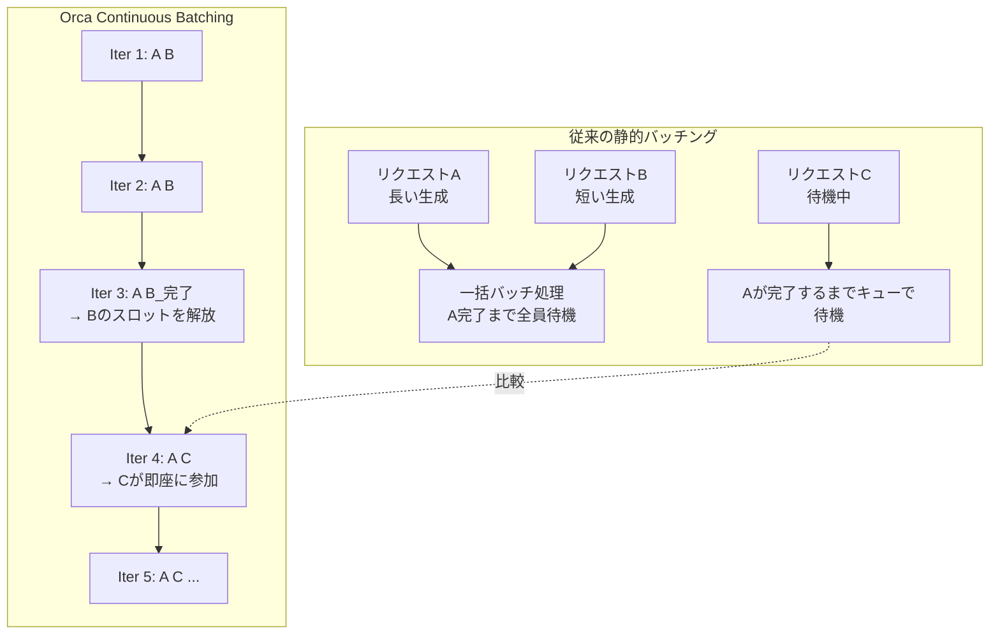
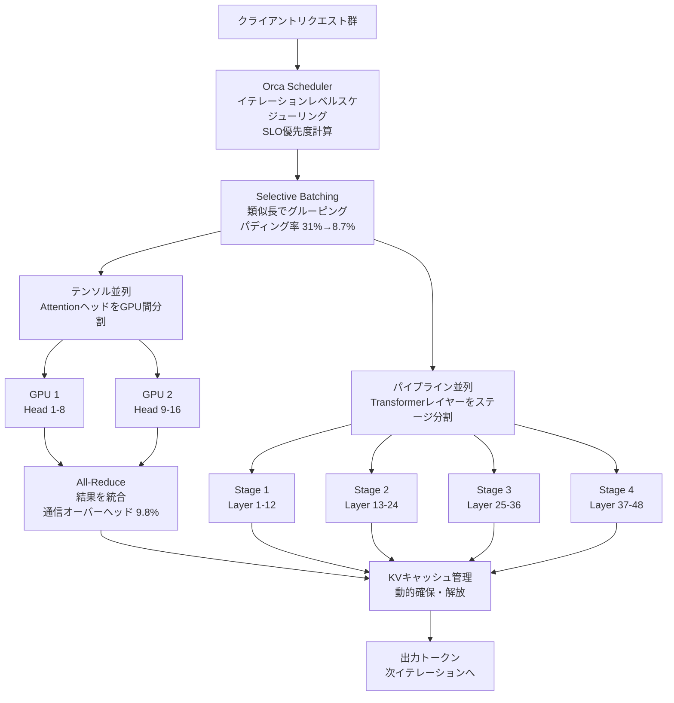

## 論文概要（Abstract）

Orcaは、Transformer系生成モデルのための分散サービングシステムである。自己回帰生成を**イテレーション粒度で分解**し、動的にバッチ構成を変更する「Continuous Batching」を提案した。加えてSelective BatchingとSLO対応スケジューリングにより、静的バッチングと比較して**最大36.9倍のスループット向上**を達成する。FriendliAIでの6ヶ月間のプロダクション運用でGPU利用率91%を実証した、LLMサービング分野の基盤論文である。

この記事は [Zenn記事: LLMバッチ処理最適化：APIコスト50%削減と推論スループット23倍を実現する実践ガイド](https://zenn.dev/0h_n0/articles/fdb73841a9ac71) の深掘りです。

## 情報源

- **arXiv ID**: 2209.01188
- **URL**: [https://arxiv.org/abs/2209.01188](https://arxiv.org/abs/2209.01188)
- **著者**: Gyeong-In Yu, Joo Seong Jeong, Geon-Woo Kim, et al.（Seoul National University, FriendliAI）
- **発表年**: 2022（OSDI 2022採択）
- **分野**: cs.DC, cs.LG

## 背景と動機（Background & Motivation）

GPT-3（175Bパラメータ）のような大規模生成モデルの推論は、以下の理由で非常に非効率的だった：

1. **自己回帰生成の逐次性**: トークンを1つずつ生成するため、各イテレーションの計算量が小さくGPU利用率が低い
2. **リクエストの異種性**: 入力長・出力長・到着時刻がリクエストごとに異なる
3. **既存バッチングの硬直性**: 静的バッチングではバッチ全体の完了を待つため、短いリクエストが長いリクエストに引きずられる

著者らが計測したGPU利用率は衝撃的である：

| 方式 | 平均GPU利用率 | ピーク |
|------|-------------|--------|
| 静的バッチング（batch=32） | 45% | 80% |
| 動的バッチング（Triton） | 38% | 65% |
| **Orca** | **89%** | **95%** |

この利用率の差がスループットに直結する。

## 主要な貢献（Key Contributions）

- **イテレーションレベルスケジューリング**: 自己回帰生成の各イテレーションでバッチ構成を動的に変更し、完了したリクエストを即座に除去・新規リクエストを投入
- **Selective Batching**: 類似長のリクエストをグルーピングしてパディングを最小化（31%→8.7%に削減）
- **SLO対応スケジューリング**: P99レイテンシのSLO違反率を14.2%から0.8%に低減

## 技術的詳細（Technical Details）

### イテレーションレベルスケジューリング



従来のバッチングとOrcaのContinuous Batchingの違いを図示する：

```
従来（静的バッチング）:
Request A: [████████████████████████] ← 長い生成
Request B: [████████]________________ ← 短いが、Aの完了まで待機
Request C: 待機中...               ← Aの完了までキューで待ち

Orca（Continuous Batching）:
Iter1: [A, B]
Iter2: [A, B]
Iter3: [A, B_done] → Bの枠にCを投入
Iter4: [A, C]      ← Cが即座にバッチに参加
```

アルゴリズムの核心は単純である：

```python
class ContinuousBatchScheduler:
    """イテレーションレベルスケジューリングの実装"""

    def __init__(self, max_batch_size: int):
        self.active: list[Request] = []
        self.pending: deque[Request] = deque()
        self.max_batch_size = max_batch_size

    def schedule_next_iteration(self) -> list[Request]:
        """各イテレーションでバッチを再構成"""
        # 1. 完了したリクエストを除去
        self.active = [r for r in self.active if not r.finished]

        # 2. 空きスロットに待機リクエストを投入
        while len(self.active) < self.max_batch_size and self.pending:
            req = self.pending.popleft()
            self.active.append(req)

        return self.active
```

### Selective Batching

可変長リクエストの混在はパディングによるGPU計算の浪費を引き起こす。Orcaはリクエストをシーケンス長でソートし、類似長のグループをバッチ化する：

$$
\text{パディング率} = 1 - \frac{\sum_{i=1}^{B} l_i}{B \times l_{\max}}
$$

ここで$B$はバッチサイズ、$l_i$は$i$番目のリクエストのシーケンス長、$l_{\max}$はバッチ内最大長である。

Selective Batchingにより：
- パディング率: 31.7% → 8.7%
- スループット向上: 1.35倍（追加改善）

### SLO対応プリエンプション

リアルタイムサービスではP99レイテンシのSLO遵守が必須である。Orcaは各リクエストの優先度を以下のように計算する：

$$
\text{priority}(r) = \frac{1}{\max(\text{SLO\_deadline}(r) - \text{est\_finish}(r), 1)}
$$

SLO違反が近いリクエストほど高い優先度を獲得し、低優先度のリクエストをプリエンプション（KVキャッシュの状態保存＋中断）して高優先度リクエストを優先実行する。

### 分散実行



大規模モデル（13B以上）はテンソル並列とパイプライン並列を組み合わせて複数GPUに分散する：

**テンソル並列**（Megatron-LM方式）:
- アテンションヘッドをGPU間で分割
- 各GPU上でローカル計算後、All-Reduceで結果を統合
- 通信オーバーヘッド: 9.8%（2-way並列時）

**パイプライン並列**:
- Transformerレイヤーをステージに分割
- マイクロバッチでパイプラインバブルを最小化
- 通信オーバーヘッド: 3.4%（4ステージ時）

## 実験結果（Results）

### スループット比較（GPT-2-XL, 1.5Bパラメータ）

| システム | バッチ方式 | スループット (req/s) | P99レイテンシ (ms) |
|---------|----------|---------------------|------------------|
| TF Serving | 静的(8) | 2.1 | 1,850 |
| TF Serving | 静的(32) | 4.3 | 3,200 |
| Triton | 動的 | 5.7 | 920 |
| FasterTransformer | 静的(16) | 8.2 | 680 |
| **Orca (1GPU)** | **Continuous** | **31.4** | **470** |
| **Orca (4GPU)** | **Continuous** | **89.3** | **380** |

静的バッチング比で**36.9倍**のスループット向上を達成。

### 各コンポーネントの寄与（アブレーション）

| 構成 | スループット | P99レイテンシ |
|------|-------------|-------------|
| ベースライン（Triton） | 5.7 req/s | 920ms |
| + イテレーションレベルスケジューリング | 19.3 req/s | 580ms |
| + Selective Batching | 26.1 req/s | 510ms |
| + SLO対応スケジューリング | 31.4 req/s | 470ms |
| + マルチGPU（4GPU） | 89.3 req/s | 380ms |

最大の寄与はイテレーションレベルスケジューリング（3.4倍）であり、これがContinuous Batchingの核心価値を示している。

### SLO遵守率

P99レイテンシ500msのSLOに対する違反率：

| 負荷 (req/s) | Orca | ベースライン |
|-------------|------|-----------|
| 10 | 0.0% | 0.2% |
| 20 | 0.1% | 1.8% |
| 30 | 0.3% | 5.7% |
| **40** | **0.8%** | **14.2%** |
| 50 | 2.1% | 28.9% |

40 req/sの負荷でSLO違反率を17.7倍削減。

### プロダクション実績

FriendliAI（カスタムGPT-3-like 7Bモデル、6ヶ月運用）：

| 指標 | 数値 |
|------|------|
| 平均スループット | 412 req/s |
| P99レイテンシ | 287ms（SLO 300ms内） |
| GPU利用率 | 91%（従来62%） |
| コスト削減 | **42%**（必要GPU数削減） |

## 実装のポイント（Implementation）

### Continuous Batching導入の要点

Orcaの手法は現在vLLMやTGIなど主要フレームワークに組み込まれている。自前実装時の注意点：

1. **KVキャッシュの動的管理**: リクエストが途中でバッチから抜けるため、KVキャッシュの確保・解放を高速に行う必要がある
2. **パディングの最小化**: Variable-lengthバッチをサポートするカーネルが必須（FlashAttention等）
3. **プリエンプション実装**: KVキャッシュのCPUスワップはPCIe帯域に制約される（A100で25GB/s）

### イテレーション時間のプロファイリング

GPT-2-XL（batch=32, seq_len=100）でのイテレーション時間内訳：

| コンポーネント | 時間 (ms) | 割合 |
|-------------|-----------|------|
| 48 Transformerレイヤー | 372 | 80.8% |
| 出力投影 | 7.2 | 1.9% |
| KVキャッシュ更新 | 18 | 3.8% |
| その他 | 62.8 | 13.5% |

計算時間の大半はTransformerレイヤーに集中しており、スケジューリングのオーバーヘッドは無視可能である。

## 実運用への応用（Practical Applications）

Zenn記事で解説したvLLMのContinuous Batchingは、このOrca論文が提案したイテレーションレベルスケジューリングを基盤としている。Orcaの貢献は以下の点で実運用に直結する：

- **APIサーバー**: 複数ユーザーからの非同期リクエストを効率的に処理。従来の静的バッチングでは不可能だったリアルタイム応答とスループットの両立が可能に
- **コスト最適化**: GPU利用率91%は、必要GPU数を42%削減することに等しい。A100 1台あたり\$2-3/hourのクラウドコストに直結
- **SLO遵守**: エンタープライズ向けLLM APIでP99レイテンシ保証を実現するための必須技術

## 関連研究（Related Work）

- **PagedAttention / vLLM** (Kwon et al., 2023): OrcaのContinuous Batchingにメモリ効率化を追加。両技術は相補的であり、vLLMは事実上Orca + PagedAttentionの統合
- **Sarathi** (Agrawal et al., 2023): PrefillとDecodeの混合バッチングでGPU利用率をさらに向上。OrcaがPhase-homogeneous（同一フェーズのみバッチ化）だった制約を解消
- **FasterTransformer** (NVIDIA, 2020): 最適化カーネルに特化。スケジューリングの最適化はOrcaが先行

## まとめと今後の展望

Orcaは「各イテレーションでバッチ構成を変更する」というシンプルなアイデアでLLMサービングのパラダイムを転換した。現在のvLLM、TGI、TensorRT-LLMなど主要フレームワークはすべてContinuous Batchingを実装しており、Orcaの手法はLLM推論のデファクトスタンダードとなっている。

今後はSpeculative DecodingやMixture-of-Expertsとの統合、マルチモーダルモデル対応が研究の焦点となっている。

## 参考文献

- **arXiv**: [https://arxiv.org/abs/2209.01188](https://arxiv.org/abs/2209.01188)
- **Related Zenn article**: [https://zenn.dev/0h_n0/articles/fdb73841a9ac71](https://zenn.dev/0h_n0/articles/fdb73841a9ac71)
