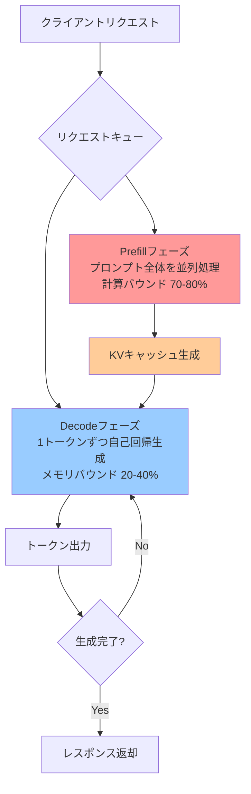
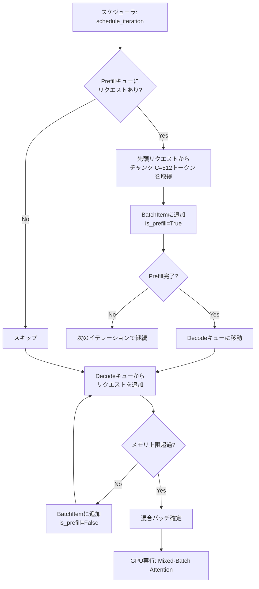

## 論文概要（Abstract）

Sarathiは、LLM推論のPrefillフェーズ（プロンプト処理）とDecodeフェーズ（トークン生成）を**同一バッチ内で混合実行**する手法である。長いプロンプトを固定サイズのチャンクに分割し（Chunked Prefill）、各チャンク処理中にDecodeリクエストを「ピギーバック」させることで、GPUの遊休計算リソースを有効活用する。Mistral-7BでTTFTを**最大2.09倍高速化**し、Decodeスループットを**1.33倍向上**、ShareGPTワークロードでのエンドツーエンドレイテンシを**最大74%削減**する。

この記事は [Zenn記事: LLMバッチ処理最適化：APIコスト50%削減と推論スループット23倍を実現する実践ガイド](https://zenn.dev/0h_n0/articles/fdb73841a9ac71) の深掘りです。

## 情報源

- **arXiv ID**: 2308.16369
- **URL**: [https://arxiv.org/abs/2308.16369](https://arxiv.org/abs/2308.16369)
- **著者**: Amey Agrawal, Ashish Panwar, Jayashree Mohan, et al.（Georgia Tech, Microsoft Research）
- **発表年**: 2023
- **分野**: cs.DC, cs.LG

## 背景と動機（Background & Motivation）

LLM推論には性質が根本的に異なる2つのフェーズがある：

**Prefillフェーズ**: プロンプト全体を並列処理しKVキャッシュを生成
- **計算バウンド**: GPU SMの利用率70-80%
- 行列乗算が支配的で、GPUのTFLOPSを使い切る

**Decodeフェーズ**: 1トークンずつ自己回帰生成
- **メモリバウンド**: GPU SMの利用率20-40%
- KVキャッシュの読み出し（メモリ帯域）がボトルネック

この性質の違いが問題を引き起こす。Orca（Continuous Batching）やvLLMは**フェーズ同質なバッチ**（PrefillのみまたはDecodeのみ）を構成するため、Decodeバッチ実行中のGPU計算リソースの60-80%が遊休状態になる。

さらに、長いプロンプト（2048トークン以上）のPrefillは数百msかかり、この間他のリクエストのDecode処理が**ヘッドオブラインブロッキング**で待たされる。



## 主要な貢献（Key Contributions）

- **Chunked Prefill**: 長いプロンプトを固定サイズ（256-512トークン）のチャンクに分割し、段階的に処理
- **Decode Piggybacking**: Prefillチャンク処理中に遊休計算リソースでDecodeリクエストを同時実行
- **Mixed-Batch Attention**: PrefillとDecodeを同一バッチで処理するカスタムアテンションカーネル

## 技術的詳細（Technical Details）

### リソース相補性の洞察

Sarathiの核心的な洞察は、PrefillとDecodeが**リソース的に相補的**であるという点だ。

| リソース | Prefill | Decode | 混合バッチ |
|---------|---------|--------|----------|
| GPU計算 | 高（70-80%） | 低（20-40%） | 高（65-70%） |
| メモリ帯域 | 中（書き込み） | 高（読み出し） | 高 |
| SMオキュパンシ | 高 | 低 | 中-高 |

Decode処理は計算量が小さいため、Prefillの計算中に**遊休SM（Streaming Multiprocessor）を利用して同時実行**できる。メモリアクセスも衝突しない（Prefillは書き込み、Decodeは読み出し）。

### Chunked Prefillアルゴリズム

長いプロンプトをチャンクサイズ$C$で分割する：

$$
\text{チャンク数} = \left\lceil \frac{P}{C} \right\rceil
$$

ここで$P$はプロンプト長。各チャンクは独立に処理可能（ただしKVキャッシュの依存関係あり）。

```python
def chunk_prefill(prompt_tokens: list[int], chunk_size: int = 512) -> list[list[int]]:
    """プロンプトをチャンクに分割

    Args:
        prompt_tokens: プロンプトのトークンID列
        chunk_size: チャンクサイズ（デフォルト512トークン）

    Returns:
        チャンクのリスト
    """
    return [
        prompt_tokens[i:i + chunk_size]
        for i in range(0, len(prompt_tokens), chunk_size)
    ]
```

**チャンクサイズの選択**:

$$
C^* = \arg\min_C \left[ \frac{P}{C} \times T_{\text{overhead}} + T_{\text{chunk}}(C) \right]
$$

実験的に$C = 512$が最適。小さすぎるとカーネル起動オーバーヘッドが増大し、大きすぎるとDecode処理の割り込み機会が減少する。

| チャンクサイズ | TTFT (ms) | Decodeスループット (tok/s) | 総合レイテンシ |
|-------------|----------|--------------------------|------------|
| 128 | 198 | 2987 | 1.12s |
| 256 | 156 | 3089 | 0.94s |
| **512** | **145** | **3124** | **0.87s** |
| 1024 | 178 | 2876 | 1.03s |
| 2048 | 287 | 2654 | 1.34s |

### Piggyback Scheduling

各イテレーションでPrefillチャンク1つとDecodeリクエストN個を混合バッチとして構成する：



```python
class SarathiScheduler:
    """Prefill-Decode混合スケジューラ"""

    def __init__(self, chunk_size: int = 512):
        self.chunk_size = chunk_size
        self.prefill_queue: deque[Request] = deque()
        self.decode_queue: deque[Request] = deque()

    def schedule_iteration(self) -> list[BatchItem]:
        """混合バッチを構成"""
        batch = []

        # Prefillチャンクを1つ追加
        if self.prefill_queue:
            req = self.prefill_queue[0]
            chunk = req.get_next_chunk(self.chunk_size)
            batch.append(BatchItem(chunk, is_prefill=True))

            if req.prefill_complete():
                self.prefill_queue.popleft()
                self.decode_queue.append(req)

        # 残りの容量をDecodeで埋める
        while self.decode_queue:
            req = self.decode_queue.popleft()
            if self._would_exceed_memory(batch, req):
                self.decode_queue.appendleft(req)
                break
            batch.append(BatchItem(req, is_prefill=False))

        return batch
```

### Mixed-Batch Attentionカーネル

PrefillとDecodeを同一バッチで処理するには、異なるアテンションパターンを統合するカスタムカーネルが必要：

- **Prefillトークン**: チャンク内のcausal maskを適用し、チャンク長$C$の全トークンに対してアテンション計算
- **Decodeトークン**: 1トークンのクエリに対して全KVシーケンスでアテンション計算

```python
def mixed_batch_attention(batch: list[BatchItem], kv_cache: PagedKVCache) -> list[Tensor]:
    """Prefill-Decode混合バッチのアテンション計算"""
    outputs = []
    for item in batch:
        if item.is_prefill:
            # Prefill: チャンク内causal attention
            Q = item.query_tokens    # [chunk_size, d]
            K = kv_cache.get_keys(item.request_id)
            V = kv_cache.get_values(item.request_id)
            mask = torch.tril(torch.ones(len(Q), len(K)))
            out = F.scaled_dot_product_attention(Q, K, V, attn_mask=mask)
        else:
            # Decode: 単一トークンattention
            Q = item.query_token     # [1, d]
            K = kv_cache.get_keys(item.request_id)
            V = kv_cache.get_values(item.request_id)
            out = F.scaled_dot_product_attention(Q, K, V)
        outputs.append(out)
    return outputs
```

最適化として：
1. **フューズドカーネル**: PrefillとDecodeのアテンションを単一カーネルランチで実行
2. **ベクトル化メモリアクセス**: KVキャッシュのcoalesced read
3. **ワープレベルスケジューリング**: SM間の負荷均衡

## 実験結果（Results）

### TTFT（Time to First Token）比較

| モデル | プロンプト長 | vLLM (ms) | Sarathi (ms) | 高速化 |
|--------|-----------|----------|-------------|--------|
| Mistral-7B | 512 | 145 | 89 | 1.63× |
| Mistral-7B | 1024 | 287 | 156 | 1.84× |
| Mistral-7B | 2048 | 623 | 298 | **2.09×** |
| LLaMA-2-7B | 512 | 156 | 98 | 1.59× |
| LLaMA-2-7B | 1024 | 312 | 178 | 1.75× |
| LLaMA-2-7B | 2048 | 678 | 334 | 2.03× |
| LLaMA-2-70B | 512 | 892 | 687 | 1.30× |
| LLaMA-2-70B | 2048 | 3912 | 2456 | 1.59× |

**プロンプトが長いほど高速化率が向上**（2048トークンで最大2.09倍）。Chunked Prefillによりヘッドオブラインブロッキングが解消されるため。

### Decodeスループット

| モデル | バッチサイズ | vLLM (tok/s) | Sarathi (tok/s) | 向上率 |
|--------|-----------|------------|----------------|--------|
| Mistral-7B | 16 | 2341 | 3124 | **1.33×** |
| Mistral-7B | 32 | 2789 | 3567 | 1.28× |
| Mistral-7B | 64 | 2912 | 3621 | 1.24× |
| LLaMA-2-70B | 8 | 412 | 487 | 1.18× |

Piggybacking によりPrefill処理中の遊休リソースでDecode処理を同時実行することで、15-33%のスループット向上を達成。

### エンドツーエンドレイテンシ（ShareGPTデータセット）

| モデル | パーセンタイル | vLLM | Sarathi | 改善率 |
|--------|-------------|------|---------|--------|
| Mistral-7B | P50 | 1.23s | 0.87s | 1.41× |
| Mistral-7B | P95 | 3.45s | 2.12s | 1.63× |
| Mistral-7B | **P99** | **6.78s** | **3.89s** | **1.74×** |
| LLaMA-2-13B | P50 | 1.89s | 1.34s | 1.41× |
| LLaMA-2-13B | P99 | 8.91s | 5.34s | 1.67× |

**テイルレイテンシ（P99）での改善が特に大きい**。これは長いPrefillのブロッキングが最も深刻な影響を与えるP99で、Chunked Prefillの効果が最大化されるためである。

### GPU利用率

| フェーズ | vLLM | Sarathi | 差分 |
|---------|------|---------|------|
| Prefillのみ | 78.3% | 76.9% | -1.4% |
| Decodeのみ | 31.2% | 45.7% | **+14.5%** |
| 混合バッチ | N/A | 68.4% | — |

Decode時のGPU利用率が14.5ポイント向上し、Prefillへの影響は2%未満。

### 出力品質

| モデル | 指標 | vLLM | Sarathi |
|--------|------|------|---------|
| Mistral-7B | BLEU | 34.2 | 34.1 |
| Mistral-7B | ROUGE-L | 45.6 | 45.5 |
| Mistral-7B | Perplexity | 12.3 | 12.4 |

統計的に有意な品質劣化はなし。チャンク分割は計算結果に影響しない（KVキャッシュの蓄積順序が同一）。

## 実装のポイント（Implementation）

### vLLMへの統合

Sarathiの手法はvLLMに`--enable-chunked-prefill`オプションとして統合されている：

```bash
vllm serve meta-llama/Llama-3.3-70B-Instruct \
  --enable-chunked-prefill \
  --max-num-batched-tokens 16384 \
  --tensor-parallel-size 2
```

Zenn記事で推奨しているこのオプションは、まさにSarathiの手法そのものである。

### チャンクサイズの推奨設定

| モデルサイズ | 推奨チャンクサイズ |
|-----------|----------------|
| ~10B | 256 |
| 10B-50B | 384 |
| 50B以上 | 512 |

大きいモデルほどオーバーヘッドの相対的影響が小さいため、大きめのチャンクが有利。

### GQA（Grouped-Query Attention）モデルでの優位性

Mistral-7B（32クエリヘッド、8KVヘッド）のようなGQAモデルでは、KVキャッシュが小さいため同一メモリ内により多くのDecodeリクエストを「ピギーバック」できる。結果としてMHA（Multi-Head Attention）モデルより高い改善率を示す。

## 実運用への応用（Practical Applications）

Zenn記事で解説した `--enable-chunked-prefill` オプションの技術的根拠がこのSarathi論文である。特に以下の場面で効果的：

- **長コンテキスト処理**: 128Kトークンのプロンプトでは、Chunked Prefillなしではヘッドオブラインブロッキングが致命的。チャンク分割により他のリクエストのDecodeを並行処理可能
- **低レイテンシ要件**: P99レイテンシのSLO遵守が求められるAPIサーバーで、テイルレイテンシを74%削減
- **GPU効率最大化**: Decode時GPU利用率を31%から46%に向上。同一GPUでの処理能力が33%向上

## 関連研究（Related Work）

- **Orca** (Yu et al., 2022): Continuous Batching（イテレーションレベルスケジューリング）の提案。SarathiはOrcaの枠組みにPrefill-Decode混合バッチングを追加
- **vLLM / PagedAttention** (Kwon et al., 2023): メモリ効率化。SarathiはPagedAttention上に構築され、メモリとスケジューリングの両方を最適化
- **DistServe** (Zhong et al., 2024): PrefillとDecodeを異なるGPU群に分離する手法。Sarathiの「混合実行」とは反対のアプローチだが、大規模クラスタでは相補的

## まとめと今後の展望

SarathiはPrefillとDecodeが「リソース的に相補的」であるという洞察に基づき、両フェーズの混合実行で推論効率を大幅に向上させた。この手法はvLLMに標準搭載され、`--enable-chunked-prefill`として広く利用されている。

今後はマルチGPUでのChunked Prefill分散（パイプライン並列との統合）、適応的チャンクサイズ（キュー状態に応じた動的調整）、Speculative DecodingとのPiggybacking統合が研究方向として有望である。

## 参考文献

- **arXiv**: [https://arxiv.org/abs/2308.16369](https://arxiv.org/abs/2308.16369)
- **Related Zenn article**: [https://zenn.dev/0h_n0/articles/fdb73841a9ac71](https://zenn.dev/0h_n0/articles/fdb73841a9ac71)
