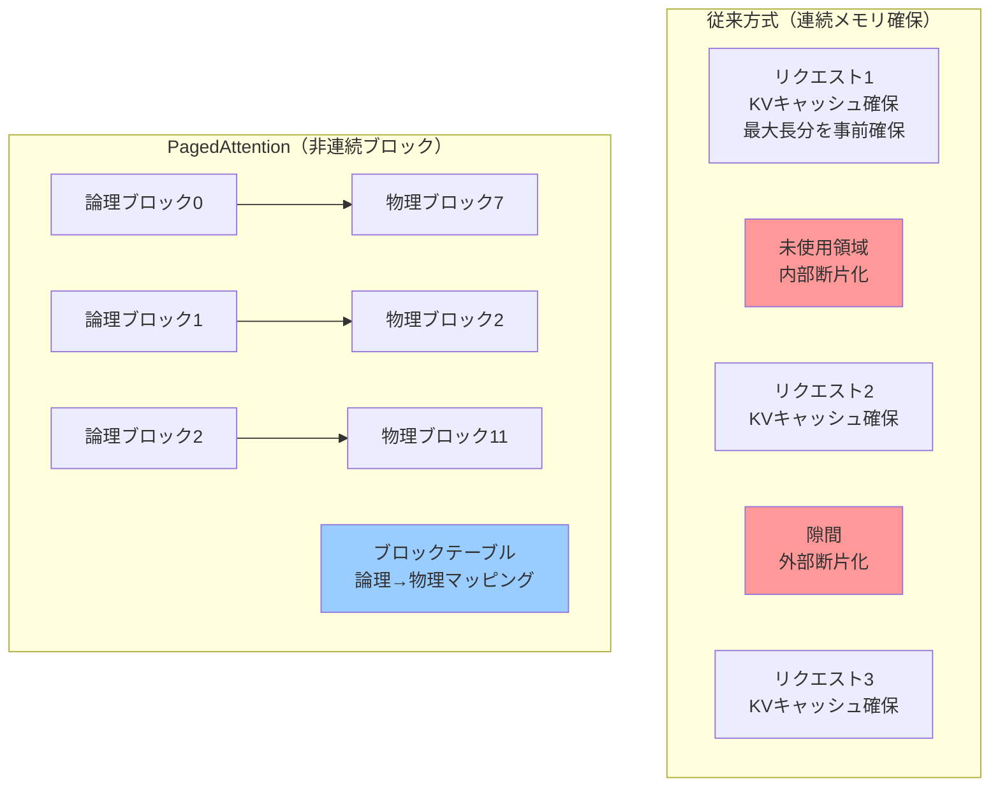
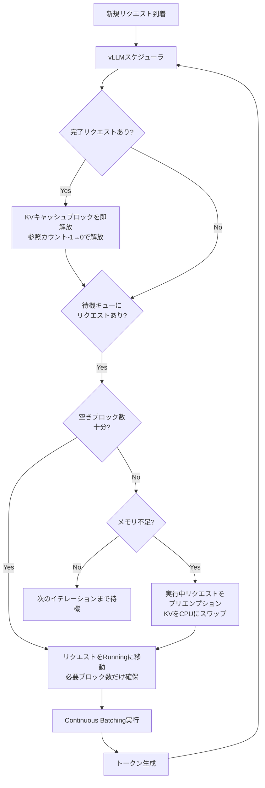

## 論文概要（Abstract）

vLLMの中核技術であるPagedAttentionは、OSの仮想メモリとページング技法に着想を得たアテンションアルゴリズムである。LLM推論時に生じるKVキャッシュのメモリ断片化と重複保持を解消し、既存システムで60-80%にのぼるメモリ浪費を4%未満に削減する。結果として同一GPU上でのバッチサイズを最大4倍に拡大し、FasterTransformerやOrcaと比較して**スループットを2-4倍**向上させる。

この記事は [Zenn記事: LLMバッチ処理最適化：APIコスト50%削減と推論スループット23倍を実現する実践ガイド](https://zenn.dev/0h_n0/articles/fdb73841a9ac71) の深掘りです。

## 情報源

- **arXiv ID**: 2309.06180
- **URL**: [https://arxiv.org/abs/2309.06180](https://arxiv.org/abs/2309.06180)
- **著者**: Woosuk Kwon, Zhuohan Li, Siyuan Zhuang, Ying Sheng, Lianmin Zheng, et al.（UC Berkeley）
- **発表年**: 2023（SOSP 2023採択）
- **分野**: cs.LG, cs.AI, cs.DC

## 背景と動機（Background & Motivation）

LLM推論のボトルネックは計算ではなくメモリにある。Transformerの自己回帰生成では、過去のトークンのKey-Value（KV）をキャッシュとして保持する必要があるが、このKVキャッシュは**リクエストごとに巨大かつ動的に増減**する。例えばLLaMA-13Bでは1シーケンスあたり最大1.7GBのKVキャッシュが必要になる。

既存のサービングシステムでは、各リクエストのKVキャッシュを**連続したメモリ領域に事前確保**する方式を採用していた。この方式には2つの根本的な問題がある：

1. **内部断片化**: 最大シーケンス長分を事前確保するため、実際に使用する量との差分が無駄になる
2. **外部断片化**: 確保済みメモリ間の隙間が利用できない

著者らの計測では、既存システムは**KVキャッシュメモリの60-80%を浪費**しており、これがバッチサイズ＝スループットの上限を決定していた。



## 主要な貢献（Key Contributions）

- **PagedAttention**: KVキャッシュを固定サイズのブロックに分割し、非連続メモリ上に格納可能にするアテンションアルゴリズム
- **Copy-on-Write共有**: Parallel SamplingやBeam Searchでプロンプト部分のKVキャッシュを共有し、メモリ使用量を最大82%削減
- **vLLM**: PagedAttentionを基盤とした分散LLMサービングエンジン。最大4倍のスループット向上を実現

## 技術的詳細（Technical Details）

### ブロックテーブルと仮想ブロック

PagedAttentionの中核はOSの仮想メモリに対応する**ブロックテーブル**である。各シーケンスのKVキャッシュを固定サイズ$B$トークンの**論理ブロック**に分割し、**物理ブロック**へのマッピングをブロックテーブルで管理する。

$$
\text{論理ブロック } i \xrightarrow{\text{block table}} \text{物理ブロック } j
$$

物理ブロックはGPUメモリ上で非連続に配置できるため、従来の連続確保が引き起こす断片化が根本的に解消される。メモリの無駄は各シーケンスの**最終ブロックの未使用部分のみ**となり、浪費率は4%未満に低減される。

### PagedAttentionアルゴリズム

トークン$t$に対するアテンション計算は以下の通り：

$$
A_t = \text{softmax}\left(\frac{Q_t K_{1:t}^T}{\sqrt{d_k}}\right) V_{1:t}
$$

ここで、$Q_t$は現在のクエリ、$K_{1:t}$, $V_{1:t}$は過去の全トークンのKey-Valueである。PagedAttentionではこれをブロック単位で処理する：

```python
def paged_attention(Q_t: Tensor, block_table: dict, kv_cache: Tensor, B: int) -> Tensor:
    """PagedAttention: ブロック単位でアテンションを計算

    Args:
        Q_t: 現在トークンのクエリ (shape: [h, d])
        block_table: 論理→物理ブロックマッピング
        kv_cache: 全物理ブロックのKVデータ
        B: ブロックサイズ（トークン数）

    Returns:
        アテンション出力 (shape: [h, d])
    """
    all_scores = []
    all_values = []

    for logical_idx in range(len(block_table)):
        physical_idx = block_table[logical_idx]
        K_block = kv_cache[physical_idx].keys   # [B, h, d]
        V_block = kv_cache[physical_idx].values  # [B, h, d]

        scores = Q_t @ K_block.transpose(-1, -2) / math.sqrt(d_k)  # [h, B]
        all_scores.append(scores)
        all_values.append(V_block)

    # 全ブロックを結合してsoftmax
    concat_scores = torch.cat(all_scores, dim=-1)
    attn_weights = F.softmax(concat_scores, dim=-1)

    # 加重和
    output = torch.zeros_like(Q_t)
    offset = 0
    for V_block in all_values:
        w = attn_weights[:, offset:offset + B]
        output += w @ V_block
        offset += B
    return output
```

このカーネル実装のオーバーヘッドは連続メモリ版と比較して**3%未満**である。ブロック単位の並列処理とメモリアクセスの最適化（coalesced access）により、非連続アクセスのペナルティを最小化している。

### Copy-on-Writeメモリ共有

Parallel SamplingやBeam Searchでは、複数のシーケンスが同一プロンプトから分岐する。PagedAttentionでは**参照カウント付きCopy-on-Write**でこれを効率的に処理する：

1. 分岐時: 子シーケンスのブロックテーブルが親のブロックを参照（参照カウント+1）
2. 書き込み時: 参照カウント>1なら新ブロックにコピーしてから書き込み
3. 完了時: 参照カウント-1、0になったらブロック解放

Parallel Sampling（$N=16$）でのメモリ削減例：

| 方式 | メモリ使用量 | 削減率 |
|------|-------------|--------|
| 従来（全コピー） | 26.4 GB | — |
| PagedAttention（共有） | 4.8 GB | **82%** |

プロンプト長$P=2048$, 出力長$O=128$の場合、従来方式では$N \times (P + O)$トークン分のメモリが必要だが、PagedAttentionでは$P + N \times O$で済む。

### vLLMのスケジューラ設計

vLLMはContinuous Batching（Orca方式）にメモリ認識スケジューリングを組み合わせたスケジューラを搭載する。各イテレーションで：

1. **完了チェック**: 終了したリクエストのブロックを即座に解放
2. **新規受付**: 空きブロック数に基づいて待機キューから受付
3. **プリエンプション**: メモリ不足時は実行中リクエストのKVキャッシュをCPUにスワップ

このメモリ認識スケジューリングにより、Orcaの単純なContinuous Batchingと比較して2.7倍のスループット向上を達成している。



## 実験結果（Results）

### スループット比較（ShareGPT, LLaMA-13B, A100-80GB）

| システム | スループット (req/s) | 高速化 |
|---------|---------------------|--------|
| FasterTransformer | 0.89 | 1.0× |
| Orca | 1.34 | 1.5× |
| TGI | 1.12 | 1.3× |
| **vLLM** | **3.56** | **4.0×** |

### モデルサイズによるスケーリング

| モデル | FT | vLLM | 高速化 |
|--------|------|------|--------|
| LLaMA-7B | 1.24 | 4.21 | 3.4× |
| LLaMA-13B | 0.89 | 3.56 | 4.0× |
| LLaMA-33B | 0.34 | 1.52 | 4.5× |
| LLaMA-65B | 0.18 | 0.89 | **4.9×** |

**モデルが大きいほど高速化率が向上する**。これはKVキャッシュのトークンあたりサイズが大きくなり、メモリ効率化の効果が増幅されるためである。

### メモリ効率

40GB A100での最大バッチサイズ比較：

| システム | 最大バッチサイズ |
|---------|----------------|
| FasterTransformer | 12 |
| Orca | 16 |
| **vLLM** | **48** |

vLLMはKVキャッシュメモリの93%を実データに使用し、浪費は最終ブロックの7%のみ。FasterTransformerの39%と比較して圧倒的な効率である。

### ブロックサイズの影響

| ブロックサイズ | スループット | オーバーヘッド |
|--------------|-------------|--------------|
| 4 | 3.12 req/s | 11% |
| 8 | 3.38 req/s | 6% |
| **16** | **3.56 req/s** | **3%** |
| 32 | 3.48 req/s | 8% |
| 64 | 3.21 req/s | 18% |

$B=16$が最適で、ブロックテーブルの管理コストと最終ブロックの断片化のバランスが取れている。

## 実装のポイント（Implementation）

### 導入のベストプラクティス

```bash
# vLLM起動（推奨パラメータ）
vllm serve meta-llama/Llama-3.3-70B-Instruct \
  --tensor-parallel-size 2 \
  --max-model-len 8192 \
  --enable-chunked-prefill \
  --max-num-batched-tokens 16384
```

- `--max-num-batched-tokens`: VRAMに応じて調整（A100 80GBなら16384推奨）
- `--enable-chunked-prefill`: 長いプロンプトの分割処理でGPU利用率を維持
- ブロックサイズはデフォルト16で通常最適

### 注意点

- KVキャッシュのメモリ量はモデル全体の20%程度（残り80%がモデル重み）
- Beam Search有効時は`--max-num-seqs`を抑えてメモリ共有の恩恵を最大化
- 8GPU以上のテンソル並列では通信オーバーヘッドに注意

## 実運用への応用（Practical Applications）

Zenn記事で解説したvLLMのContinuous Batchingによるスループット23倍向上の根幹がこのPagedAttentionである。Batch APIでのコスト削減とは異なるアプローチで、**自前GPUでの推論効率を最大化する**技術として位置づけられる。

特にプロダクションでは：

- **マルチテナント環境**: ユーザーごとに異なる長さのリクエストが混在する場面でメモリ効率が劇的に向上
- **Parallel Sampling**: LLM-as-Judgeや複数候補生成でメモリ共有の効果が顕著
- **長コンテキスト処理**: 128Kトークン対応モデルではKVキャッシュが数十GBに達するため、PagedAttentionなしでは実用困難

## 関連研究（Related Work）

- **Orca** (Yu et al., 2022): Continuous Batching（イテレーションレベルスケジューリング）の提案。PagedAttentionはOrcaのスケジューリングにメモリ効率化を追加
- **FlashAttention** (Dao et al., 2022): 計算効率に特化したアテンション実装。PagedAttentionとは直交する最適化であり、vLLMはFlashAttentionをベースカーネルとして使用
- **S-LoRA** (Sheng et al., 2023): 数千のLoRAアダプタを効率的にサーブするシステム。PagedAttentionのメモリ管理基盤の上に構築

## まとめと今後の展望

PagedAttentionは「メモリがLLM推論のボトルネック」という課題に対し、OSの仮想メモリ技法という古典的アイデアを適用した画期的な研究である。vLLMとして実装されたこの技術は、GitHubで30K以上のスターを獲得し、LLM推論基盤のデファクトスタンダードとなった。

今後の方向として、メモリ階層（GPU SRAM → HBM → CPU DRAM → SSD）を活用した階層型ページングや、Speculative Decodingとの統合が有望視されている。

## 参考文献

- **arXiv**: [https://arxiv.org/abs/2309.06180](https://arxiv.org/abs/2309.06180)
- **Code**: [https://github.com/vllm-project/vllm](https://github.com/vllm-project/vllm)
- **Related Zenn article**: [https://zenn.dev/0h_n0/articles/fdb73841a9ac71](https://zenn.dev/0h_n0/articles/fdb73841a9ac71)
