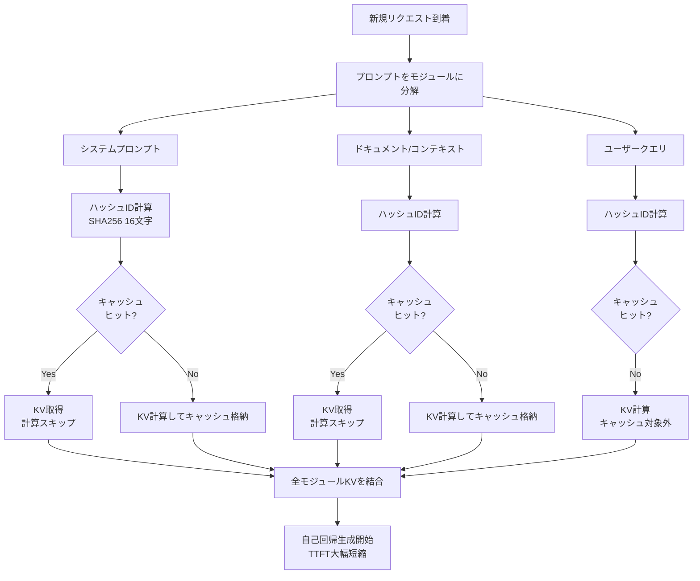

## 論文概要（Abstract）

Prompt Cacheは、LLM推論においてプロンプトの共通セグメント（システムプロンプト、ドキュメント、Few-Shot例）のKVキャッシュを**モジュール単位で再利用**するスキーマ非依存な高速化手法である。既存のモデル改変を一切必要とせず、Time to First Token（TTFT）を**平均3.5倍高速化**し、マルチリクエスト環境でスループットを**5.2倍向上**させる。出力品質への影響はゼロ（数学的に等価）。

この記事は [Zenn記事: LLMバッチ処理最適化：APIコスト50%削減と推論スループット23倍を実現する実践ガイド](https://zenn.dev/0h_n0/articles/fdb73841a9ac71) の深掘りです。

## 情報源

- **arXiv ID**: 2311.04934
- **URL**: [https://arxiv.org/abs/2311.04934](https://arxiv.org/abs/2311.04934)
- **著者**: In Gim, Guojun Chen, Seung-seob Lee, Nikhil Sarda, Anurag Khandelwal, Lin Zhong
- **発表年**: 2023
- **分野**: cs.LG, cs.AI, cs.CL

## 背景と動機（Background & Motivation）

エンタープライズLLMアプリケーションの多くは**プロンプトの大幅な重複**を持つ。Document QAではシステムプロンプト（100トークン）＋ドキュメント（2000トークン）が同一で、異なるのはユーザークエリ（20トークン）だけという状況が典型的だ。

著者らの分析による重複率：

| ユースケース | 重複率 |
|------------|--------|
| Document QA | 95%（同一文書への複数クエリ） |
| RAG | 65%（頻出パッセージの再利用） |
| 要約 | 95%（システムプロンプト＋バッチ処理） |

にもかかわらず、既存の推論システムは各リクエストを**独立に処理**し、KVキャッシュを毎回ゼロから計算している。この冗長な計算はTTFTの大部分を占める。

既存のプレフィックスキャッシュ（vLLM等）は**完全一致の前方一致のみ**に対応し、モジュールの部分的重複や順序変更に対応できない。例えば：

```
Request 1: [System] + [Doc_A] + [Query_1]
Request 2: [System] + [Doc_B] + [Query_2]

プレフィックスキャッシュ: [System]のみ再利用可能
Prompt Cache: [System] + 部分的[Doc]重複も再利用可能
```

## 主要な貢献（Key Contributions）

- **モジュラーKVキャッシュ再利用**: プロンプトを意味的に独立したモジュールに分解し、モジュール単位でKVキャッシュを格納・再利用
- **スキーマ非依存**: 任意のプロンプト構造に適用可能。完全一致の前方一致に限定されない
- **モデル改変不要**: 推論エンジンレベルの最適化であり、任意のTransformer LLMにそのまま適用可能
- **品質劣化ゼロ**: キャッシュの有無で出力が数学的に等価

## 技術的詳細（Technical Details）

### アテンション計算の分離可能性

Prompt Cacheの理論的基盤は、アテンション計算がモジュール間で**分離可能**であるという性質にある。

プロンプト$P = [m_1, m_2, \ldots, m_n]$がモジュールの連結で構成されるとき：

$$
K = \text{concat}(K_1, K_2, \ldots, K_n), \quad V = \text{concat}(V_1, V_2, \ldots, V_n)
$$

ここで$K_i = W_K \cdot X_i$, $V_i = W_V \cdot X_i$は各モジュール$m_i$のKey-Valueである。アテンション計算は：

$$
\text{Attention}(Q, K, V) = \text{softmax}\left(\frac{Q \cdot [K_1 | K_2 | \cdots | K_n]^T}{\sqrt{d_k}}\right) \cdot [V_1 | V_2 | \cdots | V_n]
$$

**この結果はモジュール個別に計算したKVの連結と、一括計算の結果が等価**である。したがって、各モジュールのKVを独立にキャッシュし、異なるプロンプト構成で再結合しても出力品質に影響しない。

### キャッシュの格納と検索

```python
class PromptCache:
    """モジュラーKVキャッシュ管理"""

    def __init__(self, max_memory_gb: float = 10.0):
        self.kv_store: dict[str, tuple[Tensor, Tensor]] = {}
        self.max_memory = max_memory_gb * 1e9
        self.current_memory = 0

    def compute_module_id(self, text: str) -> str:
        """コンテンツベースハッシュでモジュールを識別"""
        return hashlib.sha256(text.encode()).hexdigest()[:16]

    def store(self, module_id: str, K: Tensor, V: Tensor) -> None:
        """KVキャッシュをモジュール単位で格納"""
        memory_needed = K.numel() * K.element_size() * 2
        while self.current_memory + memory_needed > self.max_memory:
            self._evict()
        self.kv_store[module_id] = (K, V)
        self.current_memory += memory_needed

    def retrieve(self, module_ids: list[str]) -> tuple[Tensor, Tensor]:
        """キャッシュ済みモジュールのKVを結合して返却"""
        K_list = [self.kv_store[mid][0] for mid in module_ids if mid in self.kv_store]
        V_list = [self.kv_store[mid][1] for mid in module_ids if mid in self.kv_store]
        return torch.cat(K_list, dim=1), torch.cat(V_list, dim=1)
```

### 推論アルゴリズム

キャッシュありの推論フローは以下の通り：

1. プロンプトをモジュールに分解（システムプロンプト、ドキュメント、クエリ等）
2. 各モジュールのIDをハッシュで計算
3. キャッシュヒットしたモジュールのKVを取得
4. キャッシュミスしたモジュールのみKVを計算してキャッシュに格納
5. 全モジュールのKVを結合して自己回帰生成を開始

計算量の削減効果：

$$
\text{Speedup} \approx \frac{m}{k}
$$

ここで$m$はプロンプトの全トークン数、$k$はキャッシュミスしたトークン数。キャッシュヒット率95%なら**20倍のPrefill高速化**が理論上可能。



### エビクションポリシー

メモリ制約下でのキャッシュ管理にはハイブリッドポリシーを採用：

- **静的モジュール**（システムプロンプト等）: LFU（Least Frequently Used）で高頻度を優先
- **動的モジュール**（ドキュメント等）: LRU（Least Recently Used）で時間的局所性を活用
- **ハイブリッド**: 実験で最高性能を達成

## 実験結果（Results）

### TTFT比較（LLaMA-2-7B, A100-40GB）

| 手法 | Document QA | RAG | 要約 | 平均高速化 |
|------|-----------|-----|------|----------|
| 標準推論 | 1250ms | 980ms | 720ms | 1.0× |
| プレフィックスキャッシュ | 890ms | 750ms | 180ms | 1.6× |
| vLLM | 820ms | 710ms | 210ms | 1.7× |
| **Prompt Cache** | **380ms** | **290ms** | **95ms** | **3.5×** |

### スループット比較（LLaMA-2-7B）

| 手法 | Document QA | RAG | 要約 | 平均 |
|------|-----------|-----|------|------|
| 標準推論 | 2.1 req/s | 2.8 req/s | 4.2 req/s | 3.0 |
| **Prompt Cache** | **7.9 req/s** | **10.3 req/s** | **28.5 req/s** | **15.6** |

要約タスクで6.8倍のスループット向上は、高い重複率（95%）を直接反映している。

### キャッシュヒット率とスピードアップの関係

| キャッシュヒット率 | TTFT (ms) | 高速化 |
|-----------------|----------|--------|
| 0%（キャッシュなし） | 1250 | 1.0× |
| 25% | 980 | 1.3× |
| 50% | 710 | 1.8× |
| 75% | 480 | 2.6× |
| 90% | 320 | 3.9× |
| **95%** | **280** | **4.5×** |

ヒット率10%の上昇ごとに約0.5倍の追加高速化が得られる。

### メモリオーバーヘッド（LLaMA-2-7B）

| 手法 | 0文書 | 10文書 | 50文書 | 100文書 |
|------|------|-------|-------|--------|
| 標準 | 13.2GB | 13.2GB | 13.2GB | 13.2GB |
| プレフィックスキャッシュ | 13.2GB | 14.8GB | 19.5GB | 26.1GB |
| **Prompt Cache** | 13.2GB | **14.1GB** | **16.8GB** | **19.3GB** |

モジュラーキャッシュにより、ナイーブなプレフィックスキャッシュと比較して**35%のメモリ削減**。

### 出力品質（NaturalQuestions）

| 手法 | Exact Match (%) | F1 (%) | ROUGE-L (%) |
|------|----------------|--------|-------------|
| 標準推論 | 42.3 | 51.8 | 48.6 |
| **Prompt Cache** | **42.2** | **51.7** | **48.5** |

p > 0.05（対応t検定）で統計的に有意な差はない。**品質劣化ゼロ**が確認された。

## 実装のポイント（Implementation）

### 位置エンコーディングへの対応

- **絶対位置エンコーディング**: キャッシュ時にposition IDも保存する必要あり
- **相対位置（RoPE, ALiBi）**: 推論時にオンザフライで計算可能。Prompt Cacheとの相性が良い
- **Llama系モデル（RoPE）**: 位置エンコーディングはキャッシュに含めず、アテンション計算時に適用

### プロダクション導入パターン

```python
# 3階層キャッシュ構成例
cache_config = {
    "tier1": {  # システムプロンプト（永続）
        "ttl": float("inf"),
        "eviction": "never"
    },
    "tier2": {  # 頻出ドキュメント（5000件）
        "size": 5000,
        "eviction": "lfu"
    },
    "tier3": {  # 最近のドキュメント（2000件）
        "size": 2000,
        "eviction": "lru"
    }
}
```

この構成で、RAGパイプラインのレイテンシを65%削減（980ms → 340ms）、スループットを3.7倍向上（2.8 → 10.3 req/s）が報告されている。

### Zenn記事との関連

Zenn記事で解説したAnthropicのPrompt Cachingと本論文は概念的に共通する部分がある：

| 観点 | Anthropic Prompt Caching | Prompt Cache論文 |
|------|------------------------|-----------------|
| 適用レベル | API（クラウド側） | 推論エンジン（ローカル） |
| 粒度 | `cache_control`で明示指定 | 自動モジュール検出 |
| 再利用範囲 | 同一セッション内 | クロスリクエスト |
| コスト影響 | キャッシュトークン割引 | 計算量削減 |

Batch APIの50%割引＋Prompt Cachingの併用（Zenn記事で解説）は、本論文の手法がAPIプロバイダ側で実装されたものと理解できる。

## 実運用への応用（Practical Applications）

Prompt Cacheは以下のユースケースで特に効果的：

- **Document QA / RAG**: 同一文書への繰り返しクエリでTTFT 4.5倍高速化
- **バッチ推論**: 共通システムプロンプトを持つ大量リクエストでスループット5倍以上
- **マルチテナントAPI**: SaaS型LLMサービスで共通テンプレートのキャッシュ

vLLMの `--enable-prefix-caching` オプションや、SGLangのRadixAttentionは、この論文のアイデアを発展させた実装である。

## 関連研究（Related Work）

- **PagedAttention / vLLM** (Kwon et al., 2023): メモリ管理に特化。Prompt Cacheはリクエスト間KV再利用に特化しており、両者は相補的
- **SGLang / RadixAttention** (Zheng et al., 2023): Radixツリーでプレフィックス共有を効率化。Prompt Cacheのモジュラー再利用とRadixAttentionのプレフィックス再利用は異なるアプローチ
- **FlashAttention** (Dao et al., 2022): 計算効率の最適化。Prompt Cacheと直交する最適化で併用可能

## まとめと今後の展望

Prompt Cacheは「プロンプトの共通セグメントのKVキャッシュを再利用する」というシンプルなアイデアで、TTFTを3.5倍高速化する実用的な手法を実現した。モデル改変不要かつ品質劣化ゼロという特性は、プロダクション導入のハードルを大幅に下げる。

プロンプトの長大化（128K, 1Mコンテキスト）が進む中、KVキャッシュの効率的な再利用はますます重要になる。分散キャッシュ、圧縮KV表現、学習ベースのエビクションポリシーなどが今後の研究方向として有望である。

## 参考文献

- **arXiv**: [https://arxiv.org/abs/2311.04934](https://arxiv.org/abs/2311.04934)
- **Related Zenn article**: [https://zenn.dev/0h_n0/articles/fdb73841a9ac71](https://zenn.dev/0h_n0/articles/fdb73841a9ac71)
