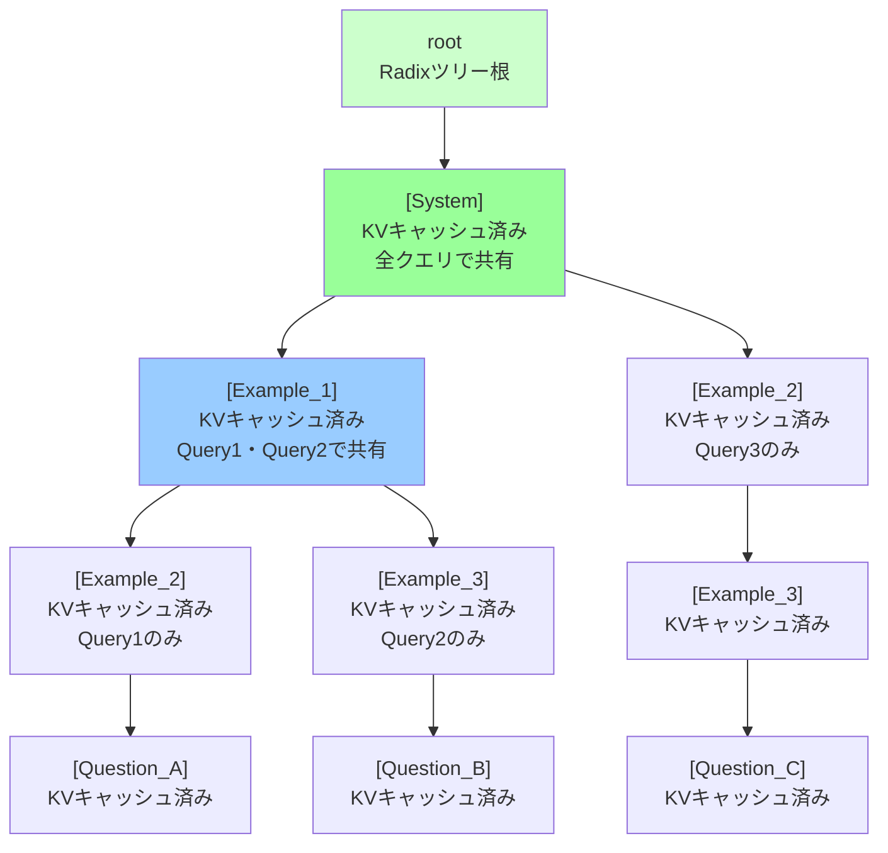
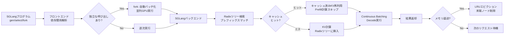

## 論文概要（Abstract）

SGLangは、LLMの構造化プログラミングと推論実行を**フロントエンド言語とランタイムの共同設計**で最適化するシステムである。フロントエンドではテキスト生成（`gen`）、制約付き選択（`select`）、並列実行（`fork`）のプリミティブを提供し、バックエンドではRadixAttentionによるKVキャッシュのプレフィックス共有を実現する。JSONデコードで**最大5倍**、エージェント制御で**3.24倍**、DSPy RAGパイプラインで**3.47倍**の高速化を達成する。

この記事は [Zenn記事: LLMバッチ処理最適化：APIコスト50%削減と推論スループット23倍を実現する実践ガイド](https://zenn.dev/0h_n0/articles/fdb73841a9ac71) の深掘りです。

## 情報源

- **arXiv ID**: 2312.07104
- **URL**: [https://arxiv.org/abs/2312.07104](https://arxiv.org/abs/2312.07104)
- **著者**: Lianmin Zheng, Liangsheng Yin, Zhiqiang Xie, et al.（UC Berkeley）
- **発表年**: 2023
- **分野**: cs.LG, cs.PL

## 背景と動機（Background & Motivation）

LLMは単一のAPI呼び出しから、**複数の生成呼び出し、条件分岐、ツール使用**を含む構造化プログラムへと進化している。ReActエージェント、RAGパイプライン、JSON構造化出力などが典型例だ。しかし既存フレームワークには3つの課題がある：

1. **レイテンシ**: 複数の生成呼び出しが逐次実行され、独立な呼び出しの並列化が手動
2. **冗長計算**: 同一プログラムの複数実行でプロンプトプレフィックスを毎回再計算
3. **デバッグ困難**: LLM特有のプリミティブ（制約付き生成、Few-Shot等）の標準化された抽象化がない

特に問題なのが2番目の冗長計算である。Few-Shot例を5つ含むプロンプトは各リクエストで共通だが、vLLMのプレフィックスキャッシュは**完全一致前方一致のみ**をサポートし、動的にプロンプト構成が変わる場面ではヒット率が0%になる。

## 主要な貢献（Key Contributions）

- **SGLangフロントエンド**: `gen()`, `select()`, `fork()` のプリミティブで構造化LLMプログラムを記述
- **RadixAttention**: LRU方式のRadixツリーでKVキャッシュのプレフィックス共有を管理。動的プロンプトでも55-80%のヒット率
- **自動並列化**: プログラムの依存関係を解析し、独立な生成呼び出しを自動バッチング

## 技術的詳細（Technical Details）

### フロントエンド言語プリミティブ

SGLangの核心は3つのプリミティブである：

**`gen()` — テキスト生成**:
```python
import sglang as sgl

@sgl.function
def summarize(s, text):
    s += sgl.system("You are a summarization expert.")
    s += sgl.user(f"Summarize: {text}")
    s += sgl.assistant(sgl.gen("summary", max_tokens=256, temperature=0.7))
```

**`select()` — 制約付き選択**:
```python
@sgl.function
def classify(s, text):
    s += f"Text: {text}\nCategory: "
    s += sgl.select("category", choices=["tech", "business", "sports"])
```

`select`はRadixツリーによる効率的なトークンマスキングで選択肢を強制する。正規表現ベースのアプローチより高速。

**`fork()` — 並列実行**:
```python
@sgl.function
def parallel_classify(s, texts):
    forks = []
    for text in texts:
        def task(s):
            s += f"Text: {text}\nLabel: "
            s += sgl.select("label", choices=["positive", "negative"])
        forks.append(s.fork(task))
    return [f["label"] for f in forks]
```

`fork`は独立した生成呼び出しを自動的にバッチ化し、GPUを効率利用する。

### RadixAttention

RadixAttentionは、KVキャッシュをRadixツリー（基数木）で管理するアルゴリズムである。

**データ構造**:

```python
class RadixTreeNode:
    """Radixツリーのノード"""
    children: dict[int, "RadixTreeNode"]  # token_id → 子ノード
    key: list[int]                        # トークン列
    kv_cache: KVCache | None              # アテンションKVキャッシュ
    last_access_time: float               # LRU用タイムスタンプ
```

**キャッシュ検索（Algorithm 1）**:

```python
def lookup(root: RadixTreeNode, token_ids: list[int]) -> tuple[int, int]:
    """プレフィックス一致検索

    Returns:
        (matched_length, total_length) — matched_lengthまでキャッシュヒット
    """
    node = root
    matched = 0
    for token in token_ids:
        if token in node.children:
            node = node.children[token]
            matched += 1
        else:
            break
    return matched, len(token_ids)
```

**従来のプレフィックスキャッシュとの決定的な違い**は、Radixツリーが**部分的なプレフィックス共有**を自然に表現できる点にある。例えば：

```
Query 1: [System] + [Example_1, Example_2] + [Question_A]
Query 2: [System] + [Example_1, Example_3] + [Question_B]
Query 3: [System] + [Example_2, Example_3] + [Question_C]

Radixツリー:
root → [System] → [Example_1] → [Example_2] → ...  (Query 1)
                 ↘ [Example_3] → ...  (Query 2 の後半)
              → [Example_2] → [Example_3] → ...  (Query 3)
```

従来の完全一致プレフィックスキャッシュはQuery 1と2で`[System]`のみ共有するが、RadixAttentionは`[System] + [Example_1]`まで共有できる。



### キャッシュヒット率の分析

キャッシュヒット率はタスクによって異なる：

$$
\text{hit\_rate} = \frac{\text{matched\_tokens}}{\text{total\_tokens}}
$$

$$
\text{speedup} \approx \frac{1}{1 - \text{hit\_rate} \times \text{prefill\_ratio}}
$$

ここで`prefill_ratio`はPrefillが全推論時間に占める割合（通常60-80%）。

| タスク | ヒット率 | 主な再利用対象 |
|--------|---------|-------------|
| JSONデコード | 68% | Few-Shot例 |
| エージェント制御 | 62% | システムプロンプト |
| MMLU | 55% | 質問テンプレート |
| RAG | 71% | 検索コンテキスト |

### 自動バッチングとスケジューリング

SGLangのバックエンドはContinuous Batchingを採用しつつ、RadixAttentionによるキャッシュを統合する：

1. **Prefillリクエスト**: Radixツリーを検索し、キャッシュヒット部分はスキップ
2. **Decodeリクエスト**: 通常のContinuous Batchingで処理
3. **新規KVの格納**: 生成完了時にRadixツリーに挿入
4. **エビクション**: メモリ不足時にLRUで末端ノードを削除



## 実験結果（Results）

### JSONデコード（LLaMA-7B, A10G）

| システム | スループット (req/s) | 高速化 |
|---------|---------------------|--------|
| Guidance | 0.85 | 1.0× |
| LMQL | 1.12 | 1.3× |
| **SGLang** | **4.24** | **5.0×** |

内訳: RadixAttention 3.2倍 × Continuous Batching 1.5倍。Few-Shot例の再利用が高ヒット率を実現。

### エージェント制御（ReAct, Mixtral-8x7B, A100）

| システム | P50レイテンシ | 高速化 |
|---------|-------------|--------|
| vLLM | 12.3s | 1.0× |
| **SGLang** | **3.8s** | **3.24×** |

ReActエージェントのThought → Action → Observationループで、システムプロンプトと過去のやりとりのKVキャッシュを再利用。

### MMLU（5-Shot, LLaMA-7B, A10G）

| システム | スループット (req/s) | 高速化 |
|---------|---------------------|--------|
| vLLM（逐次） | 2.1 | 1.0× |
| SGLang（逐次） | 3.5 | 1.67× |
| **SGLang（並列4×）** | **6.45** | **3.07×** |

`fork()`による4つの選択肢の並列評価でGPU利用率が45%から85%に向上。

### DSPy RAGパイプライン（LLaMA-7B, A100）

| システム | P50レイテンシ | 高速化 |
|---------|-------------|--------|
| DSPy + vLLM | 8.7s | 1.0× |
| **DSPy + SGLang** | **2.51s** | **3.47×** |

RAGの検索→リランク→生成の3段階パイプラインで、共通システム命令のキャッシュ再利用が効果的。

### RadixAttentionのアブレーション

| 構成 | スループット | 高速化 |
|------|-------------|--------|
| キャッシュなし | 1.35 req/s | 1.0× |
| 完全一致キャッシュ | 1.89 req/s | 1.4× |
| **RadixAttention** | **4.24 req/s** | **3.14×** |

RadixAttentionは完全一致キャッシュの2.24倍の性能を発揮。動的プロンプトでのヒット率の差が決定的。

## 実装のポイント（Implementation）

### SGLangサーバーの起動

```bash
python -m sglang.launch_server \
    --model-path meta-llama/Llama-2-7b-hf \
    --port 30000 \
    --mem-fraction-static 0.8
```

`--mem-fraction-static 0.8`はKVキャッシュに80%のGPUメモリを割り当てる設定。Radixツリーのキャッシュサイズに直結する。

### プログラム設計のベストプラクティス

1. **共通プレフィックスを最大化**: システムプロンプトやFew-Shot例をプロンプト先頭に配置
2. **`fork()`の活用**: 独立した生成呼び出しは`fork()`で並列化
3. **`select()`で選択を制約**: 分類タスクでは`gen()`より`select()`が効率的
4. **キャッシュフレンドリーな設計**: 同一ドキュメントへのクエリはバッチで送信

### メモリオーバーヘッド

RadixAttentionのキャッシュメモリはモデル重みの15-25%程度：

| モデル | モデル重み | キャッシュ | 合計 |
|--------|----------|----------|------|
| LLaMA-7B | 13GB | 2-3GB | 15-16GB |
| Mixtral-8x7B | 90GB | 15-20GB | 105-110GB |

## 実運用への応用（Practical Applications）

Zenn記事で解説したvLLMのContinuous BatchingはOrcaの手法をベースとしているが、SGLangはさらに一歩進んで**KVキャッシュの再利用**を自動化する。特に以下の場面で威力を発揮する：

- **エージェントシステム**: ReActやPlan-and-Executeパターンで、同一ツール群の説明（システムプロンプト）を繰り返し処理する場面
- **バッチ推論**: Zenn記事のBatch API相当の処理をローカルGPUで実行する際、共通プロンプトのキャッシュで効率化
- **構造化出力**: JSON SchemaやFunction Callingの制約付き生成で、`select()`による効率的な出力制約

SGLangは現在、vLLMに次ぐLLM推論エンジンとしてコミュニティで急速に採用が進んでいる。

## 関連研究（Related Work）

- **vLLM / PagedAttention** (Kwon et al., 2023): メモリ管理に特化。プレフィックスキャッシュは完全一致のみ。SGLangのRadixAttentionはファジーマッチングで上位互換
- **Prompt Cache** (Gim et al., 2023): モジュラーKV再利用。SGLangはプログラムレベルの最適化でより高レベルな自動化を実現
- **Guidance** (Microsoft, 2023): 構造化出力のDSL。逐次実行のみで並列化やキャッシュ再利用なし。SGLangの`fork()`と RadixAttentionがその限界を解消

## まとめと今後の展望

SGLangは「言語とランタイムの共同設計」というアプローチで、構造化LLMプログラムの実行効率を根本的に改善した。RadixAttentionによる55-80%のキャッシュヒット率は、従来の完全一致プレフィックスキャッシュの0%ヒット率とは次元が異なる。

今後はSpeculative Decodingとの統合、マルチモーダル対応（画像・音声入力のKVキャッシュ）、およびクロスリクエストの分散キャッシュが研究課題となっている。

## 参考文献

- **arXiv**: [https://arxiv.org/abs/2312.07104](https://arxiv.org/abs/2312.07104)
- **Code**: [https://github.com/sgl-project/sglang](https://github.com/sgl-project/sglang)
- **Related Zenn article**: [https://zenn.dev/0h_n0/articles/fdb73841a9ac71](https://zenn.dev/0h_n0/articles/fdb73841a9ac71)
