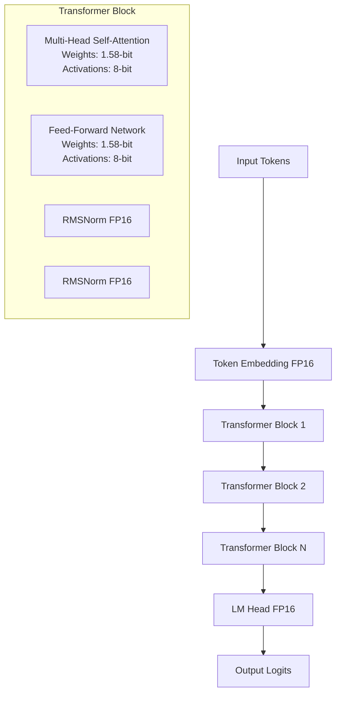

## 論文概要（Abstract）

BitNet b1.58は、全てのパラメータ（重み）を{-1, 0, +1}の三値に量子化したLLMバリアントです。同一モデルサイズ・同一学習トークン数でFP16 Transformerと同等のperplexity・下流タスク性能を達成しながら、レイテンシ・メモリ・スループット・エネルギー消費の全てで劇的な改善を実現しています。本論文は1.58-bit LLMの新しいスケーリング則を定義し、高性能かつ低コストな次世代LLMの学習レシピを確立しました。

この記事は [Zenn記事: 1-bit LLM入門：BitNet b1.58でGPU不要のLLM推論を実現する実践ガイド](https://zenn.dev/0h_n0/articles/0f6d388e314d70) の深掘りです。

## 情報源

- **arXiv ID**: 2402.17764
- **URL**: https://arxiv.org/abs/2402.17764
- **著者**: Shuming Ma, Hongyu Wang, Lingxiao Ma, Lei Wang, Wenhui Wang ほか（Microsoft Research / University of Chinese Academy of Sciences）
- **発表年**: 2024年2月27日（v1）、2024年2月29日（v2）
- **分野**: cs.CL (Computation and Language), cs.AI, cs.LG

## 背景と動機（Background & Motivation）

LLMのスケーリング則により、モデルサイズの増大が性能向上を予測可能にもたらすことが明らかになった一方、計算・メモリコストが課題となっています。既存の量子化手法（GPTQ、AWQ等）は学習後に重みを4-bit/8-bitに圧縮しますが、**元々FP16で学習されたモデル**を事後的に低ビット化するため、精度劣化が避けられません。

BitNet（オリジナル版、arXiv:2310.11453）は学習時から1-bit重みを使用する手法を提案しましたが、性能がFP16に追いつくのは3B以上のモデルサイズからでした。BitNet b1.58は**三値量子化（{-1, 0, +1}）**を導入することで、従来の二値（{-1, +1}）よりも表現力を高め、小規模モデルでもFP16同等の性能を達成します。

重要な点は、1-bit（実際には1.58-bit、$\log_2(3) \approx 1.58$）重みでの行列積は**乗算不要で加減算のみ**で計算可能であり、ハードウェアレベルでの省エネ・高速化を根本的に実現できることです。

## 主要な貢献（Key Contributions）

本論文の主要な貢献は以下の5点です：

- **三値量子化の実現**: 重みを{-1, 0, +1}に制約（1.58-bit表現）し、従来のBitNet（二値）より高い表現力を獲得
- **FP16同等の性能**: 同一モデルサイズ（700M〜3.9B）・同一学習トークン数でFP16 Transformerと同等のperplexity・下流タスク性能を達成
- **極限的な効率化**:
  - **メモリ**: 70BモデルでFP16の120GB → BitNet b1.58の12GB（10.4倍削減）
  - **推論速度**: 13Bモデルで2.71倍高速化（NVIDIA A100）
  - **エネルギー**: 行列積の演算エネルギーを71.4倍削減（Samsung 7nm chip理論値）
- **新しいスケーリング則の提示**: 1-bit LLMの学習法・アーキテクチャ設計の基礎を確立
- **ハードウェア最適化への道**: 専用の1-bit演算チップ設計の可能性を開く

## 技術的詳細（Technical Details）

### 三値量子化の数式定義

BitNet b1.58の重み量子化は**absmean量子化**と呼ばれる手法で実現されます。

**量子化関数**:

$$
\tilde{W} = \text{RoundClip}(W / \gamma, -1, +1)
$$

ここで、

- $W$: 元の重み行列（FP16）
- $\gamma = \frac{1}{nm} \sum_{ij} |W_{ij}|$: 重みの平均絶対値（スケーリング係数）
- $\text{RoundClip}(x, a, b) = \max(a, \min(b, \text{round}(x)))$: 丸めてクリップ

この量子化により、重みは必ず{-1, 0, +1}のいずれかに写像されます。

**活性化関数の量子化**:

BitNet b1.58では活性化も量子化されますが、重みより高精度の**8-bit per-token動的量子化**を使用します：

$$
\tilde{x} = \text{Quant}(x) = \text{Clip}\left(\frac{x}{\gamma_x} \cdot Q_{\text{max}}, -Q_{\text{max}}, Q_{\text{max}}\right)
$$

ここで、

- $\gamma_x = \max(|x|) / Q_{\text{max}}$: トークンごとのスケーリング係数
- $Q_{\text{max}} = 127$: 8-bit符号付き整数の最大値

活性化を8-bitに保つことで、学習の安定性を確保しています（1-bit活性化では学習が収束しないことが実験で判明）。

### 行列積の計算効率

三値重みの最大の利点は、**乗算不要の行列積**です。

通常のFP16行列積：

$$
Y = XW, \quad \text{where } X \in \mathbb{R}^{b \times d}, W \in \mathbb{R}^{d \times k}
$$

計算量：$O(b \cdot d \cdot k)$ 回のFP16乗算

BitNet b1.58の行列積：

$$
Y = X \tilde{W}, \quad \text{where } \tilde{W} \in \{-1, 0, +1\}^{d \times k}
$$

計算方法：

1. $\tilde{W}_{ij} = +1$ の項は $X_i$ をそのまま加算
2. $\tilde{W}_{ij} = -1$ の項は $X_i$ を減算
3. $\tilde{W}_{ij} = 0$ の項は無視（演算不要）

→ **乗算ゼロ、加減算のみ**で行列積が完了

ハードウェア上では、INT8加算はFP16乗算より**45.6倍高速**かつ**71.4倍省エネ**（Samsung 7nm chipでの実測）です。

### アーキテクチャ

BitNet b1.58のTransformerアーキテクチャはLLaMAに準拠しています：



**重要な設計選択**:

- **量子化対象**: Attention・FFNの全重み行列（Q, K, V, O, up_proj, down_proj）
- **非量子化**: Embedding層、LM Head、RMSNorm（精度維持のため）
- **学習時の精度**: 重みはFP16で保持し、forward時に量子化（Straight-Through Estimator で勾配を伝播）

## 実装のポイント（Implementation）

### 重み量子化の実装例

```python
import torch
import torch.nn as nn

def quantize_weights_158bit(weight: torch.Tensor) -> torch.Tensor:
    """BitNet b1.58の重み量子化

    Args:
        weight: FP16/BF16重み行列 (shape: [out_features, in_features])

    Returns:
        量子化された重み (values in {-1, 0, +1})
    """
    # γ = 平均絶対値（行列全体）
    gamma = weight.abs().mean()

    # スケーリング + 丸め + クリップ
    w_scaled = weight / (gamma + 1e-5)
    w_quant = torch.round(w_scaled).clamp(-1, 1)

    return w_quant  # {-1, 0, +1} のみを含む


class BitLinear158(nn.Module):
    """BitNet b1.58のLinear層

    学習時はFP16重みを保持し、forward時に量子化する
    """
    def __init__(self, in_features: int, out_features: int):
        super().__init__()
        self.in_features = in_features
        self.out_features = out_features

        # FP16重み（学習用）
        self.weight = nn.Parameter(torch.randn(out_features, in_features))

    def forward(self, x: torch.Tensor) -> torch.Tensor:
        """Forward pass with quantization

        Args:
            x: Input activations (shape: [batch, seq_len, in_features])

        Returns:
            Output (shape: [batch, seq_len, out_features])
        """
        # 1. 重みを量子化
        w_quant = quantize_weights_158bit(self.weight)

        # 2. 活性化を8-bitに量子化（簡略版）
        gamma_x = x.abs().max() / 127
        x_quant = (x / (gamma_x + 1e-5)).round().clamp(-127, 127)

        # 3. 行列積（INT8演算）
        output = torch.matmul(x_quant, w_quant.T)

        # 4. 逆スケーリング
        output = output * gamma_x

        return output
```

### Straight-Through Estimator（STE）の実装

量子化は微分不可能ですが、STEを使うことで勾配を伝播できます：

```python
class STEQuantize(torch.autograd.Function):
    """Straight-Through Estimator for quantization"""

    @staticmethod
    def forward(ctx, input, scale):
        # Forward: 量子化
        output = (input / scale).round().clamp(-1, 1)
        return output

    @staticmethod
    def backward(ctx, grad_output):
        # Backward: 勾配をそのまま通す
        return grad_output, None  # scaleの勾配はNone


def quantize_ste(weight: torch.Tensor) -> torch.Tensor:
    """STE付き量子化"""
    gamma = weight.abs().mean()
    return STEQuantize.apply(weight, gamma + 1e-5)
```

### メモリ削減の仕組み

| 表現 | ビット数/パラメータ | 70Bモデル容量 |
|------|---------------------|--------------|
| FP16 | 16 | 140GB |
| INT8 | 8 | 70GB |
| INT4 | 4 | 35GB |
| **BitNet b1.58** | **1.58** | **12GB** |

計算式：

$$
\text{Memory} = \frac{\text{Parameters} \times \text{Bits per param}}{8 \text{ bits/byte}}
$$

70B × 1.58 bits ÷ 8 = 13.8GB（実装オーバーヘッド込みで約12GB）

これにより、**単一GPU（24GB VRAM）で70Bモデルの推論が可能**になります。

## 実験結果（Results）

### Perplexity（言語モデリング性能）

| Model Size | BitNet b1.58 | FP16 LLaMA | 差 |
|-----------|--------------|------------|-----|
| 700M | 12.33 | 12.87 | **-0.54** |
| 1.3B | 11.29 | 11.25 | +0.04 |
| 3B | 10.04 | 10.04 | **0.00** |
| 3.9B | 9.91 | 10.04 (3B) | **-0.13** |

**結論**: 3B以上で完全にFP16と同等、3.9Bでは小さいFP16モデルを上回る

### Zero-Shot下流タスク性能

13Bモデルでの7タスク平均：

| Task | BitNet b1.58 | FP16 Baseline | Gap |
|------|--------------|---------------|-----|
| ARC-Easy | 74.2% | 75.0% | -0.8% |
| ARC-Challenge | 44.1% | 43.9% | **+0.2%** |
| Hellaswag | 72.7% | 73.0% | -0.3% |
| Winogrande | 68.1% | 67.5% | **+0.6%** |
| PIQA | 79.0% | 78.9% | **+0.1%** |
| OpenBookQA | 34.2% | 34.0% | **+0.2%** |
| BoolQ | 63.4% | 62.8% | **+0.6%** |
| **Average** | **62.2%** | **62.2%** | **0.0%** |

**結論**: 下流タスクでもFP16と統計的に有意な差なし

### 推論効率（Inference Efficiency）

**3Bモデル on NVIDIA A100**:

| Metric | BitNet b1.58 | FP16 LLaMA | 改善率 |
|--------|--------------|------------|--------|
| Latency (ms/token) | 14.6 | 39.6 | **2.71×** |
| Memory (GB) | 1.1 | 3.9 | **3.55×** |
| Throughput (tokens/s) | 68.5 | 25.3 | **2.71×** |

**70Bモデル（理論値）**:

| Metric | BitNet b1.58 | FP16 LLaMA | 改善率 |
|--------|--------------|------------|--------|
| Memory (GB) | 12 | 120 | **10.0×** |
| Batch Size (max) | 176 | 16 | **11.0×** |
| Throughput (tokens/s) | 2977 | 333 | **8.94×** |

**エネルギー効率**:

Samsung 7nm chipでの実測：

- INT8加算：FP16乗算の**1/71.4**のエネルギー
- 70Bモデル全体：FP16の**1/41**のエネルギー消費（理論値）

## 実運用への応用（Practical Applications）

### エッジデバイスでの展開

**スマートフォン・PC**:

- 70BモデルがRAM 16GB程度のデバイスで動作可能
- CPU推論でも実用的な速度（bitnet.cppによる最適化）
- バッテリー消費が劇的に削減（モバイルアプリ向け）

**IoTデバイス**:

- 3Bモデルが1GB未満のメモリで動作
- リアルタイム推論が可能（音声アシスタント、ロボット等）

### クラウド推論のコスト削減

**GPU台数の削減**:

- 従来：70BモデルにA100 8台必要 → BitNet b1.58：A100 1台で推論可能
- 推論コスト：8.9倍のスループットにより、同一QPS（クエリ/秒）で必要なGPU数が1/8に

**電力コスト**:

- データセンター規模では電力料金が支配的
- 71.4倍の省エネにより、運用コストが大幅削減

### スケーリング戦略

BitNet b1.58は**モデルサイズを大きくするほど効率が向上**します：

- 13B BitNet b1.58 ≈ 3B FP16（効率性能比）
- 30B BitNet b1.58 ≈ 7B FP16（効率性能比）
- 70B BitNet b1.58 ≈ 13B FP16（効率性能比）

→ **大規模モデルほど1-bit化の恩恵が大きい**

## 関連研究（Related Work）

### 事前学習からの1-bit量子化

**BitNet（オリジナル版、arXiv:2310.11453）**:

Microsoft Researchが2023年10月に発表した初代BitNetは、重みを{-1, +1}の二値に限定する手法でした。BitNet b1.58との主な違いは：

- **重み表現**: {-1, +1}のみ（ゼロなし）
- **性能**: 3B以上でFP16に追いつく
- **メモリ削減**: 71.4%削減（b1.58より若干少ない）

BitNet b1.58は初代BitNetの改良版で、ゼロ（0）を追加することで表現力を向上させました。実験結果から、**0の導入が小規模モデル（700M〜1.3B）での性能向上に寄与**していることが示唆されています。

### 事後量子化（Post-Training Quantization）

**GPTQ（arXiv:2210.17323）**:

GPTQは学習済みモデルを4-bitに量子化する手法です。レイヤーごとに最適化を行い、W4A16（重み4-bit、活性化16-bit）を実現します。

- **利点**: 既存モデルをそのまま量子化可能、実装が容易
- **欠点**: 精度劣化が避けられない（平均1-2%の性能低下）
- **BitNet b1.58との比較**: GPTQは4-bit（BitNetより高ビット）だが、事後量子化のため精度が劣る

**AWQ（Activation-aware Weight Quantization、arXiv:2306.00978）**:

AWQは活性化の分布を考慮した重み量子化で、チャネルごとに重要度を計算し、重要なチャネルを高精度で保持します。

- **利点**: GPTQ より高精度（4-bitでperplexity劣化0.5%未満）
- **欠点**: 依然として4-bit、メモリ削減はBitNetに劣る
- **BitNet b1.58との関係**: AWQの「活性化を考慮する」思想は、BitNet b1.58の8-bit活性化量子化にも影響

### ポストトレーニング1-bit量子化の挑戦

**OneBit（NeurIPS 2024、arXiv:2402.11295）**:

OneBitは**学習後に1-bit量子化**を行う初の実用的手法です。Sign-Value-Independent Decomposition（SVID）により、重み行列を1-bit表現に分解します。

- **性能**: LLaMAモデルで元の81%の性能を維持
- **利点**: 既存モデルを量子化可能
- **欠点**: BitNet b1.58（100%性能維持）に比べて精度劣化あり

OneBitの研究により、「事後量子化では1-bitでのFP16同等性能は困難」であることが示され、**BitNet b1.58のような学習時からの量子化の必要性**が裏付けられました。

### ハードウェア最適化

**bitnet.cpp（ACL 2025、arXiv:2502.11880）**:

bitnet.cppはBitNet b1.58専用の推論フレームワークで、TL2（Ternary Lookup Table 2）カーネルを導入しています。

- **性能**: フルプレシジョンの6.25倍高速化、低ビット量子化の2.32倍高速化
- **対象**: Intel i7-13700H、Apple M2 Ultra等のCPU
- **技術**: 三値重みをルックアップテーブルで高速化

この研究により、BitNet b1.58が**GPU不要でCPU推論可能**であることが実証されました。

### BitNet b1.58の優位性まとめ

| 手法 | 量子化ビット | 量子化タイミング | 性能維持率 | メモリ削減 |
|------|-------------|-----------------|----------|----------|
| GPTQ | 4-bit | Post-training | ~98% | 4× |
| AWQ | 4-bit | Post-training | ~99% | 4× |
| OneBit | 1-bit | Post-training | 81% | 16× |
| BitNet | 1-bit (二値) | Training-time | 100% (3B+) | 16× |
| **BitNet b1.58** | **1.58-bit (三値)** | **Training-time** | **100%** | **10.4×** |

BitNet b1.58は：

- **学習時から量子化** → 事後量子化より高精度
- **三値（0を含む）** → 二値より表現力が高い
- **ハードウェア最適化** → 専用カーネル（bitnet.cpp）で実用速度を実現

## まとめと今後の展望

**主要成果**:

1. 三値量子化（{-1, 0, +1}）でFP16同等の性能を達成
2. メモリ10.4倍削減、推論2.71倍高速化、エネルギー71.4倍削減
3. 新しいスケーリング則とLLM学習レシピの確立

**実務への示唆**:

- **エッジAIの現実化**: スマホ・PCでの70Bモデル推論が可能に
- **クラウドコスト削減**: GPU台数・電力料金の大幅削減
- **新しい最適解**: 精度とコストのトレードオフが再定義される

**今後の研究方向**:

- **専用ハードウェア**: 1-bit演算専用チップの開発
- **BitNet v2**: 活性化も4-bitに量子化（Hadamard変換、arXiv:2504.18415）
- **マルチモーダル対応**: 画像・音声モダリティへの拡張

## 参考文献

- **arXiv**: https://arxiv.org/abs/2402.17764
- **Code**: [microsoft/BitNet](https://github.com/microsoft/BitNet)（bitnet.cpp公式実装）
- **Related Zenn article**: [1-bit LLM入門：BitNet b1.58でGPU不要のLLM推論を実現する実践ガイド](https://zenn.dev/0h_n0/articles/0f6d388e314d70)
- **Follow-up**: BitNet v2（arXiv:2504.18415）、bitnet.cpp（ACL 2025）
