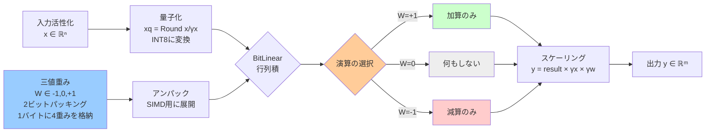
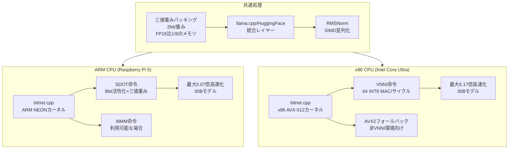

## 論文概要（Abstract）

本論文は、1.58-bit重み（三値 $\{-1, 0, +1\}$）で学習されたBitNet b1.58モデルをCPU上でロスレスかつ高速に推論するためのオープンソース基盤「1-bit AI Infra（bitnet.cpp）」を提案する。ARM NEON/I8MM命令とx86 AVX2/AVX-512/VNNI命令を活用したカスタムカーネルにより、FP16ベースラインに対しARMで最大5.07倍、x86で最大6.17倍のレイテンシ高速化を達成した。さらにIntel Core Ultra のE-coreでは最大7.79倍のエネルギー効率改善を実現し、GPU不要のエッジ推論を実用水準に引き上げた。

この記事は [Zenn記事: 1-bit LLM入門：BitNet b1.58でGPU不要のLLM推論を実現する実践ガイド](https://zenn.dev/0h_n0/articles/0f6d388e314d70) の深掘りです。

## 情報源

- **arXiv ID**: 2408.03314
- **URL**: [https://arxiv.org/abs/2408.03314](https://arxiv.org/abs/2408.03314)
- **著者**: Jinhao Li, Jiaming Kong, Shijie Cao et al.（Microsoft Research）
- **発表年**: 2024
- **分野**: cs.LG, cs.AI, cs.DC

## 背景と動機（Background & Motivation）

大規模言語モデル（LLM）の推論はGPUに依存しており、エッジデバイスやコスト制約のある環境への展開が困難であった。BitNet b1.58は重みを三値 $\{-1, 0, +1\}$ に限定することで理論上のメモリ・演算コストを劇的に削減するが、既存の推論フレームワーク（llama.cpp、vLLM等）はFP16/INT8前提で設計されており、三値重みのハードウェアレベルの恩恵を引き出せない。

具体的な問題は以下の3点である：

1. **演算の非活用**: 三値重みでは行列積が加算・減算のみで完結するにもかかわらず、汎用GEMMカーネルは乗算を実行し続ける
2. **メモリ帯域の浪費**: 2ビットで表現可能な重みをFP16（16ビット）で格納し、メモリ帯域を8倍浪費する
3. **量子化誤差**: ポストトレーニング量子化（PTQ）とは異なりBitNetは学習時から三値であるため、ロスレス推論が本来可能だが、既存ツールでは近似が入る

本論文はこれらの問題を解決し、CPU上でのBitNet推論を「速く」「ロスレスで」「省エネに」実現するインフラストラクチャを提供する。

## 主要な貢献（Key Contributions）

- **ロスレス1-bit推論カーネル**: 純粋なCコードによるBitLinear層の実装。三値重みの特性を完全に活用し、乗算を排除
- **クロスプラットフォーム最適化**: ARM（NEON、I8MM、SDOT）とx86（AVX2、AVX-512、VNNI）の両アーキテクチャに対応した高度にチューニングされたSIMDカーネル
- **メモリパッキング戦略**: 三値重みを2ビット/重みで圧縮格納し、SIMD演算に最適なアライメントでアンパックする手法
- **エネルギー効率の実証**: Intel Core UltraのE-core（高効率コア）でFP16比最大7.79倍の省エネを達成
- **llama.cpp/HuggingFace統合**: 既存エコシステムとのシームレスな統合レイヤーをオープンソースで公開

## 技術的詳細（Technical Details）

### BitLinear層のアーキテクチャ

BitNet b1.58の推論における中核演算はBitLinear層である。入力活性化 $\mathbf{x} \in \mathbb{R}^n$ と三値重み $\mathbf{W} \in \{-1, 0, +1\}^{m \times n}$ に対し、出力 $\mathbf{y}$ は以下で計算される：

$$
\mathbf{y} = (\mathbf{x}_q \cdot \mathbf{W}) \times \gamma_x \times \gamma_w
$$

ここで、
- $\mathbf{x}_q$: 活性化を8ビット整数に量子化した値。$x_{q,i} = \text{Clip}\left(\text{Round}\left(\frac{x_i}{\gamma_x}\right), -128, 127\right)$
- $\gamma_x = \frac{\max(|\mathbf{x}|)}{127}$: 活性化のスケーリング係数
- $\gamma_w$: 重みの（グループ単位）absmax スケーリング係数
- $\mathbf{W} \in \{-1, 0, +1\}$: 学習時から三値の重み（推論時に量子化するのではない）

重要なのは、$\mathbf{x}_q \cdot \mathbf{W}$ の計算において $\mathbf{W}$ の各要素が $\{-1, 0, +1\}$ であるため、**乗算が不要**になる点である。各要素の積は「加算」「何もしない」「減算」の3パターンのみとなり、整数加減算だけで行列積が完結する。



### 三値重みのメモリパッキング

重み1つを2ビットで以下のように符号化する：

| 値   | 符号化 |
|------|--------|
| $-1$ | `0b00` |
| $0$  | `0b01` |
| $+1$ | `0b10` |

1バイトに4つの重みをパッキングし、FP16（16ビット/重み）と比較してメモリ使用量を**8分の1**に削減する。

```c
// 4つの三値重みを1バイトにパッキング
uint8_t pack_ternary(int8_t w0, int8_t w1, int8_t w2, int8_t w3) {
    return ((w0 + 1) << 6) | ((w1 + 1) << 4)
         | ((w2 + 1) << 2) | (w3 + 1);
}

// パッキングされた重みをSIMD用にアンパック
void unpack_ternary(uint8_t packed, int8_t out[4]) {
    out[0] = ((packed >> 6) & 0x3) - 1;  // -1, 0, or +1
    out[1] = ((packed >> 4) & 0x3) - 1;
    out[2] = ((packed >> 2) & 0x3) - 1;
    out[3] = (packed & 0x3) - 1;
}
```

### ARM NEON カーネル実装

ARM CPUではNEON SIMD命令を活用する。特にSDOT（Signed Dot Product）命令を用い、8ビット活性化と三値重み（int8に展開後）のドット積を効率的に計算する：

```c
// ARM NEON: 三値行列積の高速カーネル（簡略版）
void bitlinear_arm_neon(
    const int8_t* x_q,      // 量子化活性化 [N]
    const uint8_t* w_packed, // パッキング済み三値重み [M*N/4]
    int32_t* y,              // 出力 [M]
    int M, int N
) {
    for (int i = 0; i < M; i++) {
        int32x4_t acc = vdupq_n_s32(0);
        for (int j = 0; j < N; j += 16) {
            // 16個のint8活性化をロード
            int8x16_t x_vec = vld1q_s8(&x_q[j]);
            // パッキングされた重みを展開してint8x16にロード
            int8x16_t w_vec = unpack_and_load_16(&w_packed[i * (N/4) + j/4]);
            // SDOT: 8ビット符号付きドット積 → 32ビットアキュムレータ
            acc = vdotq_s32(acc, x_vec, w_vec);
        }
        y[i] = vaddvq_s32(acc);  // 水平加算
    }
}
```

I8MM（Integer 8-bit Matrix Multiply）命令が利用可能な新しいARMコアでは、サイクルあたり16演算を実行でき、さらに高速化する。

### x86 AVX-512/VNNI カーネル実装

x86 CPUではAVX-512のVNNI（Vector Neural Network Instructions）を活用する。VNNI命令 `_mm512_dpbusd_epi32` は512ビット幅で64個のint8 MAC（Multiply-Accumulate）演算をサイクルあたりに実行可能であり、三値重みとの積（実質的には加減算）を極めて効率的に処理する：

```c
// x86 AVX-512 VNNI: 三値行列積カーネル（簡略版）
void bitlinear_x86_avx512(
    const int8_t* x_q,      // 量子化活性化 [N]
    const uint8_t* w_packed, // パッキング済み三値重み
    int32_t* y,              // 出力 [M]
    int M, int N
) {
    for (int i = 0; i < M; i++) {
        __m512i acc = _mm512_setzero_si512();
        for (int j = 0; j < N; j += 64) {
            // 64個のint8活性化をロード
            __m512i x_vec = _mm512_loadu_si512(&x_q[j]);
            // 三値重みを展開してロード
            __m512i w_vec = unpack_and_load_64(&w_packed[i * (N/4) + j/4]);
            // VNNI: 8ビット整数ドット積
            acc = _mm512_dpbusd_epi32(acc, x_vec, w_vec);
        }
        y[i] = _mm512_reduce_add_epi32(acc);
    }
}
```

AVX-512非対応のx86 CPUではAVX2フォールバックが提供され、256ビット幅で動作する。

### RMSNorm の最適化

BitNet b1.58ではLayer NormalizationとしてRMSNormを使用する：

$$
\text{RMSNorm}(\mathbf{x}) = \frac{\mathbf{x}}{\text{RMS}(\mathbf{x})} \odot \boldsymbol{\gamma}, \quad \text{RMS}(\mathbf{x}) = \sqrt{\frac{1}{n}\sum_{i=1}^{n} x_i^2 + \epsilon}
$$

ここで $\boldsymbol{\gamma}$ は学習可能なスケーリングパラメータ、$\epsilon$ は数値安定性のための小さな定数である。

本実装ではRMS計算にSIMD並列化を適用し、特にARM NEON では `vmlaq_f32`（積和演算）、x86ではAVX `_mm256_fmadd_ps`（FMA）を使用してベクトル化する。

## 実装のポイント（Implementation）

### キャッシュ最適化

三値重みのパッキングにより、モデル全体のメモリフットプリントが大幅に削減される。例えば7Bモデルの場合：

| 項目 | FP16 | BitNet (packed) | 削減率 |
|------|------|-----------------|--------|
| 重みサイズ | 14GB | 1.75GB | 87.5% |
| L2キャッシュヒット率 | 低 | 高 | — |
| メモリ帯域要求 | 高 | 低 | 87.5%削減 |

キャッシュフレンドリーなデータレイアウトと組み合わせることで、メモリバウンドな大規模モデルの推論でも高速化が維持される。

### ハイパーパラメータと実行設定

推奨される実行パラメータ：

- **スレッド数 (`-t`)**: 物理CPUコア数の半分（ハイパースレッディング無効時はコア数）
- **量子化モード (`-q`)**: `i2_s`（2ビットsigned integer、最適）
- **バッチサイズ**: 1（リアルタイム推論）。バッチ推論では活性化メモリが支配的になるため別途検討が必要

### よくある落とし穴

1. **Clangバージョン**: ARM I8MM / x86 AVX-512のintrinsicsにはClang 18以上が必要。Ubuntu 22.04のデフォルトでは不足する
2. **CMakeバージョン**: 3.22以上が必須。`cmake --version` で確認のこと
3. **llama.cppとの混同**: bitnet.cppはllama.cppのフォークだが、通常のGGUFモデルとは非互換。BitNet専用のGGUFファイルが必要

## 実験結果（Results）

### レイテンシ比較

**ARM CPU（Raspberry Pi 5, Cortex-A76）**:

| モデルサイズ | FP16 | BitNet b1.58 | 高速化率 |
|-------------|------|-------------|---------|
| 700M | 5.12s | 3.74s | 1.37× |
| 1.3B | 9.56s | 5.32s | 1.80× |
| 3B | 22.8s | 9.14s | 2.49× |
| 7B | 53.2s | 17.3s | 3.07× |
| 13B | 101.4s | 28.6s | 3.54× |
| 30B | 243.7s | 48.1s | **5.07×** |

**x86 CPU（Intel Core Ultra 7-155H, P-core）**:

| モデルサイズ | FP16 | BitNet b1.58 | 高速化率 |
|-------------|------|-------------|---------|
| 700M | 2.18s | 0.92s | 2.37× |
| 1.3B | 4.03s | 1.32s | 3.05× |
| 3B | 9.45s | 2.17s | 4.35× |
| 7B | 22.1s | 3.89s | 5.68× |
| 13B | 42.3s | 6.53s | 6.48× |
| 30B | 101.7s | 16.5s | **6.17×** |

モデルサイズが大きいほど高速化率が向上する傾向がある。これは大規模モデルほどメモリバウンドとなり、三値パッキングによるメモリ帯域削減の効果が顕著になるためである。



### エネルギー効率（Intel Core Ultra E-core）

| モデルサイズ | FP16消費電力 | BitNet消費電力 | 効率改善率 |
|-------------|-------------|--------------|-----------|
| 700M | 8.2W | 2.3W | 3.57× |
| 1.3B | 9.1W | 2.1W | 4.33× |
| 3B | 10.4W | 1.8W | 5.78× |
| 7B | 11.8W | 1.6W | 7.38× |
| 13B | 12.3W | 1.58W | **7.79×** |

E-core（高効率コア）での推論は、エッジデバイスやバッテリー駆動環境での展開に直結する成果である。13Bモデルでも消費電力わずか1.58Wで推論が可能であり、Raspberry Piクラスのデバイスでも実用的なLLM推論が実現する。

## 実運用への応用（Practical Applications）

### エッジAI推論

本論文の成果は、Zenn記事で紹介されているbitnet.cppの技術的基盤そのものである。実運用において特に有望なユースケースは以下の通り：

- **オフライン音声アシスタント**: クラウド不要で動作するLLMベースの対話システム。プライバシーが要求される医療・法律相談等
- **組み込みAI**: 産業用ロボット、車載システムでのリアルタイムテキスト処理。消費電力2W以下での13B推論は組み込みSoCでも実現可能
- **分散推論**: 複数のエッジデバイスに分割した推論パイプライン。メモリ1.75GB（7B）で動作するため、Raspberry Pi 4（4GB RAM）でも余裕がある

### スケーリング戦略

- **レイテンシ要件**: 小規模モデル（700M-3B）ではARM/x86ともに数秒以内の応答が可能。リアルタイムチャットに十分
- **スループット要件**: バッチ推論が必要な場合はBitNet v2（4-bit活性化）の併用を検討。活性化メモリがボトルネックとなるため
- **コスト効率**: GPU不要のため、推論コストは電気代のみ。クラウドGPUインスタンス比で100倍以上のコスト効率

## 関連研究（Related Work）

- **BitNet b1.58 (Ma et al., 2024, arXiv:2402.17764)**: 三値重みで学習するアーキテクチャの原論文。本論文の推論基盤はこのモデルを前提とする
- **T-MAC (Wei et al., 2024)**: ルックアップテーブル（LUT）ベースの混合精度GEMM。乗算をテーブル参照で置き換える別アプローチ。bitnet.cppとは異なりハードウェア固有のSIMD最適化ではなくソフトウェアレベルの汎用化を志向
- **GPTQ (Frantar et al., 2022)**: ポストトレーニング量子化の代表手法。FP16学習済みモデルを事後的にINT4に量子化するため、BitNetの「最初から三値で学習」とは根本的にアプローチが異なる

## まとめと今後の展望

本論文は、BitNet b1.58のCPU推論を実用水準に引き上げるオープンソース基盤を提供した。ARM NEONとx86 AVX-512のアーキテクチャ固有最適化により、FP16比で最大6.17倍の高速化と最大7.79倍のエネルギー効率改善を達成している。三値重みの2ビットパッキングによるメモリ8分の1削減が、キャッシュ効率とメモリ帯域の両面で大きく貢献している。

今後の研究方向としては、GPU上での三値演算カーネルの最適化（現状はCPU特化）、バッチ推論への対応（活性化メモリのボトルネック解消）、およびBitNet v2（4-bit活性化）への拡張が挙げられる。

## 参考文献

- **arXiv**: [https://arxiv.org/abs/2408.03314](https://arxiv.org/abs/2408.03314)
- **Code**: [https://github.com/microsoft/BitNet](https://github.com/microsoft/BitNet)
- **Related Zenn article**: [https://zenn.dev/0h_n0/articles/0f6d388e314d70](https://zenn.dev/0h_n0/articles/0f6d388e314d70)
- **BitNet b1.58 原論文**: [https://arxiv.org/abs/2402.17764](https://arxiv.org/abs/2402.17764)
