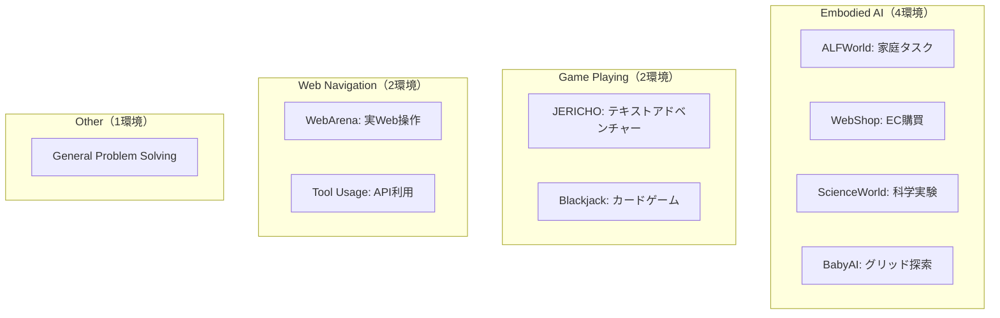
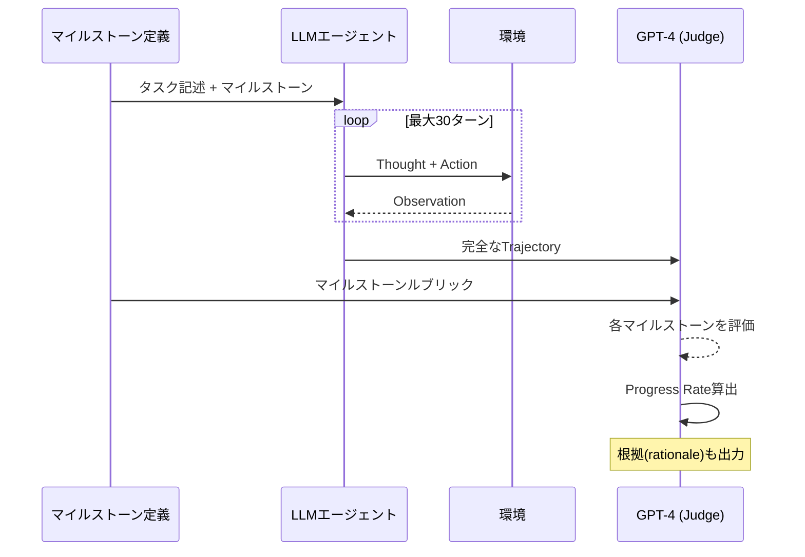

## 論文概要（Abstract）

AgentBoardは、マルチターンLLMエージェントを**マイルストーンベースのProgress Rate（進捗率）**で評価する分析的フレームワークである。ALFWorld、WebShop、WebArenaなど9つのインタラクティブ環境にわたる1,013の評価インスタンスを提供し、GPT-4やClaude-2を含む主要LLMを包括的に評価した。**バイナリな成功/失敗判定では見えない部分的進捗を可視化**し、エージェントがどこで行き詰まるかを特定できる点が最大の特徴である。GPT-4でさえ平均Progress Rateは52.3%、成功率は31.2%にとどまり、現在のLLMエージェントには大きな改善余地があることを定量的に示した。

この記事は [Zenn記事: AIエージェントのテスト戦略：pass@kとCI/CD統合で品質を自動保証する実践ガイド](https://zenn.dev/0h_n0/articles/f03733cd5ca3d9) の深掘りです。

## 情報源

- **arXiv ID**: 2401.13178
- **URL**: [https://arxiv.org/abs/2401.13178](https://arxiv.org/abs/2401.13178)
- **著者**: Chang Ma, Junlei Zhang, Zhihao Zhu et al.（HKUST, PKU, THU, SJTU, MSRA, HKU）
- **発表年**: 2024
- **分野**: cs.CL, cs.AI
- **コード**: [https://github.com/hkust-nlp/AgentBoard](https://github.com/hkust-nlp/AgentBoard)

## 背景と動機（Background & Motivation）

既存のLLMエージェント評価は2つの根本的な課題を抱えていた。

**課題1: バイナリ評価の限界**

AgentBenchやToolBenchなどの先行ベンチマークは、タスクの成功/失敗をバイナリで判定する。しかし、この方式では「80%まで進んだが最終ステップで失敗したケース」と「何も始められなかったケース」が**同じ"失敗"として扱われる**。エージェントの能力向上を追跡するためには、より粒度の細かい指標が必要である。

**課題2: ベンチマーク間の分断**

既存ベンチマークは特定の環境（Webナビゲーション、ゲーム、ツール利用等）に特化しており、エージェントの総合的な能力を一つのフレームワークで評価することが困難だった。

AgentBoardは、これらの課題を**Progress Rate**というマイルストーンベースの指標と、**9環境を統一した評価プラットフォーム**で解決する。

## 主要な貢献（Key Contributions）

- **貢献1**: マイルストーンベースのProgress Rate指標の提案。バイナリ成功率では隠れる部分的進捗を0-100%のスケールで可視化
- **貢献2**: 9つのインタラクティブ環境を統合した1,013インスタンスの評価フレームワーク
- **貢献3**: LLM-as-Judgeプロトコルの設計と検証。人間の判断との相関0.85-0.95を達成し、コストは人間アノテーションの1/40
- **貢献4**: GPT-4、Claude-2、Llama-2-70Bを含む主要モデルの包括的比較分析

## 技術的詳細（Technical Details）

### Progress Rate の定式化

Progress Rateは、タスクをマイルストーンに分解し、達成度を定量化する指標である。

$$
\text{Progress Rate} = \frac{\sum_{i=1}^{n} w_i \cdot \mathbb{1}[\text{milestone}_i \text{ achieved}]}{\sum_{i=1}^{n} w_i} \times 100\%
$$

ここで、
- $n$: タスクのマイルストーン数
- $w_i$: マイルストーン $i$ の重み（通常は均等: $w_i = 1/n$）
- $\mathbb{1}[\cdot]$: 指示関数（達成なら1、未達成なら0）

**具体例（WebShopタスク、5マイルストーン）:**

| マイルストーン | 内容 | 達成率 (%) |
|-------------|------|-----------|
| M1 | 検索ページに遷移 | 20% |
| M2 | 検索クエリを入力 | 40% |
| M3 | 関連商品を選択 | 60% |
| M4 | カートに追加 | 80% |
| M5 | 購入完了 | 100% |

M1-M3を達成してM4で失敗した場合：

$$
\text{Progress Rate} = \frac{3}{5} \times 100\% = 60\%
$$

バイナリ評価では「失敗」だが、Progress Rateでは**60%の進捗**として記録される。

### 9つの評価環境

AgentBoardは以下の9環境を統合している：



各環境は標準化されたインターフェースで統合される：

```python
from abc import ABC, abstractmethod
from typing import Any


class Environment(ABC):
    """AgentBoard環境の標準インターフェース"""

    @abstractmethod
    def reset(self) -> dict:
        """環境をリセットし初期状態を返す"""
        ...

    @abstractmethod
    def step(self, action: str) -> tuple[str, float, bool, dict]:
        """アクションを実行し、(observation, reward, done, info)を返す

        Args:
            action: エージェントが選択したアクション文字列

        Returns:
            observation: 環境からのフィードバック
            reward: 報酬（0.0-1.0）
            done: タスク完了フラグ
            info: マイルストーン達成情報を含むメタデータ
        """
        ...

    @abstractmethod
    def get_milestones(self) -> list[dict]:
        """このタスクのマイルストーン定義を返す

        Returns:
            各マイルストーンの名前、重み、検証条件のリスト
        """
        ...
```

### LLM-as-Judge プロトコル

AgentBoardのLLM-as-Judge評価は以下のパイプラインで実行される：



**Judge用プロンプトテンプレート:**

```
Task: [タスク記述]
Milestones:
1. [マイルストーン1] (20%)
2. [マイルストーン2] (40%)
...

Agent Trajectory:
[エージェントの行動履歴]

Question: このエージェントはどのマイルストーンを達成しましたか？
各マイルストーンについて、達成/未達成とその根拠を述べてください。
最終的なProgress Rate (0-100%) を算出してください。
```

**検証結果:**

| 環境 | Pearson相関 r | 一致率 | バイアス |
|------|-------------|-------|--------|
| WebShop | 0.92 | 89% | +1.2% |
| ALFWorld | 0.89 | 86% | -0.8% |
| ScienceWorld | 0.85 | 84% | +2.1% |
| **全体平均** | **0.88** | **87%** | **+0.9%** |

LLM-as-Judgeのコストは200サンプルで**約$50**であり、人間アノテーション（**約$2,000**）の**1/40**である。わずかな正のバイアス（+0.9%）があるが、ランキングの順序は正しく保持されている。

## 実験結果（Results）

### 主要ベンチマーク結果

| モデル | Avg Progress Rate | Success Rate | Progress - Success の差 |
|-------|-------------------|--------------|----------------------|
| **GPT-4** | **52.3%** | **31.2%** | **+21.1pt** |
| Claude-2 | 48.7% | 28.5% | +20.2pt |
| GPT-3.5-Turbo | 41.4% | 22.1% | +19.3pt |
| Llama-2-70B | 28.9% | 12.3% | +16.6pt |
| Vicuna-33B | 24.1% | 9.7% | +14.4pt |
| MPT-30B | 19.5% | 7.2% | +12.3pt |
| Random | 8.3% | 1.4% | +6.9pt |

**最も重要な知見**: Progress RateとSuccess Rateの差（右列）は、**バイナリ評価が隠す「もう少しで成功」ケースの量**を示している。GPT-4では21.1ポイントもの差があり、成功率の2倍近い進捗を実際には達成している。

### タスク別分析

| タスク | GPT-4 Progress Rate | GPT-4 Success Rate | 主な失敗パターン |
|-------|--------------------|--------------------|----------------|
| WebShop | 68.2% | 45.3% | 検索精度 |
| ALFWorld | 61.5% | 38.7% | 多段階計画 |
| BabyAI | 58.9% | 42.1% | 空間推論 |
| JERICHO | 47.3% | 21.5% | 長期推論 |
| ScienceWorld | 39.8% | 15.2% | ドメイン知識 |
| WebArena | 36.1% | 12.7% | 複雑なナビゲーション |

### 失敗モード分析

GPT-4の失敗パターンを分析した結果：

1. **反復的行動**（23%）: 同じアクションをループする。戦略の転換ができない
2. **早期終了**（19%）: タスク完了前に停止する。成功シグナルの誤解釈
3. **無効なアクション**（17%）: 環境の制約に違反する。コマンド構文エラー
4. **計画エラー**（15%）: 非効率な経路を選択。サブゴールの追跡失敗
5. **観察の誤解釈**（14%）: 環境フィードバックの読み間違い

### アブレーション研究

**Few-shotの影響（GPT-4）:**

| 例題数 | Progress Rate | 差分 |
|-------|---------------|------|
| 0-shot | 47.2% | - |
| 1-shot | 50.8% | +3.6% |
| 3-shot | 52.3% | +5.1% |
| 5-shot | 52.7% | +5.5% |

3-shotがコスト対効果で最適。5-shotとの差はわずか0.4pt。

**最大ターン数の影響（GPT-4）:**

| 最大ターン数 | Progress Rate | 平均使用ターン数 |
|------------|---------------|----------------|
| 10 | 41.3% | 9.2 |
| 20 | 49.7% | 16.4 |
| 30 | 52.3% | 21.8 |
| 50 | 53.1% | 22.5 |

30ターンでほぼ収束。50ターンに増やしても+0.8ptの改善にとどまる。

## 実装のポイント（Implementation）

### AgentBoard評価パイプラインの構築

```python
"""AgentBoard評価パイプラインの最小構成例

マイルストーンベースのProgress Rateで
エージェントを評価する。
"""
from dataclasses import dataclass, field


@dataclass
class Milestone:
    """評価マイルストーン"""
    name: str
    weight: float = 1.0
    achieved: bool = False


@dataclass
class EvalResult:
    """評価結果"""
    task_id: str
    milestones: list[Milestone]
    trajectory: list[dict] = field(default_factory=list)

    @property
    def progress_rate(self) -> float:
        """Progress Rateを算出

        Returns:
            0.0-100.0のProgress Rate
        """
        total_weight = sum(m.weight for m in self.milestones)
        achieved_weight = sum(
            m.weight for m in self.milestones if m.achieved
        )
        return (achieved_weight / total_weight) * 100 if total_weight > 0 else 0.0

    @property
    def success(self) -> bool:
        """全マイルストーン達成なら成功"""
        return all(m.achieved for m in self.milestones)


def evaluate_agent(
    agent,
    environment,
    max_turns: int = 30,
) -> EvalResult:
    """エージェントを評価

    Args:
        agent: 評価対象のLLMエージェント
        environment: 評価環境
        max_turns: 最大ターン数

    Returns:
        マイルストーン達成状況を含む評価結果
    """
    milestones = [
        Milestone(name=m["name"], weight=m.get("weight", 1.0))
        for m in environment.get_milestones()
    ]
    state = environment.reset()
    trajectory: list[dict] = []

    for turn in range(max_turns):
        thought, action = agent.step(state)
        observation, reward, done, info = environment.step(action)

        trajectory.append({
            "turn": turn,
            "thought": thought,
            "action": action,
            "observation": observation,
        })

        # マイルストーン達成チェック
        for milestone in milestones:
            if milestone.name in info.get("achieved_milestones", []):
                milestone.achieved = True

        state = observation
        if done:
            break

    return EvalResult(
        task_id=environment.task_id,
        milestones=milestones,
        trajectory=trajectory,
    )
```

### Zenn記事のpass@kとの対応

AgentBoardのProgress Rateは、Zenn記事で解説されているpass@kメトリクスと**相補的な関係**にある。

- **pass@k**: 「k回のうち1回以上成功するか」→ 能力の上限を測定
- **Progress Rate**: 「各試行でどこまで進んだか」→ 失敗の粒度を測定

組み合わせることで、「このエージェントはpass@5で80%だが、失敗時の平均Progress Rateは65%であり、最終ステップの信頼性が低い」といった詳細な分析が可能になる。

$$
\text{Adjusted Score} = \alpha \cdot \text{pass@}k + (1-\alpha) \cdot \overline{\text{Progress Rate}}_{\text{failures}}
$$

ここで $\alpha$ は成功/失敗の重み（典型的には0.7）、$\overline{\text{Progress Rate}}_{\text{failures}}$ は失敗試行の平均Progress Rate。

## 実運用への応用（Practical Applications）

### CI/CDへのProgress Rate統合

Progress Rateは、CI/CDパイプラインでの回帰テストに特に有用である。Success Rateのみでは「パスか失敗か」の粗い判定しかできないが、Progress Rateの低下は**品質劣化の早期警告**となる。

```yaml
# .github/workflows/agent-eval-progress.yml
name: Agent Progress Rate Check
on:
  pull_request:
    paths: ["src/agents/**"]

jobs:
  eval:
    runs-on: ubuntu-latest
    steps:
      - uses: actions/checkout@v4
      - name: Run AgentBoard eval
        run: python -m agentboard.evaluate --model $MODEL --tasks all
      - name: Check progress regression
        run: |
          PROGRESS=$(cat results/progress_rate.json | jq '.average')
          BASELINE=$(cat baselines/progress_rate.json | jq '.average')
          DIFF=$(echo "$PROGRESS - $BASELINE" | bc)
          if (( $(echo "$DIFF < -5.0" | bc -l) )); then
            echo "PROGRESS REGRESSION: $PROGRESS < $BASELINE (diff: $DIFF)"
            exit 1
          fi
```

### エラー分析の自動化

AgentBoardの失敗モード分類は、エージェントの改善方針を自動的に特定するために使える。例えば、「反復的行動」の割合が増加していれば、エージェントの探索戦略を改善する必要がある。

## 関連研究（Related Work）

- **AgentBench** (Liu et al., 2023): 8環境でのLLMエージェントベンチマーク。バイナリ成功率を使用。AgentBoardはProgress Rateで粒度を改善
- **SWE-bench** (Jimenez et al., 2023): ソフトウェアエンジニアリング特化ベンチマーク。テスト通過のバイナリ判定。AgentBoardは多領域を統合
- **WebArena** (Zhou et al., 2023): リアルなWebタスクベンチマーク。AgentBoardの9環境の1つとして統合
- **ToolBench** (Qin et al., 2023): API利用評価。勝率(win rate)を使用。AgentBoardはマイルストーンベースのより詳細な指標

## まとめと今後の展望

AgentBoardは、LLMエージェント評価に**Progress Rate**という新しい粒度の指標を導入し、バイナリ評価の限界を克服した。

**主要な知見：**
- GPT-4の成功率31.2%に対し、Progress Rateは52.3%（**21.1ptの隠れた進捗**が存在）
- LLM-as-Judgeは人間の判断と相関0.88、コストは1/40
- 3-shot、30ターンがコスト対効果の最適点
- 反復的行動（23%）と早期終了（19%）が主要な失敗モード

**実務への示唆：**
- CI/CDでProgress Rateの回帰を監視し、品質劣化を早期検出
- 失敗モード分析を自動化し、改善方針を特定
- pass@kとProgress Rateを組み合わせた多面的評価

**今後の方向性：**
- ロボティクスシミュレーション、マルチエージェント協調タスクの追加
- GPT-4依存のJudgeから専用評価モデルの訓練へ
- マルチモーダル評価（視覚、音声）への拡張

## 参考文献

- **arXiv**: [https://arxiv.org/abs/2401.13178](https://arxiv.org/abs/2401.13178)
- **Code**: [https://github.com/hkust-nlp/AgentBoard](https://github.com/hkust-nlp/AgentBoard)
- **Demo**: [https://agentboard.github.io](https://agentboard.github.io)
- **Related Zenn article**: [https://zenn.dev/0h_n0/articles/f03733cd5ca3d9](https://zenn.dev/0h_n0/articles/f03733cd5ca3d9)
