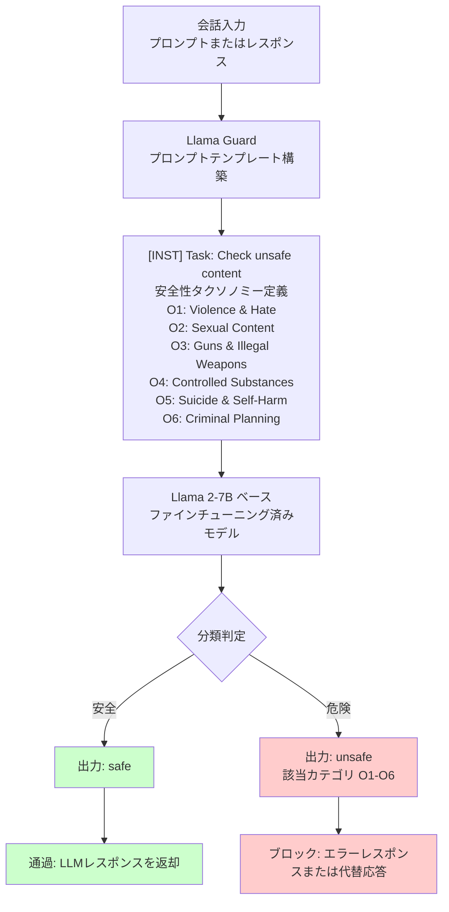

## 論文概要（Abstract）

Llama Guardは、Meta AIが開発したLLMベースの入出力セーフガードモデルである。人間とAIの会話におけるプロンプト（入力）とレスポンス（出力）の安全性を、独自の安全性リスク分類タクソノミーに基づいて分類する。Llama 2-7Bをベースにファインチューニングし、OpenAI Moderations APIやPerspective APIを上回る性能を達成した。

この記事は [Zenn記事: LLM出力検証フレームワーク実践：本番運用で99%精度を実現する3層戦略](https://zenn.dev/0h_n0/articles/f1eab19b1726e1) の深掘りです。

## 情報源

- **arXiv ID**: 2312.06674
- **URL**: [https://arxiv.org/abs/2312.06674](https://arxiv.org/abs/2312.06674)
- **著者**: Hakan Inan, Kartikeya Upasani, Jianfeng Chi, et al.
- **発表年**: 2023（Llama Guard 3は2024年リリース）
- **分野**: cs.CL, cs.AI

## 背景と動機（Background & Motivation）

LLMの本番運用において、Safety Validation（安全性検証）は3層戦略の中核をなす。従来のコンテンツモデレーションツール（OpenAI Moderations API、Perspective API等）は、固定的な分類カテゴリしか対応できず、組織固有のポリシーに適応できないという課題があった。

Llama Guardは、LLM自体をセーフガードモデルとして活用するアプローチを採用し、以下の問題を解決する：

- **カスタマイズ性**: プロンプトテンプレートでタクソノミーを自由に変更可能
- **入出力両方の分類**: プロンプトとレスポンスの両方を統一モデルで検証
- **ゼロショット適応**: 新しいカテゴリを定義するだけで、再学習なしに対応

## 主要な貢献（Key Contributions）

- **貢献1**: 6カテゴリの安全性リスクタクソノミーを設計し、人間とAIの会話における包括的な安全性分類体系を構築
- **貢献2**: LLMベースのコンテンツモデレーションにおいて、入力と出力を統一フレームワークで分類する手法を提案
- **貢献3**: 7Bパラメータのモデルで既存商用APIを上回る性能を達成し、オープンソースとして公開

## 技術的詳細（Technical Details）

### 安全性リスクタクソノミー

Llama Guardは以下の6カテゴリを定義する：

| カテゴリ | 内容 | 具体例 |
|---------|------|--------|
| O1: Violence & Hate | 暴力・ヘイトスピーチ | 脅迫、差別的表現 |
| O2: Sexual Content | 性的コンテンツ | 明示的な性的描写 |
| O3: Guns & Illegal Weapons | 銃器・違法武器 | 武器の製造方法 |
| O4: Controlled Substances | 規制物質 | 違法薬物の使用法 |
| O5: Suicide & Self-Harm | 自殺・自傷行為 | 自傷の助長 |
| O6: Criminal Planning | 犯罪計画 | 詐欺の手順 |

### 分類アーキテクチャ

Llama Guardの推論は、以下の入出力フォーマットで行われる：



**入力テンプレート**:
```
[INST] Task: Check if there is unsafe content in
'{agent_type}' messages in conversations.

<BEGIN UNSAFE CONTENT CATEGORIES>
O1: Violence and Hate. ...
O2: Sexual Content. ...
...
<END UNSAFE CONTENT CATEGORIES>

<BEGIN CONVERSATION>
{role}: {message}
<END CONVERSATION>

Provide your safety assessment. [/INST]
```

**出力形式**:
```
safe
```
または
```
unsafe
O3
```

分類の損失関数は標準的な交差エントロピーを使用する：

$$
\mathcal{L} = -\sum_{i=1}^{N} \left[ y_i \log \hat{y}_i + (1-y_i) \log (1-\hat{y}_i) \right]
$$

ここで、
- $N$: 学習サンプル数
- $y_i \in \{0, 1\}$: 安全/非安全のラベル（0=safe, 1=unsafe）
- $\hat{y}_i$: モデルの予測確率

### Llama Guard 3への進化

2024年にリリースされたLlama Guard 3（Llama-3.1-8Bベース）は、以下の改善を含む：

- **MLCommons標準タクソノミー**への準拠
- **8言語対応**（多言語コンテンツモデレーション）
- **ツール呼び出しの安全性検証**（検索・コード実行の安全性）
- **1Bパラメータの軽量版**（Llama Guard 3-1B）
- **Vision対応版**（Llama Guard 3-11B-Vision：画像入力の安全性検証）

```python
from transformers import AutoTokenizer, AutoModelForCausalLM
import torch

def classify_safety(
    text: str,
    role: str = "User",
    model_name: str = "meta-llama/Llama-Guard-3-8B",
) -> dict[str, str | list[str]]:
    """Llama Guard 3による安全性分類

    Args:
        text: 分類対象のテキスト
        role: "User"（入力分類）または "Agent"（出力分類）
        model_name: 使用するモデル名

    Returns:
        {"result": "safe"|"unsafe", "categories": [...]}
    """
    tokenizer = AutoTokenizer.from_pretrained(model_name)
    model = AutoModelForCausalLM.from_pretrained(
        model_name, torch_dtype=torch.bfloat16, device_map="auto"
    )

    chat = [{"role": role.lower(), "content": text}]
    input_ids = tokenizer.apply_chat_template(
        chat, return_tensors="pt"
    ).to(model.device)

    output = model.generate(
        input_ids=input_ids, max_new_tokens=100, pad_token_id=0
    )
    result = tokenizer.decode(
        output[0][len(input_ids[0]):], skip_special_tokens=True
    )

    if "unsafe" in result:
        categories = [
            line.strip() for line in result.split("\n")
            if line.strip().startswith("O")
        ]
        return {"result": "unsafe", "categories": categories}
    return {"result": "safe", "categories": []}
```

## 実装のポイント（Implementation）

- **デプロイ戦略**: 7Bモデルは消費者向けGPU（RTX 4090等）で推論可能。1Bモデルはさらに軽量でエッジデバイスにも展開可能
- **レイテンシ最適化**: vLLMやTGIを使用したバッチ推論で、1リクエストあたり50-100msのレイテンシを実現
- **カスタマイズ**: プロンプトテンプレートのタクソノミー部分を変更するだけで、組織固有のポリシーに適応可能
- **制限事項**: 文脈依存の判断（風刺、比喩等）での誤分類リスクがあるため、閾値チューニングが必要

## 実験結果（Results）

| ベンチマーク | OpenAI Moderation | Perspective API | Llama Guard |
|------------|-------------------|-----------------|-------------|
| ToxicChat | 0.588 F1 | 0.541 F1 | **0.749 F1** |
| OpenAI Mod | 0.837 F1 | 0.793 F1 | **0.855 F1** |
| 推論速度（GPU） | API依存 | API依存 | 50-100ms |

**分析**:
- ToxicChatでは既存手法を大幅に上回る（+16%以上のF1改善）
- オープンソースモデルのため、API依存なしにオンプレミス運用可能
- カスタムカテゴリ追加時もゼロショットで動作

## 実運用への応用（Practical Applications）

Zenn記事で紹介されたSafety Validation層（Toxicity・Bias・PII検出）の中核として、Llama Guardは以下のように活用できる：

- **Guardrails AI統合**: Guardrails AIのカスタムバリデータとしてLlama Guardを組み込み、入出力の安全性を検証
- **マルチ層防御**: PII検出（DetectPII）と組み合わせた多層的な安全性検証パイプラインの構築
- **コスト効率**: OpenAI Moderations APIの課金を回避し、自前GPU or Amazon SageMakerでの運用によるコスト削減

## 関連研究（Related Work）

- **LlamaFirewall** (Meta, 2025): Llama Guardの発展形。PromptGuard 2、Agent Alignment Checks、CodeShieldを統合した包括的セキュリティフレームワーク
- **ShieldGemma** (Google, 2024): Gemmaベースの安全性分類モデル。Llama Guardと類似のアプローチだが、異なるタクソノミー
- **NeMo Guardrails** (NVIDIA, 2024): Colangベースのルールエンジン。Llama Guardとは相補的（ルールベース vs LLMベース）

## まとめと今後の展望

Llama Guardは、LLMベースの安全性分類という新しいパラダイムを確立した。7Bモデルで商用APIを上回る性能を達成し、カスタマイズ可能なタクソノミーにより組織固有のポリシーに柔軟に対応できる。本番運用のSafety Validation層における中心的なコンポーネントとして、Guardrails AIやDeepEvalとの統合が進むことが期待される。

## 参考文献

- **arXiv**: [https://arxiv.org/abs/2312.06674](https://arxiv.org/abs/2312.06674)
- **Hugging Face**: [https://huggingface.co/meta-llama/Llama-Guard-3-8B](https://huggingface.co/meta-llama/Llama-Guard-3-8B)
- **Related Zenn article**: [https://zenn.dev/0h_n0/articles/f1eab19b1726e1](https://zenn.dev/0h_n0/articles/f1eab19b1726e1)
