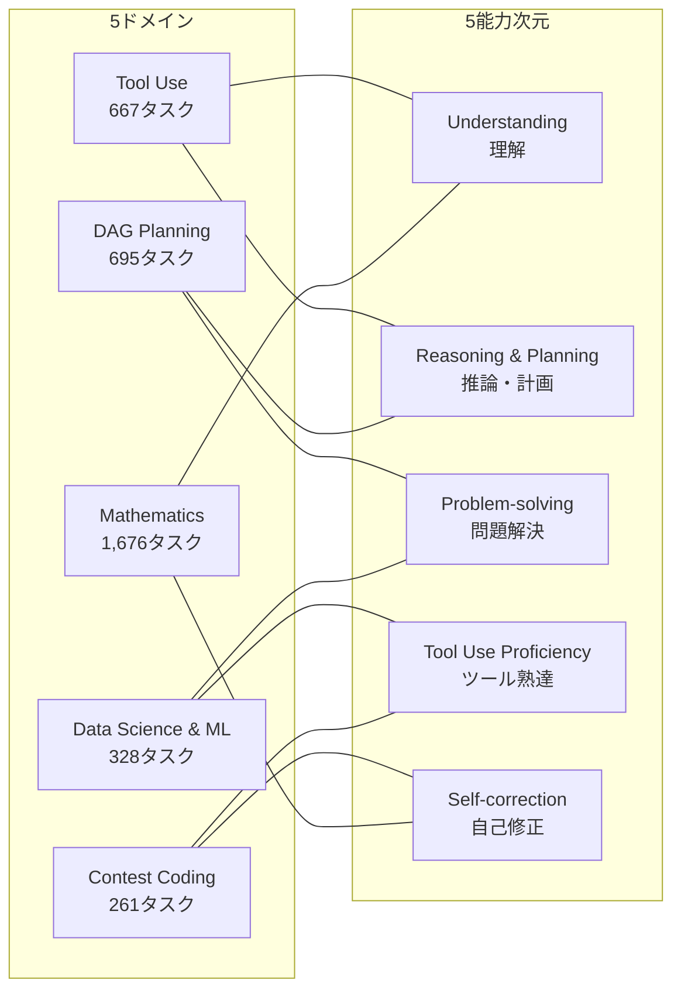

## 論文概要（Abstract）

MMAU（Massive Multitask Agent Understanding）は、LLMエージェントの能力を**5ドメイン×5能力次元の20タスク、3,000件以上のプロンプト**で網羅的に評価するオフラインベンチマークである。NAACL 2025 Findingsに採択された本論文は、GPT-4o、Claude-3.5-Sonnet、Llama-3.1-405Bを含む18モデルを評価し、**Reasoning & Planning（推論・計画）が全モデルの最大の弱点**（45-52%）であることを明らかにした。特筆すべきは**Planner-Shift / Solver-Shift**という分離評価手法で、「計画能力」と「実行能力」を独立に測定できる点が従来ベンチマークにない革新性である。

この記事は [Zenn記事: AIエージェントのテスト戦略：pass@kとCI/CD統合で品質を自動保証する実践ガイド](https://zenn.dev/0h_n0/articles/f03733cd5ca3d9) の深掘りです。

## 情報源

- **会議名**: NAACL 2025（Findings of the Association for Computational Linguistics）
- **年**: 2025
- **URL**: [https://arxiv.org/abs/2407.18961](https://arxiv.org/abs/2407.18961)
- **著者**: Guoli Yin, Haoping Bai, Shuang Ma, Feng Nan et al.（Apple, 主要著者はApple MLR所属）
- **発表形式**: Findings paper
- **公式サイト**: [https://github.com/garyinone/MMAU](https://github.com/garyinone/MMAU)

## カンファレンス情報

**NAACL (North American Chapter of the Association for Computational Linguistics)** は、ACLに次ぐ自然言語処理分野の主要会議である。2025年はニューメキシコ州アルバカーキで開催された。Findings papersは、メイン会議に惜しくも採択されなかったが高品質と認められた論文が掲載されるトラックである。MMAUは**LLMエージェントの能力分解**という新しい評価パラダイムを提案しており、エージェント評価研究に大きな影響を与えている。

## 技術的詳細（Technical Details）

### 設計原則

MMAUは4つの設計原則に基づいている：

1. **ドメインの多様性**: 5つの異なるドメインをカバー
2. **能力の多様性**: 5つの独立した能力次元を測定
3. **オフライン評価**: 複雑な環境構築不要、決定論的で再現可能
4. **実務的関連性**: 実世界のシナリオに基づくタスク設計

### 5ドメイン×5能力の評価マトリクス



**各ドメインの概要：**

| ドメイン | タスク数 | 内容 | 評価指標 |
|---------|---------|------|---------|
| **Tool Use** | 667 | 単発・複数・並列のAPI呼び出し | Exact Match、API呼び出し精度 |
| **DAG Planning** | 695 | ワークフロー構築、依存関係推論 | グラフ構造類似度、辺の正確性 |
| **Data Science & ML** | 328 | Python/SQLによるデータ分析 | コード実行成功率、結果精度 |
| **Contest Coding** | 261 | 競技プログラミング問題 | テストケース通過率 |
| **Mathematics** | 1,676 | 微積分・幾何・統計 | 解答正確性、ステップ検証 |

### Planner-Shift / Solver-Shift 分離評価

MMAUの最大の技術的貢献は、**「計画能力」と「実行能力」を分離して測定する手法**である。

#### Planner-Shift

Solver（実行モデル）を固定し、Planner（計画モデル）を変えて評価する。計画の質がタスク成功にどれだけ影響するかを測定する。

$$
\text{PlannerShift}(\text{planner}_i, \text{solver}_{\text{fixed}}) = \text{Score}(\text{plan}_i, \text{solver}_{\text{fixed}})
$$

#### Solver-Shift

Planner（計画モデル）を固定し、Solver（実行モデル）を変えて評価する。実行能力の影響を分離する。

$$
\text{SolverShift}(\text{planner}_{\text{fixed}}, \text{solver}_j) = \text{Score}(\text{plan}_{\text{fixed}}, \text{solver}_j)
$$

```python
"""Planner-Shift / Solver-Shift の実装概念"""
from dataclasses import dataclass


@dataclass
class PlannerShiftResult:
    """Planner-Shift実験の結果"""
    planner_model: str
    solver_model: str  # 固定
    plan_quality: float
    execution_score: float
    overall_score: float


def planner_shift_experiment(
    task: str,
    planners: list[str],
    fixed_solver: str,
) -> list[PlannerShiftResult]:
    """Planner-Shift実験

    Solverを固定し、異なるPlannerで計画を生成。
    計画の質がタスク成功にどう影響するかを測定する。

    Args:
        task: 評価タスク
        planners: 評価するPlannerモデルのリスト
        fixed_solver: 固定するSolverモデル

    Returns:
        各Plannerの評価結果
    """
    results: list[PlannerShiftResult] = []

    for planner in planners:
        # Stage 1: Plannerが計画を生成
        plan = generate_plan(model=planner, task=task)

        # Stage 2: 固定Solverが計画を実行
        execution = execute_plan(
            model=fixed_solver, task=task, plan=plan
        )

        results.append(PlannerShiftResult(
            planner_model=planner,
            solver_model=fixed_solver,
            plan_quality=evaluate_plan_quality(plan),
            execution_score=execution.score,
            overall_score=execution.score,
        ))

    return results
```

**Planner-Shiftの主要な発見：**

高品質な計画は全モデルの性能を大幅に向上させる。例えば、Command Rは**自身の計画では8.21%**だが、**Oracle計画では33.33%**に改善される（数学ドメイン）。これは、**計画能力がボトルネック**であることを示している。

### Comprehend+タスク

MMAUは**「理解能力」を分離する革新的なタスク設計**も導入している。Comprehend+タスクは、数学的には簡単な問題を**複雑な記述で書き換えた**ものであり、純粋な理解力を測定する。

例：
- **通常**: 「$x^2 + 3x + 2 = 0$ を解け」
- **Comprehend+**: 「あるファーマーが正方形の畑を持っている。畑の面積に、3辺分のフェンスの長さを足すと2になる。畑の一辺の長さを求めよ」

数学的には同一問題だが、言語的理解が要求される。この設計により、「問題が解けない原因が理解力か計算力か」を特定できる。

## 実験結果（Results）

### 主要ベンチマーク結果

| モデル | Tool Use | DAG Plan | DS & ML | Coding | Math | **Overall** |
|-------|----------|----------|---------|--------|------|------------|
| **Claude-3.5-Sonnet** | 71.5 | 45.2 | 58.9 | 51.3 | 54.6 | **56.3** |
| GPT-4o | 69.2 | 42.8 | 56.3 | 48.7 | 52.1 | 53.8 |
| Claude-3-Opus | 67.8 | 40.1 | 54.6 | 47.5 | 50.2 | 52.0 |
| Gemini-1.5-Pro | 65.3 | 38.5 | 52.7 | 45.2 | 48.9 | 50.1 |
| Llama-3.1-405B | 62.8 | 36.9 | 49.8 | 42.6 | 46.3 | 47.7 |
| GPT-4o-mini | 63.7 | 35.2 | 48.9 | 41.8 | 44.5 | 46.8 |
| Qwen2-72B | 60.1 | 34.6 | 46.5 | 40.3 | 43.8 | 45.1 |
| DeepSeek-V2.5 | 59.3 | 33.8 | 45.8 | 39.7 | 42.1 | 44.1 |
| Llama-3.1-70B | 58.4 | 32.1 | 44.2 | 38.9 | 41.7 | 43.1 |

**ドメイン難易度ランキング（平均スコア順）：**

1. Tool Use: 65.3%（最も容易）
2. Mathematics: 52.1%
3. Data Science & ML: 51.8%
4. Contest Coding: 46.9%
5. DAG Planning: 38.5%（最も困難）

### 能力次元別分析

| モデル | Understanding | Reasoning | Problem-solving | Tool Use | Self-correction |
|-------|-------------|-----------|----------------|----------|----------------|
| Claude-3.5-Sonnet | 72.8 | 51.6 | 68.9 | 59.2 | 64.3 |
| GPT-4o | 70.5 | 49.3 | 67.1 | 56.8 | 62.4 |
| Gemini-1.5-Pro | 66.2 | 45.7 | 62.3 | 52.1 | 58.6 |
| Llama-3.1-405B | 63.1 | 42.4 | 59.7 | 48.9 | 54.2 |

**能力次元の知見：**

- **Understanding（理解）**: 最も高スコア（70%+）。多くのモデルが十分に処理可能
- **Reasoning & Planning（推論・計画）**: **最低スコア（45-52%）。全モデル共通の最大の弱点**
- **Problem-solving（問題解決）**: モデル間の差が最も小さい。広く達成可能な能力
- **Self-correction（自己修正）**: オープンソースモデルで特に弱い。「多くのオープンソースモデルが効果的な自己修正能力を欠いている」

### エラー分類

| エラータイプ | 割合 | 説明 |
|------------|------|------|
| 推論エラー | 35% | 論理的ステップの誤り、早期結論、エッジケースの見落とし |
| ツール誤用 | 22% | 間違ったAPI選択、無効パラメータ、不正な呼び出し順序 |
| 知識不足 | 18% | ドメイン概念、ライブラリAPI、数学定理の知識が不足 |
| 指示誤解 | 15% | 要件の見落とし、過大/過小な仕様解釈 |
| 出力形式エラー | 10% | JSON構文エラー、スキーマ違反、不完全な応答 |

### スケーリング分析

オープンソースモデルのスケーリング傾向：

| モデル系列 | パラメータ数 | Overall Score |
|-----------|------------|--------------|
| Llama-3.1-8B | 8B | 35.2% |
| Llama-3.1-70B | 70B | 43.1% |
| Llama-3.1-405B | 405B | 47.7% |
| Qwen2-7B | 7B | 37.8% |
| Qwen2-72B | 72B | 45.1% |

スケーリングの効果は明確だが、**最大モデル（405B）でもClaude-3.5-Sonnetに約9pt劣る**。パラメータ数の増加だけでは埋められない差があり、RLHFやアーキテクチャの差が影響していると推測される。

## 実装のポイント（Implementation）

### オフライン評価の利点

MMAUはオフライン評価を採用しており、以下の利点がある：

1. **環境構築不要**: インタラクティブ環境のセットアップが不要
2. **決定論的評価**: 結果が完全に再現可能
3. **高速実行**: 環境との対話がないため、評価が高速
4. **コスト効率**: 環境維持のコストが不要

```python
"""MMAUオフライン評価の実行例"""
import json
from pathlib import Path


def evaluate_mmau_offline(
    model_name: str,
    tasks_dir: Path,
    output_dir: Path,
) -> dict[str, float]:
    """MMAUオフライン評価を実行

    Args:
        model_name: 評価対象モデル名
        tasks_dir: タスクデータのディレクトリ
        output_dir: 結果出力先ディレクトリ

    Returns:
        ドメイン別・能力次元別のスコア辞書
    """
    scores: dict[str, list[float]] = {
        "tool_use": [], "dag_planning": [],
        "ds_ml": [], "coding": [], "math": [],
    }

    for domain, task_files in load_tasks(tasks_dir).items():
        for task_file in task_files:
            task = json.loads(task_file.read_text())

            # モデルに推論させる（オフライン: 環境対話なし）
            response = model_inference(
                model=model_name,
                prompt=task["prompt"],
                system=task["system_prompt"],
            )

            # 正解と比較（ドメイン別の評価関数）
            score = evaluate_response(
                domain=domain,
                response=response,
                ground_truth=task["ground_truth"],
                metric=task["metric"],
            )
            scores[domain].append(score)

    # 集計
    results = {
        domain: sum(s) / len(s) * 100
        for domain, s in scores.items()
    }
    results["overall"] = sum(results.values()) / len(results)

    output_dir.mkdir(parents=True, exist_ok=True)
    (output_dir / f"{model_name}.json").write_text(
        json.dumps(results, indent=2)
    )

    return results
```

### Zenn記事との対応

MMAUの5能力次元は、Zenn記事で紹介されている評価フレームワークと以下のように対応する：

| MMAU能力次元 | Zenn記事の対応概念 | グレーダータイプ |
|------------|-----------------|--------------|
| Understanding | ツール呼び出し検証 | Code-Based |
| Reasoning & Planning | 推論の妥当性 | Model-Based |
| Problem-solving | テスト通過率 | Code-Based |
| Tool Use | ツール選択の正確性 | Code-Based |
| Self-correction | pass^kとの関連 | Code-Based + Model-Based |

特に**Self-correction**は、Zenn記事のpass^k概念と深く関連している。自己修正能力が高いエージェントは、初回失敗後に自力で修正できるため、**pass^kが改善される**。MMAUの結果は、オープンソースモデルの自己修正能力が低いことを示しており、これはpass^kの低さに直結する。

## 実運用への応用（Practical Applications）

### 能力プロファイリングによるモデル選定

MMAUの5能力次元スコアを使って、**ユースケースに最適なモデルを選定**できる。

例えば：
- **コーディングエージェント**: Problem-solving + Tool Use が高いモデルを優先
- **リサーチエージェント**: Understanding + Reasoning が高いモデルを優先
- **カスタマーサポート**: Self-correction + Understanding が高いモデルを優先

### CI/CDでの能力回帰テスト

MMAUのオフライン評価はCI/CDパイプラインに直接組み込める。モデル更新時に5能力次元のスコアを自動計算し、**特定の能力が劣化していないか**を監視する。

```yaml
# 能力次元別の回帰閾値
thresholds:
  understanding: 65.0
  reasoning: 45.0
  problem_solving: 60.0
  tool_use: 55.0
  self_correction: 50.0
```

### Planner-Shift活用のガイドライン

Planner-Shiftの知見を活用して、エージェントシステムの設計を改善できる：

1. **計画フェーズには高性能モデル**（GPT-4o、Claude-3.5-Sonnet）を使用
2. **実行フェーズにはコスト効率の良いモデル**（GPT-4o-mini、Llama-3.1-70B）を使用
3. 計画の質を検証するCode-Basedグレーダーを設計

## まとめと今後の展望

MMAUは、LLMエージェントの能力を**5ドメイン×5能力次元で網羅的に分解評価**する初のオフラインベンチマークである。

**主要な知見：**
- Claude-3.5-Sonnetが総合56.3%でリード。GPT-4oが53.8%で僅差
- **Reasoning & Planning（45-52%）が全モデル共通の最大の弱点**
- DAG Planning（38.5%）が最難関ドメイン
- Planner-Shiftにより、計画能力が実行能力より性能に大きく影響することを定量的に証明
- オープンソースモデルはAPIモデルに約10pt劣り、特にSelf-correctionが弱い

**エージェントテストへの示唆：**
- 能力次元別の評価で「何が弱いか」を特定し、改善を焦点化
- Planner-Shift/Solver-Shiftで計画と実行を分離テスト
- Self-correctionの測定はpass^kの改善に直結
- オフライン評価をCI/CDに統合し、継続的な能力監視を実現

## 参考文献

- **Conference URL**: [https://aclanthology.org/2025.findings-naacl.267/](https://aclanthology.org/2025.findings-naacl.267/)
- **arXiv**: [https://arxiv.org/abs/2407.18961](https://arxiv.org/abs/2407.18961)
- **Code**: [https://github.com/garyinone/MMAU](https://github.com/garyinone/MMAU)
- **Apple MLR**: [https://machinelearning.apple.com/research/mmau](https://machinelearning.apple.com/research/mmau)
- **Related Zenn article**: [https://zenn.dev/0h_n0/articles/f03733cd5ca3d9](https://zenn.dev/0h_n0/articles/f03733cd5ca3d9)
