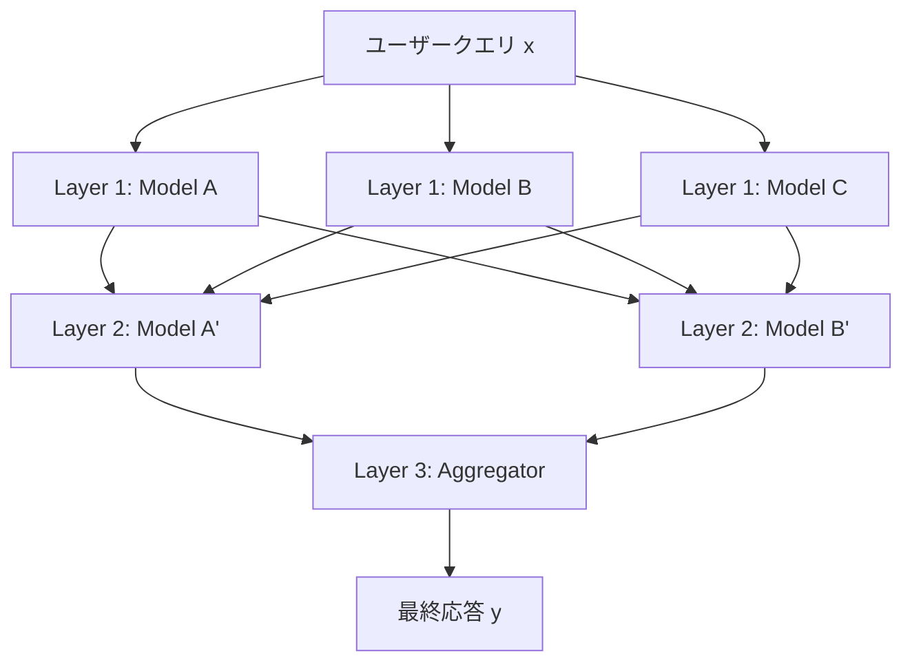

## 論文概要（Abstract）

「Mixture-of-Agents Enhances Large Language Model Capabilities」は、Together AIのJunlin Wang、Jue Wang、Ben Athiwaratkun、Ce Zhang、James Zouらが2024年6月に発表した論文である。複数のLLMを階層的に配置し、各層のモデルが前層の出力を参照しながら応答を改善する**Mixture-of-Agents（MoA）**アーキテクチャを提案している。オープンソースモデルのみでAlpacaEval 2.0において65.1%のLC勝率を達成し、GPT-4 Omniの57.5%を大幅に上回った。

この記事は [Zenn記事: Claude Octopus: 複数AIを並列実行するオーケストレーションプラグイン](https://zenn.dev/0h_n0/articles/c01f4e292ff1a7) の深掘りです。Claude Octopusが採用するマルチAI並列実行の理論的基盤として、MoAの「LLMの協調性（collaborativeness）」という知見は直接的に関連しています。

## 情報源

- **arXiv ID**: 2406.04692
- **URL**: [https://arxiv.org/abs/2406.04692](https://arxiv.org/abs/2406.04692)
- **著者**: Junlin Wang (Duke University, Together AI), Jue Wang, Ben Athiwaratkun, Ce Zhang, James Zou
- **発表年**: 2024
- **分野**: cs.CL, cs.AI, cs.LG
- **コード**: [https://github.com/togethercomputer/MoA](https://github.com/togethercomputer/MoA)

## 背景と動機（Background & Motivation）

大規模言語モデル（LLM）の性能向上は、モデルサイズの拡大やデータの質の改善によって進められてきた。しかし、単一モデルの性能には限界があり、異なるモデルはそれぞれ異なる強みを持つ。GPT-4はコード生成に強く、Claudeは長文の論理的な記述に優れ、Geminiは多言語処理に強いといった具合である。

従来のアンサンブル手法は、機械学習の分類・回帰タスクでは広く使われてきたが、LLMの自由形式テキスト生成においては単純な多数決や平均化が適用しにくいという課題があった。ランキングベースの手法（複数の応答から最良のものを選択する）はあるが、各応答の良い部分を統合する手法は未発達だった。

MoAは、この課題に対して「LLMは他のモデルの出力を参照すると、より良い応答を生成できる」という発見（**collaborativeness**）を活用し、階層的に複数モデルの出力を統合する新しいアーキテクチャを提案する。

## 主要な貢献（Key Contributions）

- **Collaborativeness現象の発見**: LLMは他モデルの出力を補助情報として与えると、それが自身より低品質なモデルの出力であっても、応答品質が向上するという普遍的な現象を実証
- **MoAアーキテクチャの提案**: $l$層×$n$モデルの階層構造により、反復的に応答を洗練する手法を設計。ファインチューニング不要で、既存のLLM APIをそのまま利用可能
- **オープンソースモデルでSOTAを達成**: AlpacaEval 2.0でGPT-4o（57.5%）を上回る65.1%を、Qwen、LLaMA-3、WizardLM等のOSSモデルのみで達成

## 技術的詳細（Technical Details）

### MoAアーキテクチャ

MoAは$l$層の階層構造を持ち、各層$i$は$n$個のLLMエージェント$A_{i,1}, A_{i,2}, \ldots, A_{i,n}$で構成される。



各層の出力は次の式で表される：

$$
y_{i+1,j} = A_{i+1,j}(x, [y_{i,1}, y_{i,2}, \ldots, y_{i,n}])
$$

ここで、
- $x$: ユーザーの元の入力クエリ
- $y_{i,j}$: 第$i$層の第$j$番目のエージェントの出力
- $A_{i,j}$: 第$i$層の第$j$番目のLLMエージェント
- $[\cdot]$: 前層のすべての出力を連結した補助情報

最終出力は最終層$l$の単一のアグリゲータエージェントによって生成される：

$$
y_{\text{final}} = A_{\text{agg}}(x, [y_{l-1,1}, y_{l-1,2}, \ldots, y_{l-1,n}])
$$

### Proposer と Aggregator の役割分離

MoAでは、LLMを2つの役割に分類している：

**Proposer（提案者）**:
- 多様な視点からの参照応答を生成
- 高い多様性が求められる
- WizardLM-8x22Bなどが優秀なProposer

**Aggregator（統合者）**:
- 複数の応答を統合し、高品質な単一応答を生成
- 情報の取捨選択能力が求められる
- GPT-4o、Qwen1.5-110B-ChatがProposerとAggregatorの両方で優秀

すべてのモデルが両方の役割に優れているわけではない点が重要である。例えば、WizardLM-8x22Bは優秀なProposerだが、Aggregatorとしては性能が低下することが実験で示されている。

### Aggregate-and-Synthesize プロンプト

Aggregatorに使用されるプロンプトは以下の構造を持つ：

```
You have been provided with a set of responses from various
open-source models to the latest user query. Your task is to
synthesize these responses into a single, high-quality response.
It is crucial to critically evaluate the information provided in
these responses, recognizing that some of it may be biased or
incorrect. Your response should not simply replicate the given
answers but should offer a refined, accurate, and comprehensive
reply to the instruction.
```

このプロンプトにより、単純なコピーではなく批判的な評価と統合が行われる。

### Mixture-of-Experts（MoE）との類似性

MoAはMixture-of-Experts（MoE）の概念をモデル全体のレベルに拡張したものと解釈できる。MoEでは内部のアクティベーションレベルでゲーティングが行われる：

$$
y = \sum_{i=1}^{n} g_i(x) \cdot E_i(x)
$$

ここで$g_i(x)$はゲーティング関数、$E_i(x)$は各エキスパートの出力である。MoAではこれをモデル全体のレベルに拡張し、各LLMをエキスパートとして扱い、Aggregatorがゲーティングの役割を担う。

## 実装のポイント（Implementation）

### 基本的な実装例

```python
from typing import List
import asyncio

class MoALayer:
    """Mixture-of-Agents の1層を実装するクラス

    Args:
        models: この層で使用するLLMのリスト
        is_final: 最終層（Aggregator層）かどうか
    """
    def __init__(self, models: List[str], is_final: bool = False):
        self.models = models
        self.is_final = is_final

    async def forward(
        self,
        query: str,
        prev_outputs: List[str] | None = None
    ) -> List[str]:
        """層の順伝播を実行

        Args:
            query: ユーザーの元のクエリ
            prev_outputs: 前層の全モデルの出力リスト

        Returns:
            この層の全モデルの出力リスト
        """
        if prev_outputs is None:
            # 第1層: クエリのみで応答生成
            prompts = [query] * len(self.models)
        else:
            # 第2層以降: 前層の出力を参照情報として付加
            reference = "\n\n".join(
                f"Response {i+1}: {out}"
                for i, out in enumerate(prev_outputs)
            )
            agg_prompt = (
                f"User query: {query}\n\n"
                f"Reference responses:\n{reference}\n\n"
                "Synthesize a high-quality response."
            )
            prompts = [agg_prompt] * len(self.models)

        # 並列実行
        tasks = [
            self._call_llm(model, prompt)
            for model, prompt in zip(self.models, prompts)
        ]
        return await asyncio.gather(*tasks)

    async def _call_llm(self, model: str, prompt: str) -> str:
        """LLM APIを非同期で呼び出す"""
        # 実装省略: OpenAI/Anthropic/Together AI APIを呼び出し
        ...


class MoAPipeline:
    """MoA全体のパイプライン

    Args:
        layers: MoALayerのリスト（最後の1つがAggregator層）
    """
    def __init__(self, layers: List[MoALayer]):
        self.layers = layers

    async def run(self, query: str) -> str:
        """MoAパイプラインを実行

        Args:
            query: ユーザークエリ

        Returns:
            最終的な統合応答
        """
        outputs = None
        for layer in self.layers:
            outputs = await layer.forward(query, outputs)
        return outputs[0]  # Aggregator層は1つの出力
```

### 実装上の注意点

1. **レイテンシの管理**: 各層は前層の完了を待つ必要があるため、TTFT（Time-to-First-Token）が層数に比例して増加する。プロダクション環境では2-3層が現実的
2. **コスト最適化**: MoA-Lite（層数・モデル数を削減した軽量版）で59.3%を達成しており、GPT-4 Turboと同等品質を2倍低いコストで実現可能
3. **モデル選択**: Proposerには多様性の高いモデル（異なるアーキテクチャ・学習データ）、Aggregatorには統合能力の高いモデルを選ぶことが重要

## 実験結果（Results）

### AlpacaEval 2.0

| モデル/手法 | LC Win Rate (%) |
|------------|----------------|
| GPT-4 Omni | 57.5 |
| GPT-4 Turbo (04/09) | 55.0 |
| **MoA (6モデル, 3層)** | **65.1 ± 0.6** |
| MoA-Lite | 59.3 |
| 単一モデル最高 (Qwen1.5-110B) | 43.9 |

MoAは単一モデル最高のQwen1.5-110B-Chat（43.9%）から21.2ポイントの向上を達成しており、単純なモデル性能の和以上の効果があることを示している。

### MT-Bench

| モデル/手法 | スコア |
|------------|--------|
| GPT-4 Turbo | 9.31 |
| **MoA** | **9.25 ± 0.10** |
| GPT-4o | 9.15 |
| Claude 3 Opus | 9.00 |

MT-Benchでは僅差でGPT-4 Turboに及ばないものの、GPT-4oやClaude 3 Opusを上回る結果を得ている。

### モデル多様性の効果

| 構成 | LC Win Rate (%) |
|------|----------------|
| 同一モデル × 6（繰り返し） | 56.7 |
| 異なるモデル × 6 | 61.3 |
| **異なるモデル × 6（3層）** | **65.1** |

同一モデルの繰り返しよりも、異なるモデルの組み合わせが4.6ポイント高い性能を示しており、モデルの多様性が重要であることが確認されている。

### ランキングベース手法との比較

MoAは単純なLLMランキング（複数応答から最良を選ぶ手法）を大幅に上回った。ランキングは個別応答の「選択」しか行わないが、MoAは応答の「統合」を行うため、個別応答にない情報の組み合わせを実現できる。

## 実運用への応用（Practical Applications）

### Claude Octopusとの関連

Zenn記事で紹介されているClaude Octopusは、Codex・Gemini・Claudeの3つのAIプロバイダを並列実行する。MoAの知見は以下の点でClaude Octopusの設計思想と直結している：

1. **Collaborativeness**: 異なるAIプロバイダの出力を参照することで品質が向上するというMoAの発見は、Claude Octopusの並列実行アーキテクチャの理論的根拠となる
2. **Proposer/Aggregator分離**: Claude OctopusのDouble Diamondにおける「発散→収束」フェーズは、MoAのProposer（発散）とAggregator（収束）に対応する
3. **品質ゲート**: Claude Octopusの75%品質ゲートは、MoAにおけるAggregatorの批判的評価機能と類似の役割を果たす

### プロダクション適用のポイント

**レイテンシ対策**:
- 層内のモデルは並列実行可能（各層のTTFTは最遅モデルに依存）
- ストリーミング対応: 最終層のAggregatorのみストリーミング出力すれば、ユーザー体験は許容範囲内
- 2層構成で十分な品質向上が見込める（3層以降の収益逓減）

**コスト管理**:
- Proposerに低コストモデル（Mixtral-8x7B等）を使用
- Aggregatorにのみ高性能モデルを配置
- MoA-Lite構成でGPT-4相当の品質を1/2のコストで実現

**スケーリング**:
- 各層のモデル数$n$を増やすと品質は向上するが、コストは線形に増加
- 実測では$n=6, l=3$が性能/コストの最適バランス

## 関連研究（Related Work）

- **Chain-of-Thought (Wei et al., 2022)**: ステップバイステップの推論を促す手法。MoAは推論の深化ではなく、複数視点の統合にフォーカス
- **Tree-of-Thought (Yao et al., 2024)**: 探索木ベースの推論。MoAは層構造による反復的改善であり、木探索ではない
- **LLM Cascading (Chen et al., 2023)**: 小→大モデルへのカスケード。MoAは全モデルが同時に動作し、階層的に統合する点が異なる
- **Self-Consistency (Wang et al., 2022)**: 同一モデルの複数回実行と多数決。MoAは異なるモデルの使用と出力の統合により、Self-Consistencyを大幅に上回る

## まとめと今後の展望

MoAは、複数のLLMを階層的に組み合わせることで、個々のモデルの限界を超える性能を引き出す革新的なアーキテクチャである。特に「LLMの協調性」という発見は、マルチAIオーケストレーション（Claude Octopusのような）の設計において重要な理論的根拠を提供する。

今後の研究方向として、(1) レイテンシ削減のためのチャンクワイズ集約、(2) 動的なモデル選択（タスクに応じたProposer/Aggregatorの自動構成）、(3) よりスケーラブルなアーキテクチャ（数十〜数百モデルの活用）が挙げられる。

## 参考文献

- **arXiv**: [https://arxiv.org/abs/2406.04692](https://arxiv.org/abs/2406.04692)
- **Code**: [https://github.com/togethercomputer/MoA](https://github.com/togethercomputer/MoA)
- **Related Zenn article**: [https://zenn.dev/0h_n0/articles/c01f4e292ff1a7](https://zenn.dev/0h_n0/articles/c01f4e292ff1a7)
- Wei, J., et al. (2022). Chain-of-thought prompting elicits reasoning in large language models. NeurIPS 2022.
- Yao, S., et al. (2024). Tree of thoughts: Deliberate problem solving with large language models. NeurIPS 2023.
- Wang, X., et al. (2022). Self-consistency improves chain of thought reasoning in language models. ICLR 2023.
