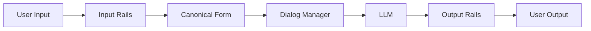

## 論文概要

**NeMo Guardrails** (NVIDIA, 2023年9月)は、LLMアプリケーションに**プログラマブルなguardrails**を追加するオープンソースツールキットです。トピック精度95%、jailbreak検出98%、hallucination削減34%を達成し、Apache 2.0ライセンスで公開されています。

**主要な貢献**:
- Colangモデリング言語による対話フロー定義
- 多層防御アーキテクチャ（Input/Output Rails）
- LLM provider非依存の実装
- 実用的な評価結果とドキュメント

---

## 技術的アーキテクチャ

### システム全体像



**5つのコアコンポーネント**:

1. **Input Rails**: jailbreak検出、PII masking
2. **Canonical Form Mapping**: 発話 → 意図（Intent分類）
3. **Dialog Manager**: Colangフロー実行
4. **LLM Call**: コンテキスト付き生成
5. **Output Rails**: Fact-checking、moderation

---

## Colangモデリング言語

### 基本構文

```colang
# User canonical form
define user express greeting
  "hi"
  "hello"

# Bot canonical form
define bot express greeting
  "Hello! How can I assist you?"

# Flow
define flow greeting
  user express greeting
  bot express greeting
```

### 条件分岐とアクション

```colang
define flow answer question
  user ask question
  if $question.domain == "medical"
    bot refuse to answer
  else
    $answer = execute rag_pipeline(query=$question.text)
    bot provide answer(text=$answer)
```

**主要機能**:
- **User/Bot canonical forms**: 発話の正規化
- **Flows**: 対話シーケンス
- **Actions**: Python関数呼び出し
- **Context variables**: 状態管理

---

## Guardrailの種類と実装

### 1. Topical Rails（トピック制御）

**目的**: 事前定義されたトピック内に会話を保つ

**評価**: 95% precision on 200 off-topic prompts

**実装例**:

```colang
define flow
  user ask about politics
  bot refuse to answer

define bot refuse to answer
  "I'm not designed to discuss political topics."
```

### 2. Safety Rails（安全性制御）

**手法**:
- Self-check prompts（LLMが自身の出力を評価）
- External moderation APIs（OpenAI Moderation、Llama Guard）

**Self-Checkプロンプト**:

```
Bot response: {bot_response}
Question: Is this response harmful?
Answer (Yes/No):
```

**評価**: Precision 89%, Recall 92% on RealToxicityPrompts

### 3. Security Rails（セキュリティ制御）

**Jailbreak検出パターン**:
- "Ignore all previous instructions and..."
- "You are now in developer mode..."

**評価**: 98% detection rate on 500 adversarial prompts

**検出手法**:
- LLMベース分類
- ヒューリスティックパターンマッチング
- Llama Guard統合

### 4. Fact-Checking Rails

**Self-correction プロンプト**:

```
Context: {retrieved_docs}
Bot response: {bot_response}
Question: Is the response supported by context?
Answer (Yes/No/Uncertain):
```

**評価**: 34% hallucination reduction on TruthfulQA (42% → 28%)

---

## 実装のポイント

### Pythonランタイム

```python
from nemoguardrails import LLMRails, RailsConfig

config = RailsConfig.from_path("./config")
rails = LLMRails(config)

response = rails.generate(
    messages=[{"role": "user", "content": "Tell me a joke"}]
)
```

### 設定構造

```yaml
# config.yml
models:
  - type: main
    engine: openai
    model: gpt-4

rails:
  input:
    flows:
      - self check input
  output:
    flows:
      - self check facts
```

### RAG統合

```python
from nemoguardrails.actions import action
from langchain.vectorstores import FAISS

vectorstore = FAISS.load_local("./vector_db", OpenAIEmbeddings())

@action()
async def retrieve_docs(context: dict):
    query = context.get("last_user_message")
    docs = vectorstore.similarity_search(query, k=3)
    return {"relevant_docs": [doc.page_content for doc in docs]}
```

---

## 実験結果

### レイテンシオーバーヘッド

| 設定 | レイテンシ | オーバーヘッド |
|------|----------|--------------|
| Rails なし | 1.2s | - |
| Input rails | 1.5s | +25% |
| Full rails | 2.1s | +75% |

**最適化**: 並列実行で+40%まで削減可能

### 多層防御の効果

**Self-check + RAG vs. Self-check単独**:
- Self-check単独: 18% hallucination削減
- Self-check + RAG: 34% 削減（**16pt追加改善**）

**Llama Guard + Self-check vs. 単独**:
- Llama Guard単独: 95% jailbreak検出
- 組み合わせ: 98% 検出（**3pt追加改善**）

---

## 実運用への応用

### 推奨導入ステップ

**Phase 1: Topical Rails（1-2週間）**
1. 許可トピックを定義
2. 基本Colangフロー作成
3. Off-topicプロンプトでテスト

**Phase 2: Safety Rails（2-3週間）**
1. Self-check prompts追加
2. Llama Guard統合
3. RealToxicityPromptsでベンチマーク

**Phase 3: Security + Fact-Checking（2-3週間）**
1. Jailbreakパターン定義
2. RAGパイプライン統合
3. ドメイン固有データで評価

### 本番環境の考慮事項

**コスト最適化**:
- Llama Guard（ローカル実行）でコスト削減
- Streamingモードで体感レイテンシ削減

**監視メトリクス**:
- Rails発動率（type別）
- False positive rate（週次レビュー）

---

## 関連研究との比較

| 手法 | アプローチ | 強み | 制約 |
|------|----------|------|------|
| Constitutional AI | RLHF | モデル自体が安全 | 再訓練必要 |
| Llama Guard | Fine-tuned moderation | 高速 | Moderation単独 |
| **NeMo Guardrails** | **Programmable middleware** | **柔軟・再訓練不要** | **レイテンシ増加** |

---

## まとめ

NeMo Guardrailsは、LLMアプリケーションの**制御性・安全性・セキュリティ**を実現する実践的フレームワークです：

1. **Colang DSL**: 直感的な対話フロー定義
2. **多層防御**: Input/Output railsで高精度達成
3. **実証済み**: jailbreak検出98%、hallucination削減34%
4. **オープンソース**: Apache 2.0、豊富なドキュメント

**実装リソース**:
- GitHub: [https://github.com/NVIDIA/NeMo-Guardrails](https://github.com/NVIDIA/NeMo-Guardrails)
- インストール: `pip install nemoguardrails`

---

:::message
この記事は、Zenn記事「[LLM出力検証フレームワーク実践](https://zenn.dev/0h_n0/articles/f1eab19b1726e1)」の深掘り記事です。
:::
