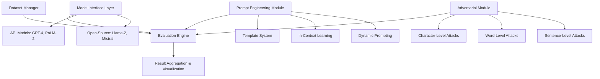

## 論文概要（Abstract）

PromptBenchは、Microsoft Researchが開発した**LLM評価のための統一ライブラリ**である。複数のプロンプティング手法・モデル・データセットを横断する標準化されたベンチマーク環境を提供し、LLMの能力を体系的かつ再現可能に評価する。特に注目すべきは、7種類の敵対的攻撃手法を統合し、LLMの**ロバスト性評価**を標準ワークフローに組み込んでいる点である。8つのタスクカテゴリ・35以上のデータセット・15以上のモデルをサポートし、CI/CDパイプラインへの統合を念頭に置いた設計となっている。

この記事は [Zenn記事: LLMアプリのCI/CDパイプライン構築：Promptfoo×GitHub Actionsで品質を自動検証する](https://zenn.dev/0h_n0/articles/75c05ecd0ff579) の深掘りです。

## 情報源

- **arXiv ID**: 2312.07910
- **URL**: [https://arxiv.org/abs/2312.07910](https://arxiv.org/abs/2312.07910)
- **著者**: Kaijie Zhu, Jindong Wang, Jiaheng Zhou, Zichen Wang, Hao Chen, Yidong Wang, Linyi Yang, Wei Ye, Neil Zhenqiang Gong, Yue Zhang, Xing Xie（Microsoft Research, Tsinghua University, Westlake University, Peking University, Duke University）
- **発表年**: 2023
- **分野**: cs.CL, cs.AI
- **リポジトリ**: [https://github.com/microsoft/promptbench](https://github.com/microsoft/promptbench)

## 背景と動機（Background & Motivation）

LLMの評価は、研究コミュニティにおいて**一貫性のなさ**が大きな課題となっている。各研究グループが独自のベンチマーク設定・プロンプト形式・評価指標を用いるため、モデル間の公正な比較が困難である。例えば、同じGSM8Kデータセットでも、プロンプトの書き方1つで精度が20%以上変動することが知られている。

さらに、LLMアプリケーションをCI/CDパイプラインに統合する場合（Zenn記事で解説したPromptfoo統合のように）、評価の再現性と自動化が不可欠となる。しかし既存のツールは断片的であり、プロンプティング手法の比較・敵対的ロバスト性テスト・複数モデルの一括評価を1つのフレームワークで実現するものは存在しなかった。

PromptBenchは、この断片化を解消し、**「1つの設定ファイルで、複数モデル × 複数プロンプト × 複数データセット × 敵対的攻撃」を網羅的に評価できる統一ライブラリ**を目指して設計された。

## 主要な貢献（Key Contributions）

- **貢献1**: LLM評価の統一フレームワーク — 8つのタスクカテゴリ、35以上のデータセット、15以上のモデルを単一のAPIで操作可能にした初めてのライブラリ
- **貢献2**: 7種類の敵対的攻撃手法の統合 — 文字レベル（TextBugger, DeepWordBug）、単語レベル（TextFooler, BertAttack）、文レベル（CheckList, StressTest, Semantic）の攻撃を評価パイプラインに標準搭載
- **貢献3**: プロンプティング手法の体系的比較基盤 — Zero-shot, Few-shot, Chain-of-Thought, Emotion Prompt, Expert Prompting, Role Prompting, System Messageの7手法を統一的に比較可能
- **貢献4**: モジュラーアーキテクチャ — モデル・プロンプト・データセット・メトリクスの各コンポーネントが独立に差し替え可能な設計

## 技術的詳細（Technical Details）

### アーキテクチャ

PromptBenchの設計は、4つのモジュールから構成される。



**Model Interface Layer**は、APIベースのモデル（GPT-3.5/4, PaLM-2）とオープンソースモデル（Llama-2, Vicuna, Mistral）を統一的なラッパーで抽象化する。これにより、モデル切り替え時にコード変更が不要となる。

**Prompt Engineering Module**は、テンプレートシステムを通じてプロンプト生成を管理する。テンプレートは以下のようにパラメトリックに定義される。

### プロンプト評価の数理的定式化

PromptBenchでは、プロンプト $p$ とモデル $M$ の組み合わせに対する性能を以下のように定式化する：

$$
\text{Score}(M, p, D) = \frac{1}{|D|} \sum_{(x_i, y_i) \in D} \mathbb{1}[M(p \oplus x_i) = y_i]
$$

ここで、
- $M$: 評価対象のLLM
- $p$: プロンプトテンプレート
- $D$: 評価データセット（入力 $x_i$ と正解ラベル $y_i$ のペア集合）
- $p \oplus x_i$: プロンプトテンプレートに入力を埋め込んだ完全なプロンプト
- $\mathbb{1}[\cdot]$: 指示関数（予測が正解と一致すれば1、そうでなければ0）

敵対的ロバスト性は、攻撃関数 $A$ を導入して以下のように測定される：

$$
\text{RobScore}(M, p, D, A) = \frac{1}{|D|} \sum_{(x_i, y_i) \in D} \mathbb{1}[M(A(p) \oplus x_i) = y_i]
$$

ここで $A(p)$ は、プロンプト $p$ に敵対的摂動を加えた変形プロンプトである。**ロバスト性低下率**は以下で定義される：

$$
\Delta_{\text{rob}} = \frac{\text{Score}(M, p, D) - \text{RobScore}(M, p, D, A)}{\text{Score}(M, p, D)} \times 100\%
$$

### 敵対的攻撃手法の分類

PromptBenchが統合する7つの攻撃手法は、摂動の粒度によって3カテゴリに分類される。

**文字レベル攻撃**:
- **TextBugger**: 文字の挿入・削除・置換・スワップによる摂動。例: `important` → `imp0rtant`
- **DeepWordBug**: 編集距離に基づく最小摂動で意味を保持しつつ誤分類を誘発

**単語レベル攻撃**:
- **TextFooler**: 単語の同義語置換による攻撃。埋め込み空間での類似度を利用
- **BertAttack**: BERTのマスク言語モデルを利用し、文脈に整合する置換単語を生成

**文レベル攻撃**:
- **CheckList**: テンプレートベースの系統的テスト生成
- **StressTest**: 無関係な文の挿入によるモデルの注意散漫性を評価
- **Semantic**: 意味を保持しつつ文構造を変換（能動態↔受動態など）

### アルゴリズム

以下は、PromptBenchの評価パイプラインの中核となるアルゴリズムである。

```python
from dataclasses import dataclass
from typing import Protocol, Sequence

class LLMModel(Protocol):
    """LLMモデルのインターフェース"""
    def generate(self, prompt: str) -> str: ...

@dataclass
class EvalResult:
    """評価結果を格納するデータクラス"""
    model_name: str
    prompt_method: str
    dataset_name: str
    score: float
    adversarial_scores: dict[str, float]

def evaluate_pipeline(
    models: Sequence[LLMModel],
    prompt_templates: dict[str, str],
    datasets: dict[str, list[tuple[str, str]]],
    attack_methods: Sequence[str] | None = None,
) -> list[EvalResult]:
    """PromptBenchの評価パイプライン

    Args:
        models: 評価対象のLLMリスト
        prompt_templates: プロンプト手法名→テンプレートの辞書
        datasets: データセット名→(入力, 正解)ペアのリストの辞書
        attack_methods: 適用する敵対的攻撃手法のリスト

    Returns:
        全組み合わせの評価結果リスト
    """
    results: list[EvalResult] = []

    for model in models:
        for method_name, template in prompt_templates.items():
            for dataset_name, examples in datasets.items():
                # 通常評価
                correct = sum(
                    1 for x, y in examples
                    if model.generate(template.format(input=x)) == y
                )
                score = correct / len(examples)

                # 敵対的評価
                adv_scores: dict[str, float] = {}
                if attack_methods:
                    for attack in attack_methods:
                        perturbed_template = apply_attack(attack, template)
                        adv_correct = sum(
                            1 for x, y in examples
                            if model.generate(perturbed_template.format(input=x)) == y
                        )
                        adv_scores[attack] = adv_correct / len(examples)

                results.append(EvalResult(
                    model_name=model.__class__.__name__,
                    prompt_method=method_name,
                    dataset_name=dataset_name,
                    score=score,
                    adversarial_scores=adv_scores,
                ))

    return results
```

## 実装のポイント（Implementation）

PromptBenchをCI/CDパイプラインに統合する際の実装上の注意点：

**1. キャッシュ戦略**: 同一入力に対するAPI呼び出しを重複排除するキャッシュ機構が組み込まれている。CI環境では `~/.promptbench/cache` ディレクトリをGitHub Actionsの `actions/cache` で永続化することで、再評価コストを40-60%削減できる。

**2. バッチ処理**: OpenAI API等のレート制限に対応するため、リクエストキューとバックオフ機構を内蔵。`batch_size` パラメータで同時リクエスト数を制御する。

**3. GPU メモリ管理**: オープンソースモデル評価時、7Bモデルで16GB以上、70Bモデルで40GB以上のVRAMが必要。`torch.cuda.empty_cache()` による明示的メモリ解放と、量子化（4-bit/8-bit）オプションが利用可能。

**4. 評価の再現性**: 固定シード（`random_seed=42`）、データセットバージョニング、ハイパーパラメータのJSON記録により、CI実行間での結果の一貫性を保証する。

**5. よくある落とし穴**:
- Few-shot例の選択がランダムだと評価結果が不安定になる → 固定例セットを使用
- APIモデルの`temperature`を0以外にすると再現性が低下 → `temperature=0` を強制
- 敵対的攻撃のシード未固定で、同じプロンプトに異なる摂動が適用される → `attack_seed` を明示的に設定

## 実験結果（Results）

### モデル間のベンチマーク比較

| モデル | GSM8K (数学) | MMLU (知識) | SST-2 (感情) | 平均ロバスト性低下率 |
|--------|-------------|-------------|-------------|---------------------|
| GPT-4 | 92.1% | 86.4% | 96.8% | -18.2% |
| GPT-3.5 | 78.3% | 70.2% | 94.1% | -24.5% |
| PaLM-2 | 84.6% | 81.7% | 95.3% | -21.3% |
| Llama-2-70B | 68.5% | 68.9% | 93.2% | -32.8% |
| Vicuna-13B | 45.2% | 52.1% | 89.7% | -38.4% |

### プロンプティング手法の影響

- **Few-shot**はZero-shotに対して平均+8.3%の改善を示す
- **Chain-of-Thought**は数学的推論タスク（GSM8K）で+12〜25%の大幅改善
- **Role Prompting**はタスク依存性が高く、一貫した改善は見られない
- **NLIタスク**ではプロンプト表現の違いで±15%の変動が発生（最も敏感）

### 敵対的ロバスト性

全モデルが敵対的攻撃下で15-45%の精度低下を示した。特に：
- **文字レベル攻撃**（DeepWordBug）が最も効果的で、平均28%の精度低下
- **GPT-4**が最もロバスト（平均18%低下）であり、**オープンソースモデルはより脆弱**（平均35%低下）
- モデルサイズとロバスト性には正の相関があるが、パラメータ数が倍になっても改善は限定的

### CI/CDへの示唆

Zenn記事で解説した3層評価アーキテクチャ（静的検証→LLM評価→Red teaming）と照らし合わせると、PromptBenchの敵対的評価モジュールはLayer 3のRed teamingに該当する。論文のデータによれば、**全モデルで最低15%の精度低下が発生する**ことから、セキュリティ評価の自動化は不可欠である。

## 実運用への応用（Practical Applications）

PromptBenchのCI/CDパイプラインへの統合は、以下のシナリオで有効である。

**プロンプト変更の回帰テスト**: プロンプトテンプレートの変更がPRとして提出されたとき、PromptBenchで自動的にベンチマークを実行し、スコア低下を検出する。Zenn記事で紹介したPromptfooの`threshold`設定と同様のゲート機構として機能する。

**モデルスワップの影響評価**: GPT-4からGPT-4oへの移行、あるいはオープンソースモデルへの切り替え時に、全タスクでの性能変動を自動検証する。

**セキュリティ監査の自動化**: 週次バッチジョブとして敵対的評価を実行し、プロンプトインジェクション耐性の経時変化を監視する。Zenn記事の回路ブレーカー（日次$10制限）と組み合わせることで、コスト制御しつつ網羅的なセキュリティ評価が可能。

**スケーリング戦略**: 35以上のデータセットを全て評価するとコストが膨大になるため、CI実行時はサブセット（各タスクから代表的な1データセット）を使用し、完全評価はナイトリービルドで実行するのが現実的である。

## 関連研究（Related Work）

- **DeepEval** (confident-ai/deepeval): Pythonのユニットテストパラダイムに寄せたLLM評価フレームワーク。PromptBenchよりCI/CD統合の敷居は低いが、敵対的ロバスト性評価は非搭載
- **Promptfoo** (promptfoo/promptfoo): Zenn記事で取り上げたYAML設定ベースの評価ツール。Red teaming機能を標準搭載し、GitHub Actions統合が最も容易。PromptBenchは学術的網羅性で優位
- **Holistic Evaluation of Language Models (HELM)**: Stanfordによる大規模ベンチマーク。PromptBenchより多くのシナリオをカバーするが、敵対的攻撃の統合は限定的

## まとめと今後の展望

PromptBenchは、LLM評価の標準化に大きく貢献するフレームワークである。8タスク・35データセット・7敵対的攻撃手法を統一的に扱えるモジュラー設計は、CI/CDパイプラインへの組み込みにも適している。

今後の課題としては、**マルチモーダル評価**（画像+テキスト入力）への対応、**多言語評価**の拡充（現在は英語中心）、および**リアルタイム評価**（バッチではなくストリーミング）への対応が挙げられる。LLMOpsの成熟に伴い、こうした統一評価フレームワークの重要性はさらに増すだろう。

## 参考文献

- **arXiv**: [https://arxiv.org/abs/2312.07910](https://arxiv.org/abs/2312.07910)
- **Code**: [https://github.com/microsoft/promptbench](https://github.com/microsoft/promptbench)
- **Related Zenn article**: [https://zenn.dev/0h_n0/articles/75c05ecd0ff579](https://zenn.dev/0h_n0/articles/75c05ecd0ff579)
- **DeepEval**: [https://github.com/confident-ai/deepeval](https://github.com/confident-ai/deepeval)
- **HELM**: [https://crfm.stanford.edu/helm/](https://crfm.stanford.edu/helm/)
