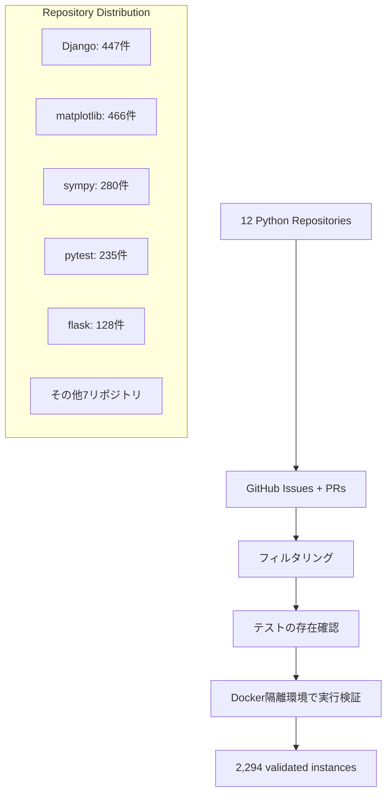
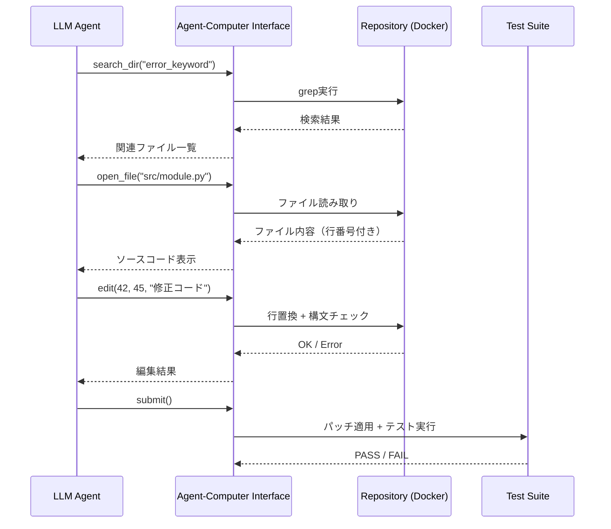

## 論文概要（Abstract）

SWE-bench は Princeton NLP グループが提案した、**実世界のGitHubイシューを用いてLLMのソフトウェアエンジニアリング能力を評価するベンチマーク**である。Django、Flask、scikit-learn など12の人気Pythonリポジトリから2,294件のイシュー・プルリクエストペアを収集し、モデルに対して「イシュー記述を読み解き」「コードベースを探索し」「テストを通過するパッチを生成する」ことを求める。当時最先端のClaude 2でも解決率はわずか3.79%であり、エージェント評価の難しさを定量的に示した画期的な研究である。

この記事は [Zenn記事: AIエージェントのテスト戦略：pass@kとCI/CD統合で品質を自動保証する実践ガイド](https://zenn.dev/0h_n0/articles/f03733cd5ca3d9) の深掘りです。

## 情報源

- **arXiv ID**: 2310.06770
- **URL**: [https://arxiv.org/abs/2310.06770](https://arxiv.org/abs/2310.06770)
- **著者**: Carlos E. Jimenez, John Yang, Alexander Wettig, Shunyu Yao, Kexin Pei, Ofir Press, Karthik Narasimhan（Princeton University）
- **発表年**: 2023（初版）、2024年にSWE-bench Verified として拡張
- **分野**: cs.CL, cs.AI, cs.SE
- **コード**: [https://github.com/princeton-nlp/SWE-bench](https://github.com/princeton-nlp/SWE-bench)

## 背景と動機（Background & Motivation）

従来のコード生成ベンチマーク（HumanEval、MBPP等）は**孤立した関数レベルの問題**を扱い、LLMの実用的なソフトウェアエンジニアリング能力を十分に測定できていなかった。主な課題は3つある。

1. **データ汚染**: HumanEvalの問題がトレーニングデータに含まれ、スコアが過大評価される
2. **飽和**: GPT-4でHumanEvalの90%以上を解決し、モデル間の差別化ができない
3. **実務との乖離**: 実際の開発では、巨大なコードベースの理解、関連ファイルの特定、既存テストとの整合性確保が必要

SWE-bench は、こうした限界を克服するため、**実際に解決されたGitHubイシューとPR**を収集し、テストスイートによる検証を行う実行ベースの評価フレームワークとして設計された。

## 主要な貢献（Key Contributions）

- **貢献1**: 12のPythonリポジトリから2,294件の実世界ソフトウェアエンジニアリング問題を体系的に収集した、初の大規模実行ベースベンチマーク
- **貢献2**: Agent-Computer Interface（ACI）を備えたSWE-agentアーキテクチャの提案。ファイル操作・検索・編集のツールセットを体系化
- **貢献3**: Oracle実験による能力ボトルネックの特定。ファイル位置を与えるだけで解決率が3.79% → 13.8%に向上し、**局所化（localization）がボトルネック**であることを定量的に証明
- **貢献4**: テストベース評価と人間の判断の一致率が78.0%であり、ベンチマークの妥当性を検証

## 技術的詳細（Technical Details）

### タスク定義

SWE-benchのタスクは、コードベース $C$、イシュー記述 $I$、テストスイート $T$ が与えられたとき、パッチ $P$ を生成する問題として定式化される：

$$
\text{resolve}(C, I) = P \quad \text{s.t.} \quad \forall t \in T: \text{pass}(\text{apply}(C, P), t) = \text{True}
$$

ここで、
- $C$: イシュー作成時点のリポジトリスナップショット
- $I$: GitHubイシューのテキスト記述（中央値542文字）
- $T$: PRに含まれるテストケース（新規追加テスト含む）
- $P$: 生成されたパッチ（中央値34行の変更）
- $\text{apply}(C, P)$: パッチ適用後のコードベース

評価メトリクスは**% Resolved**（全テスト通過率）であり、BLEUスコアや編集距離ではなく**実行ベースの二値判定**を採用している点が重要である。

### データセット構成



各インスタンスには以下が含まれる：

| フィールド | 内容 | 例 |
|-----------|------|-----|
| リポジトリ | 対象リポジトリ名 | `django/django` |
| イシュー記述 | バグ報告・機能リクエスト | "QuerySet.union() breaks..." |
| ベースコミット | イシュー作成時点のコミット | `abc123def` |
| パッチ（正解） | PRのdiff | `+/- 34 lines (median)` |
| テストスイート | 検証用テストケース | `tests/test_union.py` |

### SWE-agent アーキテクチャ

SWE-bench の評価を効率的に行うため、論文ではSWE-agentと呼ばれるエージェントアーキテクチャも提案している。中核はAgent-Computer Interface（ACI）であり、LLMがリポジトリと対話するためのツールセットを提供する。

```python
# SWE-agent の Agent-Computer Interface（ACI）
class AgentComputerInterface:
    """リポジトリ操作のためのツールセット"""

    def open_file(self, path: str, line_start: int = 0, line_end: int = 100) -> str:
        """ファイルを行番号付きで表示"""
        ...

    def search_dir(self, query: str, directory: str = ".") -> list[str]:
        """ディレクトリ内をキーワード検索"""
        ...

    def search_file(self, query: str, file_path: str) -> list[tuple[int, str]]:
        """ファイル内をキーワード検索し、行番号と内容を返す"""
        ...

    def edit(self, line_start: int, line_end: int, replacement: str) -> str:
        """指定行を置換（構文チェック付き）"""
        ...

    def submit(self) -> dict:
        """パッチを生成して提出"""
        ...
```

重要な設計判断として、**行ベースの編集**を採用している。生ファイル内容の書き換えと比較して、行番号指定による置換はLLMのエラー率を大幅に低減する。また、Python構文チェッカーとlinterを統合し、**編集直後にフィードバック**を提供することで、構文エラーの蓄積を防いでいる。

### 評価プロトコル

各インスタンスの評価は以下のフローで行われる：



## 実験結果（Results）

### 主要ベンチマーク結果

| モデル/手法 | % Resolved | 備考 |
|------------|-----------|------|
| Claude 2 | 3.79% | 当時最高性能 |
| GPT-4 | 1.74% | - |
| BM25 + Oracle Edit | 6.60% | ファイル検索ベースライン |
| Random + Oracle Edit | 0.48% | ランダムベースライン |

### Oracle実験：ボトルネックの特定

Oracle実験は、エージェントの能力ボトルネックがどこにあるかを明らかにする重要な分析である。段階的に「正解情報」を与えることで、**局所化（ファイル特定）が最大のボトルネック**であることを定量的に示した。

| 介入レベル | Claude 2 | GPT-4 | 改善倍率 (Claude 2) |
|-----------|---------|-------|-------------------|
| 介入なし | 3.79% | 1.74% | 1.0x |
| 正解ファイル提示 | 13.8% | 4.8% | 3.6x |
| 正解ファイル + 行番号 | 17.8% | 8.9% | 4.7x |
| 完全Oracle | 26.0% | 19.8% | 6.9x |

この結果は、エージェントテスト戦略において**局所化能力の評価**が極めて重要であることを示唆している。Zenn記事で紹介されている3種グレーダーの文脈では、ファイル特定の正確性はCode-Basedグレーダーで検証可能な明確な指標である。

### パッチ特性別の分析

| パッチサイズ | 解決率 (Claude 2) | 全体比率 |
|------------|------------------|---------|
| < 20行 | 5.2% | 45% |
| 20-50行 | 3.1% | 40% |
| 50-100行 | 1.5% | 10% |
| > 100行 | 0.9% | 5% |

短いパッチほど解決率が高い傾向は、**エージェントの能力評価において問題の粒度を制御する重要性**を示している。

### 失敗モード分析

エージェントの失敗パターンを分析した結果、以下の分布が判明した：

1. **局所化失敗**（45%）: 関連ファイルを発見できない、間違ったディレクトリを探索
2. **パッチ生成エラー**（38%）: 構文エラー、不正確なロジック、不完全な修正
3. **テスト失敗**（17%）: 既存テストの破壊、エッジケースの未処理

## 実装のポイント（Implementation）

### SWE-bench環境の構築

SWE-benchの評価を再現する際の主要なポイントを示す。

```python
"""SWE-bench評価パイプラインの最小構成

Docker隔離環境でテスト実行し、pass/failを判定する。
"""
from dataclasses import dataclass
from pathlib import Path
import subprocess


@dataclass
class SWEBenchInstance:
    """1つの評価インスタンス"""
    instance_id: str
    repo: str
    base_commit: str
    issue_text: str
    test_patch: str  # テストケースのdiff
    gold_patch: str  # 正解パッチ（評価時は非公開）


def evaluate_patch(instance: SWEBenchInstance, generated_patch: str) -> bool:
    """生成パッチをDocker内で評価

    Args:
        instance: 評価インスタンス
        generated_patch: モデルが生成したパッチ

    Returns:
        全テスト通過ならTrue
    """
    # 1. Docker環境でリポジトリをクローン
    # 2. base_commitにチェックアウト
    # 3. test_patchを適用（テストケース追加）
    # 4. generated_patchを適用
    # 5. pytest実行
    result = subprocess.run(
        ["docker", "run", "--rm",
         f"swebench/{instance.repo}:{instance.base_commit}",
         "bash", "-c",
         f"git apply patch.diff && pytest {instance.test_patch} -x"],
        capture_output=True, text=True, timeout=300
    )
    return result.returncode == 0
```

### pass@kとの関連

Zenn記事で解説されているpass@kメトリクスは、SWE-benchの文脈で特に重要な意味を持つ。エージェントの出力は非決定論的であるため、**同一イシューに対してk回試行した場合の成功確率**が実用的な指標となる。

$$
\text{pass@}k = 1 - \frac{\binom{n-c}{k}}{\binom{n}{k}}
$$

ここで、
- $n$: 総試行回数
- $c$: 成功回数
- $k$: サンプリング回数

SWE-benchでのClaude 2（解決率3.79%）の場合：

$$
\text{pass@}1 = 3.79\%, \quad \text{pass@}5 \approx 17.6\%, \quad \text{pass@}10 \approx 32.4\%
$$

一方、pass^k（全k回成功）は：

$$
\text{pass}^k = p^k = 0.0379^5 \approx 7.7 \times 10^{-8}
$$

つまり、**pass@5では約17.6%の問題を解決できるが、pass^5で全回成功する確率は事実上ゼロ**である。この乖離は、エージェントの「一貫した信頼性」と「能力の上限」を区別する重要性を浮き彫りにする。

## 実運用への応用（Practical Applications）

### CI/CDパイプラインへの統合

SWE-benchの評価フレームワークは、そのままCI/CDパイプラインでのエージェント回帰テストに応用できる。

```yaml
# .github/workflows/agent-regression.yml
name: Agent Regression Test (SWE-bench subset)
on:
  pull_request:
    paths: ["src/agents/**", "prompts/**"]

jobs:
  swe-bench-lite:
    runs-on: ubuntu-latest
    steps:
      - uses: actions/checkout@v4
      - name: Run SWE-bench Verified subset
        run: |
          python -m swebench.harness.run_evaluation \
            --model_name ${{ env.AGENT_MODEL }} \
            --dataset_name princeton-nlp/SWE-bench_Verified \
            --max_workers 4 \
            --split test[:50]
      - name: Check regression threshold
        run: |
          RESOLVE_RATE=$(cat results/resolve_rate.json | jq '.rate')
          if (( $(echo "$RESOLVE_RATE < 0.30" | bc -l) )); then
            echo "REGRESSION DETECTED: $RESOLVE_RATE < 0.30"
            exit 1
          fi
```

### SWE-bench Verified（2024年拡張）

SWE-bench Verifiedは、元のデータセットから**人手で検証された500件のサブセット**であり、ノイズの少ない高品質な評価を提供する。2024年時点でのリーダーボード上位モデルは解決率40-50%に達しており、エージェント技術の急速な進歩を示している。

### エージェントテスト設計への示唆

SWE-benchから得られるエージェントテスト設計の教訓：

1. **実行ベース評価の優位性**: 文字列一致やBLEUスコアではなく、テスト通過という客観的基準を使う
2. **段階的難易度設計**: パッチサイズや関連ファイル数で難易度を制御する
3. **Oracle実験の重要性**: ボトルネックを特定するため、段階的にヒントを与える実験設計
4. **環境隔離**: Docker等でテスト環境を完全隔離し、副作用を防ぐ

## 関連研究（Related Work）

- **HumanEval** (Chen et al., 2021): 164問の関数生成ベンチマーク。SWE-benchと異なり、孤立した関数のみを評価し、リポジトリレベルの理解は不要
- **APPS** (Hendrycks et al., 2021): プログラミングコンテスト問題。SWE-benchは実務寄りのイシュー解決に焦点
- **AgentBench** (Liu et al., 2023): 8環境でのLLMエージェント評価。SWE-benchはソフトウェアエンジニアリングに特化し、より深い分析を提供
- **WebArena** (Zhou et al., 2023): ウェブ環境でのエージェント評価。SWE-benchはコード生成・デバッグに特化

## まとめと今後の展望

SWE-benchは、LLMエージェントのソフトウェアエンジニアリング能力を**実世界の問題で定量的に評価する**先駆的なベンチマークである。

**主要な知見：**
- 最先端モデルでも解決率は4%未満（当時）→ 2024年には40-50%に進歩
- **局所化能力がボトルネック**であり、正確なファイル特定で3-5倍の改善
- テストベース評価と人間の判断は78%一致し、ベンチマークとして妥当
- pass@kの観点からは試行回数を増やすことで能力の上限を探索できるが、pass^kは一貫した信頼性の不足を露呈する

**今後の方向性：**
- 多言語対応（Python以外のリポジトリ）
- インタラクティブ評価（テスト実行フィードバックの活用）
- マルチリポジトリ依存関係の評価
- CI/CDパイプラインとの直接統合による継続的評価

## 参考文献

- **arXiv**: [https://arxiv.org/abs/2310.06770](https://arxiv.org/abs/2310.06770)
- **Code**: [https://github.com/princeton-nlp/SWE-bench](https://github.com/princeton-nlp/SWE-bench)
- **SWE-bench Verified**: [https://www.swebench.com/](https://www.swebench.com/)
- **Related Zenn article**: [https://zenn.dev/0h_n0/articles/f03733cd5ca3d9](https://zenn.dev/0h_n0/articles/f03733cd5ca3d9)
