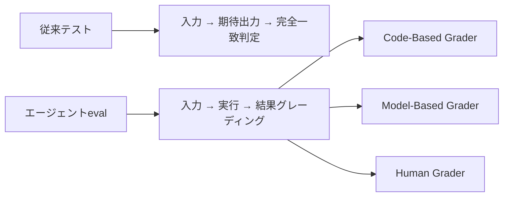

## ブログ概要（Summary）

「Demystifying Evals for AI Agents」は、Anthropicのエンジニアリングチームが2026年1月に公開した**AIエージェント評価の包括的ガイド**である。Claude Codeの開発経験と顧客企業（Descript、Bolt等）との協業から得られた知見を体系化し、3種グレーダー（Code-Based / Model-Based / Human）の使い分け、pass@kとpass^kの運用設計、eval構築の8段階ロードマップを実践的に解説している。「結果をグレーディングし、経路ではない」という原則のもと、20-50タスクから始める段階的アプローチを提唱した重要なリファレンスである。

この記事は [Zenn記事: AIエージェントのテスト戦略：pass@kとCI/CD統合で品質を自動保証する実践ガイド](https://zenn.dev/0h_n0/articles/f03733cd5ca3d9) の深掘りです。

## 情報源

- **種別**: 企業テックブログ
- **URL**: [https://www.anthropic.com/engineering/demystifying-evals-for-ai-agents](https://www.anthropic.com/engineering/demystifying-evals-for-ai-agents)
- **組織**: Anthropic Engineering
- **発表日**: 2026年1月9日

## 技術的背景（Technical Background）

AIエージェントは自律的にツールを呼び出し、推論し、環境を変更する。この特性がテストを根本的に難しくする理由は3つある。

1. **非決定論的出力**: 同一プロンプトでも毎回異なる結果を返す
2. **経路の多様性**: 同じ目標に対して複数の有効な解法が存在する（Anthropicは「Opus 4.5がフライト予約で想定外の解法を発見した」事例を紹介）
3. **ミスの伝播**: マルチターンでは1ステップの誤りが後続すべてに影響する

従来の「期待出力との完全一致」テストはこの環境で機能しない。Anthropicが提唱するのは**「Grade results, not paths」**（結果をグレーディングし、経路ではない）という原則である。



### なぜevalが重要か

Anthropicのブログは、evalなしでは「flying blind（盲目飛行）」であると指摘する。Claude Codeの開発では、最初は社員フィードバックのみで運用していたが、以下の段階を経てeval体制を構築した。

1. **初期**: 社員フィードバックによる手動品質管理
2. **狭域eval**: 特定機能（簡潔さ、ファイル編集）にevalを追加
3. **拡張eval**: 複雑な行動（過剰エンジニアリングの検出）にevalを追加
4. **成熟期**: CI/CDパイプラインに統合し、PR単位で自動実行

## 3種グレーダーの詳細分析（Architecture）

### 評価構造の基本概念

Anthropicが定義するevalの構造要素は以下の通りである。

| 要素 | 定義 | 例 |
|------|------|-----|
| **Task** | 入力と成功基準を持つ1つのテスト | 「TypeErrorを修正せよ」 |
| **Trial** | Taskの1回の試行 | 同一Taskのk回目の実行 |
| **Grader** | 出力を採点するロジック | pytest実行、LLM判定 |
| **Transcript** | 試行の完全記録 | 出力、ツール呼び出し、推論過程 |
| **Outcome** | 試行終了時の環境状態 | 修正済みコード、テスト結果 |

### Code-Based Grader

**特徴**: 高速・安価・再現可能。客観的な条件を検証する場面で使用。

```python
from dataclasses import dataclass
from typing import Callable


@dataclass
class CodeGrader:
    """Code-Basedグレーダーの実装例

    Attributes:
        name: グレーダー名
        check_fn: 検証関数（Trueなら合格）
    """
    name: str
    check_fn: Callable[[dict], bool]


# 具体的なCode-Basedグレーダー群
graders = [
    # 1. テスト通過検証
    CodeGrader(
        name="pytest_pass",
        check_fn=lambda result: result["test_exit_code"] == 0
    ),
    # 2. ツール呼び出し検証
    CodeGrader(
        name="correct_tool_used",
        check_fn=lambda result: "weather_api" in result["tools_called"]
    ),
    # 3. 出力形式検証
    CodeGrader(
        name="valid_json_output",
        check_fn=lambda result: is_valid_json(result["output"])
    ),
    # 4. 静的解析（ruff, mypy, bandit）
    CodeGrader(
        name="no_lint_errors",
        check_fn=lambda result: result["ruff_exit_code"] == 0
    ),
    # 5. 状態チェック
    CodeGrader(
        name="security_log_written",
        check_fn=lambda result: result["logs"].get("event_type") == "auth_blocked"
    ),
]
```

**適用場面**:
- ツール呼び出しの正確性（API名、パラメータ）
- 出力形式の検証（JSON Schema準拠等）
- テストスイートの通過
- 静的解析（コード品質）
- 環境状態の検証（ファイル生成、DB更新等）

### Model-Based Grader

**特徴**: 柔軟でニュアンス対応可能。主観的・定性的な判定に使用。

```python
@dataclass
class ModelGrader:
    """Model-Basedグレーダーの実装例

    Attributes:
        criteria: 評価基準（自然言語で記述）
        rubric_path: ルブリック（採点基準書）のパス
        num_judges: 多数決に使う判定回数（奇数推奨）
    """
    criteria: str
    rubric_path: str
    num_judges: int = 3  # 非決定論的なので多数決

    def evaluate(self, transcript: dict) -> float:
        """LLM-as-Judgeで採点

        Args:
            transcript: エージェントの実行記録

        Returns:
            0.0-1.0のスコア
        """
        scores: list[float] = []
        for _ in range(self.num_judges):
            score = llm_judge(
                rubric=self.rubric_path,
                criteria=self.criteria,
                transcript=transcript
            )
            scores.append(score)
        return median(scores)  # 多数決（中央値）
```

**重要な注意点**: Anthropicは「重要な判定には3回実行の多数決」を推奨している。Money Forward社も3回実行による傾向分析が有効と報告している。

**適用場面**:
- 文章品質の評価（適切なトーン、簡潔さ）
- 推論の妥当性判定
- ペアワイズ比較（A/Bテスト）
- 参照ベース評価（正解との類似度）

### Human Grader

**特徴**: ゴールドスタンダード。キャリブレーションとエッジケースに使用。

**適用場面**:
- LLM-as-Judgeのキャリブレーション（人間の判断と比較）
- 専門家レビュー（医療、法律等の高リスク領域）
- スポットチェック（ランダムサンプリングでの検証）
- A/Bテスト（ユーザー嗜好の判定）

### グレーダー組み合わせの実践例

Anthropicが示すコーディングエージェント向けの評価構成：

```yaml
# コーディングエージェント向けeval構成
task:
  id: "fix-auth-bypass_1"
  graders:
    # 1. 決定論的テスト（最重要）
    - type: deterministic_tests
      required:
        - test_empty_pw_rejected.py
        - test_null_pw_rejected.py

    # 2. LLMルブリック（コード品質）
    - type: llm_rubric
      rubric: prompts/code_quality.md

    # 3. 静的解析
    - type: static_analysis
      commands: [ruff, mypy, bandit]

    # 4. 環境状態チェック
    - type: state_check
      expect:
        security_logs:
          event_type: "auth_blocked"

    # 5. ツール呼び出し検証
    - type: tool_calls
      required:
        - tool: read_file
          params:
            path: "src/auth/*"
```

## pass@kとpass^kの運用設計（Performance）

### 数学的定義

**pass@k**: k回の試行で少なくとも1回成功する確率

$$
\text{pass@}k = 1 - (1 - p)^k
$$

ここで $p$ は1回あたりの成功確率。

**pass^k**: k回の試行ですべて成功する確率

$$
\text{pass}^k = p^k
$$

### 乖離の可視化

k=10で試行した場合の差異を表に示す：

| 1回成功率 $p$ | pass@10 | pass^10 | 乖離 |
|-------------|---------|---------|------|
| 90% | 99.9999% | 34.9% | 65.1pt |
| 75% | 94.4% | 5.6% | 88.8pt |
| 50% | 99.9% | 0.098% | 99.8pt |
| 25% | 94.4% | 0.000095% | 94.4pt |

**実運用での使い分け**:

```mermaid
graph TD
    A[エージェント評価] --> B{使用場面}
    B -->|開発・探索| C[pass@k を使用]
    B -->|本番・信頼性| D[pass^k を使用]

    C --> E[能力の上限を探索]
    C --> F[k=5〜10で実行]

    D --> G[一貫した信頼性を測定]
    D --> H[pass^k ≥ 90%を目標]

    E --> I[例: SWE-benchでpass@5=17.6%]
    G --> J[例: 本番エージェントでpass^3≥90%]
```

Anthropicのブログでは、**pass@kが100%に近づいても、pass^kは劇的に低い**ことを強調している。顧客対応エージェントでpass@10が99.9%でも、pass^10が35%なら「10回に1回は3回連続で失敗する」ことを意味し、ユーザー体験に直結する。

## eval構築の8段階ロードマップ（Production Lessons）

Anthropicは、eval構築を8つのステップに分解している。

### Step 0: 早く始める

**20-50タスクから開始**する。完璧なeval setを待つ必要はない。初期段階では変更の影響が大きく、小さなサンプルで十分に検出できる。

### Step 1: 手動テストを変換する

開発時のチェックや本番障害からタスクを作成する。ユーザー影響度で優先順位をつける。

```python
# Step 1: 本番障害からevalタスクを生成
def create_eval_from_incident(incident: dict) -> EvalTask:
    """本番障害をevalタスクに変換

    Args:
        incident: 障害レポート（input, expected, actual）

    Returns:
        EvalTask: 回帰テスト用のevalタスク
    """
    return EvalTask(
        task_id=f"regression-{incident['id']}",
        input_prompt=incident["user_input"],
        graders=[
            CodeGrader(
                name="outcome_check",
                check_fn=lambda r: r["status"] == incident["expected_status"]
            ),
            ModelGrader(
                criteria=f"この障害を再現しないこと: {incident['description']}",
                rubric_path="prompts/regression_rubric.md"
            ),
        ],
    )
```

### Step 2: タスク品質を確保する

**2人のドメイン専門家が独立して同一の合否判定に到達する**ことを確認する。リファレンスソリューション（正解）を用意し、グレーダーが正しく動作することを検証する。

### Step 3: バランスの取れた問題セット

「エージェントがXすべき」ケースと「Xすべきでない」ケースの両方をテストする。片側最適化を避ける。

### Step 4: 堅牢なハーネス

試行間で環境を完全隔離する。インフラの不安定さが相関する失敗を生まないようにする。

### Step 5: 思慮深いグレーディング

**決定論的グレーダーを可能な限り使い、必要な場合にのみLLMグレーダーを使う。** ステップの順序ではなく、結果を評価する。部分点を設計する。LLM-as-Judgeには構造化ルブリックと「Unknown」の逃げ道を用意する。

### Step 6: トランスクリプトレビュー

定期的にエージェントの実行記録を読み、グレーダーが正しく機能しているか確認する。「測定のアーティファクトを測っていないか」を自問する。

### Step 7: 飽和の監視

pass率が100%に近づくと、そのevalは回帰テストとしてのみ機能する。改善のシグナルがなくなるため、新しいCapability evalの追加が必要になる。

### Step 8: 長期メンテナンス

evalをユニットテストと同様に「生きたアーティファクト」として扱う。インフラチームがコア基盤を所有し、ドメインチームがタスクを追加する体制を構築する。

## エージェントタイプ別の評価戦略（Academic Connection）

Anthropicのブログは、4種のエージェントタイプに応じた評価戦略を提示している。

| エージェントタイプ | 主要グレーダー | ベンチマーク例 | 特有の課題 |
|-----------------|-------------|-------------|-----------|
| **コーディング** | 決定論的テスト + LLMルブリック + 静的解析 | SWE-bench, Terminal-Bench | テスト通過とコード品質のバランス |
| **会話型** | 状態検証 + トランスクリプト制約 + LLMルブリック | τ-Bench, τ2-Bench | シミュレーテッドユーザーの必要性 |
| **リサーチ** | 根拠性検証 + カバレッジ + LLM評価 | - | 「包括的」の定義がコンテキスト依存 |
| **コンピュータ操作** | 環境状態検証 + URL/UI検証 | WebArena, OSWorld | サンドボックス環境の構築 |

この分類は、Zenn記事で紹介されている3種グレーダー（Code/Model/Human）の使い分けと直接対応しており、エージェントの種類に応じてグレーダーの重み付けを変える指針を提供している。

## 多層防御モデル（Swiss Cheese Model）

Anthropicは安全工学の**スイスチーズモデル**をevalに適用している。

| 手法 | 長所 | 短所 |
|------|------|------|
| **自動eval** | 高速反復、再現可能、ユーザー影響なし | 初期投資、メンテナンスドリフト |
| **本番モニタリング** | 実ユーザー行動、合成evalの盲点を補完 | 事後的、ノイジー |
| **A/Bテスト** | 実ユーザー結果、交絡制御 | 低速（日〜週単位） |
| **ユーザーフィードバック** | 予期せぬ問題の発見 | 疎ら、自己選択バイアス |
| **手動レビュー** | 直感の構築、微妙な問題の検出 | 時間集約的、スケールしない |
| **ヒューマンスタディ** | ゴールドスタンダード | 高コスト、評価者間不一致 |

**各手法に穴があるが、複数層を組み合わせることで包括的なカバレッジを実現する。**

## 実務への落とし穴：CORE-BenchとMETRの事例

Anthropicは2つの具体的な失敗事例を紹介している。

### CORE-Bench

Opus 4.5のスコアが当初42%だったが、これはeval側の問題だった：
- 厳密すぎるグレーディング（「96.12」vs「96.124991...」を不正解扱い）
- 曖昧な仕様
- 確率的タスク

修正後、スコアは**95%に跳ね上がった**。

### METR

時間制限ベンチマークで、**設定された閾値に従うモデルがペナルティを受け、無視するモデルが高スコア**を得るという逆転現象が発生した。

これらの事例は、**eval設計自体のテスト**が不可欠であることを示している。

## まとめと実践への示唆

Anthropicのガイドから得られる実践的な教訓：

1. **「結果をグレーディングし、経路ではない」が原則**: ステップの固定検証は創造的な解法を排除する
2. **3種グレーダーの組み合わせが鍵**: Code-Basedを中心に、必要な場面でModel-Based、キャリブレーションにHumanを使用
3. **pass@kとpass^kの使い分け**: 開発時はpass@k、本番はpass^kで信頼性を測定
4. **20タスクから始めて段階的に拡大**: 完璧を待たず、本番障害からevalを構築
5. **evalのメンテナンスは継続的投資**: 飽和の監視、グレーダーの定期検証、トランスクリプトレビューが不可欠
6. **多層防御**: 自動evalだけでなく、モニタリング・A/Bテスト・手動レビューを組み合わせる

## 参考文献

- **Blog URL**: [https://www.anthropic.com/engineering/demystifying-evals-for-ai-agents](https://www.anthropic.com/engineering/demystifying-evals-for-ai-agents)
- **Related Papers**: SWE-bench ([arXiv:2310.06770](https://arxiv.org/abs/2310.06770))、τ-Bench、WebArena
- **Supporting Tools**: Harbor、Promptfoo、Braintrust、LangSmith、Langfuse
- **Related Zenn article**: [https://zenn.dev/0h_n0/articles/f03733cd5ca3d9](https://zenn.dev/0h_n0/articles/f03733cd5ca3d9)
