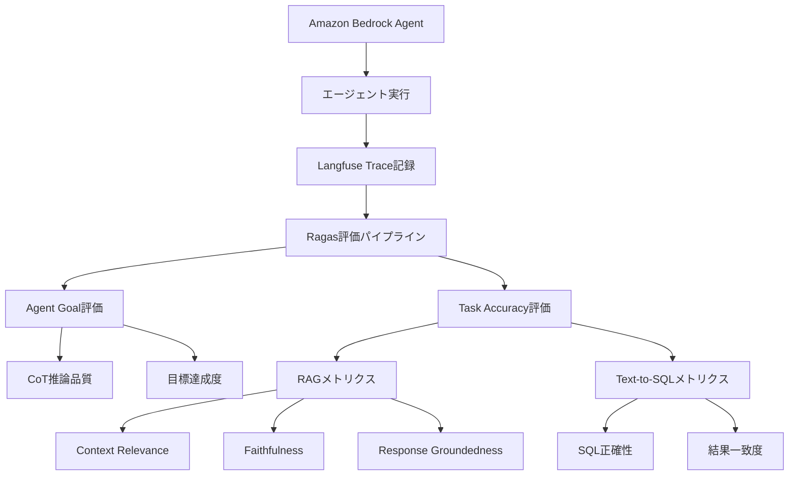
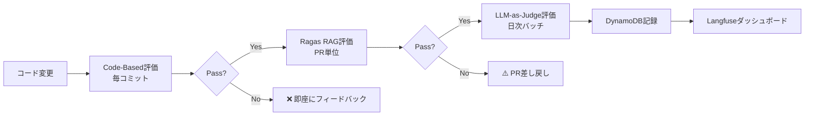

## ブログ概要（Summary）

AWSが公開した「Evaluate Amazon Bedrock Agents with Ragas and LLM-as-a-judge」は、**Amazon Bedrock上で動作するAIエージェントの品質を、RagasライブラリとLLM-as-a-Judge手法を用いて体系的に評価するフレームワーク**を解説した技術ブログである。エージェントの目標達成度（Chain-of-Thought評価）とタスク精度（RAG評価、Text-to-SQL評価）の2軸で評価メトリクスを定義し、Langfuseとの統合によるオブザーバビリティ、CI/CDパイプラインへの組み込みまでをカバーしている。Zenn記事で紹介されているModel-Basedグレーダー（LLM-as-Judge）の具体的な産業実装例として、極めて実践的な内容である。

この記事は [Zenn記事: AIエージェントのテスト戦略：pass@kとCI/CD統合で品質を自動保証する実践ガイド](https://zenn.dev/0h_n0/articles/f03733cd5ca3d9) の深掘りです。

## 情報源

- **種別**: 企業テックブログ
- **URL**: [https://aws.amazon.com/blogs/machine-learning/evaluate-amazon-bedrock-agents-with-ragas-and-llm-as-a-judge/](https://aws.amazon.com/blogs/machine-learning/evaluate-amazon-bedrock-agents-with-ragas-and-llm-as-a-judge/)
- **組織**: AWS Machine Learning Blog
- **発表日**: 2025年4月

## 技術的背景（Technical Background）

### エージェント評価の課題

Amazon Bedrock Agentsは、ナレッジベース（RAG）、アクショングループ（API呼び出し）、コードインタプリタを統合した自律的AIエージェントプラットフォームである。しかし、エージェントの品質を定量的に評価する標準的な手法が不足していた。

主な課題：

1. **多段階推論の評価**: エージェントはツール呼び出し→推論→応答の複数ステップを実行するが、各ステップの品質を個別に測定する必要がある
2. **RAG品質の保証**: 検索結果の関連性、応答の忠実性、根拠性を定量化する必要がある
3. **継続的評価**: モデル更新やプロンプト変更のたびに品質を自動検証する仕組みが必要

### Ragasフレームワーク

**Ragas (Retrieval Augmented Generation Assessment)** は、LLMアプリケーションのテスト・評価のためのオープンソースライブラリである。RAG、Text-to-SQL、Chain-of-Thoughtの各パイプラインに対する定量的メトリクスを提供する。



## 実装アーキテクチャ（Architecture）

### 評価パイプラインの全体構成

AWSが提案する評価フレームワークは、以下のコンポーネントで構成される：

| コンポーネント | 役割 | 技術スタック |
|-------------|------|-----------|
| **Bedrock Agent** | 評価対象のAIエージェント | Amazon Bedrock, Claude/Titan |
| **Langfuse** | トレース記録・可視化 | Langfuse OSS |
| **Ragas** | 評価メトリクス算出 | ragas Python library |
| **Step Functions** | 評価パイプラインオーケストレーション | AWS Step Functions |
| **DynamoDB** | 評価結果の永続化 | Amazon DynamoDB |
| **API Gateway** | 評価APIエンドポイント | Amazon API Gateway |

### 評価メトリクスの詳細

#### 1. Agent Goal（エージェント目標）メトリクス

全質問に対して実行される、エージェントの推論プロセス（Chain-of-Thought）の品質評価。

```python
"""Agent Goal評価の実装例

エージェントのChain-of-Thought推論をLLM-as-Judgeで評価する。
"""
from dataclasses import dataclass


@dataclass
class AgentGoalMetrics:
    """エージェント目標メトリクス

    Attributes:
        goal_achievement: 目標達成度 (0.0-1.0)
        reasoning_quality: 推論品質 (0.0-1.0)
        tool_selection_accuracy: ツール選択正確性 (0.0-1.0)
    """
    goal_achievement: float
    reasoning_quality: float
    tool_selection_accuracy: float

    @property
    def overall(self) -> float:
        """総合スコア"""
        return (
            self.goal_achievement * 0.5
            + self.reasoning_quality * 0.3
            + self.tool_selection_accuracy * 0.2
        )


def evaluate_agent_goal(
    question: str,
    agent_trace: dict,
    expected_goal: str,
    judge_model: str = "anthropic.claude-3-5-sonnet-20241022-v2:0",
) -> AgentGoalMetrics:
    """LLM-as-Judgeでエージェント目標を評価

    Args:
        question: ユーザーの質問
        agent_trace: エージェントの実行トレース（Langfuse形式）
        expected_goal: 期待される目標状態
        judge_model: 判定に使用するLLMモデルID

    Returns:
        目標達成度、推論品質、ツール選択正確性のスコア
    """
    # Chain-of-Thought抽出
    cot_steps = extract_cot_from_trace(agent_trace)

    # LLM-as-Judge呼び出し
    judge_prompt = f"""
    以下のエージェントの推論プロセスを評価してください。

    質問: {question}
    期待される目標: {expected_goal}

    エージェントの推論ステップ:
    {format_cot_steps(cot_steps)}

    以下の3つの観点で0.0-1.0のスコアを付けてください:
    1. goal_achievement: 目標が達成されたか
    2. reasoning_quality: 推論の論理性・効率性
    3. tool_selection_accuracy: 適切なツールが選択されたか

    JSON形式で回答してください。
    """

    result = invoke_bedrock(
        model_id=judge_model,
        prompt=judge_prompt,
    )

    return AgentGoalMetrics(**parse_json(result))
```

#### 2. Task Accuracy（タスク精度）メトリクス

使用されたツールに応じて実行される、特定タスクの精度評価。

##### RAG評価メトリクス

Ragasが提供する3つのコアメトリクスを使用：

**Context Relevance（コンテキスト関連性）:**

検索されたコンテキストがユーザーの質問にどの程度関連しているかを測定する。

$$
\text{Context Relevance} = \frac{|\text{Relevant Sentences in Context}|}{|\text{Total Sentences in Context}|}
$$

ここで、
- 分子: コンテキスト中で質問に関連する文の数
- 分母: コンテキスト中の全文数

**Faithfulness（忠実性）:**

生成された応答がコンテキストに対してどれだけ忠実か（幻覚がないか）を測定する。

$$
\text{Faithfulness} = \frac{|\text{Claims supported by Context}|}{|\text{Total Claims in Response}|}
$$

ここで、
- 分子: コンテキストで裏付けられる主張の数
- 分母: 応答中の全主張の数

**Response Groundedness（応答の根拠性）:**

応答の各主張がコンテキストによってどの程度支持されているかを測定する。

$$
\text{Groundedness} = \frac{1}{N}\sum_{i=1}^{N} \text{support}(c_i, \text{Context})
$$

ここで、
- $N$: 応答中の主張の数
- $c_i$: $i$番目の主張
- $\text{support}(c_i, \text{Context})$: コンテキストによる主張の支持度（0.0-1.0）

```python
"""Ragas RAG評価メトリクスの実装例"""
from ragas import evaluate
from ragas.metrics import (
    context_relevancy,
    faithfulness,
    answer_relevancy,
)
from ragas.llms import LangchainLLMWrapper
from langchain_aws import ChatBedrock


def evaluate_rag_response(
    question: str,
    answer: str,
    contexts: list[str],
    ground_truth: str | None = None,
) -> dict[str, float]:
    """Ragasを使用してRAG応答を評価

    Args:
        question: ユーザーの質問
        answer: エージェントの応答
        contexts: 検索されたコンテキスト群
        ground_truth: 正解（あれば）

    Returns:
        各メトリクスのスコア辞書
    """
    # Bedrock LLMをRagasのラッパーで使用
    bedrock_llm = LangchainLLMWrapper(
        ChatBedrock(
            model_id="anthropic.claude-3-5-sonnet-20241022-v2:0",
            region_name="us-east-1",
        )
    )

    # 評価データセットの構築
    eval_dataset = {
        "question": [question],
        "answer": [answer],
        "contexts": [contexts],
    }
    if ground_truth:
        eval_dataset["ground_truth"] = [ground_truth]

    # Ragas評価の実行
    result = evaluate(
        dataset=eval_dataset,
        metrics=[
            context_relevancy,
            faithfulness,
            answer_relevancy,
        ],
        llm=bedrock_llm,
    )

    return {
        "context_relevancy": result["context_relevancy"],
        "faithfulness": result["faithfulness"],
        "answer_relevancy": result["answer_relevancy"],
    }
```

##### Text-to-SQL評価メトリクス

| メトリクス | 測定対象 | 評価方法 |
|-----------|---------|---------|
| SQL正確性 | 生成SQLの構文・意味の正しさ | 正解SQLとの比較（実行結果一致） |
| 結果一致度 | クエリ結果の正確性 | 正解結果セットとの比較 |
| 実行成功率 | SQLが実行可能か | DBでの実行テスト |

### Langfuseとの統合

Langfuseは、LLMアプリケーションのオブザーバビリティプラットフォームであり、エージェントの実行トレースを記録・可視化する。

```python
"""Langfuse統合によるトレース記録の例"""
from langfuse import Langfuse


langfuse = Langfuse()


def evaluate_with_tracing(
    agent,
    test_cases: list[dict],
) -> list[dict]:
    """Langfuseトレース付きで評価を実行

    Args:
        agent: Bedrock Agent
        test_cases: テストケースのリスト

    Returns:
        トレースID付きの評価結果リスト
    """
    results: list[dict] = []

    for case in test_cases:
        # トレース開始
        trace = langfuse.trace(
            name=f"eval-{case['id']}",
            metadata={"test_case_id": case["id"]},
        )

        # エージェント実行
        response = agent.invoke(
            input_text=case["question"],
            trace_id=trace.id,
        )

        # RAG評価
        rag_scores = evaluate_rag_response(
            question=case["question"],
            answer=response["output"],
            contexts=response["contexts"],
            ground_truth=case.get("expected_answer"),
        )

        # Agent Goal評価
        goal_scores = evaluate_agent_goal(
            question=case["question"],
            agent_trace=response["trace"],
            expected_goal=case["expected_goal"],
        )

        # スコアをLangfuseに記録
        trace.score(name="faithfulness", value=rag_scores["faithfulness"])
        trace.score(name="context_relevancy", value=rag_scores["context_relevancy"])
        trace.score(name="goal_achievement", value=goal_scores.goal_achievement)

        results.append({
            "test_case_id": case["id"],
            "trace_id": trace.id,
            "rag_scores": rag_scores,
            "goal_scores": goal_scores.__dict__,
        })

    return results
```

## パフォーマンス最適化（Performance）

### 評価パイプラインの最適化

大規模な評価を効率的に実行するための最適化手法：

**並列評価**:

AWS Step Functionsを使用して、複数のテストケースを並列に評価する。

```python
"""並列評価のためのStep Functions定義（概念）"""

# Step Functions定義（JSON形式の概念表現）
parallel_evaluation = {
    "Type": "Map",
    "MaxConcurrency": 10,  # 最大10並列
    "Iterator": {
        "States": {
            "InvokeAgent": {"Type": "Task", "Resource": "bedrock:invoke"},
            "EvaluateRAG": {"Type": "Task", "Resource": "lambda:ragas_eval"},
            "EvaluateGoal": {"Type": "Task", "Resource": "lambda:goal_eval"},
            "StoreResult": {"Type": "Task", "Resource": "dynamodb:put"},
        }
    }
}
```

**コスト効率**:

| 評価方式 | 1000件あたりコスト | 所要時間 | 適用場面 |
|---------|------------------|---------|---------|
| Code-Based Only | ~$0 | ~1分 | CIの毎コミット |
| Ragas (Claude Haiku) | ~$5 | ~10分 | CIのPR単位 |
| Ragas (Claude Sonnet) | ~$25 | ~15分 | 日次バッチ |
| Full LLM-as-Judge | ~$50 | ~30分 | 週次/リリース前 |

### CI/CDパイプラインへの統合

AWSは、評価をCI/CDパイプラインに統合するための具体的なアーキテクチャを提案している：

```yaml
# AWS CodePipelineでのエージェント評価統合例
# buildspec.yml
version: 0.2
phases:
  install:
    commands:
      - pip install ragas langfuse boto3
  build:
    commands:
      # 1. 軽量Code-Based評価（毎コミット）
      - python eval/code_based_checks.py
      # 2. Ragas RAG評価（PR単位）
      - python eval/ragas_evaluation.py \
          --model-id $BEDROCK_MODEL_ID \
          --test-suite eval/test_cases.json \
          --threshold-faithfulness 0.8 \
          --threshold-relevancy 0.7
  post_build:
    commands:
      # 3. 結果をDynamoDBに保存
      - python eval/store_results.py
      # 4. 閾値チェック
      - python eval/check_thresholds.py || exit 1
```



## 運用での学び（Production Lessons）

### LLM-as-Judgeのキャリブレーション

LLM-as-Judgeの信頼性を担保するための実践的なアドバイス：

1. **人間アノテーションとの比較**: 最初の100件は人間専門家がアノテーションし、LLM-as-Judgeの結果と比較してキャリブレーション
2. **多数決**: 重要な判定は3回実行して多数決を取る（Anthropicの推奨と一致）
3. **ルブリックの構造化**: 自然言語でなく、明確な基準と段階を定義したルブリックを使用
4. **「Unknown」の逃げ道**: 判定困難なケースで無理に判定させない

### Ragasメトリクスの運用閾値

AWS公式の推奨閾値：

| メトリクス | 推奨閾値 | 警告閾値 | 用途 |
|-----------|---------|---------|------|
| Context Relevancy | ≥ 0.75 | ≥ 0.60 | RAG検索品質 |
| Faithfulness | ≥ 0.85 | ≥ 0.70 | 幻覚防止 |
| Answer Relevancy | ≥ 0.80 | ≥ 0.65 | 応答品質 |
| Goal Achievement | ≥ 0.90 | ≥ 0.75 | エージェント目標 |

### モニタリングとアラート

Langfuseダッシュボードを活用した継続的モニタリング：

- **Faithfulnessの急激な低下**: ナレッジベースの更新ミスを示唆
- **Context Relevancyの低下**: 検索インデックスの劣化を示唆
- **Goal Achievementの低下**: プロンプトやモデル変更の影響を示唆

## 学術研究との関連（Academic Connection）

AWSのフレームワークは、以下の学術研究の知見を産業実装に転換している：

| 学術概念 | 論文 | AWS実装 |
|---------|------|---------|
| LLM-as-Judge | Zheng et al., 2023 (MT-Bench) | Bedrock Model Evaluation |
| RAG評価メトリクス | Es et al., 2024 (Ragas) | Ragas統合評価 |
| エージェント評価 | Liu et al., 2023 (AgentBench) | Agent Goal評価 |
| オブザーバビリティ | - | Langfuse統合 |

Zenn記事で紹介されている**Model-Basedグレーダー**の概念は、AWSのLLM-as-Judge実装に直接対応している。特に：

- **Ragasのメトリクス**: Zenn記事の「LLM-as-Judgeでの意味的検証」の具体的実装
- **Agent Goal評価**: Zenn記事の「結果をグレーディングし、経路ではない」原則のAWS版
- **CI/CD統合**: Zenn記事のpytestとLangSmith統合と同等のAWSエコシステム版

### pass@kとの関連

Ragasメトリクスは、pass@kの「成功」の定義を精緻化する。従来のバイナリ成功判定の代わりに：

$$
\text{success}(t) = \begin{cases}
1 & \text{if } F(t) \geq \tau_F \land R(t) \geq \tau_R \land G(t) \geq \tau_G \\
0 & \text{otherwise}
\end{cases}
$$

ここで、
- $F(t)$: 試行 $t$ のFaithfulnessスコア
- $R(t)$: 試行 $t$ のContext Relevancyスコア
- $G(t)$: 試行 $t$ のGoal Achievementスコア
- $\tau_F, \tau_R, \tau_G$: 各メトリクスの閾値

この多基準成功定義を使ったpass@kは、単純なバイナリ判定よりも**実運用での品質要件に近い**。

## まとめと実践への示唆

AWSのBedrock Agent評価フレームワークは、**エージェント評価の学術的概念を産業グレードの実装に昇華**させた重要な事例である。

**主要なポイント：**

1. **2軸評価**: Agent Goal（推論品質）とTask Accuracy（RAG/SQL精度）の2軸で包括的に評価
2. **Ragasメトリクス**: Context Relevancy、Faithfulness、Response Groundednessの3指標でRAG品質を定量化
3. **LLM-as-Judge**: Claude/Titanを判定モデルとして使用し、人間アノテーションのコストを1/40に削減
4. **CI/CD統合**: Code-Based → Ragas → LLM-as-Judgeの段階的評価パイプライン
5. **Langfuseオブザーバビリティ**: トレース記録と継続的モニタリングでリアルタイム品質監視

**Zenn記事との対応：**
- Ragasメトリクス → Model-Basedグレーダーの産業実装
- CI/CD統合 → pytestとLangSmith統合のAWSエコシステム版
- 段階的評価 → 3種グレーダー（Code → Model → Human）の段階的適用

## 参考文献

- **Blog URL**: [https://aws.amazon.com/blogs/machine-learning/evaluate-amazon-bedrock-agents-with-ragas-and-llm-as-a-judge/](https://aws.amazon.com/blogs/machine-learning/evaluate-amazon-bedrock-agents-with-ragas-and-llm-as-a-judge/)
- **Ragas Documentation**: [https://docs.ragas.io/](https://docs.ragas.io/)
- **Bedrock Evaluations**: [https://aws.amazon.com/bedrock/evaluations/](https://aws.amazon.com/bedrock/evaluations/)
- **Langfuse**: [https://langfuse.com/](https://langfuse.com/)
- **Related Zenn article**: [https://zenn.dev/0h_n0/articles/f03733cd5ca3d9](https://zenn.dev/0h_n0/articles/f03733cd5ca3d9)
