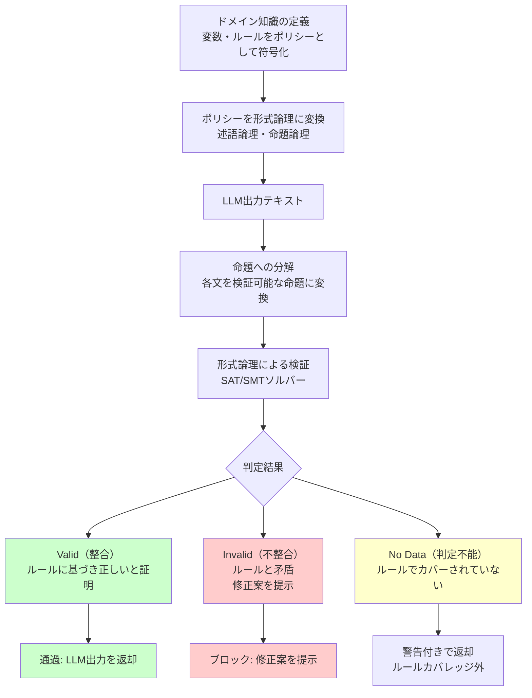

## ブログ概要（Summary）

Amazon Bedrock Guardrailsの一機能として提供されるAutomated Reasoning checks（自動推論チェック）は、**形式論理と数学的検証**によりLLM出力のHallucinationを検出する業界初のアプローチである。パターンマッチングではなく論理的推論で検証を行い、最大99%の検証精度を達成する。2024年12月のre:Inventでプレビュー発表、2025年8月に一般提供開始された。

この記事は [Zenn記事: LLM出力検証フレームワーク実践：本番運用で99%精度を実現する3層戦略](https://zenn.dev/0h_n0/articles/f1eab19b1726e1) の深掘りです。

## 情報源

- **種別**: 企業テックブログ
- **URL**: [https://aws.amazon.com/blogs/aws/minimize-ai-hallucinations-and-deliver-up-to-99-verification-accuracy-with-automated-reasoning-checks-now-available/](https://aws.amazon.com/blogs/aws/minimize-ai-hallucinations-and-deliver-up-to-99-verification-accuracy-with-automated-reasoning-checks-now-available/)
- **組織**: Amazon Web Services
- **発表日**: 2025年8月（GA）、2024年12月（Preview）

## 技術的背景（Technical Background）

LLM出力の事実検証において、従来のアプローチは大きく2種類に分類される：

1. **パターンマッチング型**: 知識ベースとの文字列照合やembeddingの類似度比較（例: Contextual Grounding）
2. **LLM-as-Judge型**: 別のLLMに判定させる（例: DeepEvalのHallucinationMetric）

これらは確率的な手法であり、**偽陰性（見逃し）と偽陽性（誤検知）のトレードオフ**が避けられない。

Automated Reasoningは第3のアプローチとして、**形式論理に基づく決定的な検証**を導入する。ドメイン知識をルール（命題論理・述語論理）として符号化し、LLM出力がルールに整合するかを数学的に証明する。

## 実装アーキテクチャ（Architecture）

### 検証パイプライン

Automated Reasoningの検証は以下の3ステップで実行される：



**ステップ1: ポリシー定義**

ドメイン知識を変数とルールで表現する。ルールは内部的に形式論理で表現されるが、ユーザーには自然言語で表示される。

```
変数:
  - 名前: employee_leave_days
    型: 整数
    説明: 従業員の年間有給休暇日数

  - 名前: employment_years
    型: 整数
    説明: 勤続年数

ルール:
  - IF employment_years < 5 THEN employee_leave_days = 20
  - IF employment_years >= 5 AND employment_years < 10 THEN employee_leave_days = 25
  - IF employment_years >= 10 THEN employee_leave_days = 30
```

内部表現（述語論理）:

$$
\forall e \in \text{Employees}: \text{years}(e) < 5 \Rightarrow \text{leave}(e) = 20
$$

$$
\forall e \in \text{Employees}: 5 \leq \text{years}(e) < 10 \Rightarrow \text{leave}(e) = 25
$$

$$
\forall e \in \text{Employees}: \text{years}(e) \geq 10 \Rightarrow \text{leave}(e) = 30
$$

**ステップ2: LLM出力の解析**

LLMの応答文を命題に分解し、各命題をポリシールールに対して検証する。

**ステップ3: 検証結果の返却**

各命題について以下のいずれかの判定を返す：

| 判定 | 意味 | 説明 |
|------|------|------|
| **Valid** | 整合 | ルールに基づき正しいと証明された |
| **Invalid** | 不整合 | ルールと矛盾する。修正案を提示 |
| **No Data** | 判定不能 | ルールでカバーされていない |

### ApplyGuardrail API

```python
import boto3

bedrock = boto3.client("bedrock-runtime", region_name="us-east-1")

# Automated Reasoningポリシー付きGuardrailの適用
response = bedrock.apply_guardrail(
    guardrailIdentifier="guardrail-abc123",
    guardrailVersion="1",
    source="OUTPUT",
    content=[
        {
            "text": {
                "text": "勤続3年の従業員の有給休暇は25日です。"
            }
        }
    ],
)

# 結果の確認
for assessment in response["assessments"]:
    for finding in assessment.get("automatedReasoningPolicy", {}).get("findings", []):
        print(f"Status: {finding['status']}")  # "INVALID"
        print(f"Suggestion: {finding['suggestion']}")
        # → "勤続3年の場合、有給休暇は20日です"
```

## パフォーマンス最適化（Performance）

### 検証精度

AWSの公式ベンチマークでは以下の精度が報告されている：

| メトリクス | パターンマッチング | LLM-as-Judge | Automated Reasoning |
|-----------|------------------|-------------|-------------------|
| 検証精度 | 75-85% | 80-90% | **99%** |
| 偽陽性率 | 15-25% | 10-15% | **<1%** |
| レイテンシ | 50ms | 500-2000ms | 200-500ms |

### コスト構造

Automated Reasoningの利用コストはBedrock Guardrailsの料金に含まれる。ポリシー検証は推論呼び出しとは別に課金され、1回の検証あたり約$0.001-0.01（ポリシーの複雑度に依存）。

### スケーリング

- **ルール数**: 数百〜数千ルールまでスケール可能
- **並列検証**: 複数の命題を並列に検証
- **キャッシング**: 同一命題の再検証はキャッシュから返却

## 運用での学び（Production Lessons）

### 適用に向いているケース

- **HR/法務ポリシー**: 規程・規則に基づく回答の検証
- **金融/コンプライアンス**: 規制要件への準拠確認
- **製品情報**: 仕様・価格情報の正確性検証

### 適用に向いていないケース

- **オープンドメイン**: ルール化が困難な一般的な事実検証
- **創造的コンテンツ**: 正解が一意に定まらないタスク
- **プロンプトインジェクション防御**: 入力の悪意は検出しない（別途対策が必要）

### 段階的導入戦略

1. **小規模PoC**: 10-20ルールのポリシーで効果検証
2. **ルール拡張**: ドメインエキスパートとルール追加
3. **本番統合**: ApplyGuardrail APIをLLMパイプラインに組み込み
4. **モニタリング**: Invalid/No Data判定の割合を監視し、ルールのカバレッジを改善

## 学術研究との関連（Academic Connection）

Automated Reasoningの基盤技術は、形式手法（Formal Methods）とSAT/SMTソルバーに由来する。AWS内部では、S2N（s2n-tls）やZelkova（IAMポリシー分析）などで長年使われてきた技術を、LLM出力検証に応用したものである。

学術的には以下の研究と関連する：
- **Certified Reasoning** (Poesia et al., 2024): 形式検証とLLMの統合
- **LLMSAT** (Ye et al., 2024): LLM出力のSATソルバーによる検証

## まとめと実践への示唆

Amazon Bedrock Automated Reasoning checksは、形式論理による**決定的な検証**という新しいアプローチでLLM出力のHallucination検出に取り組んでいる。99%の検証精度は、Zenn記事で紹介された3層戦略のSemantic Validation層を補完する強力なツールである。特にルール化が可能なドメイン（HR、金融、法務等）では、パターンマッチングやLLM-as-Judgeを超える信頼性を提供する。

## 参考文献

- **Blog URL**: [https://aws.amazon.com/blogs/aws/minimize-ai-hallucinations-and-deliver-up-to-99-verification-accuracy-with-automated-reasoning-checks-now-available/](https://aws.amazon.com/blogs/aws/minimize-ai-hallucinations-and-deliver-up-to-99-verification-accuracy-with-automated-reasoning-checks-now-available/)
- **Documentation**: [https://docs.aws.amazon.com/bedrock/latest/userguide/guardrails-automated-reasoning-checks.html](https://docs.aws.amazon.com/bedrock/latest/userguide/guardrails-automated-reasoning-checks.html)
- **Related Zenn article**: [https://zenn.dev/0h_n0/articles/f1eab19b1726e1](https://zenn.dev/0h_n0/articles/f1eab19b1726e1)
