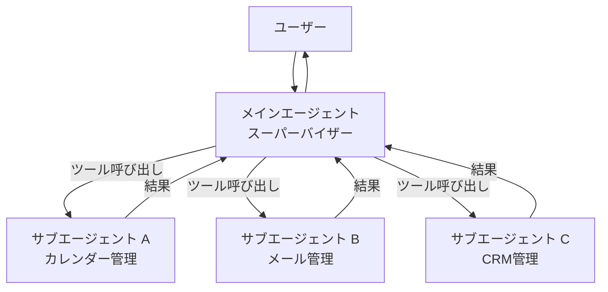
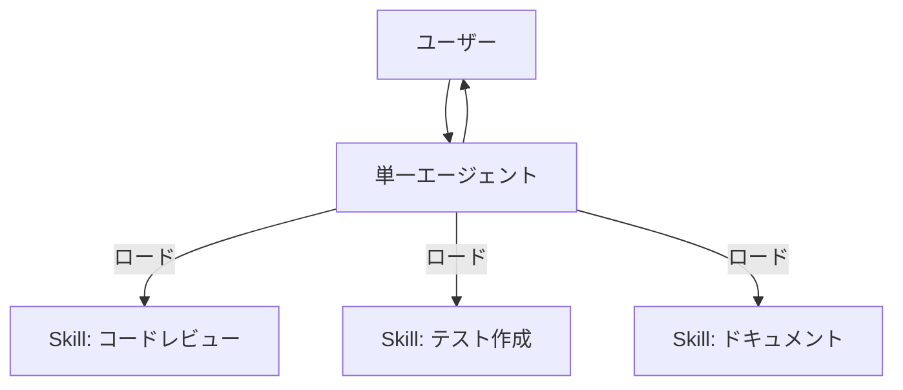
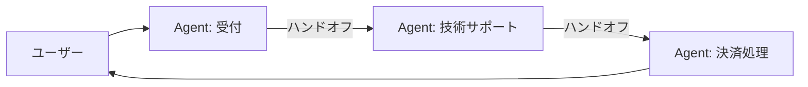
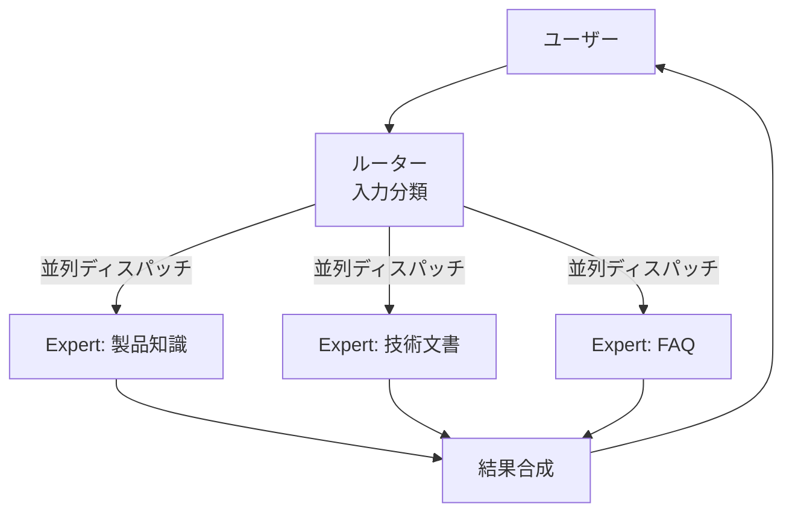

## ブログ概要（Summary）

LangChainのSydney Runkleが2026年1月に公開した「Choosing the Right Multi-Agent Architecture」は、マルチエージェントシステムの4つのアーキテクチャパターン — **Subagents**、**Skills**、**Handoffs**、**Router** — を体系的に比較分析した記事である。各パターンの強み・弱み・適用場面を明確に定義し、実装時のトレードオフ（モデル呼び出し数、トークン消費、コンテキスト管理）を定量的に比較している。

この記事は [Zenn記事: Claude Octopus: 複数AIを並列実行するオーケストレーションプラグイン](https://zenn.dev/0h_n0/articles/c01f4e292ff1a7) の深掘りです。Claude Octopusは複数のパターンを組み合わせたハイブリッドアプローチを採用しており、本記事の分類フレームワークを使ってClaude Octopusの設計を分析します。

## 情報源

- **種別**: 企業テックブログ（LangChain）
- **URL**: [https://blog.langchain.com/choosing-the-right-multi-agent-architecture/](https://blog.langchain.com/choosing-the-right-multi-agent-architecture/)
- **組織**: LangChain
- **発表日**: 2026年1月14日
- **著者**: Sydney Runkle

## 技術的背景（Technical Background）

マルチエージェントシステムへの移行は、単一エージェントが以下の限界に直面したときに検討される：

1. **コンテキスト管理の限界**: 各機能に必要な専門知識が単一プロンプトに収まらない
2. **分散開発の必要性**: チームが独立して各機能を開発・テスト・デプロイしたい

ただし、LangChainは「**単一エージェント → ツール追加 → マルチエージェント**」という段階的な移行を推奨している。Anthropicのリサーチでも、Claude Opus 4をリーダー、Claude Sonnet 4をサブエージェントとするマルチエージェント構成が単一のClaude Opus 4を90.2%上回ったことが報告されており、適切なアーキテクチャ選択の重要性が裏付けられている。

## 4つのアーキテクチャパターン

### パターン1: Subagents（サブエージェント）

**概要**: スーパーバイザーエージェントが専門化されたサブエージェントをツールとして呼び出す。メインの会話コンテキストを維持しつつ、サブエージェントはステートレスに実行される。



**特徴**:
- **中央集権的制御**: スーパーバイザーが全体の流れを管理
- **並列実行**: 独立したサブエージェントは同時実行可能
- **コンテキスト分離**: サブエージェント間でコンテキストが漏れない
- **分散開発**: チームが独立して各サブエージェントを開発可能

**トレードオフ**: サブエージェントの結果は必ずメインエージェントを経由するため、1リクエストあたり最低4回のモデル呼び出し（メイン→サブ→サブ結果→メイン応答）が必要。

**適用場面**: パーソナルアシスタント（カレンダー/メール/CRM）、ドメインエキスパートによるリサーチシステム

**実装例**:

```python
from typing import Any

class SubagentOrchestrator:
    """Subagentsパターンの実装

    メインエージェントがサブエージェントをツールとして呼び出す。
    サブエージェントはステートレスに実行され、
    結果はメインエージェントに返される。

    Args:
        main_model: メインエージェント用のLLM
        subagents: サブエージェントの辞書
    """
    def __init__(
        self,
        main_model: str,
        subagents: dict[str, "SubAgent"]
    ):
        self.main_model = main_model
        self.subagents = subagents
        self.conversation_history: list[dict] = []

    async def run(self, user_input: str) -> str:
        """ユーザー入力を処理

        Args:
            user_input: ユーザーのメッセージ

        Returns:
            最終応答
        """
        self.conversation_history.append({
            "role": "user",
            "content": user_input
        })

        # メインエージェントがツール選択
        tool_calls = await self._plan(user_input)

        # サブエージェントを並列実行
        import asyncio
        results = await asyncio.gather(*[
            self.subagents[call["name"]].execute(call["args"])
            for call in tool_calls
        ])

        # メインエージェントが結果を統合
        response = await self._synthesize(results)
        return response
```

### パターン2: Skills（スキル）

**概要**: 単一のエージェントが動的にスキル（専門プロンプト + 知識）をロードし、異なるペルソナを切り替える。複数のエージェントインスタンスは不要。



**特徴**:
- **軽量**: 追加のエージェントインスタンスが不要
- **ユーザーとの直接対話**: スキル切り替え中もユーザーと直接やり取り
- **Progressive Disclosure**: 必要なスキルのみをオンデマンドでロード

**トレードオフ**: スキルがロードされるたびにコンテキストに蓄積される。マルチドメインクエリでは最大15,000トークンに膨らむことがある。

**適用場面**: コーディングエージェント、クリエイティブアシスタント、単一エージェントで複数の専門性が必要な場合

**パフォーマンス比較**:

| シナリオ | モデル呼び出し数 | トークン消費 |
|---------|----------------|-------------|
| 単一リクエスト | 3回 | ~6K |
| リピートリクエスト | 2回（40%削減） | ~4K |
| マルチドメインクエリ | 3回 | ~15K（コンテキスト蓄積） |

### パターン3: Handoffs（ハンドオフ）

**概要**: アクティブなエージェントがツール呼び出しを通じて別のエージェントに制御を移譲する。状態は自然に引き継がれる。



**特徴**:
- **逐次的ワークフロー**: ステージ間の自然な遷移
- **状態の引き継ぎ**: 前のエージェントのコンテキストが次のエージェントに渡る
- **直接対話**: 現在アクティブなエージェントがユーザーと直接やり取り

**トレードオフ**: ステートフルな設計のため、状態管理が複雑になる。並列実行には不向き。マルチドメインクエリでは7回以上のモデル呼び出しが必要。

**適用場面**: マルチステージカスタマーサポート、前提条件のある逐次的会話フロー

### パターン4: Router（ルーター）

**概要**: ルーティングステップが入力を分類し、専門エージェントに振り分け、結果を合成する。



**特徴**:
- **高並列性**: 独立したエキスパートを同時実行
- **ステートレス**: リクエストごとに完結（一貫した性能）
- **明確な分離**: 各エキスパートが独立した知識ドメインを管理

**トレードオフ**: ステートレスのため、会話履歴が必要な場合はリクエストごとにルーティングのオーバーヘッドが発生。

**適用場面**: エンタープライズナレッジベース、マルチバーティカルカスタマーサポート、並列マルチソースクエリ

## パターン選択フレームワーク

### 定量比較

| 要件 | Subagents | Skills | Handoffs | Router |
|------|-----------|--------|----------|--------|
| 並列実行 | ★★★★★ | ★★☆☆☆ | ★☆☆☆☆ | ★★★★★ |
| 逐次ワークフロー | ★★★☆☆ | ★★★☆☆ | ★★★★★ | ★★☆☆☆ |
| コンテキスト分離 | ★★★★★ | ★★☆☆☆ | ★★★☆☆ | ★★★★★ |
| 直接対話 | ★★★☆☆ | ★★★★★ | ★★★★★ | ★★☆☆☆ |
| 分散開発 | ★★★★★ | ★★★★☆ | ★★★☆☆ | ★★★★★ |
| 状態管理の簡素さ | ★★★★☆ | ★★★☆☆ | ★★☆☆☆ | ★★★★★ |

### シナリオ別モデル呼び出し数

| シナリオ | Subagents | Skills | Handoffs | Router |
|---------|-----------|--------|----------|--------|
| 単一リクエスト | 4回 | 3回 | 3回 | 3回 |
| リピートリクエスト | 4回 | 2回 | 2回 | 3回 |
| マルチドメインクエリ | 5回 | 3回 | 7回+ | 5回 |

Skills と Handoffs はリピートリクエストで40%の効率改善を示す（状態保持の恩恵）。一方、Subagents と Router はマルチドメインクエリで並列実行により効率的（~9Kトークン vs Skills の ~15K）。

### 決定木

```
タスクの性質は？
├── 複数の独立ドメイン + 並列実行が重要
│   ├── 中央集権的制御が必要 → Subagents
│   └── ステートレスで一貫した性能が重要 → Router
├── 単一エージェントで複数の専門性
│   └── → Skills
└── 逐次的なワークフロー（状態遷移）
    └── → Handoffs
```

## Claude Octopusのアーキテクチャ分析

LangChainの4パターン分類を使って、Claude Octopusの設計を分析する：

### Claude Octopusが採用するパターン

Claude Octopusは**ハイブリッドアーキテクチャ**であり、複数のパターンを組み合わせている：

| 機能 | 対応パターン | 理由 |
|------|------------|------|
| 3プロバイダ並列実行（Codex/Gemini/Claude） | **Router** | 独立したAIに並列ディスパッチ |
| 29種類のペルソナ自動選択 | **Skills** | 意図検知でスキルをロード |
| Double Diamond 4フェーズ | **Handoffs** | Discover→Define→Develop→Deliver |
| `/octo:embrace` フルライフサイクル | **Subagents** | Orchestratorが各フェーズを制御 |

### 最適化の余地

LangChainの定量比較に基づくと：

1. **トークン効率**: Skillsパターンの部分（ペルソナロード）でコンテキスト蓄積が問題になる可能性。29ペルソナすべてをロードせず、上位3-5に絞ることで改善
2. **並列実行の活用**: Router + Subagentsの組み合わせにより、3プロバイダの並列実行とフェーズ内の並列実行を両立可能
3. **状態管理**: Handoffsパターン（Double Diamond）では状態管理が複雑になる。`.octo/STATE.md`による永続化は良い設計だが、各フェーズ間の明示的な状態スキーマの定義が推奨される

## 実運用への応用（Practical Applications）

### パターン選択のガイドライン

**プロトタイプ段階**:
- 最初は**Skills**パターン（単一エージェント + スキルロード）で開始
- 複雑さが増したら**Subagents**に移行

**プロダクション段階**:
- **Router**パターンでユーザーリクエストを分類・振り分け
- 各ドメイン内で**Subagents**が専門的なタスクを処理
- 逐次ワークフロー（サポートフロー等）には**Handoffs**を併用

### Deep Agents: 実用的な統合パターン

LangChainは**Deep Agents**という実装を紹介している。これはSubagents + Skillsの組み合わせで、即座に利用可能なマルチエージェントフレームワークを提供する。Claude Octopusのように、複数パターンの統合が実用的なマルチエージェントシステムの鍵となる。

## 学術研究との関連（Academic Connection）

- **Mixture-of-Agents (Wang et al., 2024)**: 階層的なLLM協調。Subagentsパターンの理論的基盤
- **Magentic-One (Fourney et al., 2024)**: Orchestrator + 専門エージェント。Subagentsパターンの実装例
- **ToolOrchestra (Diao et al., 2025)**: RL訓練された小型オーケストレータ。Routerパターンの高度な実装
- **Evolving Orchestration (Dang et al., 2025)**: 動的なエージェント指揮。Handoffsパターンの進化形

これら4つの研究は、LangChainの4パターンにそれぞれ対応しており、理論と実践が収束していることを示している。

## まとめと実践への示唆

LangChainの4パターン分類は、マルチエージェントアーキテクチャの選択を体系化する実用的なフレームワークである。重要なポイントは：

1. **単一パターンに固執しない**: Claude Octopusのように複数パターンの組み合わせが最も効果的
2. **段階的に複雑さを増す**: Single Agent → Skills → Subagents/Router の順で移行
3. **定量的にトレードオフを評価**: モデル呼び出し数とトークン消費で比較

マルチAIオーケストレーションの設計者にとって、この4パターンは「どのアーキテクチャをいつ使うか」の意思決定を支援する強力なツールとなる。

## 参考文献

- **Blog URL**: [https://blog.langchain.com/choosing-the-right-multi-agent-architecture/](https://blog.langchain.com/choosing-the-right-multi-agent-architecture/)
- **LangGraph**: [https://langchain-ai.github.io/langgraph/](https://langchain-ai.github.io/langgraph/)
- **Anthropic Multi-Agent Research**: Claude Opus 4 + Sonnet 4 構成で単体比90.2%改善
- **Related Zenn article**: [https://zenn.dev/0h_n0/articles/c01f4e292ff1a7](https://zenn.dev/0h_n0/articles/c01f4e292ff1a7)
