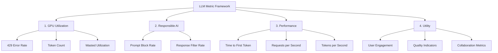
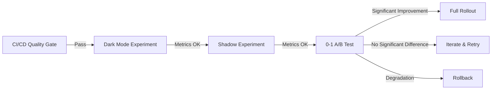

## ブログ概要（Summary）

Microsoft ResearchのExperimentation Platform（ExP）チームが2023年9月に発表した技術記事で、**LLM機能の評価に必要なメトリクスを4カテゴリ**に体系化したフレームワークを提唱している。従来のA/Bテストに加え、LLM特有の評価軸（GPU利用率、Responsible AI、ストリーミング性能、ユーティリティ）を統合し、本番環境でのLLM機能の導入判断を支援する。Shadow実験やDark Mode実験といった低リスクな段階的ロールアウト手法も含まれており、CI/CDパイプラインの品質ゲートとしてだけでなく、**プロダクション環境でのLLM評価の全体像**を把握できる内容となっている。

この記事は [Zenn記事: LLMアプリのCI/CDパイプライン構築：Promptfoo×GitHub Actionsで品質を自動検証する](https://zenn.dev/0h_n0/articles/75c05ecd0ff579) の深掘りです。

## 情報源

- **種別**: 企業テックブログ（Microsoft Research）
- **URL**: [https://microsoft.com/en-us/research/group/experimentation-platform-exp/articles/how-to-evaluate-llms-a-complete-metric-framework](https://microsoft.com/en-us/research/group/experimentation-platform-exp/articles/how-to-evaluate-llms-a-complete-metric-framework)
- **組織**: Microsoft Experimentation Platform（ExP）
- **著者**: Widad Machmouchi, Somit Gupta
- **発表日**: 2023年9月27日

## 技術的背景（Technical Background）

LLMを本番プロダクトに統合する際の評価は、オフライン評価（ベンチマーク）とオンライン評価（A/Bテスト）の2フェーズに分かれる。Zenn記事で解説したPromptfoo統合は主にオフライン評価（CI/CDパイプライン内でのスコア検証）を対象としていたが、Microsoftのフレームワークはオンライン評価、すなわち**実ユーザーにLLM機能を展開した後のメトリクス測定**をカバーする。

両者は排他的ではなく、CI/CDパイプラインのオフライン品質ゲートをクリアした後、オンライン実験でビジネスインパクトを検証する — というのがプロダクションLLMの標準的なリリースフローである。

学術的には、このフレームワークはControlled Experiment（A/Bテスト）の方法論をLLMに適用したものである。Microsoftは自社プロダクト（Bing, Copilot, Teams等）で年間数万件のA/Bテストを実行しており、その知見がLLM評価に適用されている。

## 4カテゴリ・メトリクスフレームワーク

Microsoftのフレームワークは、LLM評価メトリクスを以下の4カテゴリに分類する：



### カテゴリ1: GPU利用率メトリクス

LLM推論のコスト効率を測定するメトリクス群。API呼び出しあたりのコストがCI/CDパイプラインの予算に直結する。

| メトリクス | 定義 | CI/CDへの示唆 |
|-----------|------|-------------|
| **429エラー率** | レート制限に達した比率（P90/P95） | CI実行の並列度制限の根拠 |
| **総トークン数** | プロンプト + 完了トークンの合計 | コスト見積もりの基礎 |
| **プロンプトトークン** | 入力トークン数 | プロンプト最適化の指標 |
| **完了トークン** | 出力トークン数（最大コストドライバー） | 出力長制限の根拠 |
| **無駄な利用率** | 非アクション応答に消費されたGPU | 品質ゲートの設計根拠 |
| **切り詰め発生率** | レスポンスが途中で切断された比率 | max_tokens設定の調整指標 |

**数理的モデル**:

LLMの推論コストは、トークン消費量に比例する：

$$
C_{\text{inference}} = C_{\text{prompt}} \cdot N_{\text{prompt}} + C_{\text{completion}} \cdot N_{\text{completion}}
$$

ここで、
- $C_{\text{prompt}}$: プロンプトトークンあたりの単価（例: $0.01/1Kトークン）
- $N_{\text{prompt}}$: プロンプトトークン数
- $C_{\text{completion}}$: 完了トークンあたりの単価（例: $0.03/1Kトークン）
- $N_{\text{completion}}$: 完了トークン数

CI/CDにおけるコスト最適化では、$N_{\text{prompt}}$ の削減（差分のみを入力する、不要なコンテキストを除去する）が最も効果的である。Zenn記事のPromptfoo設定で `cost` 閾値（`threshold: 0.01`）を設定していたのは、このメトリクスに基づく品質ゲートの一例である。

### カテゴリ2: Responsible AI（RAI）メトリクス

LLMの安全性とコンテンツポリシー遵守を測定する。

**プロンプトブロック率**: コンテンツフィルタリングによりHTTP 400エラーが返された比率。高すぎる場合、正当なリクエストが誤ブロックされている可能性がある。低すぎる場合、フィルタリングが不十分な可能性がある。

$$
R_{\text{block}} = \frac{N_{\text{400}}}{N_{\text{total}}} \times 100\%
$$

**レスポンスフィルタ率**: 生成後のコンテンツフィルタリングでブロックされた比率。プロンプトレベルでは通過したが、出力レベルで安全でないと判定されたケースを測定する。

CI/CDの文脈では、Promptfooの`llm-rubric`アサーションに「安全性基準を満たしているか」を追加することで、同等の検証が可能である。Zenn記事で触れたLayer 3（Red teaming）のメトリクス化に相当する。

### カテゴリ3: パフォーマンスメトリクス

ユーザー体験に直結するレイテンシとスループットの指標。

**Time to First Token (TTFT)**: リクエスト送信からストリーミングの最初のトークンが返るまでの時間。P50/P90/P95で測定する。

$$
\text{TTFT}_{p95} = \text{Percentile}_{95}\left(\{t_{\text{first\_token}}^{(i)} - t_{\text{request}}^{(i)}\}_{i=1}^{N}\right)
$$

この指標はCI/CDパイプラインでは `latency` 閾値（Zenn記事の`threshold: 5000`）に直結する。TTFT P95が5秒を超える場合、ユーザー体験が劣化している可能性が高い。

**Requests per Second (RPS)**: 単位時間あたりの処理リクエスト数。スケーリングの基準となる。

**Tokens per Second (TPS)**: ストリーミング中のトークン生成速度。ユーザーが「待たされている」と感じるかどうかの指標。

### カテゴリ4: ユーティリティメトリクス

LLM機能がユーザーに実際の価値を提供しているかを測定する最も重要なカテゴリ。

#### ユーザーエンゲージメント指標

```python
@dataclass
class UtilityMetrics:
    """ユーティリティメトリクスの定義

    LLM機能がユーザーに提供する価値を測定する。
    """
    # Prompt-Response ファネル
    prompt_submission_rate: float  # プロンプト送信率
    response_view_rate: float     # レスポンス閲覧率
    response_action_rate: float   # レスポンスに基づくアクション率

    # 品質インジケータ
    avg_prompt_length: float      # 平均プロンプト長
    avg_response_length: float    # 平均レスポンス長
    edit_distance: float          # ユーザー編集距離（低いほど品質が高い）

    # フィードバック
    thumbs_up_rate: float         # 高評価率
    thumbs_down_rate: float       # 低評価率

    # リテンション
    daily_active_users: int       # DAU
    retention_7d: float           # 7日リテンション率
```

**プロンプト-レスポンスファネル**は、LLM機能の利用度を段階的に測定する。「プロンプト送信→レスポンス閲覧→アクション実行」の各段階での離脱率を分析することで、ボトルネックを特定できる。

**編集距離**（Edit Distance）は、LLMのレスポンスをユーザーがどれだけ修正したかの指標である。コード補完やドキュメント生成の文脈で有用であり、編集距離が小さいほどLLMの出力品質が高いことを意味する。

$$
d_{\text{edit}} = \frac{\text{Levenshtein}(r_{\text{LLM}}, r_{\text{final}})}{\max(|r_{\text{LLM}}|, |r_{\text{final}}|)}
$$

ここで $r_{\text{LLM}}$ はLLMの出力、$r_{\text{final}}$ はユーザーが最終的に採用したテキストである。

## 実験デザインパターン

Microsoftのフレームワークでは、LLM機能のロールアウトに4種類の実験デザインを推奨している：

### パターン1: Dark Mode実験

LLM推論を実行するが、結果をユーザーには表示しない。バックエンドの性能検証（レイテンシ、コスト、エラー率）に使用する。CI/CDパイプラインでの**ステージング環境テスト**に相当する。

### パターン2: 0-1実験

機能のON/OFFで比較するA/Bテスト。LLM機能がない場合（Control）とある場合（Treatment）の差分を測定する。

### パターン3: Shadow実験

本番トラフィックのコピーをLLM機能に流し、結果を記録するが表示しない。Dark Mode実験の拡張版で、実際のユーザーリクエストパターンでの性能を検証できる。

### パターン4: 1-N実験

複数のLLM設定（異なるモデル、プロンプト、パラメータ）を同時にテストする標準的なA/Bテスト。Promptfooの「複数プロバイダ比較」機能と同等だが、オンライン（実ユーザートラフィック）で実施する点が異なる。



## CI/CDパイプラインとの統合

Microsoftのメトリクスフレームワークは、Zenn記事の3層評価アーキテクチャと以下のように対応する：

| Zenn記事の評価層 | Microsoftメトリクスカテゴリ | 実行タイミング |
|----------------|--------------------------|-------------|
| Layer 1: 静的検証 | GPU利用率（トークン数、コスト） | PR毎（CI） |
| Layer 2: LLM評価 | パフォーマンス（TTFT, TPS） | PR毎（CI） |
| Layer 3: Red teaming | RAI（ブロック率、フィルタ率） | 週次バッチ |
| — | ユーティリティ（エンゲージメント、リテンション） | 本番デプロイ後（CD） |

**重要な示唆**: Zenn記事のCI/CDパイプラインは Layer 1〜3（デプロイ前評価）をカバーしているが、Microsoftのフレームワークはさらに**デプロイ後のユーティリティ評価**を体系化している。完全なLLMOpsパイプラインには、この「デプロイ後メトリクス」の追加が不可欠である。

## 運用での学び（Production Lessons）

### 教訓1: メトリクスの優先順位

4カテゴリは以下の優先順位で監視すべきである：
1. **RAIメトリクス**: 安全性の問題は即座にブロックする（P0）
2. **パフォーマンスメトリクス**: レイテンシ劣化はUXに直結（P1）
3. **GPU利用率**: コスト超過は中長期的なリスク（P2）
4. **ユーティリティ**: ビジネスインパクトは最も重要だが、測定に時間がかかる

### 教訓2: 統計的検出力

LLMの出力は高分散であるため、A/Bテストで統計的に有意な差を検出するには、従来のUI変更テストよりも**大きなサンプルサイズ**が必要となる。分散 $\sigma^2$ が大きいと、最小検出可能効果サイズ（MDE）も大きくなる：

$$
N_{\text{sample}} = \frac{2(z_{\alpha/2} + z_{\beta})^2 \sigma^2}{\text{MDE}^2}
$$

### 教訓3: 「無駄な利用率」の重要性

LLMが生成したが、ユーザーが採用しなかった（またはシステムが破棄した）出力に費やされたGPUリソースを追跡する。このメトリクスが高い場合、プロンプトの最適化またはフィルタリングの強化が必要である。

## 学術研究との関連（Academic Connection）

- **Controlled Experiments on the Web** (Kohavi et al., 2009): オンラインA/Bテストの基礎理論。Microsoftのフレームワークはこの方法論のLLM拡張
- **Trustworthy Online Controlled Experiments** (Kohavi, Tang, Xu, 2020): ExPチームの書籍で、本フレームワークの理論的基盤を詳述
- **PromptBench** (Zhu et al., 2023): オフライン評価ベンチマーク。Microsoftのオンラインメトリクスと相補的に使用

## まとめと実践への示唆

Microsoftのメトリクスフレームワークは、CI/CDパイプラインの品質ゲート（Zenn記事の範囲）から本番環境でのA/Bテストまで、**LLM評価の全ライフサイクル**をカバーする体系的なアプローチを提供する。

実務への最も重要な示唆は、**CI/CDでの評価だけでは不十分**ということである。デプロイ前のオフライン評価（Promptfoo, PromptBench）とデプロイ後のオンライン評価（A/Bテスト、ユーティリティメトリクス）を組み合わせた2段階評価が、プロダクションLLMアプリケーションの品質保証の完全な形である。

特に「無駄な利用率」と「編集距離」は、既存の評価フレームワーク（Promptfoo, DeepEval等）にはない独自のメトリクスであり、プロダクション環境でのLLM価値測定に不可欠な指標である。

## 参考文献

- **Blog URL**: [https://microsoft.com/en-us/research/group/experimentation-platform-exp/articles/how-to-evaluate-llms-a-complete-metric-framework](https://microsoft.com/en-us/research/group/experimentation-platform-exp/articles/how-to-evaluate-llms-a-complete-metric-framework)
- **Related Papers**: Kohavi, Tang, Xu, "Trustworthy Online Controlled Experiments" (Cambridge University Press, 2020)
- **Related Zenn article**: [https://zenn.dev/0h_n0/articles/75c05ecd0ff579](https://zenn.dev/0h_n0/articles/75c05ecd0ff579)
- **RELEVANCE Framework**: [https://www.microsoft.com/en-us/research/project/relevance-automatic-evaluation-framework-for-llm-responses/](https://www.microsoft.com/en-us/research/project/relevance-automatic-evaluation-framework-for-llm-responses/)
