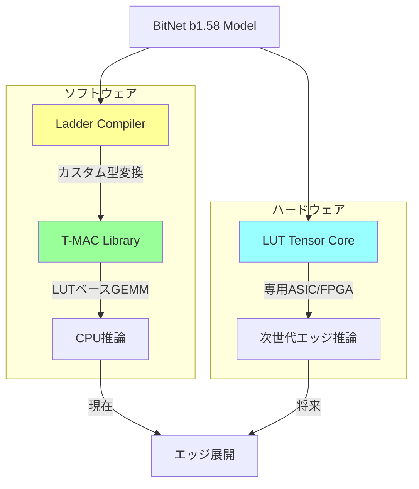

## ブログ概要（Summary）

Microsoft Researchは2025年2月、エッジデバイスでのLLM推論を可能にする3つの技術的ブレークスルーを発表した。(1) **T-MAC**: ビット単位LUT参照による混合精度GEMMライブラリで、llama.cpp比4-5倍高速化、(2) **LUT Tensor Core**: 従来のTensor Coreの38.3%の面積で6.93倍の推論速度を実現する専用ハードウェア設計、(3) **Ladder**: カスタムデータ型をハードウェア互換型に自動変換するコンパイラ。Surface Laptop 7上でBitNet b1.58 3Bモデルが48トークン/秒で動作するデモンストレーションも公開された。

この記事は [Zenn記事: 1-bit LLM入門：BitNet b1.58でGPU不要のLLM推論を実現する実践ガイド](https://zenn.dev/0h_n0/articles/0f6d388e314d70) の深掘りです。

## 情報源

- **種別**: 企業テックブログ
- **URL**: [Advances to low-bit quantization enable LLMs on edge devices - Microsoft Research](https://www.microsoft.com/en-us/research/blog/advances-to-low-bit-quantization-enable-llms-on-edge-devices/)
- **組織**: Microsoft Research（Shijie Cao, Lingxiao Ma, Ting Cao）
- **発表日**: 2025年2月5日

## 技術的背景（Technical Background）

### エッジLLM推論の課題

LLMをエッジデバイス（スマートフォン、ラップトップ、IoTデバイス）で推論するには、以下の制約を同時に満たす必要がある：

1. **メモリ制約**: 7BモデルのFP16推論には14GBのメモリが必要。一般的なラップトップのRAM（16GB）ではOSとの共存が困難
2. **演算能力制約**: エッジCPU/NPUの演算性能はGPUの1/10以下。レイテンシを許容範囲（<100ms/トークン）に収めるには演算量の大幅削減が必要
3. **電力制約**: モバイルデバイスのTDP（熱設計電力）は15-45W。GPU推論の消費電力（200-400W）とは桁違いの制約

低ビット量子化はこれら3つの制約を同時に緩和する手法である。特にBitNet b1.58の三値重み（1.58ビット/重み）は理論上FP16比で**10倍のメモリ削減**と**行列積の乗算排除**を実現する。しかし、この理論的利点を実際のハードウェアで引き出すには、ソフトウェアスタックからハードウェアまでの全レイヤーでの最適化が必要となる。

MSRのブログは、この全レイヤー最適化を3つの技術で実現したことを報告している。

## 実装アーキテクチャ（Architecture）

### 1. T-MAC: ビット単位LUT参照によるCPU推論高速化

T-MAC（Table-based MAC）は、低ビット量子化モデルの混合精度GEMM（General Matrix Multiply）をLUT参照で実行するCPUライブラリである。

**従来のGEMM**では、8ビット活性化 $x$ と $W$ビット重み $w$ の積を直接計算する：

$$
y = \sum_{i} x_i \cdot w_i
$$

**T-MACの手法**では、重み $w$ をビット分解し、各ビット位置ごとにLUT参照で部分和を計算する：

$$
w = \sum_{b=0}^{B-1} 2^b \cdot w^{(b)}, \quad w^{(b)} \in \{0, 1\}
$$

各ビット位置 $b$ について、$w^{(b)}$ の値（0または1）に基づいて活性化のグループ和を LUT から参照する：

$$
y = \sum_{b=0}^{B-1} 2^b \cdot \text{LUT}[w^{(b)}_{\text{group}}]
$$

ここで LUT のエントリは活性化のグループ和 $\sum_{i \in \text{group}} x_i$ を事前計算したものである。

**三値重み（BitNet b1.58）の場合**: $B = 2$（2ビット表現）であるため、LUT参照は2回のみで完結する。4ビット量子化では4回、8ビットでは8回となる。三値が最も効率的なのはこのためである。

```python
import numpy as np
from typing import Optional

def t_mac_ternary_gemm(
    x: np.ndarray,
    w_packed: np.ndarray,
    group_size: int = 4
) -> np.ndarray:
    """T-MACスタイルのLUTベース三値GEMM

    Args:
        x: 活性化ベクトル [N] (int8)
        w_packed: パッキング済み三値重み [M, N//4] (uint8)
        group_size: LUTのグループサイズ

    Returns:
        y: 出力ベクトル [M]
    """
    M = w_packed.shape[0]
    N = x.shape[0]
    y = np.zeros(M, dtype=np.int32)

    # 活性化のグループ和をLUTとして事前計算
    # group_size=4の場合、4要素の全組み合わせ (2^4=16パターン)
    num_groups = N // group_size
    lut = np.zeros((num_groups, 1 << group_size), dtype=np.int32)

    for g in range(num_groups):
        x_group = x[g * group_size: (g + 1) * group_size]
        for pattern in range(1 << group_size):
            s = 0
            for k in range(group_size):
                if (pattern >> k) & 1:
                    s += x_group[k]
            lut[g][pattern] = s

    # LUT参照でGEMMを実行
    for i in range(M):
        for g in range(num_groups):
            # パッキングされた重みからビットパターンを抽出
            w_bits = extract_ternary_bits(w_packed[i], g, group_size)
            # LUT参照（乗算なし）
            y[i] += lut[g][w_bits['positive']]
            y[i] -= lut[g][w_bits['negative']]

    return y
```

**Surface Laptop 7での実測結果**（Snapdragon X Elite）：

| モデル | ビット幅 | T-MAC | llama.cpp | 高速化率 |
|--------|---------|-------|-----------|---------|
| BitNet b1.58 3B | 2-bit | **48 tok/s** | ~10 tok/s | **~4.8×** |
| Llama 7B | 2-bit | **30 tok/s** | ~7 tok/s | **~4.3×** |
| Llama 7B | 4-bit | **20 tok/s** | ~5 tok/s | **~4.0×** |

**エネルギー効率**: T-MACはCPUコアの1/4〜1/6のみを使用して上記性能を達成。残りのコアを他のタスクに割り当て可能であり、バッテリー駆動デバイスでの実用性が高い。

### 2. LUT Tensor Core: 専用ハードウェア設計

LUT Tensor Coreは、T-MACのLUTベースGEMMをハードウェアレベルで実現する次世代Tensor Coreの設計提案である。

**主要な設計指標**:

| メトリクス | 従来のTensor Core | LUT Tensor Core | 改善率 |
|-----------|-------------------|-----------------|--------|
| 推論速度 | 1.0× | **6.93×** | 6.93倍 |
| チップ面積 | 100% | **38.3%** | 61.7%削減 |
| 演算密度 | 1.0× | **20.9×** | 20.9倍 |
| エネルギー効率 | 1.0× | **11.2×** | 11.2倍 |

**なぜ面積38.3%で6.93倍速なのか**: 従来のTensor Coreは乗算器が面積の大部分を占める。LUT Tensor Coreは乗算器を完全に排除し、代わりにSRAM LUTとアキュムレータのみで構成する。面積を61.7%削減しつつ、同一チップに約2.6倍の演算ユニットを配置し、各ユニットのレイテンシも短縮される（LUT参照は乗算より高速）ため、総合で6.93倍の速度を達成する。

### 3. Ladder: カスタムデータ型コンパイラ

低ビット量子化では多様なデータ型（INT2、INT3、NF4、FP4等）が使われるが、ハードウェアがネイティブにサポートするのはFP16/INT8等の標準型のみである。Ladderはカスタムデータ型をハードウェア互換型に**ロスレス変換**するコンパイラである。

**変換の例**:
```
INT2 (三値) → INT8 (ハードウェア互換) + scale factors
NF4 (4-bit normal float) → FP16 (GPU互換) + metadata
```

Ladderの特徴は、変換コードの**自動生成**である。カスタム型の仕様（ビット幅、値域、スケーリング方式）を入力すると、ターゲットハードウェア（NVIDIA GPU、AMD GPU、ARM CPU）向けの最適化された変換カーネルを生成する。

**パフォーマンス**: NVIDIA GPU上でカスタムデータ型（INT2含む）に対し最大**14.6倍**の高速化を達成。手動最適化のカーネルと同等以上の性能を自動生成で実現する。

## パフォーマンス最適化（Performance）

### T-MACのCPUコア利用効率

T-MACの際立つ特徴は、CPUコアの一部のみで高い推論性能を達成する点にある。

**Snapdragon X Elite (Surface Laptop 7)**:
- **全12コア使用（llama.cpp）**: ~10 tok/s（BitNet 3B）
- **3コアのみ使用（T-MAC）**: **48 tok/s**（BitNet 3B）

この逆説的な結果は、T-MACが**メモリバウンド**の問題を解決しているためである。llama.cppは12コア全てで演算するが、メモリ帯域がボトルネックとなり全コアに十分なデータを供給できない。T-MACはLUT参照によりメモリアクセスパターンを最適化し、少数のコアでメモリ帯域を飽和させることで最大性能を引き出す。

### 全体アーキテクチャの相互関係



3つの技術は**垂直統合**の関係にある：
- **Ladder**（コンパイラ層）: モデルのデータ型をハードウェアに適合させる
- **T-MAC**（ライブラリ層）: 既存CPUでLUT推論を実現する（今すぐ使える）
- **LUT Tensor Core**（ハードウェア層）: 将来の専用チップで最大効率を実現する

## 運用での学び（Production Lessons）

### エッジ展開の段階的アプローチ

MSRの技術は、以下の段階的なエッジLLM展開を可能にする：

**フェーズ1（現在）**: T-MAC + 既存ARM/x86 CPU
- BitNet b1.58 3Bモデルで48 tok/s（Surface Laptop 7）
- GPUやNPU不要。CPUのみで動作
- 消費電力: TDP 15W以下

**フェーズ2（1-2年後）**: NPU/カスタムアクセラレータ統合
- Qualcomm Hexagon NPU、Apple ANE等へのT-MAC移植
- 7B-13Bモデルの実用速度推論

**フェーズ3（3-5年後）**: LUT Tensor Core搭載チップ
- 専用三値演算ユニット内蔵のSoC
- 30B+モデルのリアルタイム推論
- 消費電力: 5W以下

### 実際のアプリケーションシナリオ

1. **オンデバイスAIアシスタント**: クラウド通信不要の対話型AI。プライバシーを完全にローカルで保護
2. **ロボティクス**: リアルタイム自然言語理解による人間-ロボット対話。48 tok/s は音声合成のリアルタイム入力に十分
3. **オフライン翻訳**: ネットワーク接続なしで動作するLLMベース翻訳。航空機内、地下、災害時等

## 学術研究との関連（Academic Connection）

### 引用されている主要論文

- **BitNet b1.58 (Ma et al., 2024)**: T-MAC/LUT Tensor Core の主要ターゲットモデル。本ブログの技術は BitNet の推論効率を実際のデバイスで最大化するためのインフラストラクチャ
- **T-MAC 論文 (Wei et al., 2024)**: ビット単位LUTによる混合精度GEMMの学術的基盤。Snapdragon上での実装と評価を詳細に記述
- **Ladder 論文 (Ma et al., 2024)**: カスタムデータ型コンパイラの設計と実装。NVIDIA/AMDの両プラットフォームで評価
- **1-bit AI Infra (Li et al., 2024, arXiv:2408.03314)**: bitnet.cpp の基盤論文。T-MAC とは別アプローチ（SIMD直接最適化 vs LUT参照）だが相補的

### T-MAC vs bitnet.cpp

| 項目 | bitnet.cpp | T-MAC |
|------|-----------|-------|
| アプローチ | SIMD直接最適化 | LUT参照 |
| 対応ビット幅 | 2-bit（三値専用） | 2/3/4/8-bit（汎用） |
| ARM最適化 | NEON/I8MM | NEON + LUT |
| x86最適化 | AVX2/AVX-512 | AVX2 + LUT |
| 高速化率（三値） | 最大6.17× | 最大4.8× |
| エネルギー効率 | 最大7.79× | 4-6×（推定） |
| 汎用性 | 三値モデル専用 | 全ビット幅対応 |

bitnet.cppは三値に特化しているため三値モデルでは最速だが、T-MACは2-8ビットの全ビット幅をカバーする汎用性がある。実用上は用途に応じて使い分けが推奨される。

## まとめと実践への示唆

MSRのブログは、低ビットLLM推論の**ソフトウェア（T-MAC）・コンパイラ（Ladder）・ハードウェア（LUT Tensor Core）**の3層にわたる技術的ブレークスルーを報告している。特にT-MACによるSurface Laptop 7上でのBitNet 3B 48 tok/s という結果は、**今すぐ**エッジLLM推論が実用水準に達していることを示す。

Zenn記事で紹介されているbitnet.cppと本ブログのT-MACは異なるアプローチだが、「CPUだけでBitNet推論を実用速度で行う」という同じゴールに向かっており、どちらもMSRのチームが関与している。将来的にはLUT Tensor Core搭載チップが登場すれば、20倍以上の効率改善が見込まれ、30B以上のモデルもエッジで動作する時代が来るだろう。

## 参考文献

- **Blog URL**: [https://www.microsoft.com/en-us/research/blog/advances-to-low-bit-quantization-enable-llms-on-edge-devices/](https://www.microsoft.com/en-us/research/blog/advances-to-low-bit-quantization-enable-llms-on-edge-devices/)
- **T-MAC Paper**: [https://arxiv.org/abs/2407.00088](https://arxiv.org/abs/2407.00088)
- **Ladder Paper**: OSDI 2024
- **Related Zenn article**: [https://zenn.dev/0h_n0/articles/0f6d388e314d70](https://zenn.dev/0h_n0/articles/0f6d388e314d70)
