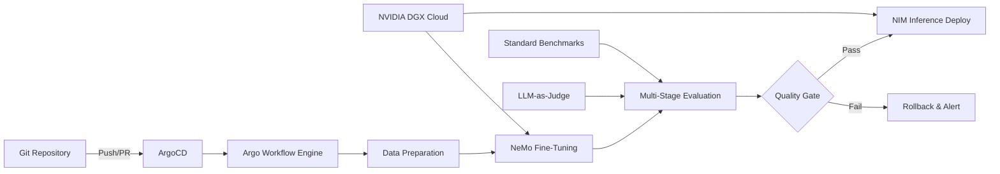

## ブログ概要（Summary）

NVIDIA Developer Blogに2025年6月に掲載された技術記事で、通信大手Amdocsが**GitOpsベースのLLMOpsパイプライン**を構築し、カスタムLLMのファインチューニングから評価・デプロイまでを自動化した事例を報告している。NVIDIA NeMoマイクロサービスによるファインチューニング、NVIDIA NIMによる推論デプロイ、ArgoCDとArgo Workflowによる継続的デリバリーを統合し、データサイエンティストがインフラ管理から解放される環境を実現した。わずか50例の訓練データでLlama 3.1 8Bの精度を0.74→0.83に向上させつつ、汎用タスク性能を維持するという結果が示されている。

この記事は [Zenn記事: LLMアプリのCI/CDパイプライン構築：Promptfoo×GitHub Actionsで品質を自動検証する](https://zenn.dev/0h_n0/articles/75c05ecd0ff579) の深掘りです。

## 情報源

- **種別**: 企業テックブログ
- **URL**: [https://developer.nvidia.com/blog/fine-tuning-llmops-for-rapid-model-evaluation-and-ongoing-optimization/](https://developer.nvidia.com/blog/fine-tuning-llmops-for-rapid-model-evaluation-and-ongoing-optimization/)
- **組織**: NVIDIA + Amdocs
- **著者**: Liad Levi-Raz（Amdocs）, Abhilash Deshmukh（Amdocs）, Daniele Tafani（NVIDIA）, Anshul Jindal（NVIDIA DGX Cloud）, Ziv Ilan（NVIDIA）他
- **発表日**: 2025年6月17日

## 技術的背景（Technical Background）

LLMのファインチューニングとデプロイは、従来のMLOpsよりも複雑である。モデルサイズが数十億パラメータに達するため、GPUリソースの管理が不可欠であり、評価もタスク固有のメトリクスとベンチマーク回帰テストの両方を満たす必要がある。

Zenn記事では、CI/CDパイプラインにおけるLLM評価を3層構造（静的検証→LLM評価→Red teaming）で設計した。NVIDIAの事例は、この枠組みをファインチューニング工程に拡張し、**「モデル変更→評価→デプロイ」の自動化ループ**を実現している。

学術的には、Parameter-Efficient Fine-Tuning (PEFT)手法、特にLoRA (Low-Rank Adaptation) の実用性がこのパイプラインの基盤となっている。LoRAは、学習パラメータ数をフルファインチューニングの0.1%以下に抑えつつ、タスク固有の性能向上を達成する手法であり、CI/CDのコスト制約と両立する唯一の現実的選択肢である。

## 実装アーキテクチャ（Architecture）

### システム全体構成



### 技術スタック

| レイヤー | コンポーネント | 役割 |
|---------|-------------|------|
| オーケストレーション | ArgoCD, Argo Workflow | GitOpsベースの継続的デリバリーとワークフロー実行 |
| ファインチューニング | NVIDIA NeMo Microservices | LoRA等のPEFT手法によるモデルカスタマイズ |
| 推論デプロイ | NVIDIA NIM | 最適化されたLLM推論エンドポイント |
| インフラ | NVIDIA DGX Cloud + Kubernetes | GPU依存処理のためのクラスター管理 |
| 評価 | 標準ベンチマーク + LLM-as-Judge | 多段階品質検証 |

### GitOpsワークフロー詳細

GitOpsの原則に基づき、パイプラインの全設定はGitリポジトリに宣言的に定義される。データサイエンティストが新しいファインチューニング設定をPRとして提出すると、以下のワークフローが自動的に起動する：

**ステップ1: データ準備**

訓練データのフォーマット検証、トークン化、シャッフルを実行する。NeMoの`DataPreparationService`が、入力データを以下の形式に正規化する：

```python
# NeMo訓練データ形式（SFT: Supervised Fine-Tuning）
training_data = [
    {
        "input": "通信障害の原因を分析してください: ...",
        "output": "ネットワーク診断結果: ..."
    },
    # ... 最低50例が必要
]
```

**ステップ2: LoRAファインチューニング**

LoRAは、事前学習済みモデルの重み行列 $W \in \mathbb{R}^{d \times k}$ を直接更新する代わりに、低ランク分解 $\Delta W = BA$ を学習する：

$$
h = W_0 x + \Delta W x = W_0 x + B A x
$$

ここで、
- $W_0 \in \mathbb{R}^{d \times k}$: 凍結された事前学習済み重み行列
- $B \in \mathbb{R}^{d \times r}$: 学習可能な低ランク行列
- $A \in \mathbb{R}^{r \times k}$: 学習可能な低ランク行列
- $r \ll \min(d, k)$: LoRAのランク（通常 $r = 8$ または $r = 16$）

LoRAの学習パラメータ数は $r \times (d + k)$ であり、フルファインチューニングの $d \times k$ と比較して$\frac{r}{d+k}$ 倍に圧縮される。例えばLlama 3.1 8Bの場合、$d = 4096, k = 4096, r = 16$ とすると：

$$
\frac{\text{LoRAパラメータ数}}{\text{フルFTパラメータ数}} = \frac{16 \times (4096 + 4096)}{4096 \times 4096} \approx 0.0078 = 0.78\%
$$

NeMoファインチューニングの設定例：

```yaml
# nemo_finetune_config.yaml
model:
  name: meta-llama/Llama-3.1-8B-Instruct
  peft_method: lora
  lora_rank: 16
  lora_alpha: 32
  lora_dropout: 0.05
  target_modules: [q_proj, v_proj, k_proj, o_proj]

training:
  epochs: 3
  batch_size: 4
  learning_rate: 2.0e-4
  warmup_ratio: 0.03
  gradient_accumulation_steps: 4

data:
  train_path: /data/telecom_train.jsonl
  val_path: /data/telecom_val.jsonl
  max_seq_length: 2048
```

**ステップ3: 多段階評価**

ファインチューニング後、2種類の評価を並列実行する：

**A. 標準ベンチマーク回帰テスト**: GSM8K（数学推論）、SQuAD（読解）、GLUE（自然言語理解）など、汎用能力の劣化がないことを検証する。ファインチューニングでドメイン固有能力を獲得した代わりに汎用能力が失われる「壊滅的忘却」を検出するための防御層である。

**B. LLM-as-Judge評価**: ドメイン固有のビジネスメトリクスを、別のLLM（GPT-4等）をJudgeとして使い評価する。この手法はPromptfooの`llm-rubric`アサーションと同じパターンであり、Zenn記事で紹介した品質ゲートの設計に直結する。

```python
def evaluate_finetuned_model(
    model_endpoint: str,
    benchmark_datasets: dict[str, list],
    business_eval_cases: list[dict],
    judge_model: str = "gpt-4o",
    regression_threshold: float = 0.95,
) -> dict[str, float]:
    """ファインチューニング後の多段階評価

    Args:
        model_endpoint: NIMデプロイ済みモデルのエンドポイント
        benchmark_datasets: 標準ベンチマークデータ
        business_eval_cases: ビジネスドメイン固有の評価ケース
        judge_model: Judgeとして使用するモデル
        regression_threshold: 回帰テスト閾値（元モデルの何割以上を維持）

    Returns:
        各評価軸のスコア辞書
    """
    results = {}

    # A. 標準ベンチマーク回帰テスト
    for bench_name, dataset in benchmark_datasets.items():
        score = run_benchmark(model_endpoint, dataset)
        base_score = get_baseline_score(bench_name)
        results[f"regression/{bench_name}"] = score / base_score

        if score / base_score < regression_threshold:
            raise RegressionError(
                f"{bench_name}: {score:.3f} < {base_score * regression_threshold:.3f}"
            )

    # B. LLM-as-Judge評価
    for case in business_eval_cases:
        response = call_model(model_endpoint, case["input"])
        judge_score = call_judge(
            judge_model, case["input"], response, case["rubric"]
        )
        results[f"business/{case['name']}"] = judge_score

    return results
```

**ステップ4: NIMデプロイ**

評価をパスしたモデルは、NVIDIA NIM（NVIDIA Inference Microservice）にデプロイされる。NIMは、TensorRT-LLMによる最適化推論を提供し、バッチング、KVキャッシュ、量子化を自動的に適用する。

## パフォーマンス最適化（Performance）

### 実験結果

Llama 3.1 8Bに対するLoRAファインチューニングの結果：

| 評価項目 | ベースモデル | ファインチューニング後 | 変化 |
|---------|------------|---------------------|------|
| ドメイン固有タスク精度 | 0.74 | 0.83 | +12.2% |
| TriviaQA（汎用知識） | 0.60 | 0.60 | ±0% |
| GSM8K（数学推論） | 維持 | 維持 | ±0% |

**注目すべき点**: わずか**50例の訓練データ**で、ドメイン固有の精度が9ポイント向上している。これはLoRAの効率性を示す好例であり、大規模な訓練データ収集が困難なエンタープライズ環境でのLLMカスタマイズの現実解である。

### パイプライン実行時間

| フェーズ | 所要時間 | GPU利用 |
|---------|---------|---------|
| データ準備 | ~5分 | なし |
| LoRAファインチューニング | ~30分 | A100 × 1 |
| 標準ベンチマーク評価 | ~15分 | A100 × 1 |
| LLM-as-Judge評価 | ~10分 | API呼び出し |
| NIMデプロイ | ~5分 | なし |
| **合計** | **~65分** | |

### CI/CDとの統合上の考慮事項

Zenn記事のPromptfooパイプライン（最大20分）と比較すると、ファインチューニングを含むNVIDIAパイプラインは**65分**と大幅に長い。しかし、これは「プロンプト評価」と「モデル評価」の性質の違いによるものである。

- **プロンプト変更のCI/CD**: PR毎に実行、5〜20分以内が目標（Promptfooの領域）
- **モデル変更のCI/CD**: ファインチューニング時のみ実行、60〜120分が許容範囲（NVIDIAの領域）

両者は排他的ではなく、**プロンプト層の高速評価 + モデル層の詳細評価**を組み合わせるのが理想的なLLMOps設計である。

## 運用での学び（Production Lessons）

### GitOps原則のLLMOpsへの適用

すべてのパイプライン設定（ファインチューニングハイパーパラメータ、評価閾値、デプロイ設定）がGitリポジトリに宣言的に定義される。これにより：

1. **変更履歴の完全追跡**: いつ、誰が、どのパラメータを変更したかがGitログで追跡可能
2. **ロールバックの容易さ**: 問題発生時にGit revertでパイプライン設定を即座に復元
3. **レビュープロセス**: ファインチューニング設定の変更もPRレビューの対象となり、品質ゲートが機能

### 壊滅的忘却の監視

ファインチューニング後の最大リスクは**壊滅的忘却（catastrophic forgetting）**である。ドメイン固有の能力を獲得した代わりに、汎用的な推論能力や知識が失われるケースがある。NVIDIAのパイプラインでは、TriviaQA等の汎用ベンチマークで0.95以上のスコア維持を品質ゲートとして設定し、自動的に検出・ブロックする。

### GPU リソース管理

Kubernetesクラスター上でGPU依存ジョブ（ファインチューニング、推論）と非GPU ジョブ（データ準備、評価結果集約）を分離し、GPUの利用効率を最大化している。Argo Workflowのリソースリクエスト設定により、GPUジョブはDGX Cloud上の適切なノードにスケジューリングされる。

## 学術研究との関連（Academic Connection）

- **LoRA** (Hu et al., 2021, arXiv:2106.09685): 本パイプラインの基盤となるPEFT手法。元論文ではGPT-3 175Bに対して0.01%のパラメータで同等性能を達成
- **LLM-as-Judge** (Zheng et al., 2023, arXiv:2306.05685): MT-Benchで提案されたLLMによる自動評価手法。本パイプラインのビジネスメトリクス評価に採用
- **PromptBench** (Zhu et al., 2023, arXiv:2312.07910): 標準ベンチマーク回帰テストの体系化フレームワーク。NVIDIAのパイプラインの評価層と補完的に使用可能

## まとめと実践への示唆

NVIDIAとAmdocsのLLMOpsパイプラインは、**ファインチューニング→評価→デプロイ**の全工程をGitOps原則で自動化した先進事例である。50例の訓練データでLlama 3.1 8Bの精度を12%向上させつつ汎用能力を維持するという結果は、エンタープライズLLMのカスタマイズが現実的であることを示している。

Zenn記事のPromptfooパイプラインが「プロンプト層の品質ゲート」を実現するのに対し、NVIDIAのパイプラインは「モデル層の品質ゲート」を実現する。両者を組み合わせた**2層LLMOps**が、今後のプロダクションLLMアプリケーションの標準アーキテクチャとなるだろう。

## 参考文献

- **Blog URL**: [https://developer.nvidia.com/blog/fine-tuning-llmops-for-rapid-model-evaluation-and-ongoing-optimization/](https://developer.nvidia.com/blog/fine-tuning-llmops-for-rapid-model-evaluation-and-ongoing-optimization/)
- **Related Papers**: Hu et al., "LoRA: Low-Rank Adaptation of Large Language Models" (arXiv:2106.09685)
- **Related Zenn article**: [https://zenn.dev/0h_n0/articles/75c05ecd0ff579](https://zenn.dev/0h_n0/articles/75c05ecd0ff579)
- **NVIDIA NeMo**: [https://docs.nvidia.com/nemo-framework/](https://docs.nvidia.com/nemo-framework/)
- **NVIDIA NIM**: [https://developer.nvidia.com/nim](https://developer.nvidia.com/nim)
