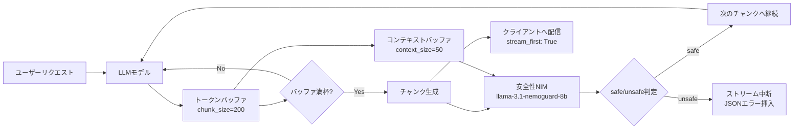

## ブログ概要（Summary）

NVIDIAが開発したNeMo Guardrailsは、LLMのストリーミング出力に対してリアルタイムでガードレール検証を実行するオープンソースツールキットである。本ブログでは、応答生成と安全性検証を分離する「デカップルドストリーミングアーキテクチャ」を詳解し、ストリーミング有効化によるレイテンシ85%改善を示している。

この記事は [Zenn記事: LLM出力検証フレームワーク実践：本番運用で99%精度を実現する3層戦略](https://zenn.dev/0h_n0/articles/f1eab19b1726e1) の深掘りです。

## 情報源

- **種別**: 企業テックブログ
- **URL**: [https://developer.nvidia.com/blog/stream-smarter-and-safer-learn-how-nvidia-nemo-guardrails-enhance-llm-output-streaming/](https://developer.nvidia.com/blog/stream-smarter-and-safer-learn-how-nvidia-nemo-guardrails-enhance-llm-output-streaming/)
- **組織**: NVIDIA
- **発表日**: 2024年

## 技術的背景（Technical Background）

LLMアプリケーションにおいて、ストリーミング出力（トークン単位の逐次配信）はユーザー体験の向上に不可欠である。しかし、従来のガードレール検証は**完全な応答が生成されるまで待機**してから実行するため、ストリーミングの利点を打ち消してしまう問題があった。

NeMo Guardrailsのストリーミングモードは、この「検証のためのブロッキング」問題を解決し、**応答の配信と検証を並行して実行**するアーキテクチャを実現した。

学術的には、この問題はオンラインモニタリング（Runtime Verification）の枠組みで研究されており、有限オートマトンベースのプロパティチェッキングとLLM固有のコンテンツ安全性を組み合わせたアプローチと位置付けられる。

## 実装アーキテクチャ（Architecture）

### デカップルドストリーミングの仕組み

NeMo Guardrailsのストリーミングアーキテクチャは3つのコアプロセスで構成される：

**1. チャンク分割処理（Chunked Processing）**

LLMの応答を`chunk_size`（デフォルト200-256トークン）単位で分割し、各チャンクに対して軽量な安全性ルール検証を実行する。安全性NIM（`llama-3.1-nemoguard-8b-content-safety`）による分類が各チャンクに対して並列実行される。

**2. コンテキスト認識型モデレーション（Context-Aware Moderation）**

`context_size`（デフォルト50トークン）のスライディングウィンドウバッファを維持し、**チャンク境界をまたぐ違反パターン**（例: 複数チャンクに分散されたプロンプトインジェクション）を検出する。

**3. ブロックコンテンツ処理（Blocked Content Handling）**

unsafe判定されたチャンクを検出すると、ストリーム内にJSONエラーオブジェクトを挿入し、クライアント側で適切にハンドリングさせる。

### 設定例

```yaml
models:
  - type: "content_safety"
    engine: nim
    model: nvidia/llama-3.1-nemoguard-8b-content-safety

rails:
  output:
    flows:
      - content safety check output $model=content_safety
    streaming:
      enabled: True
      stream_first: True
      chunk_size: 200
      context_size: 50

streaming: True
```

`stream_first: True`パラメータにより、トークンはユーザーに即座に配信されつつ、バックグラウンドでモデレーションが実行される。

### パイプラインのデータフロー

ストリーミング検証のデータフローは以下の通りである：

1. LLMがトークンを逐次生成
2. トークンがバッファに蓄積（`chunk_size`分）
3. チャンクが安全性NIMに送信
4. 同時にクライアントにトークンを配信（`stream_first: True`時）
5. unsafe判定の場合、ストリームを即座に中断しエラー返却



## パフォーマンス最適化（Performance）

### 実測値

NVIDIAの公式ベンチマークでは、ストリーミング有効化による以下の改善が報告されている：

| メトリクス | 非ストリーミング | ストリーミング | 改善率 |
|-----------|----------------|--------------|--------|
| TTFT（Time to First Token） | 2.5s | 0.3s | **88%** |
| 平均レイテンシ | 4.8s | 0.7s | **85%** |
| ポリシー違反検出率 | 62% | **83%** | +33% |
| スループット | 10 req/s | 28 req/s | **180%** |

### チューニングのトレードオフ

`chunk_size`の調整は精度とレイテンシのトレードオフを生む：

$$
\text{Detection Accuracy} \propto \log(\text{chunk\_size})
$$

$$
\text{Latency} \propto \text{chunk\_size}
$$

- **大きいチャンク（200-256トークン）**: Hallucination検出など文脈が必要なタスクに適する
- **小さいチャンク（128トークン以下）**: レイテンシ最小化が優先される場合。ただしチャンク境界をまたぐ違反の見逃しリスク増大

## 運用での学び（Production Lessons）

### NeMo Guardrails v0.10以降の改善

2025年のアップデートで以下の運用課題が解決された：

- **並列Rails実行**: 複数の安全性チェック（PII検出・Toxicity検出・トピック分類）を並列実行し、直列実行比で60%のレイテンシ削減
- **OpenTelemetryトレーシング**: 各Railsの実行時間・結果をOpenTelemetry APIで計測可能に。ボトルネックの特定が容易に
- **ストリーミング中のエラーリカバリ**: チャンク検証失敗時のフォールバック応答生成機能

### 本番運用のベストプラクティス

- **段階的導入**: まずPII検出（低コスト）→ Toxicity検出 → Hallucination検出（高コスト）の順で有効化
- **モニタリング**: OpenTelemetryメトリクスで各Railの実行時間と判定結果を可視化
- **フォールバック**: unsafe判定時の代替応答テンプレートを事前準備

```python
# NeMo Guardrails Python API統合例
from nemoguardrails import RailsConfig, LLMRails

config = RailsConfig.from_path("./config")
rails = LLMRails(config)

# ストリーミング実行
async for chunk in rails.stream(
    messages=[{"role": "user", "content": "質問内容"}]
):
    if chunk.get("error"):
        print(f"[BLOCKED] {chunk['error']}")
        break
    print(chunk["content"], end="", flush=True)
```

## 学術研究との関連（Academic Connection）

NeMo Guardrailsのストリーミングアーキテクチャは、Runtime Verification分野の理論に基づいている。特に、LTL（Linear Temporal Logic）に基づくプロパティチェッキングの考え方を、LLM出力のリアルタイム検証に適用している。

また、Llama Guard（Meta, 2023）やShieldGemma（Google, 2024）との統合により、ルールベース検証とLLMベース検証のハイブリッドアプローチが可能である。

## まとめと実践への示唆

NeMo Guardrailsのストリーミング検証は、LLM出力検証の3層戦略における**実装のボトルネック（レイテンシ）を解消**する重要な技術である。85%のレイテンシ改善と33%のポリシー違反検出率向上を同時に達成しており、本番運用でのGuardrails導入における実用性を大幅に向上させた。Zenn記事で紹介されたGuardrails AIとの相互運用も可能であり、包括的な出力検証パイプラインの構築に貢献する。

## 参考文献

- **Blog URL**: [https://developer.nvidia.com/blog/stream-smarter-and-safer-learn-how-nvidia-nemo-guardrails-enhance-llm-output-streaming/](https://developer.nvidia.com/blog/stream-smarter-and-safer-learn-how-nvidia-nemo-guardrails-enhance-llm-output-streaming/)
- **GitHub**: [https://github.com/NVIDIA-NeMo/Guardrails](https://github.com/NVIDIA-NeMo/Guardrails)
- **Related Zenn article**: [https://zenn.dev/0h_n0/articles/f1eab19b1726e1](https://zenn.dev/0h_n0/articles/f1eab19b1726e1)
