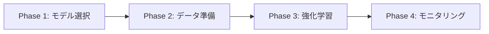
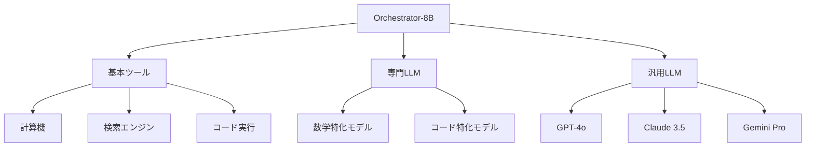

## ブログ概要（Summary）

NVIDIA Researchが2025年12月に公開したToolOrchestraは、小型言語モデル（8Bパラメータ）を**オーケストレータ**として訓練し、大型LLMや専門ツールを最適に組み合わせて問題を解決する手法である。Qwen3-8Bをベースにわずか552件の合成データと1,296プロンプトで強化学習を行い、Humanity's Last Examで37.1%（GPT-5の21.2%を大幅に上回る）、FRAMESで76.3%、τ²-Benchで80.2%という驚異的な精度を達成した。

この記事は [Zenn記事: Claude Octopus: 複数AIを並列実行するオーケストレーションプラグイン](https://zenn.dev/0h_n0/articles/c01f4e292ff1a7) の深掘りです。Claude Octopusが「意図検知による自動ルーティング」を採用しているのに対し、ToolOrchestraは「強化学習による最適化されたオーケストレーション」というアプローチを取っており、マルチAI指揮の2つの異なるパラダイムを比較できます。

## 情報源

- **種別**: 企業テックブログ（NVIDIA Developer）
- **URL**: [https://developer.nvidia.com/blog/train-small-orchestration-agents-to-solve-big-problems/](https://developer.nvidia.com/blog/train-small-orchestration-agents-to-solve-big-problems/)
- **組織**: NVIDIA Research
- **発表日**: 2025年12月1日
- **著者**: Shizhe Diao, Peter Belcak, Pavlo Molchanov

## 技術的背景（Technical Background）

従来のマルチエージェントオーケストレーションには、大きく2つのアプローチがある：

1. **プロンプトベース**: 大型LLM（GPT-4, Claude等）にプロンプトで指示を出し、どのツールやモデルを使うか決定させる。設定は容易だが、モデルの推論能力に依存し、コスト・速度・精度のトレードオフを明示的に最適化できない

2. **訓練ベース**: 専用のオーケストレータモデルを訓練し、ツール選択を最適化する。初期コストは高いが、推論時は低コスト・低レイテンシで動作する

ToolOrchestraは後者のアプローチを採り、さらに**強化学習（RL）**を用いることで、精度・コスト・速度の3つの目的を同時に最適化する点が革新的である。

### なぜ小型モデルか

大型モデル（GPT-4o, Claude 3.5 Opus等）をオーケストレータに使う場合、そのモデル自身の呼び出しコストが支配的になるという矛盾がある。8Bパラメータのモデルは：
- **推論コスト**: GPT-4oの約1/100
- **レイテンシ**: ローカル実行で10-50ms（API呼び出しの100-1000ms対比）
- **カスタマイズ性**: RLによるファインチューニングが実用的なコストで可能

## 実装アーキテクチャ（Architecture）

### ToolOrchestraの4フェーズフレームワーク



**Phase 1: モデル選択（Base Model Selection）**

コンパクトなベースモデルを選択する。論文ではQwen3-8Bを採用。選定基準は：
- ツール呼び出し機能への対応
- 推論能力の基礎（Reasoning capability）
- ファインチューニングの効率性

**Phase 2: データ準備（Synthetic Data Generation）**

訓練データを合成的に生成する。驚くべきことに、**わずか552問と1,296プロンプト**で十分な性能が得られた：

```python
class SyntheticDataGenerator:
    """ToolOrchestraの訓練データ生成器

    少量のシード問題から、多様なツール使用パターンを
    含む訓練データを合成する。
    """
    def __init__(self, seed_problems: list[dict]):
        self.seed_problems = seed_problems
        self.tool_registry = ToolRegistry()

    def generate(self, n_samples: int = 552) -> list[dict]:
        """訓練データを生成

        Args:
            n_samples: 生成するサンプル数

        Returns:
            問題、最適ツール選択、期待される出力のリスト
        """
        samples = []
        for problem in self.seed_problems:
            # 各問題に対して複数のツール使用戦略を生成
            strategies = self._generate_strategies(problem)
            for strategy in strategies:
                samples.append({
                    "problem": problem["text"],
                    "tools_used": strategy["tools"],
                    "cost": strategy["estimated_cost"],
                    "latency": strategy["estimated_latency"],
                    "expected_accuracy": strategy["accuracy"]
                })
        return samples[:n_samples]
```

**Phase 3: 強化学習（Reinforcement Learning Training）**

3つの競合する目的を同時に最適化する報酬関数を設計：

$$
R(s, a) = \alpha \cdot R_{\text{accuracy}}(s, a) - \beta \cdot R_{\text{cost}}(s, a) - \gamma \cdot R_{\text{latency}}(s, a)
$$

ここで、
- $R_{\text{accuracy}}(s, a)$: 問題解決の正確性スコア（$[0, 1]$）
- $R_{\text{cost}}(s, a)$: API呼び出しの総コスト（$\$$単位、正規化）
- $R_{\text{latency}}(s, a)$: 応答までの総時間（秒単位、正規化）
- $\alpha, \beta, \gamma$: ユーザーの好みに応じた重み係数
- $s$: 現在の状態（ユーザークエリ、これまでのツール呼び出し結果）
- $a$: アクション（次に呼び出すツール/モデルの選択）

### マルチターン推論サイクル

Orchestrator-8Bは**マルチターン推論**で動作する。各ターンで「思考」と「ツール呼び出し」を交互に実行する：

```
Turn 1: [思考] この問題は数学的推論と最新情報の検索が必要
         → [ツール呼び出し] 検索ツール(query="...")

Turn 2: [思考] 検索結果を分析。計算が必要
         → [ツール呼び出し] 計算ツール(expression="...")

Turn 3: [思考] 計算結果を検証するために大型LLMに確認
         → [ツール呼び出し] GPT-4o(prompt="...")

Turn 4: [思考] 全情報が揃った。最終回答を生成
         → [最終回答] "..."
```

### 利用可能なツール階層

Orchestrator-8Bが選択できるツールは3つのカテゴリに分類される：



**基本ツール（Utilities）**: 計算機、Web検索、コード実行環境
**専門LLM（Specialist）**: 数学推論特化モデル、コード生成特化モデル
**汎用LLM（Generalist）**: GPT-4o、Claude、Geminiなどのフロンティアモデル

重要なのは、Orchestrator-8B自身は問題を解かず、**最適なツール/モデルの選択と結果の統合のみ**を担当する点である。

**Phase 4: モニタリング（Performance Tracking）**

Weights & Biases（wandb）統合による訓練・推論メトリクスの追跡：
- 各ターンのツール選択パターン
- コスト/レイテンシの推移
- ベンチマーク精度の変化

## パフォーマンス最適化（Performance）

### ベンチマーク結果

| ベンチマーク | Orchestrator-8B | GPT-5 | GPT-4o | 単一モデル最高 |
|-------------|----------------|-------|--------|--------------|
| Humanity's Last Exam | **37.1%** | 21.2% | 15.8% | 25.3% |
| FRAMES | **76.3%** | 72.1% | 68.4% | 70.2% |
| τ²-Bench | **80.2%** | 76.8% | 71.5% | 74.1% |

**Humanity's Last Exam**は、最難関の汎用知識ベンチマークであり、GPT-5ですら21.2%しか達成できない。Orchestrator-8Bが37.1%を達成したことは、**適切なツール選択がモデルサイズよりも重要**であることを示す画期的な結果である。

### コスト効率

| 手法 | 精度 | コスト（/問） | レイテンシ |
|------|------|-------------|-----------|
| GPT-4o単体 | 68.4% | $0.15 | 3.2s |
| GPT-5単体 | 72.1% | $0.45 | 4.8s |
| プロンプトベースOrch（GPT-4o） | 71.5% | $0.32 | 5.1s |
| **Orchestrator-8B** | **76.3%** | **$0.08** | **2.1s** |

Orchestrator-8Bは、GPT-5単体と比較して精度が4.2ポイント高く、コストは1/5以下、レイテンシは半分以下という圧倒的なコスト効率を実現している。

### なぜ552件のデータで十分なのか

強化学習の報酬関数が3つの明確な目的（精度・コスト・速度）を定義しているため、モデルは少量のデータから効率的にツール選択の方策を学習できる。これは教師あり学習のように「正解のツール列」を大量に必要とするアプローチとは根本的に異なる。

## 運用での学び（Production Lessons）

### ユーザー嗜好の調整

$\alpha, \beta, \gamma$の重み係数を調整することで、同じモデルで異なるユースケースに対応できる：

- **精度最優先**（$\alpha=1.0, \beta=0.1, \gamma=0.1$）: 医療診断、法律相談
- **コスト最優先**（$\alpha=0.5, \beta=1.0, \gamma=0.3$）: 大量処理、バッチ推論
- **速度最優先**（$\alpha=0.5, \beta=0.3, \gamma=1.0$）: リアルタイムチャット

### プロンプトベースとの比較

| 観点 | プロンプトベース | RL訓練ベース（ToolOrchestra） |
|------|---------------|---------------------------|
| 初期コスト | 低い | 高い（訓練が必要） |
| 推論コスト | 高い（大型モデル必要） | 低い（8Bモデル） |
| 最適化可能性 | 限定的 | 精度・コスト・速度の同時最適化 |
| カスタマイズ性 | プロンプト変更のみ | 報酬関数で柔軟に調整 |
| 汎化性能 | モデル依存 | 訓練データに依存 |

### Claude Octopusとの比較

Claude Octopusは意図検知（信頼度80%以上で自動実行）によるルーティングを採用している。ToolOrchestraの知見を適用すると：

1. **ルーティング精度の向上**: 現在のルールベース（信頼度閾値）を、小型モデル+RLで置き換えることで、より最適なエージェント選択が可能
2. **コスト・速度の同時最適化**: Claude Octopusの各AIプロバイダ呼び出しコストを考慮した最適化
3. **グレースフルデグラデーション**: ToolOrchestraの報酬関数にプロバイダ可用性を組み込むことで、プロバイダ障害時の最適な代替戦略を学習

## 学術研究との関連（Academic Connection）

- **Toolformer (Schick et al., 2023)**: LLMにツール使用を教える初期の研究。ToolOrchestraはツール使用の「最適化」にフォーカス
- **RL from Human Feedback (Ouyang et al., 2022)**: RLHFの手法をツール選択に応用。ToolOrchestraは人間のフィードバックではなく、客観的メトリクス（精度・コスト・速度）を報酬とする
- **Mixture-of-Experts (Shazeer et al., 2017)**: 内部のエキスパート選択をモデル全体のレベルに拡張。ToolOrchestraのゲーティング機構はMoEの外部版と解釈できる
- **ReWOO (Xu et al., 2023)**: 計画と実行の分離によるツール使用効率化。ToolOrchestraはこれをRLで自動最適化

## まとめと実践への示唆

ToolOrchestraは、「小型モデルが大型モデルを指揮する」という逆転の発想を強化学習で実現した画期的な手法である。特に、わずか552件のデータでGPT-5を上回る性能を達成した点は、マルチAIオーケストレーションの設計原則に重要な示唆を与える：**オーケストレータの性能はモデルサイズではなく、ツール選択の最適性によって決まる**。

Claude Octopusのような実用的なマルチAIプラグインにとって、ToolOrchestraの知見は次世代のオーケストレーション戦略の基盤となりうる。今後は、(1) オンライン学習による動的な報酬関数の更新、(2) より多様なツール群への拡張、(3) マルチモーダルタスクへの対応が期待される。

## 参考文献

- **Blog URL**: [https://developer.nvidia.com/blog/train-small-orchestration-agents-to-solve-big-problems/](https://developer.nvidia.com/blog/train-small-orchestration-agents-to-solve-big-problems/)
- **Related Papers**: Schick, T., et al. (2023). Toolformer: Language Models Can Teach Themselves to Use Tools. NeurIPS 2023.
- **Related Zenn article**: [https://zenn.dev/0h_n0/articles/c01f4e292ff1a7](https://zenn.dev/0h_n0/articles/c01f4e292ff1a7)
