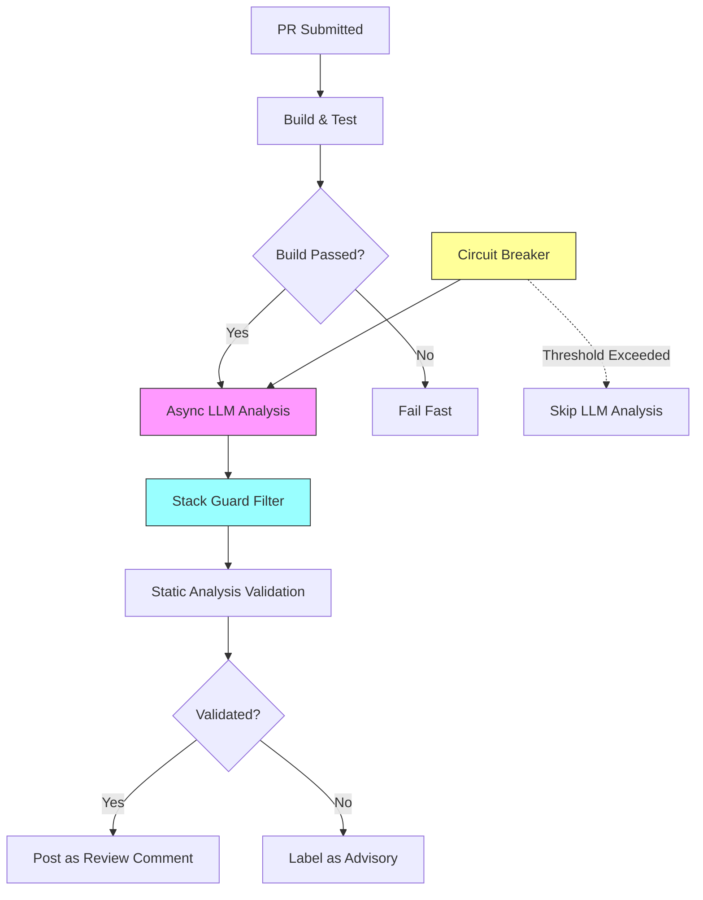

## ブログ概要（Summary）

USENIX `;login:` Online に2025年9月に掲載されたGuruprasad Raghothama Raoによる事例報告である。CI/CDパイプラインにLLM推論をインラインで統合したところ、**パイプライン実行時間が8分→18〜22分に膨張**し、LLMの幻覚（hallucination）による誤った提案やコスト暴走が発生した。本報告は、これらの問題に対して**5つのガードレール**（非同期処理、バリデーション層、回路ブレーカー、ラベリング、スタックガード）を設計・導入した実践記録である。LLMの出力を「信頼できない入力」として扱い、従来のソフトウェアエンジニアリングの防御パターンを適用するアプローチは、CI/CDにおけるLLM統合の事実上のベストプラクティスとなりつつある。

この記事は [Zenn記事: LLMアプリのCI/CDパイプライン構築：Promptfoo×GitHub Actionsで品質を自動検証する](https://zenn.dev/0h_n0/articles/75c05ecd0ff579) の深掘りです。

## 情報源

- **種別**: 企業テックブログ / 学術誌事例報告
- **URL**: [https://www.usenix.org/publications/loginonline/ai-pipeline-reliability-lessons-adding-llm-cicd](https://www.usenix.org/publications/loginonline/ai-pipeline-reliability-lessons-adding-llm-cicd)
- **組織**: USENIX Association（`;login:` Online）
- **著者**: Guruprasad Raghothama Rao
- **発表日**: 2025年9月16日

## 技術的背景（Technical Background）

CI/CDパイプラインは、ソフトウェア開発における品質保証の中核を担う。従来のパイプラインは決定的（deterministic）であり、同じ入力に対して同じ結果を返すことが期待される。しかしLLM推論をパイプラインに組み込むと、**非決定的な出力**が導入され、パイプラインの信頼性モデルが根本的に変わる。

この問題は、Zenn記事で解説した「LLMアプリのCI/CDが従来と異なる理由」の実証事例である。Zenn記事では、テスト対象が「コードの正しさ」から「出力品質」に変わること、判定基準が「Pass/Fail」から「スコア閾値」に変わることを指摘したが、本USENIX報告はそれらの理論的予測が実際のプロダクション環境で顕在化した記録である。

学術的には、LLMの非決定性はサンプリング過程（temperature > 0時のtop-k/top-pサンプリング）と、モデル更新による暗黙的な挙動変化（APIバージョンの裏側での差し替え）の2要因に起因する。CI/CDの文脈では、この非決定性が**テストの信頼性（flakiness）**と直結する。

## 発生した問題の詳細分析

### 問題1: パイプラインレイテンシの劇的な増大

LLM推論をCI/CDのクリティカルパス（ビルド→テスト→マージ判定）にインラインで挿入した結果、パイプライン実行時間が**約8分→18〜22分**に増大した。

原因の内訳は以下の通り：

$$
T_{\text{total}} = T_{\text{build}} + T_{\text{test}} + T_{\text{LLM}} + T_{\text{retry}}
$$

ここで、
- $T_{\text{build}}$: ビルド時間（従来通り、約3分）
- $T_{\text{test}}$: テスト実行時間（従来通り、約4分）
- $T_{\text{LLM}}$: LLM推論時間（新規追加、約5〜8分）
- $T_{\text{retry}}$: リトライによる追加遅延（約2〜7分）

$T_{\text{LLM}}$ が大きい原因は、「トークンの多いプロンプト」と「推論遅延」の蓄積である。PRレビューのコンテキストとして差分全体をプロンプトに含めると、大規模PRで数万トークンに達し、推論だけで数十秒〜数分かかる。これが複数のファイルに対して繰り返されると、累積遅延は無視できない。

さらに $T_{\text{retry}}$ が問題を悪化させる。API呼び出しのタイムアウトや429エラー（レート制限）によるリトライが指数バックオフで発生し、最悪ケースでは1回のリトライサイクルに30秒以上を要する。

### 問題2: 幻覚（Hallucination）による誤った提案

LLMが**存在しないimportの未使用を指摘**するケースや、**リポジトリの言語と無関係なフレームワーク（JavaScript以外のリポジトリにJestを推奨）**を提案するケースが報告された。

これは、LLMのコンテキストウィンドウにリポジトリ全体の情報が含まれないことに起因する。PRの差分だけを見て、プロジェクト全体の依存関係やアーキテクチャを理解せずに提案を生成するため、文脈から外れた提案が発生する。

特に深刻だったのは、リリースノートの自動生成における**架空のbreaking change**の捏造である。実際には存在しない後方互換性のない変更を、LLMが自信を持って記載してしまうケースがあった。

### 問題3: コストの暴走

「1回の呼び出しは数セント」というLLM APIの価格設定は、CI/CDの文脈では誤解を招く。1つのPRに対して複数のプロンプト（コードレビュー、テスト提案、リリースノート生成等）が実行され、リトライを含めると1PRあたり10〜30回のAPI呼び出しが発生する。チーム全体で1日に50〜100件のPRがマージされるリポジトリでは、**月額数千ドル**の追加コストとなる。

$$
C_{\text{monthly}} = N_{\text{PR/day}} \times K_{\text{calls/PR}} \times C_{\text{per\_call}} \times 30
$$

例えば、$N_{\text{PR/day}} = 80$、$K_{\text{calls/PR}} = 15$、$C_{\text{per\_call}} = \$0.03$ とすると：

$$
C_{\text{monthly}} = 80 \times 15 \times 0.03 \times 30 = \$1,080/\text{month}
$$

これはZenn記事で紹介した回路ブレーカー（日次$10制限）の設計根拠と一致する。

### 問題4: レビュワー負荷の増大

皮肉なことに、LLMによるコードレビュー支援が**レビュワーの負荷を増大**させた。LLMの提案が正しいかどうかの検証コストが、提案がない場合のレビューコストを上回るケースが頻発した。特に、幻覚による誤った提案を見抜くには、レビュワーが提案内容を詳細に検証する必要があり、本来の目的（レビュー効率化）と逆行する結果となった。

## 5つのガードレール設計（Architecture）

報告では、上記の問題に対して5つのガードレールを導入し、段階的に改善を達成した。



### ガードレール1: 非同期処理（Async Processing）

LLM推論をクリティカルパスから除外し、**ビルド成功後にバックグラウンドで実行**する。LLMのコメントはPRが既にマージ可能な状態になった後にポストされる。

```python
# 擬似コード: 非同期LLM分析ジョブ
import asyncio
from typing import Optional

async def async_llm_review(
    pr_diff: str,
    repo_context: dict[str, str],
    timeout_sec: int = 120,
) -> Optional[str]:
    """非同期でLLMレビューを実行

    ビルド・テスト完了後にトリガーされ、
    結果はPRコメントとして非同期にポストされる。

    Args:
        pr_diff: PRの差分テキスト
        repo_context: リポジトリのメタデータ（言語、フレームワーク等）
        timeout_sec: タイムアウト（秒）

    Returns:
        レビューコメント文字列、またはタイムアウト時None
    """
    try:
        review = await asyncio.wait_for(
            call_llm_api(pr_diff, repo_context),
            timeout=timeout_sec,
        )
        return review
    except asyncio.TimeoutError:
        return None  # タイムアウト時はサイレントにスキップ
```

**効果**: パイプライン実行時間が18〜22分→元の約8分に戻り、開発者のフィードバックループが維持された。

### ガードレール2: バリデーション層（Validation Layer）

LLMの提案を「信頼できない入力」として扱い、4種類のバリデータで検証する：

1. **静的解析確認**: LLMが指摘したコード問題を、lint/型チェッカーで独立に再確認
2. **テストオラクル**: LLMが提案したテストを実際に実行し、パスするか検証
3. **スタックガード**: リポジトリの言語/フレームワークと提案の整合性チェック
4. **セキュリティゲート**: セキュリティ関連の提案は専用ルールエンジンで検証

### ガードレール3: 回路ブレーカー（Circuit Breaker）

コストまたはレイテンシが閾値を超えた場合、LLM分析を自動的に無効化する。

```python
from dataclasses import dataclass, field
from datetime import datetime, timedelta

@dataclass
class CircuitBreaker:
    """CI/CDパイプライン用回路ブレーカー

    コスト上限とレイテンシ上限の2つの軸で制御。
    """
    cost_limit_usd: float = 10.0
    latency_limit_ms: int = 30_000
    failure_threshold: int = 3
    reset_interval: timedelta = timedelta(hours=24)

    _daily_cost: float = field(default=0.0, init=False)
    _consecutive_failures: int = field(default=0, init=False)
    _last_reset: datetime = field(default_factory=datetime.now, init=False)

    def should_execute(self, estimated_cost: float) -> bool:
        """LLM分析を実行すべきか判定

        Args:
            estimated_cost: 推定APIコスト（USD）

        Returns:
            実行可能ならTrue
        """
        self._maybe_reset()

        if self._consecutive_failures >= self.failure_threshold:
            return False
        if self._daily_cost + estimated_cost > self.cost_limit_usd:
            return False
        return True

    def record_success(self, cost: float, latency_ms: int) -> None:
        """成功時の記録"""
        self._daily_cost += cost
        self._consecutive_failures = 0

    def record_failure(self) -> None:
        """失敗時の記録"""
        self._consecutive_failures += 1

    def _maybe_reset(self) -> None:
        """日次リセットチェック"""
        if datetime.now() - self._last_reset > self.reset_interval:
            self._daily_cost = 0.0
            self._consecutive_failures = 0
            self._last_reset = datetime.now()
```

この設計はZenn記事で紹介した `ci/circuit_breaker.py` と同じパターンであるが、USENIX報告ではレイテンシ軸の制御が追加されている点が異なる。

### ガードレール4: ラベリング（Advisory Labeling）

バリデーション層を通過しなかった提案は、削除するのではなく **`[Advisory]` ラベルを付与**してPRコメントに表示する。これにより、レビュワーは検証済みの提案と未検証の提案を明確に区別できる。

### ガードレール5: スタックガード（Stack Guards）

リポジトリのメタデータ（使用言語、フレームワーク、依存関係）を事前に分析し、LLMの提案がプロジェクトのテクノロジースタックと整合するかをフィルタリングする。PythonリポジトリにJestを推奨するような不整合を排除する。

## パフォーマンス最適化（Performance）

### ガードレール導入前後の比較

| 指標 | 導入前 | 導入後 | 改善率 |
|------|--------|--------|--------|
| パイプライン時間 | 18〜22分 | 約8分 | 60〜64% |
| 誤提案率 | 不明（高頻度） | 大幅低下 | - |
| 月間APIコスト | 制御不能 | 予算内 | - |
| レビュワー負荷 | 増大 | 軽減 | - |

### コスト最適化戦略

報告で示された4つのコスト最適化戦略は、Zenn記事の戦略表と対応する：

| 戦略 | USENIX報告 | Zenn記事 | 削減効果 |
|------|-----------|---------|---------|
| 非同期化 | クリティカルパスから除外 | - | レイテンシ60%減 |
| キャッシュ | 同一diff再利用 | 同一入力の再利用 | 40-60% |
| スコープ制限 | 変更ファイルのみ | パスフィルタ | 30-50% |
| 回路ブレーカー | コスト/レイテンシ閾値 | 日次$10制限 | 予算順守 |

## 運用での学び（Production Lessons）

### 教訓1: LLMを「信頼できない入力」として扱う

最も重要な教訓は、LLMの出力を**外部からの信頼できない入力**と同等に扱うことである。SQLインジェクション防御やXSS対策と同じマインドセットで、LLMの提案を「バリデーション→サニタイズ→使用」のパイプラインで処理する。

### 教訓2: 非同期が必須

LLM推論をCI/CDのクリティカルパスに入れてはならない。パイプラインの速度はチームの開発ベロシティに直結するため、LLM分析は必ず非同期で実行し、結果は「アドバイス」として提供する。

### 教訓3: 段階的ロールアウト

ガードレールは一度に全て導入するのではなく、段階的に導入すべきである。まず非同期化で基本的な安全性を確保し、次にバリデーション層、最後に回路ブレーカーの順で追加する。

### 教訓4: 障害モードの設計

回路ブレーカーが開いた（LLM分析がスキップされた）場合、パイプラインは**正常に完了**するべきである。LLM分析は「あれば便利」だが、パイプラインの成否を左右するべきではない。

## 学術研究との関連（Academic Connection）

本USENIX報告の知見は、以下の学術研究と関連する：

- **回路ブレーカーパターン**: Michael Nygardの「Release It!」(2007)で提唱された障害連鎖防止パターンのLLM応用。元々はマイクロサービス間の障害伝播防止に使われていたが、LLM API呼び出しにも同様に適用可能
- **Chaos Engineering**: Netflix発の障害注入テスト手法。LLMのCI/CD統合においても、LLM APIの障害やレイテンシスパイクを意図的に発生させてガードレールの有効性を検証するアプローチが有効
- **PromptBench (arXiv:2312.07910)**: LLMの敵対的ロバスト性評価。CI/CDにおけるLLMの幻覚問題は、敵対的攻撃とは異なるが、出力の信頼性という同じ軸で議論できる

## まとめと実践への示唆

USENIX報告が示した最も重要な教訓は、**「LLMをCI/CDに統合する際は、従来のソフトウェアエンジニアリングの防御パターンを忘れるな」**ということである。非同期処理、入力バリデーション、回路ブレーカー、フェイルセーフ設計 — これらは全てLLM以前から存在するパターンだが、LLMの非決定性と幻覚リスクの下で改めてその価値が証明された。

Zenn記事で紹介した「Promptfoo + GitHub Actions + 回路ブレーカー」の設計は、このUSENIX報告の知見と完全に整合する。特に、Promptfooの`threshold`による品質ゲートはバリデーション層に、`cost`制限は回路ブレーカーに相当し、Zenn記事の設計が実証された形である。

今後の課題として、LLMの推論コストが低下しthroughputが向上するにつれ、ガードレールの閾値設定はより積極的に（緩く）調整できるようになるだろう。しかし、「信頼できない入力として扱う」という原則は、LLMの能力がいかに向上しても変わらない。

## 参考文献

- **Blog URL**: [https://www.usenix.org/publications/loginonline/ai-pipeline-reliability-lessons-adding-llm-cicd](https://www.usenix.org/publications/loginonline/ai-pipeline-reliability-lessons-adding-llm-cicd)
- **Related Papers**: Michael Nygard, "Release It!" (2007) — Circuit Breaker Pattern
- **Related Zenn article**: [https://zenn.dev/0h_n0/articles/75c05ecd0ff579](https://zenn.dev/0h_n0/articles/75c05ecd0ff579)
- **Promptfoo CI/CD Docs**: [https://www.promptfoo.dev/docs/integrations/ci-cd/](https://www.promptfoo.dev/docs/integrations/ci-cd/)
