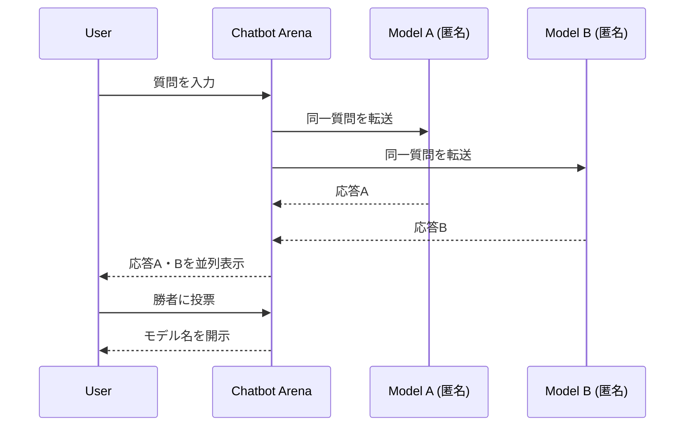

## 論文概要（Abstract）

LLMの評価には、(1) ベンチマークが実世界のユースケースの多様性を捉えきれない、(2) 自動指標が人間の選好と乖離する、という2つの根本的な課題がある。Chatbot Arenaは100万件超の人間選好投票を収集するオープンプラットフォームを構築し、Bradley-Terryモデルによる統計的に頑健なランキングを実現した。4,000票で安定したランキングが得られること、クラウドソーシング評価が専門家評価と高い相関を示すことを実証している。

この記事は [Zenn記事: LLMのA/Bテスト戦略：プロンプト改善サイクルを3倍速にする実践ガイド](https://zenn.dev/0h_n0/articles/d86aba5cf2c154) の深掘りです。

## 情報源

- **arXiv ID**: 2403.04132
- **URL**: [https://arxiv.org/abs/2403.04132](https://arxiv.org/abs/2403.04132)
- **著者**: Wei-Lin Chiang, Lianmin Zheng, Ying Sheng, Anastasios N. Angelopoulos et al.（UC Berkeley）
- **発表年**: 2024
- **分野**: cs.CL, cs.LG

## 背景と動機（Background & Motivation）

LLMの性能評価は2つの構造的問題を抱えている。第一に、MMLUやHumanEvalのような静的ベンチマークは、実ユーザーが日常的に投げるタスクの多様性を反映しない。第二に、BLEUやROUGEなどの自動指標は人間の主観的な品質判断と乖離する。

従来の人間評価は、専門家アノテーターを雇用して実施するためスケーラビリティに乏しく、評価コストが高い。また、モデル名が評価者に見える状態では、ブランドバイアスが結果を歪める。Chatbot Arenaは「匿名ペアワイズ比較 × クラウドソーシング」でこれらの課題に対処し、LLMの実力を統計的に信頼できる形で序列化するプラットフォームを構築した。

## 主要な貢献（Key Contributions）

- **オープン評価プラットフォーム**: 匿名化・多様性担保・バイアス軽減の設計原則に基づくLLM評価基盤を公開
- **統計的ランキング手法**: Bradley-TerryモデルとEloレーティングの両方を採用し、ブートストラップで信頼区間を付与
- **投票効率の実証**: 4,000票でモデルランキングが頑健に安定することを示し、スケーラブルな評価が可能であることを証明
- **クラウド評価の妥当性**: クラウドソーシングによる評価が専門家評価と高い相関を持つことを実証
- **大規模データ収集**: 100以上のLLMに対して100万件超の投票データを蓄積

## 技術的詳細（Technical Details）

### プラットフォームアーキテクチャ

Chatbot Arenaでは、ユーザーが2つの匿名モデルと同時に対話し、より良い方に投票する。モデル名は投票後にはじめて開示される。この設計によりブランドバイアスを排除する。



### Eloレーティングシステム

チェスのEloレーティングをLLM評価に転用する。各モデルは初期Eloスコアを持ち、ペアワイズ比較の結果に応じてスコアが更新される。

モデルAの期待勝率は次式で計算される：

$$
E_A = \frac{1}{1 + 10^{(R_B - R_A)/400}}
$$

対戦結果に基づくスコア更新式：

$$
R'_A = R_A + K(S_A - E_A)
$$

ここで、
- $R_A, R_B$: モデルA, Bの現在のEloレーティング
- $E_A$: モデルAの期待勝率
- $K$: K-factor（1試合の影響度を制御する定数）
- $S_A$: 実際のスコア（勝利=1, 敗北=0, 引き分け=0.5）
- $R'_A$: 更新後のEloレーティング

Eloはリアルタイム更新が容易だが、比較順序に依存するため統計的厳密性はやや劣る。

### Bradley-Terryモデル（主力手法）

Bradley-Terry（BT）モデルは、全ペアワイズ比較履歴を同時に考慮して各モデルの潜在的な強さを推定する。

$$
P(\text{A wins vs B}) = \frac{e^{\beta_A}}{e^{\beta_A} + e^{\beta_B}}
$$

ここで $\beta_A, \beta_B$ は各モデルのlog強度パラメータである。全比較データに対する対数尤度を最大化して $\beta$ を推定する：

$$
\ell(\boldsymbol{\beta}) = \sum_{(i,j) \in \mathcal{D}} \left[ y_{ij} \log \frac{e^{\beta_i}}{e^{\beta_i} + e^{\beta_j}} + (1 - y_{ij}) \log \frac{e^{\beta_j}}{e^{\beta_i} + e^{\beta_j}} \right]
$$

ここで $\mathcal{D}$ は全比較ペアの集合、$y_{ij}=1$ はモデル$i$がモデル$j$に勝利したことを示す。

```python
import numpy as np
from scipy.optimize import minimize

def fit_bradley_terry(wins: np.ndarray, n_models: int) -> np.ndarray:
    """Bradley-Terryモデルのパラメータを最尤推定する.

    Args:
        wins: shape (n_comparisons, 3) の配列。各行は [model_i, model_j, y_ij]
        n_models: モデル数

    Returns:
        各モデルのlog強度パラメータ beta
    """
    def neg_log_likelihood(beta: np.ndarray) -> float:
        nll = 0.0
        for i, j, y in wins:
            i, j = int(i), int(j)
            log_p = beta[i] - np.logaddexp(beta[i], beta[j])
            log_q = beta[j] - np.logaddexp(beta[i], beta[j])
            nll -= y * log_p + (1 - y) * log_q
        return nll

    beta0 = np.zeros(n_models)
    result = minimize(neg_log_likelihood, beta0, method="L-BFGS-B")
    return result.x
```

BTモデルはEloと異なり比較順序に依存せず、推移性（A>B, B>C → A>C）を自然に保証する。

### ブートストラップによる信頼区間

ランキングの不確実性を定量化するため、収集データをリサンプリングして複数回BTモデルを推定し、パラメータの分散から信頼区間を算出する。これにより「GPT-4とClaude 3は統計的に有意差がない」といった判定が可能になる。

## 実験結果（Results）

| 指標 | 値 |
|------|------|
| 収集投票数 | 1,000,000件超 |
| 評価済みモデル数 | 100以上 |
| ランキング安定化の最小投票数 | 4,000票 |
| クラウド評価と専門家評価の相関 | 高相関 |

評価対象にはGPT-4、Claude、LLaMA、Mistralなど主要なオープンソース・プロプライエタリモデルが含まれる。4,000票でランキングが安定するという発見は、新規モデルの追加評価を迅速に行えることを意味し、プラットフォームのスケーラビリティを裏付けている。

## 実運用への応用（Practical Applications）

Chatbot Arenaの手法は、社内LLMアプリケーションのA/Bテストに直接応用できる。

**プロンプト改善への適用**: Zenn記事で紹介したハッシュベースのA/Bテストとの組み合わせにより、プロンプトバリアントのペアワイズ比較をBTモデルで統計的に評価できる。単純な勝率比較よりも3バリアント以上の同時比較で威力を発揮する。

**評価コストの最適化**: 4,000票で安定するという知見を応用すれば、サンプルサイズ設計の指針になる。社内評価でもゴールデンデータセット50件×各80回評価＝4,000件で十分な統計的検出力を確保できる。

**バイアス対策の設計指針**: 匿名化、多様な質問、多様な評価者という3要素は、社内の品質評価基盤を設計する際の必須要件として活用できる。

## 関連研究（Related Work）

- **MT-Bench（Zheng et al., 2023）**: LLM-as-a-Judgeによる自動評価。人間の手間を省けるが、ジャッジモデル自体のバイアス問題を持つ
- **HELM（Liang et al., 2022）**: 多面的な自動評価フレームワーク。包括的だが人間の選好を直接反映しない
- **AlpacaEval（Li et al., 2023）**: 自動勝率評価。Chatbot Arenaはこれを人間投票で補完する位置づけ

## まとめと今後の展望

Chatbot Arenaは、人間の選好投票という最も直接的な品質指標をスケーラブルに収集し、BTモデルで統計的に頑健なランキングを実現した。4,000票での安定化、専門家との高相関という結果は、クラウドソーシング型LLM評価の実用性を強く示している。今後はドメイン特化評価（医療、法律等）やマルチモーダル評価への拡張が期待される。

## 参考文献

- **arXiv**: [https://arxiv.org/abs/2403.04132](https://arxiv.org/abs/2403.04132)
- **Code**: [https://github.com/lm-sys/FastChat](https://github.com/lm-sys/FastChat)
- **Platform**: [https://chat.lmsys.org](https://chat.lmsys.org)
- **Related Zenn article**: [https://zenn.dev/0h_n0/articles/d86aba5cf2c154](https://zenn.dev/0h_n0/articles/d86aba5cf2c154)
