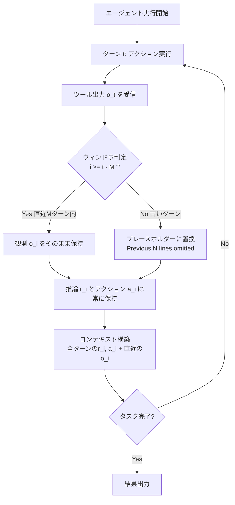

## 論文概要（Abstract）

LLMベースのエージェントは反復的な推論・探索・ツール使用を通じて複雑なタスクを解決するが、その過程で長大かつ高コストなコンテキスト履歴が生成される。JetBrains Researchの本論文は、**単純なObservation Masking（観測マスキング）戦略が、LLM要約と同等、場合によってはそれ以上のコスト効率**を達成することを5つのモデル構成で実証した。Qwen3-Coder 480Bでの実験では、Observation Maskingが解決率を+1.4%改善しながらコストを52.7%削減した。

この記事は [Zenn記事: LLMエージェントのContext Engineering実践：4戦略でトークンコスト50%削減](https://zenn.dev/0h_n0/articles/e918777f3aa87c) の深掘りです。

## 情報源

- **会議名**: NeurIPS 2025 Fourth Deep Learning for Code (DL4C) Workshop
- **arXiv ID**: 2508.21433
- **URL**: [https://arxiv.org/abs/2508.21433](https://arxiv.org/abs/2508.21433)
- **著者**: Tobias Lindenbauer, Igor Slinko, Ludwig Felder, Egor Bogomolov, Yaroslav Zharov
- **提出日**: 2025年8月29日（v3: 2025年10月27日）
- **コード**: [JetBrains-Research/the-complexity-trap](https://github.com/JetBrains-Research/the-complexity-trap)

## カンファレンス情報

**NeurIPS DL4C Workshop**について:
NeurIPS（Neural Information Processing Systems）は機械学習分野の最高峰会議の1つであり、DL4C（Deep Learning for Code）はソフトウェアエンジニアリングへのLLM適用に特化したワークショップである。本論文はソフトウェアエンジニアリングエージェントのコンテキスト管理という、近年急速に注目を集めるテーマを扱っている。

## 背景と動機

### コンテキスト膨張問題

LLMエージェントがツールを使って反復的にタスクを解決する際、各ターンのツール出力（observation）がコンテキストに蓄積される。SWE-benchのようなソフトウェアエンジニアリングタスクでは、ファイル読み取り・テスト実行・検索結果などの出力が**数万トークン**に達することが珍しくない。

この問題に対し、2つの主要なアプローチが存在する：

1. **Observation Masking**: 古いツール出力をプレースホルダーに置換する単純な戦略
2. **LLM Summarization**: LLMを使って過去の履歴を要約する高度な戦略

従来、LLM要約の方が情報を保持できるため優位と考えられていた。しかし本論文は、この直感が**「Complexity Trap（複雑性の罠）」**であることを実証する。

### なぜこの研究が重要か

エージェントの**コンテキスト管理のコスト**は、推論コストの大部分を占める。コスト削減は直接的にエージェントの実用性に影響するため、最適な戦略の選択はプロダクション展開において極めて重要である。

## 主要な貢献（Key Contributions）

- **貢献1**: SWE-bench Verified上でObservation MaskingとLLM Summarizationを5モデルで系統的に比較し、単純なMaskingが同等以上の効率を示すことを実証
- **貢献2**: LLM要約が**軌跡延長効果（Trajectory Elongation）**を引き起こし、失敗するエージェントが無駄にターンを消費する現象を発見
- **貢献3**: コード・データを公開し、再現性を確保

## 技術的詳細（Technical Details）

### Observation Maskingのアルゴリズム



エージェントの軌跡（trajectory）を以下のように形式化する：

$$
\tau_{t-1} = (o_{\text{sys}}, o_{\text{user}}, T_1, T_2, \ldots, T_{t-1})
$$

ここで、
- $o_{\text{sys}}$: システムプロンプト
- $o_{\text{user}}$: ユーザープロンプト
- $T_i = (r_i, a_i, o_i)$: 第$i$ターン（$r_i$: 推論、$a_i$: アクション、$o_i$: 観測）

Observation Maskingは、ウィンドウサイズ$M$を用いて古い観測を置換する：

$$
o'_i = \begin{cases} p_i & \text{if } i < t - M \\[6pt] o_i & \text{if } i \geq t - M \end{cases}
$$

ここで$p_i$はプレースホルダーテキスト（例: "Previous 8 lines omitted for brevity."）である。

**重要な設計判断**: 推論（$r_i$）とアクション（$a_i$）は**常に保持**される。マスクされるのはツール出力（$o_i$）のみである。これにより、エージェントの思考過程は失われず、行動の一貫性が維持される。

### LLM Summarizationのアルゴリズム

LLM要約は、パラメータ$N$（蓄積ターン数）と$M$（保持ターン数）を使用する：

1. 蓄積ターンが$N + M$に達したら要約をトリガー
2. 最後の要約から最新$M$ターンを除いた部分をスライス
3. 要約用LLMにスライスを入力し、新しい要約を生成
4. 履歴を再構築: `(system_prompt, user_prompt, summary, recent_turns)`

```python
def llm_summarization(
    trajectory: list[Turn],
    N: int = 21,        # 蓄積ターン数
    M: int = 10,        # 保持する直近ターン数
    summarizer_temp: float = 0.0,
) -> list[Turn]:
    """LLM要約によるコンテキスト圧縮

    Args:
        trajectory: エージェントの全軌跡
        N: 要約トリガーまでの蓄積ターン数
        M: 常に保持する直近ターン数
        summarizer_temp: 要約LLMの温度パラメータ

    Returns:
        圧縮された軌跡
    """
    if len(trajectory) < N + M:
        return trajectory  # 十分短い場合はそのまま

    # 要約対象のスライス（直近Mターンを除く）
    to_summarize = trajectory[:-M]
    recent = trajectory[-M:]

    # LLMで要約生成
    summary = summarizer_llm(
        prompt=SUMMARY_INSTRUCTION,
        content=to_summarize,
        temperature=summarizer_temp,
    )

    return [summary] + recent
```

### Observation Maskingの実装

```python
def observation_masking(
    trajectory: list[Turn],
    window_size: int = 10,
) -> list[Turn]:
    """Observation Maskingによるコンテキスト圧縮

    Args:
        trajectory: エージェントの全軌跡
        window_size: 保持する直近ターン数

    Returns:
        マスク適用後の軌跡
    """
    masked = []
    total = len(trajectory)

    for i, turn in enumerate(trajectory):
        if i >= total - window_size:
            # 直近ウィンドウ内: そのまま保持
            masked.append(turn)
        else:
            # 古いターン: 観測のみマスク、推論・アクションは保持
            masked.append(Turn(
                reasoning=turn.reasoning,
                action=turn.action,
                observation=f"Previous {len(turn.observation.splitlines())} lines omitted for brevity.",
            ))

    return masked
```

## 実験設定

### インフラストラクチャ

- **GPU**: NVIDIA H200 × 8台（各141GB HBM3e）
- **推論サーバー**: vLLM（Qwenモデル用）
- **API**: Vertex AI（Gemini用）

### モデル構成

| モデル | 思考モード | パラメータ数 |
|--------|-----------|------------|
| Qwen3-32B | thinking | 32B |
| Qwen3-32B | non-thinking | 32B |
| Qwen3-Coder 480B | - | 480B (MoE) |
| Gemini 2.5 Flash | thinking | 非公開 |
| Gemini 2.5 Flash | non-thinking | 非公開 |

### ハイパーパラメータ

- **ベンチマーク**: SWE-bench Verified（500インスタンス）
- **ターン上限**: 250
- **Observation Masking $M$**: 10
- **LLM Summary $N$**: 21, $M$: 10
- **エージェント温度**: 0.8
- **要約LLM温度**: 0.0

## 実験結果（Results）

### メイン結果

| モデル | 戦略 | 解決率 | 平均コスト | コスト削減率 |
|--------|------|--------|-----------|------------|
| Qwen3-Coder 480B | Raw（管理なし） | 53.4% | $1.29 | - |
| Qwen3-Coder 480B | **Obs. Masking** | **54.8%** | **$0.61** | **-52.7%** |
| Qwen3-Coder 480B | LLM Summary | 53.8% | $0.64 | -50.4% |
| Gemini 2.5 Flash | Raw（管理なし） | 32.8% | $0.41 | - |
| Gemini 2.5 Flash | **Obs. Masking** | **35.6%** | **$0.18** | **-56.1%** |
| Gemini 2.5 Flash | LLM Summary | 36.0% | $0.24 | -41.5% |

**核心的発見**: Observation Maskingは5構成中4構成でLLM要約以上のコスト効率を達成した。

### 要約コストのオーバーヘッド

LLM要約の生成コスト自体が総コストの**2.86〜7.20%**を占める。これは「無料でない圧縮」を意味し、特に小規模タスクでは相対的なオーバーヘッドが大きくなる。

### 軌跡延長効果（Trajectory Elongation）

本論文の最も興味深い発見の1つが、LLM要約が**軌跡延長効果**を引き起こすことである。

LLM要約は、失敗している軌跡の「失敗の兆候」を平滑化してしまう。その結果、エージェントは非生産的なループに留まり続け、軌跡がObservation Maskingと比較して**13〜15%長く**なる。

$$
\frac{|\tau_{\text{summary}}|}{|\tau_{\text{masking}}|} \approx 1.13 \text{ 〜 } 1.15
$$

この現象は**強力なモデル**（Qwen3-Coder 480B）でより顕著に現れる。著者らは「要約の平滑化された性質が、失敗している軌跡の兆候を隠蔽し、エージェントが非生産的なループに固執することを助長する」と分析している。

## 実装のポイント（Implementation）

### ウィンドウサイズの選択

実験では$M = 10$が使用されたが、最適値はタスク依存である：

- **短期タスク**（5〜20ターン）: $M = 5$で十分
- **中期タスク**（20〜100ターン）: $M = 10$が推奨（論文のデフォルト）
- **長期タスク**（100ターン以上）: $M = 15〜20$を検討

**注意**: $M$が小さすぎると、直前のツール呼び出しの結果が参照できなくなり、同じ操作を繰り返す「ループ」が発生する。

### プレースホルダーの設計

論文では `"Previous 8 lines omitted for brevity."` という簡潔なプレースホルダーを使用している。プレースホルダーに情報を詰め込みすぎると、Observation Maskingの利点（トークン削減）が失われるため、最小限に留めることが重要である。

### 実運用での推奨構成

```python
# 推奨: Observation Maskingをベースに、
# 重要な分岐点でのみLLM要約を挿入するハイブリッド
config = {
    "primary_strategy": "observation_masking",
    "window_size": 10,
    "hybrid_summary_trigger": "on_critical_juncture",
    "summary_model_temp": 0.0,
}
```

## 実運用への応用（Practical Applications）

### Zenn記事との関連

[Zenn記事](https://zenn.dev/0h_n0/articles/e918777f3aa87c)で紹介した4戦略（Write / Select / Compress / Isolate）のうち、本論文は**Compress戦略**の具体的な実装と定量評価を提供する。特にObservation Maskingは、Zenn記事で「最もコスト効率が高い手法」として紹介した手法そのものであり、本論文がその根拠となっている。

### プロダクション適用のポイント

1. **まずObservation Maskingから始める**: 実装が簡単（正規表現ベースの置換で実装可能）で効果が大きい
2. **LLM要約は慎重に**: 要約自体のコスト（2.86〜7.20%）と軌跡延長効果を考慮する
3. **ハイブリッド戦略**: 基本はMasking、重要な意思決定ポイントでのみ要約を生成
4. **モニタリング**: 軌跡長とコストを常時監視し、ループ検出を実装する

### コスト試算

月間10,000タスクを処理するエージェントシステムの場合：

| 戦略 | 月間コスト（概算） | 削減額 |
|------|-----------------|--------|
| Raw（管理なし） | $12,900 | - |
| Observation Masking | $6,100 | **$6,800/月** |
| LLM Summary | $6,400 | $6,500/月 |

## 関連研究（Related Work）

- **SWE-agent** (Yang et al., 2024): 本論文の実験基盤。ファイル閲覧ツールでのトランケーション機能を提供するが、系統的なコンテキスト管理は行わない
- **OpenHands** (Wang et al., 2024): LLM要約をデフォルトで使用するエージェントフレームワーク。本論文ではOpenHandsでの予備実験も報告
- **SWE-Search** (Antoniades et al., 2025): モンテカルロ木探索を使用したエージェント。観測マスキングを採用しているが、本論文のような系統的比較は行っていない
- **Cursor** (2024): 商用コーディングエージェント。LLM要約を使用するが、詳細は非公開

## まとめと今後の展望

### 主要な成果

本論文は、**単純なObservation Maskingが複雑なLLM要約と同等以上のコスト効率を持つ**ことを実証した。特にQwen3-Coder 480Bでは、Maskingが解決率+1.4%、コスト-52.7%という結果を達成し、「シンプルな方がよい」という設計原則を裏付けた。

### 実務への示唆

- コスト削減の第一手として**Observation Masking**（$M = 10$）を導入すべき
- LLM要約は「Complexity Trap」に陥りやすい。軌跡延長効果を必ずモニタリングする
- ハイブリッド戦略（Masking + 重要ポイントでの選択的要約）が将来の最適解

### 今後の研究方向

- 適応的トリガー（ループ検出、プラトー検出）による動的なウィンドウサイズ調整
- ソフトウェアエンジニアリング以外のドメイン（対話、検索、データ分析）への一般化
- 軽量な専用要約モデルの蒸留によるハイブリッド戦略の最適化

## 参考文献

- **arXiv**: [https://arxiv.org/abs/2508.21433](https://arxiv.org/abs/2508.21433)
- **Code**: [https://github.com/JetBrains-Research/the-complexity-trap](https://github.com/JetBrains-Research/the-complexity-trap)
- **Related Zenn article**: [https://zenn.dev/0h_n0/articles/e918777f3aa87c](https://zenn.dev/0h_n0/articles/e918777f3aa87c)
