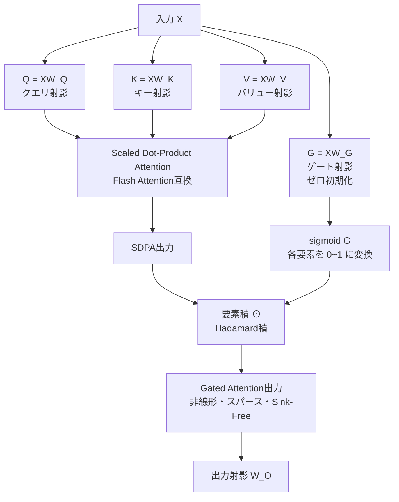

## 論文概要（Abstract）

本論文は、Scaled Dot-Product Attention（SDPA）の出力にsigmoidゲートを要素積で適用する「Gated Attention」を提案する。このシンプルな修正が3つの理論的・実験的利点をもたらすことを示した：(1) sigmoidゲートがデータ依存であるため、非線形アテンションと等価になる、(2) トークン次元でスパースな出力を生成する、(3) Attention Sink（BOS等への過剰なアテンション集中）を解消できる。15B MoEモデル30変種と1.7B Denseモデルを3.5兆トークンで学習した大規模実験で、一貫した性能向上を確認した。本手法はQwen3-Nextアーキテクチャに正式採用され、NeurIPS 2025最優秀論文賞を受賞した。

この記事は [Zenn記事: Qwen3.5徹底解説：397B MoEモデルをvLLMでデプロイする実践ガイド](https://zenn.dev/0h_n0/articles/657d35a2bbf71d) の深掘りです。

## 情報源

- **会議名**: NeurIPS 2025（最優秀論文賞 / Oral）
- **年**: 2025
- **URL**: [https://arxiv.org/abs/2505.06708](https://arxiv.org/abs/2505.06708)
- **著者**: Zihao Zeng, Qiuzhi Liu, Jianghan Shen, Xingyu Xie, Mingzhen Li, Tong Wu, Zhengzhong Liu, Eric P. Xing
- **発表形式**: Oral + Best Paper Award

## カンファレンス情報

**NeurIPS 2025について**: Neural Information Processing Systems（NeurIPS）は機械学習・人工知能分野の最高峰国際会議の1つ。採択率は通常25〜30%程度で、さらにBest Paper賞は数千本の採択論文から数本のみに授与される。本論文はQwenチームによる体系的なアテンション機構の研究として、この最高栄誉を受賞した。

## 技術的詳細（Technical Details）

### 標準SDPAの限界

標準のScaled Dot-Product Attention（SDPA）には3つの構造的な限界がある：

**1. 線形性**: ソフトマックス正規化後の出力は$V$（バリューベクトル）の凸結合、つまり線形結合に過ぎない。非線形性はFFN（Feed-Forward Network）層でのみ導入され、アテンション機構自体は線形変換にとどまる。

**2. 非スパース性**: ソフトマックスの出力は全ての位置に対して厳密に正（$\alpha_{ij} > 0\ \forall i, j$）。意味のないトークンにも必ず非ゼロの重みが割り当てられる。

**3. Attention Sink現象**: BOS（beginning-of-sequence）トークン等のシンクトークンに多くのヘッドで不釣り合いに大きなアテンション重みが集中し、下流層に不正確な情報が伝搬される問題。

### Gated Attentionの定式化



入力$X \in \mathbb{R}^{n \times d}$（$n$トークン、隠れ次元$d$）に対し：

**標準SDPA**:

$$
Q = XW_Q, \quad K = XW_K, \quad V = XW_V
$$

$$
\text{SDPA}(Q, K, V) = \text{softmax}\left(\frac{QK^\top}{\sqrt{d_k}}\right)V
$$

**Gated Attention**:

$$
G = XW_G \in \mathbb{R}^{n \times d}
$$

$$
\text{GatedAttn}(Q, K, V) = \sigma(G) \odot \text{SDPA}(Q, K, V)
$$

ここで、
- $W_G \in \mathbb{R}^{d \times d}$: ゲート用の学習可能な射影行列
- $\sigma(\cdot)$: 要素ごとのsigmoid関数（各要素を$(0, 1)$に写像）
- $\odot$: 要素積（Hadamard積）

ゲートは入力$X$から独立に計算されるが、$X$に依存するため**データ依存的**な変換となる。

### マルチヘッド版

各ヘッド$h$が独自のゲート射影$W_{G_h}$を持つ：

$$
G_h = XW_{G_h} \in \mathbb{R}^{n \times d_h}, \quad d_h = d / H
$$

$$
\text{GatedMHA}_h = \sigma(G_h) \odot \text{SDPA}(Q_h, K_h, V_h)
$$

GQA（Grouped Query Attention）との組み合わせも可能で、KVヘッド数が少なくてもゲートはクエリヘッド数を維持する。

### 理論的分析

#### 非線形アテンションとの等価性（Theorem 1）

位置$i$での出力を展開すると：

$$
\text{Out}_i = \sigma(G_i) \odot \sum_j \alpha_{ij} V_j = \sum_j \alpha_{ij} (\sigma(G_i) \odot V_j)
$$

$\sigma(G_i) \odot V_j$は入力位置$i$に依存する非線形変換であり、標準SDPAの線形な凸結合を超える表現力を持つ。FFN層を待たずにアテンション機構内部で非線形表現が可能になる。

#### Attention Sink解消メカニズム（Theorem 2）

標準アテンションでは、たとえBOSトークンに大きな$\alpha_{i,\text{BOS}}$が割り当てられても出力を抑制できない：

$$
\text{SDPA}_i = \alpha_{i,\text{BOS}} V_{\text{BOS}} + \sum_{j \neq \text{BOS}} \alpha_{ij} V_j
$$

Gated Attentionでは、ゲートがBOS位置で$\sigma(G_{\text{BOS}}) \approx 0$を学習すれば：

$$
\text{GatedAttn}_{\text{BOS}} = \sigma(G_{\text{BOS}}) \odot \text{SDPA}_{\text{BOS}} \approx 0
$$

BOSがアテンションを受けること自体は妨げないが、**BOSが下流に情報を伝搬することを出力側で遮断**する。StreamingLLMがシンクの存在を前提としてシステムを設計したのに対し、Gated Attentionはシンク問題を根本的に解消する異なるアプローチを取る。

#### スパース性の実証

学習済みモデルでのゲート値分布：
- **シンクトークン（BOS等）**: 中央値 ~0.05、ゼロ近傍に集中
- **コンテンツトークン**: $(0.3, 0.8)$の範囲に分散
- **実効スパース率**（ゲート値 < 0.1）: 深い層で全トークン位置の15〜20%

## 実験設定と結果

### 大規模ハイパーパラメータ探索

30種類の15B MoE（2.5B活性化）モデルと1.7B Denseモデルを3.5兆トークンで学習。探索した軸：

| 軸 | 変種 |
|----|------|
| ゲート初期化 | ゼロ初期化 / ランダム / ones初期化 |
| ゲート位置 | SDPA後 / SDPA前 / V のみ |
| ゲート正規化 | なし / Layer Norm |
| ゲート共有 | ヘッドごと / 共有 |
| Sigmoid変種 | 標準sigmoid / hard sigmoid / SiLU |

### 最適構成

- **初期化**: ゼロ初期化（$W_G = 0$、学習開始時は標準SDPA相当 → 安定）
- **位置**: SDPA後（出力に適用）
- **正規化**: なし（Layer Normは過正則化）

### ダウンストリームタスク改善（15B MoE、標準SDPA対比）

| ベンチマーク | 改善幅 |
|-------------|--------|
| MMLU | +0.5〜1.5% |
| MATH | +1〜3% |
| HumanEval | +0.5〜2% |
| GSM8K | +1〜2% |
| ARC-Challenge | +0.3〜1% |
| HellaSwag | +0.2〜0.8% |

### 長文コンテキスト外挿

| 評価 | 結果 |
|------|------|
| RULER | 訓練長を超える文脈長で標準SDPAを大幅に上回る |
| Needle-in-a-Haystack | 全文脈長で高精度、特に32K超で顕著な差 |
| 評価範囲 | 4K / 8K / 16K / 32K / 64K / 128K トークン |

Attention Sinkが解消されることで、長文でのアテンション容量が関連情報の検索に集中でき、文脈長外挿性能が大幅に向上する。

## 実装のポイント（Implementation）

### Flash Attentionとの互換性

Gated Attentionの大きな実装上の利点は、**Flash Attentionカーネルの変更が不要**な点にある。ゲートはSDPA出力に適用されるため、内部のFlash Attentionカーネルはそのまま使用できる。

```python
import torch
import torch.nn as nn
from flash_attn import flash_attn_func

class GatedAttention(nn.Module):
    """Gated Attention Module

    SDPA出力にsigmoidゲートを適用。Flash Attentionと互換。

    Args:
        d_model: モデル隠れ次元
        n_heads: ヘッド数
    """
    def __init__(self, d_model: int, n_heads: int):
        super().__init__()
        self.n_heads = n_heads
        self.d_head = d_model // n_heads
        self.W_q = nn.Linear(d_model, d_model, bias=False)
        self.W_k = nn.Linear(d_model, d_model, bias=False)
        self.W_v = nn.Linear(d_model, d_model, bias=False)
        self.W_g = nn.Linear(d_model, d_model, bias=False)  # ゲート射影
        self.W_o = nn.Linear(d_model, d_model, bias=False)

        # ゼロ初期化（学習初期は標準SDPA相当）
        nn.init.zeros_(self.W_g.weight)

    def forward(self, x: torch.Tensor) -> torch.Tensor:
        """Forward pass

        Args:
            x: (batch, seq_len, d_model)
        Returns:
            (batch, seq_len, d_model)
        """
        B, T, D = x.shape
        q = self.W_q(x).view(B, T, self.n_heads, self.d_head)
        k = self.W_k(x).view(B, T, self.n_heads, self.d_head)
        v = self.W_v(x).view(B, T, self.n_heads, self.d_head)

        # Flash Attention（カーネル変更なし）
        attn_out = flash_attn_func(q, k, v, causal=True)

        # Sigmoidゲート適用（出力側のみ）
        gate = torch.sigmoid(self.W_g(x)).view(B, T, self.n_heads, self.d_head)
        gated_out = gate * attn_out

        # 最終射影
        gated_out = gated_out.view(B, T, D)
        return self.W_o(gated_out)
```

### パラメータオーバーヘッド

ゲートは1つの線形射影$W_G \in \mathbb{R}^{d \times d}$をアテンション層ごとに追加する。$L$層のモデル全体で約**3〜5%のパラメータ増**。KVキャッシュへの影響はなく、量子化もゲートを独立に処理可能。

### 実装上の注意点

- **ones初期化は絶対に避ける**: 学習初期に崩壊する
- **Layer Normをゲートに追加しない**: 過正則化で性能低下
- **ゲートはSDPA後に配置**: 入力側や$V$のみへの適用は効果が弱い

## Qwen3-Next / Qwen3.5への統合

Gated Attentionは**Qwen3-Nextアーキテクチャ**に正式採用されている：

- 全アテンション層にGated Attentionを適用（一部ではなく全層）
- ゼロ初期化により既存の学習済みチェックポイントからの安全な移行が可能
- GQA / RoPE / Flash Attentionとの互換性を維持

Qwen3.5-397B-A17Bでは、60層中15層がFull Attention（Gated Attention付き）層であり、このゲーティングメカニズムがAttention Sink解消と長文脈外挿の基盤となっている。

## 査読者の評価（Peer Review Insights）

NeurIPS 2025 Best Paper / Oralとして採択された本論文について、OpenReviewでの評価コメントの要点：

- 「極めてシンプルな修正でありながら、理論的裏付けと大規模実験の両方で説得力がある」
- 「30変種のMoEモデルを3.5Tトークンで学習した実験規模は、この種の研究としては異例」
- 「Qwen3-Nextへの実際の採用が、提案手法の産業的価値を実証している」

## まとめ

Gated Attentionは「SDPA出力にsigmoidゲートを掛ける」という最もシンプルな修正で、非線形性・スパース性・Attention Sink解消の3つを同時に達成した。30種類のMoEモデルバリアントによる網羅的な検証と、Qwen3-Nextでの正式採用が、この手法の堅牢性と実用性を裏付けている。

Qwen3.5のFull Attention層（4層に1層）がこのGated Attentionを採用しており、Gated DeltaNet層と組み合わせることで256Kコンテキストの高速推論と高精度を両立している。

## 参考文献

- **Conference URL**: [https://arxiv.org/abs/2505.06708](https://arxiv.org/abs/2505.06708)
- **OpenReview**: [https://openreview.net/forum?id=1b7whO4SfY](https://openreview.net/forum?id=1b7whO4SfY)
- **Code**: [https://github.com/qiuzh20/gated_attention](https://github.com/qiuzh20/gated_attention)
- **Related Zenn article**: [https://zenn.dev/0h_n0/articles/657d35a2bbf71d](https://zenn.dev/0h_n0/articles/657d35a2bbf71d)

---

:::message
この記事はAI（Claude Code）により自動生成されました。内容の正確性については元論文と照合して検証していますが、実際の利用時は公式ドキュメントもご確認ください。
:::
