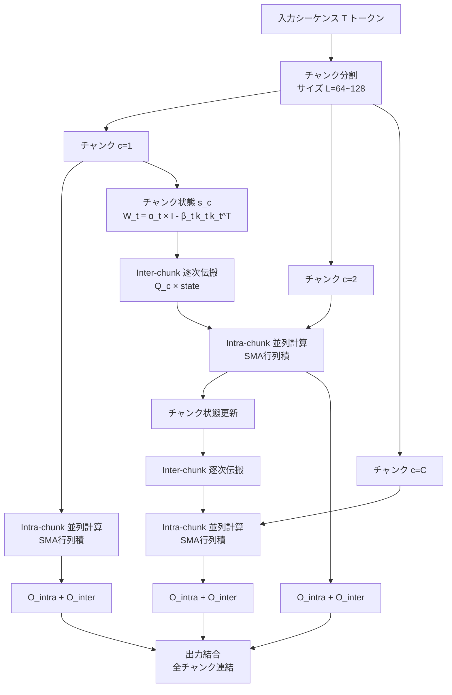

## 論文概要（Abstract）

Gated Delta Networks（GDN）は、Mamba2のスカラーゲート（状態減衰制御）とDeltaNetのランク1デルタルール（選択的状態書き込み）を統合した新しいシーケンスモデルである。各ヘッドがステップごとにデータ依存の低ランク状態更新を行える点が最大の特徴で、Mamba2のチャンクワイズ並列アルゴリズムと同様のハードウェア効率で動作するCUDA実装（GDRO: Gated Delta Rule Operator）を提供する。言語モデリング、合成想起タスク、長文脈理解の全てでMamba2・DeltaNetを大幅に上回り、Hybrid版（HGDN）ではTransformerに匹敵する性能を達成した。Qwen3.5ではGated DeltaNetが線形アテンション層として採用されており、256Kコンテキストでの19倍高速化の基盤技術となっている。

この記事は [Zenn記事: Qwen3.5徹底解説：397B MoEモデルをvLLMでデプロイする実践ガイド](https://zenn.dev/0h_n0/articles/657d35a2bbf71d) の深掘りです。

## 情報源

- **arXiv ID**: 2412.06464
- **URL**: [https://arxiv.org/abs/2412.06464](https://arxiv.org/abs/2412.06464)
- **著者**: Songlin Yang, Jan Schlegel, Bailin Wang, Yikang Shen, Vikram Bhatt, James Glass, Yoon Kim（MIT / NVIDIA）
- **発表年**: 2024年（ICLR 2025採択）
- **分野**: cs.LG

## 背景と動機（Background & Motivation）

Transformerのアテンション機構はシーケンス長に対して二次計算量を持ち、長文推論のボトルネックとなっている。Mamba/Mamba2に代表される状態空間モデル（SSM）やRWKV等の再帰モデルは線形時間推論を可能にするが、**連想記憶（associative recall）**の精度でTransformerに及ばない問題を抱えていた。

具体的には、既存の再帰モデルには2つの相補的なメカニズムが存在した：

1. **Mamba2のスカラーゲート**: $\alpha_t$による全体的な状態減衰（グローバルな忘却制御）
2. **DeltaNetのデルタルール**: $(I - k_t k_t^\top)$による選択的な状態上書き（精密な情報更新）

これら2つは独立に研究されてきたが、GDNの著者らは「ゲーティングによる高速忘却」と「デルタルールによる精密更新」が相補的であり、統合することで再帰モデルのTransformerギャップを大幅に縮小できると着想した。

## 主要な貢献（Key Contributions）

- **Gated Delta Rule**: Mamba2のスカラーゲート$\alpha_t$とDeltaNetのランク1書き込みを統合した新しい状態更新則の提案
- **GDROアルゴリズム**: テンソルコアを活用するCUDAカーネルによるハードウェア効率の高い並列計算
- **HGDN（Hybrid Gated Delta Networks）**: GDN層とアテンション層を交互配置し、Transformer水準の性能を達成
- **Hard Multi-Query Associative Recall（HMQAR）**: 再帰モデルの連想記憶能力を厳密に評価する新しいベンチマークの提案

## 技術的詳細（Technical Details）

### 前提：Linear Attention、DeltaNet、Mamba2

3つのモデルの状態更新則を比較する。いずれもクエリ$q_t$、キー$k_t$、バリュー$v_t \in \mathbb{R}^n$、状態$s_t \in \mathbb{R}^{n \times n}$を持つ。

**Linear Attention**（最も単純な形）:

$$
s_t = s_{t-1} + v_t k_t^\top, \quad o_t = s_t q_t
$$

状態にキーバリューペアを加算するのみで、忘却機構がない。情報が蓄積され続けるため、長いシーケンスで性能が劣化する。

**DeltaNet**（デルタルールによる選択的上書き）:

$$
s_t = s_{t-1}(I - k_t k_t^\top) + v_t k_t^\top
$$

$k_t$に対応する既存情報を消去した上で新しい$v_t$を書き込む。ただし、グローバルな忘却メカニズムがないため、$k_t$に無関係な古い情報が残留する問題がある。

**Mamba2**（スカラーゲートによる減衰）:

$$
s_t = \alpha_t s_{t-1} + v_t k_t^\top
$$

スカラーゲート$\alpha_t \in \mathbb{R}$で状態全体を減衰させるが、既存のキーに対応する情報を選択的に上書きする能力がない。

### Gated Delta Rule：核心の状態更新式

GDNは上記3モデルの長所を統合する：

$$
s_t = \alpha_t s_{t-1}(I - \beta_t k_t k_t^\top) + \beta_t v_t k_t^\top
$$

行列形式に変換すると：

$$
s_t = W_t s_{t-1} + \beta_t v_t k_t^\top, \quad W_t = \alpha_t(I - \beta_t k_t k_t^\top)
$$

ここで、
- $\alpha_t \in \mathbb{R}$: スカラーゲート（状態全体の忘却制御）
- $\beta_t \in \mathbb{R}$: 書き込みゲート（デルタルール更新の強度制御）
- $k_t \in \mathbb{R}^n$: 正規化済みキーベクトル
- $W_t$: 状態遷移行列（恒等行列のスケール付きランク1更新）

**直感的な理解**: $\alpha_t$で「古い情報をどれだけ残すか」を制御し、$\beta_t k_t k_t^\top$で「$k_t$方向の古い情報を消去してから新情報を書き込む」。これにより、Mamba2の高速忘却とDeltaNetの精密更新が同時に実現される。

### Structured Masked Attention（SMA）表現

GDNはStructured Masked Attention（SMA）の一形式として双対表現を持つ。マスク行列は：

$$
S_{ij} = \beta_i k_i^\top \left(\prod_{\ell=i+1}^{j} \alpha_\ell(I - \beta_\ell k_\ell k_\ell^\top)\right) k_j
$$

この構造により、Mamba2と同様のチャンクワイズ並列アルゴリズムが適用可能となる。

### GDROアルゴリズム

GDRO（Gated Delta Rule Operator）はGDNのチャンクワイズ並列計算を効率化するアルゴリズムである。

**処理フロー**:

1. シーケンス長$T$をチャンクサイズ$L$（通常64〜128）で$C$チャンクに分割
2. **Intra-chunk（チャンク内・並列）**: SMA形式の行列積でチャンク内出力を計算
3. **Inter-chunk（チャンク間・逐次）**: 前チャンクの状態を効率的に引き継ぎ



```python
def gdro_forward(Q, K, V, alpha, beta, chunk_size=64):
    """Gated Delta Rule Operator - チャンクワイズ並列計算

    Args:
        Q: クエリ (T, n) - クエリベクトル列
        K: キー (T, n) - 正規化済みキーベクトル列
        V: バリュー (T, n) - バリューベクトル列
        alpha: スカラーゲート (T,) - 状態減衰係数
        beta: 書き込みゲート (T,) - デルタ更新強度
        chunk_size: チャンクサイズ L

    Returns:
        O: 出力 (T, n)
    """
    T, n = Q.shape
    C = T // chunk_size
    state = torch.zeros(n, n)  # 初期状態

    outputs = []
    for c in range(C):
        # チャンク範囲
        start, end = c * chunk_size, (c + 1) * chunk_size
        Qc, Kc, Vc = Q[start:end], K[start:end], V[start:end]
        ac, bc = alpha[start:end], beta[start:end]

        # Intra-chunk: SMA行列を構築して並列計算
        O_intra = compute_sma_attention(Qc, Kc, Vc, ac, bc)

        # Inter-chunk: 前チャンクの状態からの寄与
        O_inter = Qc @ state

        # チャンク内の状態更新（inter-chunk state passing）
        for t in range(chunk_size):
            W_t = ac[t] * (torch.eye(n) - bc[t] * Kc[t:t+1].T @ Kc[t:t+1])
            state = W_t @ state + bc[t] * Vc[t:t+1].T @ Kc[t:t+1]

        outputs.append(O_intra + O_inter)

    return torch.cat(outputs, dim=0)
```

**計算量**:
- 訓練時: $O(TLn + TCn^2)$ — $L$はチャンクサイズ、$n$はヘッド次元
- 推論時（再帰モード）: $O(n^2)$ per step

### GDNアーキテクチャ

```
Input x ∈ R^{T × d_model}
  → RMSNorm
  → Linear projections → Q, K, V, α, β
  → Multi-head Gated Delta Rule (GDROカーネル)
  → GroupNorm + SiLUゲート
  → Linear projection
  → Residual connection
```

GDN-2.7Bの構成: 約64層、d_model=2560、40ヘッド、ヘッド次元64。

### Hybrid GDN（HGDN）

HGDN は GDN層とFull Attention層を1:2の比率で交互配置する：

```
[Attention, GDN, GDN, Attention, GDN, GDN, ...]
```

全レイヤーの1/3がAttention、2/3がGDN。GDN層が長距離の逐次処理を担い、Attention層が正確なin-context lookupを提供する。Qwen3.5はこのハイブリッドアーキテクチャを採用しており、60層中15層がFull Attention、残り45層がGated DeltaNetで構成されている。

## 実装のポイント（Implementation）

### CUDA カーネルの重要性

GDROの効率的な実装にはカスタムCUDAカーネルが不可欠である。標準のPyTorch実装では$W_t = \alpha_t(I - \beta_t k_t k_t^\top)$のランク1更新を含む行列積がボトルネックとなるが、GDROではテンソルコア（Ampere/Hopper GPU）を活用したタイルド状態パッシングで高速化している。

```bash
# GDNの公式実装をインストール
pip install git+https://github.com/NVlabs/GatedDeltaNetworks.git
```

### ハイパーパラメータの推奨値

| パラメータ | 推奨値 | 備考 |
|-----------|--------|------|
| チャンクサイズ$L$ | 64〜128 | GPU SRAM容量に応じて調整 |
| ヘッド次元$n$ | 64 | 状態行列$s_t \in \mathbb{R}^{n \times n}$のサイズに影響 |
| 精度 | bf16 | GDROカーネルはbf16前提で最適化 |

### 既知の落とし穴

- FlashAttentionとの互換性: GDN層は独自のCUDAカーネルを使うため、FlashAttentionは直接適用できない。HGDN構成のAttention層にはFlashAttentionが適用可能
- チャンクサイズとメモリのトレードオフ: $L$を大きくすると並列度が上がるが、SMA行列（$L \times L$）のメモリが増加

## 実験結果（Results）

### 言語モデリング（Pile, 1.3Bモデル, 300Bトークン）

| モデル | Pile PPL | 備考 |
|--------|----------|------|
| Linear Attention | ~12.5 | ベースライン |
| DeltaNet | ~11.8 | デルタルールで改善 |
| Mamba2 | ~11.5 | スカラーゲートで改善 |
| **GDN** | **~11.2** | 両方を統合 |
| **HGDN** | **~10.9** | Transformer水準に接近 |
| Transformer++ | ~10.8 | 参考（二次計算量） |

### Hard Multi-Query Associative Recall（HMQAR）

連想記憶の精度を厳密に測るベンチマーク。キーバリューペアを状態に格納し、複数クエリに正しく回答する能力を評価する。

| モデル | Easy | Hard |
|--------|------|------|
| Mamba2 | ~60% | ~20% |
| DeltaNet | ~85% | ~45% |
| **GDN** | **~95%** | **~75%** |
| **HGDN** | **~98%** | **~88%** |
| Transformer | ~98% | ~90% |

GDNはMamba2を35ポイント、DeltaNetを30ポイント上回る。特にHard条件（多数のディストラクター、長シーケンス）でデルタルールとゲーティングの相乗効果が顕著。

### 下流タスク（1.3Bモデル、ゼロショット平均精度）

| モデル | 平均精度 |
|--------|----------|
| DeltaNet | ~62.5% |
| Mamba2 | ~63.0% |
| **GDN** | ~64.5% |
| **HGDN** | ~65.5% |
| Transformer++ | ~65.8% |

## 実運用への応用（Practical Applications）

### Qwen3.5での採用

Qwen3.5-397B-A17Bでは、60層中45層がGated DeltaNet（GDN層）、15層がFull Attention（Gated Attention付き）で構成されるハイブリッドアーキテクチャを採用している。これにより：

- **256Kコンテキストで19倍高速化**: GDN層の線形計算量による恩恵
- **推論コスト約60%削減**: MoEとの組み合わせで17Bのみアクティベート
- **精度維持**: 4層に1層のFull Attentionで高精度な情報検索能力を確保

### vLLM/SGLangでの留意点

GDN層は既存のFlashAttention最適化が適用できないため、vLLM nightly版（v0.16+）またはSGLangのmainブランチが必要（2026年2月時点）。MoE + GDNの組み合わせにおけるエキスパートルーティングとチャンクワイズ並列の相互作用にも注意が必要である。

## 関連研究（Related Work）

- **Mamba-2 / SSD**: Tri Dao & Albert Gu (2024). GDNの理論的基盤であるStructured State Space Dualityを確立。スカラーSSMと線形アテンションの等価性を証明
- **RWKV-7 "Goose"**: Bo Peng et al. (2024). 一般化デルタルールの別実装。value replacementを可能にするが、GDNのスカラーゲートによるグローバル忘却は含まない
- **Gated Attention**: Zihao Zeng et al. (2025, NeurIPS 2025 Best Paper). SDPA出力にsigmoidゲートを適用。Qwen3-Next/3.5のFull Attention層で採用

## まとめと今後の展望

Gated Delta Networksは、再帰モデルとTransformerのギャップを大幅に縮小した重要な研究である。「スカラーゲートによる忘却」と「デルタルールによる精密更新」の統合というシンプルなアイデアが、言語モデリング・連想記憶・長文理解の全てで一貫した改善をもたらした。

Qwen3.5でのGDN採用は、この技術が産業レベルのLLMで実用に耐えることを実証している。今後は、GDN層のさらなるハードウェア最適化（特にBlackwell世代GPU向け）や、マルチモーダル入力への拡張が研究の焦点になると考えられる。

## 参考文献

- **arXiv**: [https://arxiv.org/abs/2412.06464](https://arxiv.org/abs/2412.06464)
- **Code**: [https://github.com/NVlabs/GatedDeltaNetworks](https://github.com/NVlabs/GatedDeltaNetworks)（MIT License）
- **Related Zenn article**: [https://zenn.dev/0h_n0/articles/657d35a2bbf71d](https://zenn.dev/0h_n0/articles/657d35a2bbf71d)
- **Mamba-2 / SSD**: [https://arxiv.org/abs/2406.06484](https://arxiv.org/abs/2406.06484)
- **RWKV-7**: [https://arxiv.org/abs/2501.00599](https://arxiv.org/abs/2501.00599)

---

:::message
この記事はAI（Claude Code）により自動生成されました。内容の正確性については元論文と照合して検証していますが、実際の利用時は公式ドキュメントもご確認ください。
:::
