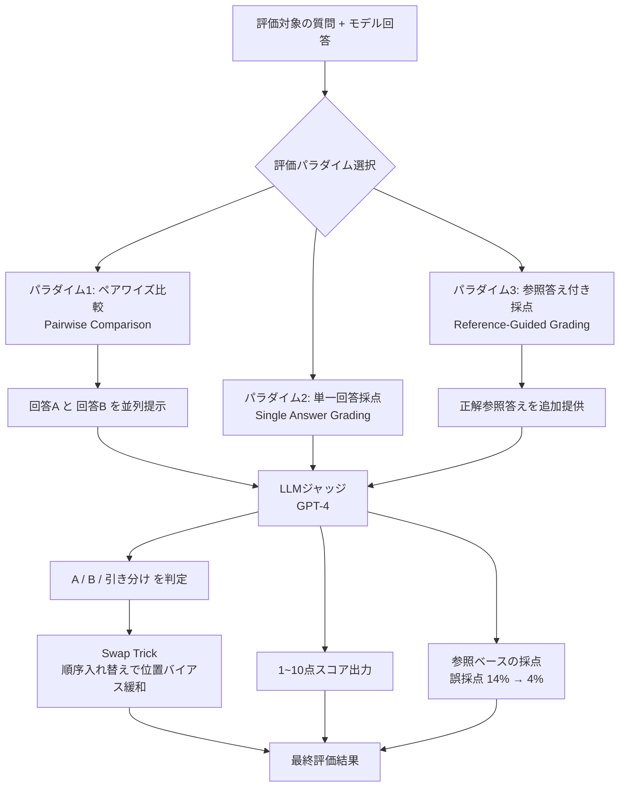

## 論文概要（Abstract）

LLMベースのチャットアシスタントの評価は、その広範な能力と既存ベンチマークの不十分さのため困難です。本論文は「強力なLLM（GPT-4）を審判（Judge）として使う」アプローチを体系的に研究し、MT-Bench（80問のマルチターンベンチマーク）とChatbot Arena（クラウドソーシング型対戦プラットフォーム）の2つの評価フレームワークを提案しました。GPT-4 Judgeは人間評価者との一致率85.6%を達成し、これは人間同士の一致率81.1%を上回ります。NeurIPS 2023 Datasets and Benchmarks Track に採択された、LLM評価分野の基盤論文です。

この記事は [Zenn記事: LLMのA/Bテスト戦略：プロンプト改善サイクルを3倍速にする実践ガイド](https://zenn.dev/0h_n0/articles/d86aba5cf2c154) の深掘りです。

## 情報源

- **arXiv ID**: 2306.05685
- **URL**: [https://arxiv.org/abs/2306.05685](https://arxiv.org/abs/2306.05685)
- **著者**: Lianmin Zheng, Wei-Lin Chiang, Ying Sheng et al.（UC Berkeley / CMU / LMSYS）
- **発表年**: 2023（NeurIPS 2023 Datasets and Benchmarks Track）
- **分野**: cs.CL, cs.AI

## 背景と動機（Background & Motivation）

LLMの急速な進化により、チャットアシスタントの品質評価が重大な課題となっています。従来の評価手法には3つの構造的問題があります。

**1. クローズドフォーム型ベンチマークの限界**：MMLU、HellaSwag、ARC等の既存ベンチマークは多肢選択式の問題で知識・推論能力を測定しますが、会話能力や指示追従能力を評価できません。また、人間の選好（preference）との相関が低いことが知られています。

**2. 人手評価のスケーラビリティ問題**：人間による評価は品質は高いものの、1,000比較あたり4,000〜8,000ドルのコストと数日〜数週間の時間がかかり、大規模な評価には適していません。

**3. Goodhart's Law**：ベンチマークスコアの最大化がゴールとなり、スコアが上がっても実際のユーザー体験は改善されないという乖離が生じます。

本論文はこれらの問題に対し、GPT-4のような強力なLLMを「自動審判」として使うアプローチを提案し、その有効性と限界を体系的に検証しました。

## 主要な貢献（Key Contributions）

- **貢献1**: MT-Bench（8カテゴリ×10問=80問のマルチターンベンチマーク）の設計と公開
- **貢献2**: LLM-as-a-Judgeの3つのパラダイム（ペアワイズ比較・単一回答採点・参照答え付き採点）の体系的検証
- **貢献3**: 3種類のバイアス（位置・冗長性・自己強化）の定量的分析と緩和策の提案
- **貢献4**: GPT-4 Judgeが人間評価者間の一致率（81.1%）を超える85.6%を達成することの実証

## 技術的詳細（Technical Details）

### LLM-as-a-Judgeの3つのパラダイム



本論文は、LLMを審判として使う3つの異なるアプローチを定義し、それぞれの特性を検証しています。

#### パラダイム1: ペアワイズ比較（Pairwise Comparison）

2つのモデルの回答を並べて「どちらが良いか」を判定するアプローチです。人間にとっても最も自然な評価方法ですが、**位置バイアス**（先に提示された回答を好む傾向）が生じます。

ジャッジプロンプトの核心部分を以下に示します：

```text
[System]
Please act as an impartial judge and evaluate the quality of the
responses provided by two AI assistants to the user question
displayed below. You should choose the assistant that follows the
user's instructions and answers the user's question better. Your
evaluation should consider factors such as the helpfulness, relevance,
accuracy, depth, creativity, and level of detail of their responses.
Begin your evaluation by comparing the two responses and provide a
short explanation. Avoid any positional biases and ensure that the
order in which the responses were presented does not influence your
decision. Do not allow the length of the responses to influence your
evaluation. Be as objective as possible. After providing your
explanation, output your final verdict by strictly following this
format: "[[A]]" if assistant A is better, "[[B]]" if assistant B is
better, and "[[C]]" for a tie.
```

注目すべき設計要素：
- 6つの評価軸（helpfulness, relevance, accuracy, depth, creativity, detail）を明示
- 「位置バイアスを避けよ」「長さに影響されるな」という明示的指示を含む
- 出力フォーマットを `[[A]]`/`[[B]]`/`[[C]]` に厳密に制約

#### パラダイム2: 単一回答採点（Single Answer Grading）

1つの回答を1〜10点のスケールで絶対評価するアプローチです。位置バイアスを排除できますが、モデル間の微妙な差を区別する精度が低下します。

#### パラダイム3: 参照答え付き採点（Reference-Guided Grading）

単一回答採点に加えて、正解（参照答え）をジャッジに提供するアプローチです。数学・コーディング問題で特に有効であり、参照答えなしでは14%あった誤採点を約4%に低減できました。

### MT-Bench: 80問の設計

MT-Benchは8カテゴリ×10問=80問で構成される、マルチターン（2ターン）ベンチマークです。

| カテゴリ | 問数 | 特性 |
|---------|------|------|
| Writing | 10 | エッセイ・手紙・物語・詩の創造的文章 |
| Roleplay | 10 | 特定ペルソナ・役割を演じる能力 |
| Extraction | 10 | 非構造化テキストからの情報抽出 |
| Reasoning | 10 | 論理パズル・演繹推論・分析問題 |
| Math | 10 | 計算・証明を要する数学問題 |
| Coding | 10 | 複数言語のプログラミング・デバッグ |
| STEM | 10 | 物理・化学・生物・工学の科学問題 |
| Humanities | 10 | 歴史・哲学・法律・社会科学 |

各問はTurn 1（初期質問）とTurn 2（フォローアップ）の2ターン構造で、Turn 2はTurn 1の文脈理解を必須とする設計です。例えば：

- **Writing Turn 1**: 「ハワイ旅行について文化体験と必見スポットを盛り込んだ旅行ブログ記事を書いてください」
- **Writing Turn 2**: 「前の回答を書き直してください。すべての文をAで始めてください」

この2ターン設計により、単なる単発回答の品質だけでなく、指示への追従能力と文脈保持能力を同時に評価できます。

## 実験結果（Results）

### MT-Benchスコア（GPT-4 Judge、1-10点）

| Model | Writing | Roleplay | Math | Coding | Average |
|-------|---------|----------|------|--------|---------|
| GPT-4 | 9.25 | 8.35 | 7.91 | 7.92 | **8.99** |
| GPT-3.5-Turbo | 8.50 | 8.00 | 6.08 | 6.67 | **7.94** |
| Claude-v1 | 8.15 | 8.35 | 5.67 | 5.17 | **7.90** |
| Vicuna-13B | 7.57 | 7.80 | 4.00 | 4.40 | **6.57** |
| LLaMA-13B | 5.33 | 5.73 | 2.25 | 2.83 | **4.53** |

注目すべき傾向：Math/CodingカテゴリでGPT-4と他モデルの差が最も大きく（GPT-4: 7.91/7.92 vs Vicuna: 4.00/4.40）、Writing/Humanitiesでは差が相対的に小さい（GPT-4: 9.25 vs Vicuna: 7.57）。

### ジャッジの人間一致率

| 一致ペア | 一致率 |
|---------|--------|
| GPT-4 judge vs. Human | **85.6%** |
| Human vs. Human（評価者間） | **81.1%** |
| GPT-3.5-Turbo judge vs. Human | 72.4% |
| Claude-v1 judge vs. Human | 70.3% |

GPT-4 Judgeは人間同士の一致率（81.1%）を4.5ポイント上回る85.6%を達成しました。測定方法は、11名のCS/ML専門家に質問と2つの回答（モデル名非表示）を提示し、3名以上の多数決を正解として3,300件の判定で算出しています。

### MT-BenchとChatbot Arenaの相関

| 相関指標 | 値 |
|---------|---|
| Spearman相関係数 | **0.92** |
| Kendall's tau | **0.84** |

これは「80問のMT-Benchが30,000票の大規模人手評価を高精度で代替できる」ことを意味しています。

### コスト比較

| 評価方法 | 1,000比較あたりコスト | 所要時間 |
|---------|---------------------|---------|
| 人手評価 | $4,000〜8,000 | 数日〜数週間 |
| GPT-4 Judge | $50〜100 | 数時間 |
| GPT-3.5-Turbo Judge | $5〜10 | 数時間 |

GPT-4 Judgeは人手評価の **約1/80〜1/100** のコストで同等以上の一致率を達成しました。

## 3種のバイアス分析と緩和策

本論文の最も実践的な貢献は、LLM-as-a-Judgeの3種類のバイアスを定量的に分析し、具体的な緩和策を提示したことです。

### 1. 位置バイアス（Positional Bias）

**定義**: ペアワイズ比較で、実際の品質に関わらず特定の位置（1番目/2番目）の回答を好む傾向。

**実測値**: GPT-4は位置を入れ替えると判定が変わる不整合率が約27%、GPT-3.5-Turboは約35%でした。GPT-4は1番目の位置を優遇する傾向があり、回答の品質差が小さいほどバイアスが強くなります。

**緩和策（Swap Trick）**:

```python
def evaluate_with_swap_trick(
    judge_model: str,
    question: str,
    answer_a: str,
    answer_b: str,
) -> str:
    """位置バイアスを緩和するSwap Trick実装.

    Args:
        judge_model: ジャッジに使用するモデル
        question: 評価対象の質問
        answer_a: モデルAの回答
        answer_b: モデルBの回答

    Returns:
        "A", "B", or "tie"
    """
    # 順序1: A→B
    result_1 = judge(question, answer_a, answer_b)
    # 順序2: B→A（入れ替え）
    result_2 = judge(question, answer_b, answer_a)

    # 両方の順序で一致した場合のみ採用
    if result_1 == "A" and result_2 == "B":
        return "A"  # 両順序でAが勝利
    elif result_1 == "B" and result_2 == "A":
        return "B"  # 両順序でBが勝利
    else:
        return "tie"  # 不一致 → 引き分け扱い
```

### 2. 冗長性バイアス（Verbosity Bias）

**定義**: 内容品質が同等以下でも、より長い回答を好む傾向。

**実測値**: GPT-4は本来Tieまたは短い回答が優れているケースの約35%で長い回答を選択しました。GPT-3.5-Turboはさらに顕著で約43%です。

**緩和策**: ジャッジプロンプトに「Do not allow the length of the responses to influence your evaluation.」を明示的に含める（本論文のプロンプトテンプレートに実装済み）。加えて、参照答え付き採点を使うことで事実正確性にフォーカスさせます。

### 3. 自己強化バイアス（Self-Enhancement Bias）

**定義**: LLMジャッジが自分自身の生成した回答を他モデルの回答より高く評価する傾向。

| ジャッジモデル | 自己強化率（期待値比超過分） |
|--------------|--------------------------|
| GPT-4 | +10.1% |
| GPT-3.5-Turbo | +15.6% |
| Claude-v1 | +16.5% |

**緩和策**: 評価対象モデルとは異なる、より強力なモデルをジャッジとして使用する。GPT-4でも10.1%の自己強化があるため、重要な判定では複数LLMでクロスジャッジして集約することが推奨されます。

## 実装のポイント（Implementation）

### 実装チェックリスト

1. **ジャッジモデルの選択**: GPT-4系を推奨（人間一致率85.6%）。被評価モデルと同じモデルをジャッジにしない
2. **評価方式の選択**:
   - 一般的なオープンエンド問題 → ペアワイズ比較 + Swap Trick
   - 数学・コーディング → 参照答え付き採点（誤採点14%→4%に低減）
   - 高速スクリーニング → 単一回答採点（位置バイアスなし）
3. **Temperature設定**: ジャッジはTemperature=0で実行（再現性確保）
4. **サンプル数**: 各バリアントで最低50サンプル（統計的有意差の検出に必要）
5. **コスト予算**: GPT-4 Judgeで1,000比較あたり$50〜100を計上

### FastChatリポジトリでの実行

```bash
# MT-Bench評価の実行
git clone https://github.com/lm-sys/FastChat
cd FastChat

# モデル回答の生成
python -m fastchat.llm_judge.gen_model_answer \
    --model-path <model_path> \
    --model-id <model_id>

# GPT-4ジャッジによる評価
python -m fastchat.llm_judge.gen_judgment \
    --model-list <model_id> \
    --judge-model gpt-4

# 結果の表示
python -m fastchat.llm_judge.show_result
```

## 実運用への応用（Practical Applications）

### Zenn記事との関連

[Zenn記事](https://zenn.dev/0h_n0/articles/d86aba5cf2c154)で紹介されているLLM-as-a-Judgeパターンの理論的基盤がまさにこの論文です。記事で示されているPydanticベースの`EvalResult`モデルの設計根拠として、本論文の6つの評価軸（helpfulness, relevance, accuracy, depth, creativity, detail）を直接適用できます。

### プロダクション視点

- **スケーリング**: 1,000比較を数時間で完了可能。CI/CDパイプラインに組み込める
- **コスト効率**: 人手評価の1/80〜1/100のコスト
- **品質保証**: Swap Trickと参照答え付き採点の組み合わせで残留バイアスを10%以下に抑制
- **Goodhart's Law対策**: MT-Bench（80問固定）とChatbot Arena（オープンエンド）を併用し、ベンチマーク過適合を監視

### 注意すべき制約

- GPT-4 Judgeの能力上限が評価の天井になる（GPT-4自身が解けない問題は正しく評価できない）
- 緩和後も10〜15%の残留位置バイアスが存在する
- API依存のため、料金変更やアクセス制限がパイプラインに影響する

## 関連研究（Related Work）

- **AlpacaEval** (Li et al., 2023): GPT-4をジャッジとしたオープンエンド評価の先駆けだが、マルチターン評価やバイアス分析がない
- **Chatbot Arena** (Chiang et al., 2024, arXiv:2403.04132): 本論文の拡張版。240K票の大規模データでBradley-Terryモデルによるランキングを実装
- **Judging the Judges** (2024, arXiv:2411.16594): LLM-as-a-Judgeのバイアス・脆弱性を体系的に分析した後続研究

## まとめと今後の展望

本論文は「LLMを審判として使う」パラダイムを確立し、その有効性（人間一致率85.6%）とコスト効率（人手の1/80）を実証しました。同時に3種のバイアスを定量化し、Swap Trick等の実践的な緩和策を提示しています。

**実務への示唆**として最も重要なのは、LLM-as-a-Judgeは「万能ではないが、正しく使えば人手評価の代替として十分機能する」という結論です。特にA/Bテストのような比較評価シナリオでは、Swap Trick + 参照答え付き採点の組み合わせにより、高い精度とスケーラビリティを両立できます。

**今後の研究方向**としては、ジャッジモデルの能力上限問題（より強力なモデルが登場すれば解消される可能性）、多言語対応の改善、ドメイン特化評価の発展が挙げられます。

## 参考文献

- **arXiv**: [https://arxiv.org/abs/2306.05685](https://arxiv.org/abs/2306.05685)
- **Code**: [https://github.com/lm-sys/FastChat](https://github.com/lm-sys/FastChat)（MT-Bench評価コード含む）
- **Related Zenn article**: [https://zenn.dev/0h_n0/articles/d86aba5cf2c154](https://zenn.dev/0h_n0/articles/d86aba5cf2c154)
