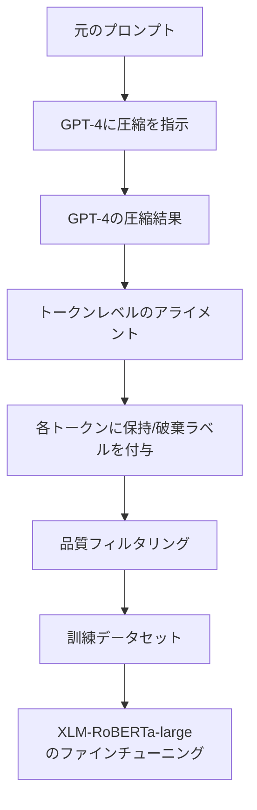

## 論文概要（Abstract）

LLMLingua-2は、タスク非依存のプロンプト圧縮手法である。従来のLLMLinguaが情報エントロピーベースの指標で圧縮対象を決定していたのに対し、LLMLingua-2はGPT-4から圧縮知識を蒸留し、トークン分類タスクとして圧縮を定式化する。XLM-RoBERTa-largeを分類器として使用し、各トークンの保持/破棄を双方向コンテキストで判断することで、元のLLMLinguaの3〜6倍の速度向上と、ドメイン外データでの優れた汎化性能を実現する。ACL 2024 Findingsに採択されている。

この記事は [Zenn記事: LLMコンテキストウィンドウ最適化：5層戦略でコスト70%削減と精度維持を両立する](https://zenn.dev/0h_n0/articles/a350e2a0103cc4) の深掘りです。

## 情報源

- **arXiv ID**: 2403.12968
- **URL**: [https://arxiv.org/abs/2403.12968](https://arxiv.org/abs/2403.12968)
- **著者**: Zhuoshi Pan, Qianhui Wu, Huiqiang Jiang, Menglin Xia, Xufang Luo, Jue Zhang, Qingwei Lin, Victor Rühle, Yuqing Yang, Chin-Yew Lin, H. Vicky Zhao, Lili Qiu, Dongmei Zhang（Microsoft Research）
- **発表年**: 2024
- **会議**: ACL 2024 Findings
- **コード**: [GitHub - microsoft/LLMLingua](https://github.com/microsoft/LLMLingua)
- **ライセンス**: MIT

## 背景と動機（Background & Motivation）

LLMへの入力プロンプトが長くなるほど、APIコスト増加、レイテンシ増大、そしてNoLiMa等の研究が示す性能低下の3つの問題が深刻化する。プロンプト圧縮はこれらの課題への即効性の高い対策である。

初代LLMLingua（EMNLP 2023）は、因果言語モデル（LLaMA-7B等）のパープレキシティを用いて各トークンの重要度を推定し、不要トークンを削除する手法であった。しかし、2つの根本的な課題があった：

1. **情報エントロピーの不整合**: パープレキシティは「次のトークンの予測困難度」であり、「プロンプト圧縮においてそのトークンが重要かどうか」とは直接対応しない
2. **因果モデルの限界**: 因果言語モデルは一方向（左→右）のコンテキストのみ参照するため、双方向の文脈情報を活用できない

LLMLingua-2はこれらの課題を、データ蒸留とトークン分類という新しいアプローチで解決する。

## 主要な貢献（Key Contributions）

- **貢献1**: プロンプト圧縮を**トークン分類タスク**として定式化し、圧縮結果の忠実度を理論的に保証する枠組みを提案
- **貢献2**: GPT-4を教師として**データ蒸留パイプライン**を構築し、タスク非依存の圧縮知識を小型モデルに転移
- **貢献3**: MeetingBankデータセットのみで訓練しながら、LongBench、GSM8K、BBH等の**ドメイン外タスクで優れた汎化性能**を実証
- **貢献4**: 初代LLMLingua比で**3〜6倍の推論速度向上**を達成

## 技術的詳細（Technical Details）

### 問題定式化：抽出型テキスト圧縮

LLMLingua-2はプロンプト圧縮を抽出型テキスト圧縮（Extractive Text Compression）として定式化する。元のプロンプト $x = (x_1, x_2, \ldots, x_N)$ に対し、各トークン $x_i$ を保持するか破棄するかの二値ラベル $y_i \in \{0, 1\}$ を予測する。

$$
\hat{y}_i = f_\theta(x_i \mid x_1, \ldots, x_N), \quad i = 1, \ldots, N
$$

ここで $f_\theta$ はTransformerエンコーダベースの分類器であり、**双方向コンテキスト**を参照してトークンの重要度を判断する。

圧縮後のプロンプトは $\tilde{x} = \{x_i \mid \hat{y}_i = 1\}$ として構成される。これにより、元のプロンプトに存在しない新しい単語が追加されないことが保証される（忠実度の保証）。

### データ蒸留パイプライン



#### Step 1: GPT-4による圧縮

GPT-4に以下の指示を与え、プロンプトの圧縮版を生成させる：

> "Compress the given text to short expressions, and abbreviations, to capture every detail. Delete unimportant words in the original texts only and not add any new words."

この指示により、GPT-4は元のテキストから不要な単語を削除し、重要な単語のみを残す抽出型圧縮を実行する。

#### Step 2: トークンレベルのアライメント

GPT-4の出力と元のプロンプトを比較し、各トークンにバイナリラベルを付与する：

$$
y_i = \begin{cases}
1 & \text{if token } x_i \text{ is retained in GPT-4's output} \\
0 & \text{otherwise}
\end{cases}
$$

#### Step 3: 品質フィルタリング

2つの品質メトリクスでフィルタリングする：

1. **整合率（Alignment Rate）**: 圧縮結果のトークンが元テキストのトークンとどの程度マッチするか
2. **圧縮率チェック**: 極端に短い/長い圧縮結果を除外

#### Step 4: モデル訓練

フィルタリング後のデータで XLM-RoBERTa-large（約560Mパラメータ）をファインチューニングする。損失関数はバイナリクロスエントロピー：

$$
\mathcal{L} = -\frac{1}{N} \sum_{i=1}^{N} \left[ y_i \log \hat{y}_i + (1 - y_i) \log (1 - \hat{y}_i) \right]
$$

### なぜトークン分類か？

従来の生成型圧縮（要約等）と比較した優位性：

| 特性 | 生成型圧縮 | LLMLingua-2（分類型） |
|------|-----------|---------------------|
| 忠実度 | 低（新単語追加リスク） | **高（元トークンのみ）** |
| 速度 | 遅（自己回帰生成） | **速（並列分類）** |
| 汎化性 | タスク依存 | **タスク非依存** |
| 幻覚リスク | あり | **なし** |

### なぜXLM-RoBERTaか？

1. **双方向Attention**: BERTベースのエンコーダは前後両方のコンテキストを参照可能。因果LM（GPT, LLaMA）は一方向のみ
2. **多言語対応**: XLM-RoBERTaは100言語で事前訓練されており、英語以外への拡張可能性がある
3. **小型**: 560Mパラメータで、7Bの因果LMと比較してメモリ・計算コストが大幅に低い

## 実装のポイント（Implementation）

### 基本的な使い方

```python
# pip install llmlingua
from llmlingua import PromptCompressor

# モデルのロード
compressor = PromptCompressor(
    model_name="microsoft/llmlingua-2-xlm-roberta-large-meetingbank",
    device_map="cpu",  # GPU利用時は "cuda"
)

# プロンプト圧縮の実行
original_prompt = """
You are a helpful AI assistant. Based on the following context,
answer the user's question accurately and concisely.

Context: [数千トークンのドキュメント]

Question: What is the main contribution of this paper?
"""

compressed = compressor.compress_prompt(
    context=[original_prompt],
    rate=0.4,  # 40%に圧縮（2.5倍圧縮）
    force_tokens=["\n", ".", "?", "!"],  # 文構造を保持するトークン
)

print(f"元の長さ: {compressed['origin_tokens']} tokens")
print(f"圧縮後: {compressed['compressed_tokens']} tokens")
print(f"実際の圧縮率: {compressed['rate']:.1%}")
print(f"圧縮結果:\n{compressed['compressed_prompt']}")
```

### 圧縮率の選択ガイド

```python
def select_compression_rate(content_type: str) -> float:
    """コンテンツタイプに応じた推奨圧縮率を返す

    Args:
        content_type: "text", "code", "mixed", "qa"

    Returns:
        推奨圧縮率（0.0-1.0、小さいほど圧縮率が高い）
    """
    rates = {
        "text": 0.3,   # テキスト: 3.3倍圧縮（高圧縮可能）
        "code": 0.5,   # コード: 2倍圧縮（構文保持が必要）
        "mixed": 0.4,  # 混合: 2.5倍圧縮
        "qa": 0.35,    # QA: 2.9倍圧縮
    }
    return rates.get(content_type, 0.4)
```

### ハマりポイントと対策

1. **コードブロックの構文崩壊**: 圧縮率0.2以下（5倍圧縮超）ではコードの構文が崩れる。コードを含む場合は `rate=0.5` 以上を推奨
2. **固有名詞の欠落**: `force_tokens` に固有名詞やドメイン固有用語を追加して保護する
3. **数値情報の喪失**: 数値・日付は重要度が低く判定されがち。数値を含むセンテンスは圧縮対象外にする戦略が有効

```python
import re

def compress_with_number_protection(
    compressor: PromptCompressor,
    text: str,
    rate: float = 0.4,
) -> str:
    """数値情報を保護しながらプロンプトを圧縮する

    Args:
        compressor: PromptCompressorインスタンス
        text: 圧縮対象テキスト
        rate: 圧縮率

    Returns:
        圧縮されたテキスト
    """
    # 数値を含む文を分離
    sentences = text.split(". ")
    numeric_sentences = []
    compressible_sentences = []

    for s in sentences:
        if re.search(r'\d+\.?\d*%|\$\d+|\d{4}年', s):
            numeric_sentences.append(s)
        else:
            compressible_sentences.append(s)

    # 数値なし部分のみ圧縮
    compressed = compressor.compress_prompt(
        context=[". ".join(compressible_sentences)],
        rate=rate,
    )

    # 数値文を先頭に配置（Lost in the Middle対策）
    return ". ".join(numeric_sentences) + "\n" + compressed["compressed_prompt"]
```

## 実験結果（Results）

### ドメイン内評価（MeetingBank）

MeetingBankデータセット上でのQAタスク性能：

| 手法 | 圧縮率 | QA精度 | レイテンシ |
|------|--------|--------|----------|
| 圧縮なし（原文） | 1x | ベースライン | ベースライン |
| LLMLingua（LLaMA-7B） | 2x | -3.2% | 1x |
| LLMLingua-2（XLM-RoBERTa） | 2x | **-1.1%** | **0.3x** |
| LLMLingua-2 | 5x | -5.8% | 0.17x |

### ドメイン外評価

MeetingBankのみで訓練したモデルが、異なるドメインのタスクでも優れた汎化性能を発揮する：

| タスク | ベンチマーク | 圧縮率 | 精度変化 |
|--------|------------|--------|---------|
| 数学推論 | GSM8K | 14x | 78.85% → 77.79%（-1.06%） |
| RAG QA | NaturalQuestions | 5x | 54.1% → **74.0%（+19.9%）** |
| 長文タスク | LongBench | 4x | 微減 |
| 多段推論 | BBH | 4x | 微減 |

特筆すべきは、RAG QAで圧縮により性能が**向上**していること。これはノイズとなる冗長な情報が除去され、モデルが重要な情報に集中できるためと考えられる。

### 速度比較

| 手法 | モデルサイズ | 圧縮推論速度 | End-to-Endレイテンシ |
|------|-----------|------------|-------------------|
| LLMLingua（LLaMA-7B） | 7B | 1x | 1x |
| LongLLMLingua | 7B | 1x | 0.8x |
| LLMLingua-2（XLM-RoBERTa） | 560M | **3-6x** | **1.6-2.9x改善** |

560Mパラメータの小型モデルで7Bモデルの3〜6倍の速度を達成している。

## 実運用への応用（Practical Applications）

### コスト削減シミュレーション

Zenn記事で紹介した5層戦略の第1層として、LLMLingua-2をRAGパイプラインに組み込んだ場合のコスト効果：

```python
# コスト試算の例
original_tokens_per_request = 8000  # 平均入力トークン数
compression_rate = 0.4              # 40%に圧縮
compressed_tokens = int(original_tokens_per_request * compression_rate)  # 3200

# OpenAI GPT-4o pricing (2026年2月時点の概算)
price_per_1k_input = 0.0025  # $/1K input tokens

daily_requests = 10000

cost_before = daily_requests * original_tokens_per_request / 1000 * price_per_1k_input
cost_after = daily_requests * compressed_tokens / 1000 * price_per_1k_input

savings = cost_before - cost_after
savings_pct = savings / cost_before * 100

# 結果: 1日あたり約60%のコスト削減
```

### RAGパイプラインへの統合

```python
from llmlingua import PromptCompressor
from langchain.retrievers import VectorStoreRetriever

class CompressedRAGPipeline:
    """LLMLingua-2を組み込んだRAGパイプライン"""

    def __init__(self, retriever: VectorStoreRetriever, llm):
        self.retriever = retriever
        self.llm = llm
        self.compressor = PromptCompressor(
            model_name="microsoft/llmlingua-2-xlm-roberta-large-meetingbank",
            device_map="cuda",
        )

    def query(self, question: str, k: int = 5) -> str:
        """圧縮付きRAGクエリを実行する

        Args:
            question: ユーザーの質問
            k: 取得するチャンク数

        Returns:
            LLMの回答
        """
        # 1. 検索
        docs = self.retriever.get_relevant_documents(question, k=k)
        context = "\n\n".join([d.page_content for d in docs])

        # 2. 圧縮
        compressed = self.compressor.compress_prompt(
            context=[context],
            instruction="Answer the question based on the context.",
            question=question,
            rate=0.4,
        )

        # 3. LLM推論
        prompt = f"Context: {compressed['compressed_prompt']}\n\nQuestion: {question}"
        return self.llm.invoke(prompt)
```

### プロダクション環境での考慮事項

- **レイテンシ**: XLM-RoBERTa-largeの推論にGPUで約10-20ms。CPUでは100-200ms程度。リアルタイム要件に応じてGPU配備を検討
- **バッチ処理**: 複数リクエストのプロンプトをバッチ処理することで、GPU利用効率を最大化
- **キャッシュ**: 同一ドキュメントの圧縮結果をキャッシュし、再圧縮を回避

## 関連研究（Related Work）

- **LLMLingua (Jiang et al., EMNLP 2023)**: 初代。パープレキシティベースの圧縮。LLMLingua-2の前身であり、因果LMの制約を持つ
- **LongLLMLingua (Jiang et al., ACL 2024)**: 長文コンテキスト特化の拡張。キー情報のPerceptionを改善する手法を追加
- **Selective Context (Li et al., 2023)**: 自己情報量ベースでのコンテキスト選択。タスク依存の面がある
- **In-context Autoencoder (Ge et al., 2024)**: LLMを使ってコンテキストを短いメモリスロットに圧縮。訓練コストが高い

## まとめと今後の展望

LLMLingua-2は、プロンプト圧縮を「トークン分類」として再定式化することで、速度・汎化性・忠実度の3つを同時に改善した実用的な手法である。

**実務への示唆**:
- RAGパイプラインへの組み込みが最も費用対効果が高い。`pip install llmlingua` で3行のコードで導入可能
- 圧縮率0.3-0.5（2-3倍圧縮）が精度とコスト削減のスイートスポット
- RAG QAでは圧縮によりむしろ精度が向上するケースがある（ノイズ除去効果）

**今後の研究方向**:
- 日本語を含む多言語環境での性能評価と改善
- コード圧縮に特化したモデルの訓練
- Attention機構との統合（圧縮トークンにAttentionを集中させる戦略）

## 参考文献

- **arXiv**: [https://arxiv.org/abs/2403.12968](https://arxiv.org/abs/2403.12968)
- **Code**: [https://github.com/microsoft/LLMLingua](https://github.com/microsoft/LLMLingua)
- **LLMLingua公式サイト**: [https://llmlingua.com/llmlingua2.html](https://llmlingua.com/llmlingua2.html)
- **Related Zenn article**: [https://zenn.dev/0h_n0/articles/a350e2a0103cc4](https://zenn.dev/0h_n0/articles/a350e2a0103cc4)
