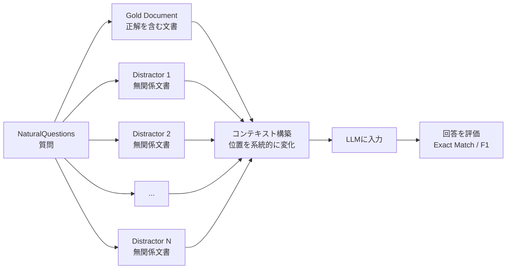
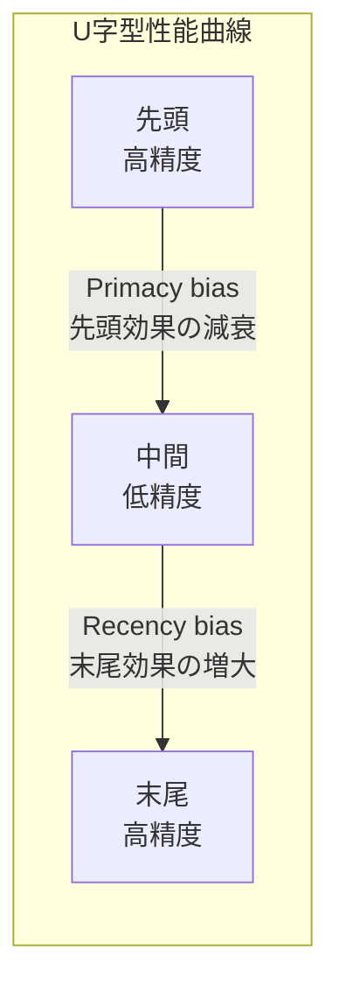

## 論文概要（Abstract）

「Lost in the Middle」は、LLMが長いコンテキスト内の情報を均等に利用していないことを体系的に実証した基礎研究である。関連情報がコンテキストの先頭または末尾にある場合は高い性能を示すが、中間に位置する場合は20〜30ポイント性能が低下する**U字型性能曲線**を発見した。この現象はGPT-3.5-Turbo、Claude 1.3を含む複数のモデルで一貫して観察され、拡張コンテキストモデル（LongChat-13B-16K等）でも同様であった。RAGシステムの設計において、検索チャンクの配置順序が性能に直結するという実用的な示唆を提供している。

この記事は [Zenn記事: LLMコンテキストウィンドウ最適化：5層戦略でコスト70%削減と精度維持を両立する](https://zenn.dev/0h_n0/articles/a350e2a0103cc4) の深掘りです。

## 情報源

- **arXiv ID**: 2307.03172
- **URL**: [https://arxiv.org/abs/2307.03172](https://arxiv.org/abs/2307.03172)
- **著者**: Nelson F. Liu, Kevin Lin, John Hewitt, Ashwin Paranjape, Michele Bevilacqua, Fabio Petroni, Percy Liang
- **発表年**: 2023
- **掲載誌**: Transactions of the ACL (TACL) 2023
- **分野**: cs.CL
- **コード**: [GitHub](https://github.com/nelson-liu/lost-in-the-middle)

## 背景と動機（Background & Motivation）

2023年時点で、LLMのコンテキストウィンドウは急速に拡大していた。GPT-3.5-Turboが16Kトークン、Claude 1.3が100Kトークンに対応し、LongChat-13B-16Kなどの拡張コンテキストモデルも登場していた。

しかし、「長いコンテキストを**処理できる**」ことと「長いコンテキストを**ロバストに活用できる**」ことは異なる。著者らは、コンテキスト内の情報位置がモデルの性能にどのような影響を与えるかを系統的に調査することで、この区別を明確にした。

従来の研究では、Recency bias（直近の情報を重視するバイアス）が知られていたが、長文コンテキストにおけるPrimacy bias（先頭の情報を重視するバイアス）との組み合わせ効果は十分に調査されていなかった。

## 主要な貢献（Key Contributions）

- **貢献1**: 長文コンテキストにおける**U字型性能曲線**の発見と体系的実証。先頭と末尾の情報は高精度で利用されるが、中間の情報は最大20-30ポイント精度が低下する
- **貢献2**: GPT-3.5-Turbo、Claude 1.3、LongChat-13B等の**複数モデル・複数タスク**での一貫した再現性を確認
- **貢献3**: 拡張コンテキストモデルでも同様の現象が生じることを実証し、「コンテキスト長の拡張 ≠ ロバストな活用」を示す
- **貢献4**: RAGシステム設計における**チャンク配置戦略**の重要性を定量的に明示

## 技術的詳細（Technical Details）

### 実験設計

#### タスク1: Multi-Document QA

NaturalQuestions-Openデータセット（2,655例）を使用。各質問に対し、正解を含む文書（gold document）と無関係な文書（distractor）を組み合わせ、10〜30文書のコンテキストを構築する。



Gold documentの位置を「先頭→1/4→中間→3/4→末尾」と系統的に変化させ、各位置での性能を測定する。

#### タスク2: Key-Value Retrieval（合成タスク）

JSON形式のキー・バリューペアを75〜140個含むコンテキストを構築し、特定のキーに対応する値を正確に回答させる。QAタスクと異なり、意味理解が不要な純粋な情報検索タスクである。

```python
# Key-Value Retrievalタスクの例
context = """
[
  {"key": "a1b2c3", "value": "Tokyo"},
  {"key": "d4e5f6", "value": "Berlin"},
  {"key": "g7h8i9", "value": "Paris"},   # ← target
  {"key": "j0k1l2", "value": "London"},
  ...
]
"""

question = "What is the value for key 'g7h8i9'?"
expected_answer = "Paris"
```

### 主要な発見: U字型性能曲線

#### 実験結果の定量値

**Multi-Document QA（20文書、GPT-3.5-Turbo）**:

| Gold Document位置 | 精度 |
|-------------------|------|
| 先頭（位置1） | ~71% |
| 1/4（位置5） | ~58% |
| 中間（位置10） | ~45% |
| 3/4（位置15） | ~52% |
| 末尾（位置20） | ~68% |

中間配置時の精度は先頭配置時より**約26ポイント低下**している。

**Claude 1.3でも同様のパターン**:

| Gold Document位置 | 精度 |
|-------------------|------|
| 先頭 | ~75% |
| 中間 | ~40% |
| 末尾 | ~72% |

Claude 1.3はさらに顕著なU字型を示し、中間配置で**最大35ポイントの低下**が観察された。

#### Key-Value Retrievalでの結果

GPT-3.5-Turboは75ペアのコンテキストで、ターゲットキーが先頭・末尾にある場合は**約100%**の精度だが、中間では**50%以下**に急落。単純な文字列マッチングタスクですら、位置バイアスの影響を受けることが判明した。

### U字型曲線のメカニズム

著者らはU字型曲線を2つのバイアスの組み合わせとして説明する：

$$
\text{Performance}(p) = \alpha \cdot \text{Primacy}(p) + \beta \cdot \text{Recency}(p) + \gamma
$$

ここで：
- $p$: 関連情報のコンテキスト内位置（0=先頭、1=末尾）
- $\text{Primacy}(p)$: 先頭効果（$p \to 0$ で最大）
- $\text{Recency}(p)$: 末尾効果（$p \to 1$ で最大）
- $\alpha, \beta, \gamma$: モデル依存の係数



この現象の根本原因として、以下が考えられている：

1. **Positional Encodingの影響**: Transformerの位置エンコーディングは、先頭と末尾のトークンに対してより安定した表現を生成する傾向がある
2. **Attention Patternの偏り**: Self-Attentionは先頭トークンと直近のトークンに高い重みを付ける傾向がある（Attention Sink現象）
3. **訓練データの分布**: 多くの訓練データでは重要な情報が文書の冒頭に配置されているため、モデルが先頭バイアスを学習している可能性

### コンテキスト長との関係

文書数を10から30に増やすと、U字型はさらに深くなる：

| 文書数 | 先頭精度 | 中間精度 | 低下幅 |
|--------|---------|---------|--------|
| 10 | ~75% | ~55% | -20pt |
| 20 | ~71% | ~45% | -26pt |
| 30 | ~65% | ~38% | -27pt |

コンテキスト長が増加するほど中間の性能低下が深刻化する。これはNoLiMa（arXiv:2502.05167）の結果と整合的であり、コンテキスト最適化の必要性を裏付ける。

### 拡張コンテキストモデルの検証

LongChat-13B-16K（16Kトークンに拡張されたモデル）でも同様のU字型パターンが確認された。これは、コンテキストウィンドウの拡張だけでは根本的な解決にならないことを意味する。

## 実装のポイント（Implementation）

### RAGシステムへの適用: チャンク配置最適化

Lost in the Middleの知見を直接活用した、RAGのチャンク配置戦略：

```python
from typing import TypeAlias

Chunk: TypeAlias = dict[str, float | str]


def optimize_chunk_placement(
    chunks: list[Chunk],
) -> list[Chunk]:
    """Lost in the Middle対策: 重要チャンクを先頭・末尾に配置

    関連度の高いチャンクをコンテキストの先頭と末尾に、
    関連度の低いチャンクを中間に配置する。

    Args:
        chunks: relevance_scoreを含むチャンクのリスト

    Returns:
        最適配置されたチャンクのリスト
    """
    # 関連度で降順ソート
    sorted_chunks = sorted(chunks, key=lambda c: c["relevance_score"], reverse=True)

    n = len(sorted_chunks)
    result: list[Chunk | None] = [None] * n

    # 先頭と末尾に高関連度チャンクを交互配置
    head_idx = 0
    tail_idx = n - 1

    for i, chunk in enumerate(sorted_chunks):
        if i % 2 == 0:
            result[head_idx] = chunk
            head_idx += 1
        else:
            result[tail_idx] = chunk
            tail_idx -= 1

    return [c for c in result if c is not None]


# 使用例
chunks = [
    {"text": "重要な情報A", "relevance_score": 0.95},
    {"text": "関連情報B", "relevance_score": 0.85},
    {"text": "補足情報C", "relevance_score": 0.70},
    {"text": "背景情報D", "relevance_score": 0.60},
    {"text": "追加情報E", "relevance_score": 0.50},
]

optimized = optimize_chunk_placement(chunks)
# 結果: [A(0.95), C(0.70), E(0.50), D(0.60), B(0.85)]
# 先頭=最重要、末尾=次重要、中間=低重要
```

### コンテキスト長の適切な制限

```python
def determine_optimal_context_length(
    model_max_context: int,
    task_type: str,
    quality_threshold: float = 0.85,
) -> int:
    """タスクに応じた最適コンテキスト長を推定する

    Lost in the Middleの知見に基づき、モデルの公称最大値より
    短いコンテキスト長を推奨する。

    Args:
        model_max_context: モデルの公称最大コンテキスト長
        task_type: タスクの種類
        quality_threshold: 許容する精度閾値（短文時の精度比）

    Returns:
        推奨コンテキスト長
    """
    # 経験的な推奨比率
    ratios = {
        "qa": 0.25,        # QA: 公称の25%以内を推奨
        "summarization": 0.5,  # 要約: 50%以内
        "retrieval": 0.15,     # 検索: 15%以内（最も影響大）
        "generation": 0.4,     # 生成: 40%以内
    }

    ratio = ratios.get(task_type, 0.25)
    return min(int(model_max_context * ratio), 16384)


# 例: GPT-4o (128K) でのQAタスク
optimal = determine_optimal_context_length(128000, "qa")
# 結果: 16384トークン（公称128Kの約13%）
```

### k値の最適化（RAG）

```python
def estimate_optimal_k(
    avg_chunk_tokens: int = 512,
    optimal_context_tokens: int = 8000,
    reserved_tokens: int = 2000,
) -> int:
    """RAGのTop-k値を推定する

    Lost in the Middleの知見: 中間チャンクはほぼ無視されるため、
    k値を大きくしてもノイズが増えるだけ。

    Args:
        avg_chunk_tokens: 平均チャンクサイズ（トークン）
        optimal_context_tokens: 最適コンテキスト長
        reserved_tokens: システムプロンプト等の予約トークン

    Returns:
        推奨k値
    """
    available = optimal_context_tokens - reserved_tokens
    max_k = available // avg_chunk_tokens

    # Lost in the Middle対策: 中間チャンクは無視されるため
    # 実効的に使われるのは先頭と末尾の計2/3程度
    effective_k = max(3, int(max_k * 2 / 3))
    return min(effective_k, 7)  # 上限7


# 例
k = estimate_optimal_k()
# 結果: 5（8000-2000=6000トークン、約12チャンク可能だが実効8チャンク、さらに7に制限）
```

## 実験結果（Results）

### 主要結果のまとめ

| モデル | 先頭精度 | 中間精度 | 末尾精度 | U字型の深さ |
|--------|---------|---------|---------|-----------|
| GPT-3.5-Turbo（20docs） | ~71% | ~45% | ~68% | -26pt |
| Claude 1.3（20docs） | ~75% | ~40% | ~72% | -35pt |
| LongChat-13B（20docs） | ~50% | ~20% | ~46% | -30pt |
| MPT-30B-Instruct | 低 | 最低 | 低 | 大 |

### Oracle上限との比較

短いコンテキスト（gold documentのみ）での性能を上限とすると：

| 条件 | GPT-3.5-Turbo精度 |
|------|-----------------|
| Oracle（gold docのみ） | ~80% |
| 20 docs, 先頭配置 | ~71% |
| 20 docs, 中間配置 | ~45% |

Oracle比で中間配置は**35ポイント**もの精度低下が生じている。

### 異なるコンテキスト長での一貫性

Key-Value Retrievalタスクでは、ペア数を75→140に増やしても同様のU字型パターンが観察された。ペア数が増えるほど中間の性能低下が拡大し、コンテキスト長の増加がリスクとなることを示す。

## 実運用への応用（Practical Applications）

### Zenn記事の5層戦略との関連

Lost in the Middleの知見は、Zenn記事で紹介した5層最適化戦略のうち、特に以下の3層に直接的な設計根拠を提供する：

| 層 | Lost in the Middleの示唆 |
|---|---|
| 第1層: プロンプト圧縮 | コンテキストが短いほどU字型が浅い → 圧縮で性能改善 |
| 第2層: スマートチャンキング | チャンクの配置順序が性能を直接左右 → 先頭・末尾優先 |
| 第4層: RAG | k値が大きいと中間チャンクが無視される → k=3-5が最適 |

### プロダクション設計パターン

1. **チャンクリランキング後の配置最適化**: Cross-Encoderで関連度スコアを付与 → 高関連度チャンクを先頭・末尾に配置
2. **コンテキスト長の動的制限**: タスクの精度要件に応じて、モデルの公称上限より短いコンテキストを使用
3. **重要情報の冗長配置**: 最重要情報を先頭と末尾の両方に配置する「ブックエンド戦略」

### 2025-2026年の最新モデルへの適用

本論文は2023年のモデル（GPT-3.5、Claude 1.3）で検証されたが、NoLiMa（arXiv:2502.05167）の2025年の結果では、GPT-4o、Claude 3.5 Sonnet等の最新モデルでも同様の位置バイアスが確認されている（ニードルが中央にある場合の精度が最低）。つまり、Lost in the Middleの問題は**2年経っても解決されていない**。

## 関連研究（Related Work）

- **NoLiMa (Modarressi et al., ICML 2025)**: Lost in the Middleの知見を非リテラルマッチング設定に拡張。17モデルで同様の位置バイアスを確認
- **Make Your LLM Fully Utilize the Context (An et al., 2024)**: 訓練データに位置多様性を導入し、U字型を緩和する手法「INformation-INtensive (IN2) Training」を提案
- **Found in the Middle (Ferraretto et al., 2024)**: Attention CalibrationによりU字型を緩和する推論時手法。最大15ポイントの改善を報告

## まとめと今後の展望

Lost in the Middleは、LLMの長文コンテキスト利用における根本的な限界を明らかにした基礎研究である。2023年の発見以降、この問題は広く認知されるようになったが、2025年の最新モデルでも完全には解決されていない。

**実務への示唆**:
- RAGシステムでは、検索チャンクの**配置順序**が精度に最大35ポイントの影響を与える
- コンテキストウィンドウが大きいからといって、全てを詰め込むのは逆効果
- 「先頭と末尾に重要情報を置く」という単純なルールが、即座に実装可能な最も効果的な対策

**今後の研究方向**:
- Attention Calibrationによる位置バイアスの緩和（推論時アプローチ）
- IN2 Trainingなどの訓練時アプローチ
- State Space Models（Mamba等）での位置バイアスの調査

## 参考文献

- **arXiv**: [https://arxiv.org/abs/2307.03172](https://arxiv.org/abs/2307.03172)
- **Code**: [https://github.com/nelson-liu/lost-in-the-middle](https://github.com/nelson-liu/lost-in-the-middle)
- **TACL 2023**: Transactions of the Association for Computational Linguistics
- **Related Papers**: [NoLiMa (arXiv:2502.05167)](https://arxiv.org/abs/2502.05167), [Make Your LLM Fully Utilize the Context (arXiv:2404.16811)](https://arxiv.org/abs/2404.16811)
- **Related Zenn article**: [https://zenn.dev/0h_n0/articles/a350e2a0103cc4](https://zenn.dev/0h_n0/articles/a350e2a0103cc4)
