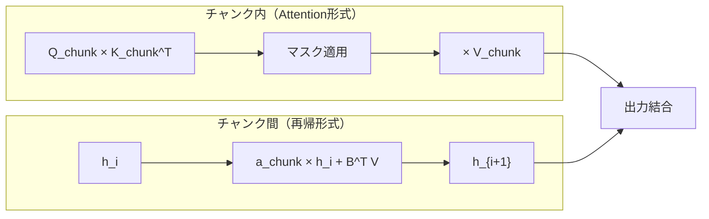

## 論文概要（Abstract）

Tri DaoとAlbert Guによる本論文は、状態空間モデル（SSM）とAttentionが**半可分行列（Semiseparable Matrix）**を介して数学的に等価であることを示す**Structured State Space Duality（SSD）フレームワーク**を提案する。このフレームワークに基づき設計されたMamba-2は、状態遷移行列をスカラーに制約しMulti-head構造を導入することで、Mamba-1比**2〜8倍の学習高速化**を達成しつつ、Transformer++と同等以上の言語モデリング性能を実現した。

この記事は [Zenn記事: Qwen3.5徹底解説：397B MoEモデルをvLLMでデプロイする実践ガイド](https://zenn.dev/0h_n0/articles/657d35a2bbf71d) の深掘りです。

## 情報源

- **arXiv ID**: 2406.06484
- **URL**: [https://arxiv.org/abs/2406.06484](https://arxiv.org/abs/2406.06484)
- **著者**: Tri Dao, Albert Gu
- **発表年**: 2024年6月
- **分野**: cs.LG

## 背景と動機（Background & Motivation）

2024年時点で、シーケンスモデリングの主要アーキテクチャには2つの潮流がある：

1. **Transformer**: Softmax Attentionベース。表現力が高いが計算量$O(T^2)$
2. **SSM（Mamba等）**: 線形再帰ベース。推論時$O(1)$状態更新だが、学習の並列化が課題

Mamba-1はTransformerに匹敵する品質を示したが、**再帰計算の逐次的な性質**がGPU上の学習速度を制限していた。本論文はSSMとAttentionの理論的接続を明らかにし、「両方の良いところ取り」を可能にするフレームワークを構築した。

## 主要な貢献（Key Contributions）

- **SSDフレームワーク**: SSMの出力行列が半可分行列であることを示し、Attentionとの等価性を証明
- **Mamba-2アーキテクチャ**: スカラー状態遷移 + Multi-head構造で学習2〜8倍高速化
- **チャンク化アルゴリズム**: チャンク内はAttention形式、チャンク間は再帰形式のハイブリッド計算
- **統一的な視点**: Linear Attention、RetNet、GLA（Gated Linear Attention）をSSDの特殊ケースとして整理

## 技術的詳細（Technical Details）

### SSMの行列形式と半可分行列

SSMの基本再帰式：

$$h_t = A_t h_{t-1} + B_t x_t, \quad y_t = C_t^T h_t$$

ここで$x_t \in \mathbb{R}$は入力、$h_t \in \mathbb{R}^N$は隠れ状態、$A_t \in \mathbb{R}^{N \times N}$, $B_t, C_t \in \mathbb{R}^N$は（入力依存の）パラメータ。

この再帰を展開すると、出力$\mathbf{y} = M\mathbf{x}$と書ける：

$$M_{ij} = \begin{cases} C_i^T \left(\prod_{k=j+1}^{i} A_k\right) B_j & i \geq j \\ 0 & i < j \end{cases}$$

行列$M$は**下三角半可分行列**であり、下三角部分の任意の部分行列のランクが状態次元$N$以下という構造的性質を持つ。

### SSD層：スカラー制約による等価性

SSDの核心的アイデアは、状態遷移行列を$A_t = a_t I$（スカラー倍の単位行列）に制約すること：

$$h_t = a_t h_{t-1} + B_t x_t$$

再帰を展開すると：

$$y_t = \sum_{j \leq t} (C_t^T B_j) \cdot \underbrace{\prod_{k=j+1}^{t} a_k}_{\alpha_{j:t}} \cdot x_j$$

$Q = C$、$K = B$、$V = X$と置くと、行列形式で：

$$\boxed{Y = (L \circ QK^T) V}$$

ここで$L_{ij} = \prod_{k=j+1}^{i} a_k$は**入力依存の構造化マスク行列**、$\circ$はアダマール積。これを**Structured Masked Attention（SMA）**と呼ぶ。

**定理**: スカラー$A_t$を持つSSD層は、マスク$L$を持つSMAと完全に等価である。

### Attentionバリアントの統一的理解

SSDフレームワークはマスク$L$の違いとして既存手法を整理する：

| モデル | マスク$L_{ij}$ | 特徴 |
|--------|---------------|------|
| Softmax Attention | $\text{softmax}(QK^T)$（任意） | 最高表現力、$O(T^2)$ |
| Linear Attention | $\mathbf{1}_{i \geq j}$（定数） | softmaxなし |
| RetNet | $\gamma^{i-j}$（定数減衰） | $a_t = \gamma$の特殊ケース |
| **SSD/Mamba-2** | $\prod_{k=j+1}^{i} a_k$（入力依存） | 乗法構造 |

等価性の階層：

$$\text{対角SSM} \supset \text{SSD（スカラー}A\text{）} = \text{SMA} \supset \text{RetNet} \supset \text{Linear Attention}$$

### Mamba-1からMamba-2への進化

| コンポーネント | Mamba-1 | Mamba-2 |
|--------------|---------|---------|
| 状態遷移$A$ | 対角行列$A \in \mathbb{R}^{N \times N}$ | スカラー$A = a_t I$ |
| ヘッド構造 | なし（チャンネル単位） | **Multi-head**（Attention同様） |
| 入力射影 | 単一射影 | グループ化Multi-head射影 |
| 中核アルゴリズム | 逐次再帰 | **チャンク化SSD** |

スカラー$A$への制約は表現力を低下させるが、Multi-head構造が補完する。アブレーション実験（370Mモデル）で確認：

| バリアント | パープレキシティ |
|-----------|----------------|
| Mamba-2（完全版） | **8.9** |
| Multi-headなし | 9.1 |
| 状態次元$N=128$ | 8.8 |
| 状態次元$N=32$ | 9.2 |

### チャンク化アルゴリズム

SSD層の効率的計算のため、シーケンスをチャンクサイズ$Q$のブロックに分割：

**チャンク内**（GPU並列化に最適）：

$$Y_{\text{intra}} = (L_{\text{chunk}} \circ Q_{\text{chunk}} K_{\text{chunk}}^T) V_{\text{chunk}}$$

**チャンク間**（隠れ状態伝播）：

$$h_{i+1} = A_{\text{chunk}} h_i + B_{\text{chunk}}^T V_{\text{chunk}}$$

計算量（$Q = N$で最適化）：

$$\text{時間}: O(TN^{3/2}), \quad \text{メモリ}: O(TN)$$

| 演算 | 時間 | メモリ |
|------|------|--------|
| ナイーブAttention | $O(T^2 d)$ | $O(T^2)$ |
| Linear Attention | $O(Td^2)$ | $O(d^2)$ |
| SSM再帰 | $O(TN^2)$ | $O(N)$ |
| **SSD（チャンク化）** | $O(TN^{3/2})$ | $O(TN)$ |

FlashAttentionと同じ思想で、HBM↔SRAM間のメモリ転送を最小化するハードウェアアウェア設計。

## 実験結果（Results）

### 言語モデリング（The Pile, 300Bトークン）

| モデル | 370M | 1.3B | 2.7B | 7B |
|--------|------|------|------|-----|
| Transformer++ | 9.0 | 7.6 | 6.9 | 6.3 |
| Mamba-1 | 9.0 | 7.6 | 7.0 | 6.4 |
| **Mamba-2** | **8.9** | **7.6** | **6.9** | **6.3** |

全スケールでMamba-1以上、Transformer++と同等以上のパープレキシティ。

### 学習スループット（A100 GPU）

| モデル（1.3B） | スループット | Mamba-1比 |
|---------------|------------|-----------|
| Mamba-1 | ~180K tokens/sec | 1.0x |
| Transformer++ | ~175K tokens/sec | 0.97x |
| **Mamba-2** | **~430K tokens/sec** | **2.4x** |

シーケンス長が伸びるほど優位性が拡大：T=2048で2倍、T=8192で4倍、T=16384で6倍以上。

## 実運用への応用（Practical Applications）

### Qwen3.5との関係

Qwen3.5のGated DeltaNet層は、Mamba-2/SSDフレームワークの直系の発展である：

- **SSD**: $A = a_t I$（スカラー）、出力$Y = (L \circ QK^T) V$
- **DeltaNet**: Delta Rule（$\Delta = \beta_t k_t v_t^T - \beta_t k_t k_t^T S_{t-1}$）で状態を更新
- **Gated DeltaNet**: DeltaNetにMamba-2型のスカラーゲート$\alpha_t$を追加

Qwen3.5は60層中45層にGated DeltaNetを配置し、残り15層にGated Attention（Full Attention）を使用するハイブリッド構成。SSDフレームワークが示した「チャンク内Attention + チャンク間再帰」の計算パターンは、Gated DeltaNetのハードウェア効率的な実装にも応用されている。

### ハイブリッドアーキテクチャの設計指針

SSDフレームワークが示した重要な知見：

1. **SSMはAttentionの一形式**: マスク$L$の構造が異なるだけ
2. **表現力とハードウェア効率のトレードオフ**: スカラー$A$は表現力を制限するが、チャンク化で大幅高速化
3. **Multi-headが表現力を補完**: Attention由来の設計パターンがSSMの性能向上に有効

## 関連研究（Related Work）

- **Mamba-1** (Gu & Dao, 2023): 選択的SSMの提案。SSDフレームワークの直接的前身
- **RetNet** (Sun et al., 2023): 定数減衰マスクによるAttention。SSDの特殊ケース
- **GLA** (Yang et al., 2024): 対角$A$を用いたGated Linear Attention。SSDとMamba-1の中間
- **FlashAttention-2** (Dao, 2023): ハードウェアアウェアAttention。SSDチャンク化アルゴリズムの設計思想の源泉
- **Gated Delta Networks** (arXiv 2412.06464): Mamba-2のゲーティング機構をDeltaNetに統合。Qwen3.5で採用

## まとめと今後の展望

SSDフレームワークは「SSMとAttentionは半可分行列の構造の違いでしかない」という統一的視点を提供し、Mamba-2という具体的な高速アーキテクチャを実現した。この理論的基盤は、Qwen3.5のGated DeltaNet/Gated Attentionハイブリッドアーキテクチャに直接継承されており、**256Kコンテキストでの19倍高速化**の理論的裏付けとなっている。

$Y = (L \circ QK^T) V$という1つの式が、Softmax Attention・Linear Attention・RetNet・Mamba-2を統一的に記述できるという発見は、今後のシーケンスモデリングアーキテクチャ設計の基礎理論として広く参照されるだろう。

## 参考文献

- **arXiv**: [https://arxiv.org/abs/2406.06484](https://arxiv.org/abs/2406.06484)
- **Related Zenn article**: [https://zenn.dev/0h_n0/articles/657d35a2bbf71d](https://zenn.dev/0h_n0/articles/657d35a2bbf71d)
- **Mamba-1**: [https://arxiv.org/abs/2312.00752](https://arxiv.org/abs/2312.00752)
- **Gated Delta Networks**: [https://arxiv.org/abs/2412.06464](https://arxiv.org/abs/2412.06464)

---

:::message
この記事はAI（Claude Code）により自動生成されました。内容の正確性については元論文と照合して検証していますが、実際の利用時は公式ドキュメントもご確認ください。
:::
