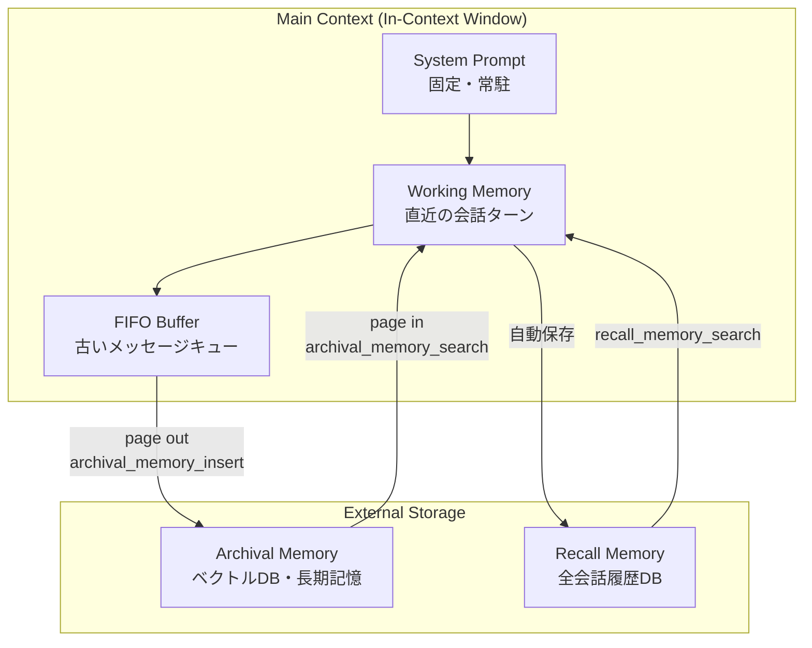
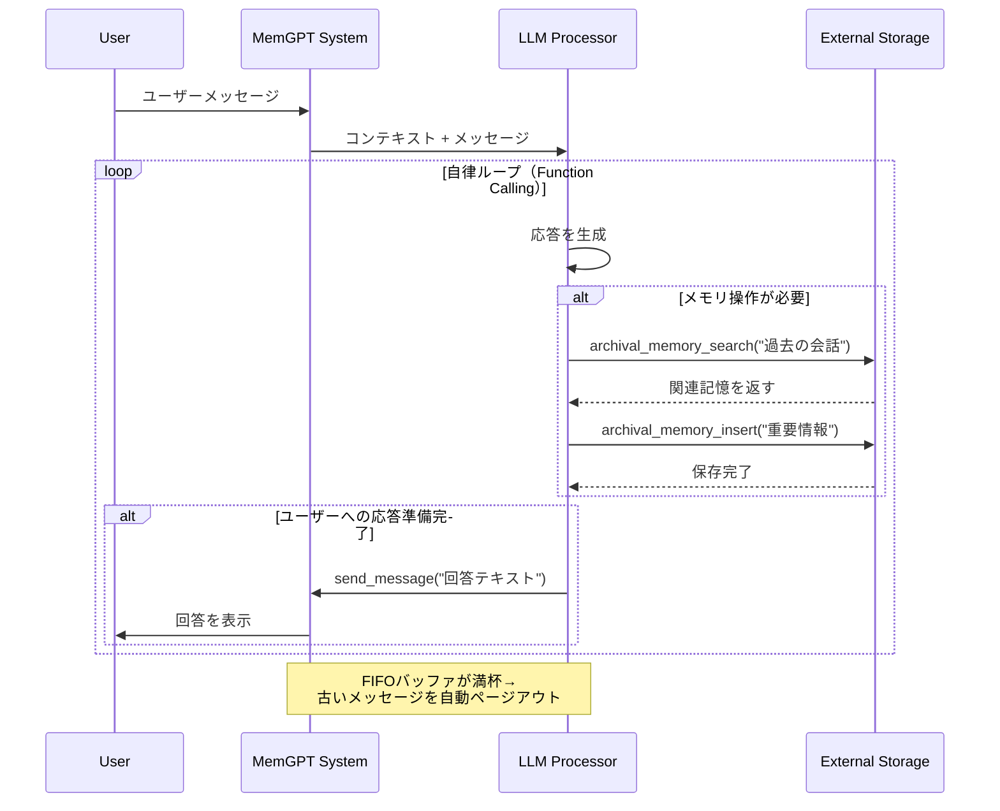

## 論文概要（Abstract）

MemGPT（Memory GPT）は、オペレーティングシステムの仮想メモリ管理をLLMのコンテキスト管理に適用したシステムである。LLMの固定長コンテキストウィンドウ（メインメモリ）と外部ストレージ（ディスク）の間でデータを自律的にページング（ページイン/ページアウト）することで、原理上無限長のコンテキストを処理する。LLM自身が「メモリ管理関数」を呼び出してコンテキストの入れ替えを制御する点が特徴であり、文書分析と複数セッション会話の2つのタスクで有効性を実証している。現在はLettaとしてオープンソースフレームワークに発展している。

この記事は [Zenn記事: LLMコンテキストウィンドウ最適化：5層戦略でコスト70%削減と精度維持を両立する](https://zenn.dev/0h_n0/articles/a350e2a0103cc4) の深掘りです。

## 情報源

- **arXiv ID**: 2310.08560
- **URL**: [https://arxiv.org/abs/2310.08560](https://arxiv.org/abs/2310.08560)
- **著者**: Charles Packer, Vivian Fang, Shishir G. Patil, Kevin Lin, Sarah Wooders, Joseph E. Gonzalez
- **発表年**: 2023
- **分野**: cs.AI, cs.CL, cs.OS
- **コード**: [GitHub - letta-ai/letta](https://github.com/letta-ai/letta)（旧MemGPT）
- **ライセンス**: Apache 2.0

## 背景と動機（Background & Motivation）

LLMのコンテキストウィンドウは有限であり（GPT-4で4K-8K、Claude 3.5で200K等）、これを超えるデータを直接入力することはできない。従来のアプローチは主に3つあった：

1. **トランケーション**: コンテキストの先頭または末尾を切り捨て。情報損失が不可避
2. **要約**: LLMに要約させてから渡す。要約品質に依存し、詳細が失われる
3. **RAG**: 外部DBから関連チャンクを検索して注入。「いつ何を検索するか」の判断が固定的

MemGPTの著者らは、これらのアプローチが**受動的**であることに着目した。OSの仮想メモリ管理では、プロセスが必要なデータをオンデマンドで物理メモリに読み込み/書き出す。同様に、LLM自身がコンテキストの内容を**能動的に管理**できれば、固定長のコンテキストウィンドウでも原理上無限のデータを扱えるはずである。

## 主要な貢献（Key Contributions）

- **貢献1**: OSの仮想メモリ管理（ページング、階層メモリ）をLLMのコンテキスト管理に適用する**概念的フレームワーク**を提案
- **貢献2**: LLM自身がFunction Callingでメモリ操作を行う**自律的メモリ管理アーキテクチャ**を設計・実装
- **貢献3**: 長文ドキュメント分析と複数セッション会話の2つのドメインで、既存手法（トランケーション、要約）を上回る性能を実証
- **貢献4**: オープンソースフレームワーク（現Letta）として公開し、永続エージェントの構築基盤を提供

## 技術的詳細（Technical Details）

### OS仮想メモリとの対応関係

MemGPTのコアアイデアは、OSの仮想メモリ管理の概念をLLMに写像することである：

| OSの概念 | MemGPTでの対応 |
|---------|---------------|
| 物理メモリ（RAM） | LLMのコンテキストウィンドウ（in-context） |
| ディスクストレージ | 外部データベース（ベクトルDB等） |
| ページング | コンテキストへのデータ読み込み/書き出し |
| ページフォルト | コンテキスト内に必要な情報がない状態 |
| メモリ管理ユニット（MMU） | LLM自身（Function Calling経由） |
| プロセス | エージェントの実行タスク |

### メモリ階層構造



#### Main Context（メインメモリ）

LLMのコンテキストウィンドウに直接載る情報：

1. **System Prompt**: エージェントの人格・指示。常にコンテキスト内に保持される（ページアウト不可）
2. **Working Memory**: 構造化されたユーザー情報（名前、好み等）。LLMが明示的に更新可能
3. **FIFO Buffer**: 会話メッセージのキュー。最も古いメッセージから自動的にページアウトされる

#### External Storage（外部ストレージ）

コンテキスト外の永続ストレージ：

1. **Archival Memory**: ベクトルDBに格納される長期記憶。セマンティック検索でアクセス
2. **Recall Memory**: 全会話履歴を格納するリレーショナルDB。タイムスタンプやキーワードで検索

### メモリ管理関数

LLMは以下の関数をFunction Callingで呼び出し、メモリを管理する：

```python
# Archival Memory操作
def archival_memory_insert(content: str) -> str:
    """コンテキストから外部ストレージへデータを書き出す（ページアウト）

    Args:
        content: 保存する情報（文字列）

    Returns:
        保存成功メッセージ
    """
    embedding = embed_model.encode(content)
    vector_db.insert(content=content, embedding=embedding)
    return f"Saved to archival memory: {content[:50]}..."


def archival_memory_search(query: str, count: int = 5) -> list[str]:
    """外部ストレージからコンテキストへデータを読み込む（ページイン）

    Args:
        query: 検索クエリ
        count: 取得件数

    Returns:
        関連する記憶のリスト
    """
    embedding = embed_model.encode(query)
    results = vector_db.search(embedding=embedding, top_k=count)
    return [r.content for r in results]


# Recall Memory操作
def recall_memory_search(query: str, count: int = 5) -> list[str]:
    """過去の会話履歴から検索する

    Args:
        query: 検索クエリ（キーワードまたは日付）
        count: 取得件数

    Returns:
        過去の会話メッセージのリスト
    """
    results = conversation_db.search(query=query, limit=count)
    return [r.message for r in results]


# Working Memory操作
def core_memory_append(key: str, value: str) -> str:
    """Working Memoryに情報を追加する

    Args:
        key: 情報カテゴリ（例: "user_preferences"）
        value: 追加する情報

    Returns:
        更新成功メッセージ
    """
    working_memory[key] += f"\n{value}"
    return f"Added to {key}: {value}"


def core_memory_replace(key: str, old: str, new: str) -> str:
    """Working Memory内の情報を更新する

    Args:
        key: 情報カテゴリ
        old: 置換対象の文字列
        new: 新しい文字列

    Returns:
        更新成功メッセージ
    """
    working_memory[key] = working_memory[key].replace(old, new)
    return f"Updated {key}: '{old}' -> '{new}'"
```

### 制御フロー：割り込み駆動アーキテクチャ

MemGPTはOSの割り込み（interrupt）を模倣した制御フローを採用する：



重要な点は、LLMが **`send_message` 関数を明示的に呼ばない限り**ユーザーに応答しないことである。これにより、LLMはメモリ操作（検索・保存）を先に実行し、十分な情報を得てから応答を生成できる。

### FIFOバッファとページアウト戦略

コンテキストウィンドウの大部分を占めるFIFOバッファは、以下の戦略でメッセージを管理する：

$$
\text{Buffer capacity} = C_{\text{total}} - C_{\text{system}} - C_{\text{working}} - C_{\text{reserved}}
$$

ここで：
- $C_{\text{total}}$: モデルの最大コンテキスト長（例: 8192トークン）
- $C_{\text{system}}$: システムプロンプトのトークン数
- $C_{\text{working}}$: Working Memoryのトークン数
- $C_{\text{reserved}}$: 関数定義・応答生成用の予約トークン数

バッファが容量を超えた場合、最も古いメッセージから順にRecall Memoryへ自動保存（ページアウト）される。Zenn記事で述べた「Working Memoryがトークン予算の70%に達した時点」での要約トリガーは、このFIFOオーバーフロー処理の実装パターンの一つである。

## 実験結果（Results）

### 長文ドキュメント分析

MemGPTを使い、GPT-4の8Kコンテキストウィンドウで最大512Kトークン相当のドキュメントを分析するタスクを評価した。

| 手法 | 対応可能な文書長 | QA精度 |
|------|---------------|--------|
| トランケーション（8K） | 8K | 低い（大部分が切り捨て） |
| 要約 + QA | 無制限（理論上） | 中（要約で詳細が欠落） |
| **MemGPT** | **無制限（理論上）** | **最高** |

MemGPTは、ドキュメント全体をArchival Memoryに格納し、質問に応じて関連セクションをページインすることで、トランケーションや要約ベースの手法を上回った。

### 複数セッション会話

MemoryGymベンチマークでの評価結果：

| 手法 | 事実記憶 | 嗜好記憶 | 会話の一貫性 |
|------|---------|---------|------------|
| 固定コンテキスト | 低 | 低 | 低 |
| 要約ベース | 中 | 低 | 中 |
| **MemGPT** | **高** | **高** | **高** |

MemGPTは、過去のセッションで共有された情報（ユーザーの名前、好み、過去の話題）を長期的に記憶・想起できた。

## 実装のポイント（Implementation）

### Letta（旧MemGPT）での実装

```python
# pip install letta
from letta import create_client

# Lettaクライアントの作成
client = create_client()

# エージェントの作成
agent = client.create_agent(
    name="context-optimizer",
    memory={
        "human": "開発者。LLMアプリケーションのコスト最適化に興味がある。",
        "persona": "AI研究アシスタント。技術的に正確で実用的なアドバイスを提供する。",
    },
)

# メッセージの送信
response = client.send_message(
    agent_id=agent.id,
    message="コンテキストウィンドウ最適化の最新手法を教えて",
)

# レスポンスの処理
for msg in response.messages:
    if msg.message_type == "assistant_message":
        print(msg.assistant_message)
```

### ハマりポイント

1. **Function Calling精度への依存**: メモリ操作の判断はLLMのFunction Calling能力に依存する。GPT-3.5クラスでは不安定で、GPT-4以上を推奨
2. **ページイン/アウトのレイテンシ**: 各メモリ操作にAPI呼び出しが発生する。1回の応答に3-5回のFunction Callが必要なケースもあり、レイテンシが蓄積する
3. **無限ループのリスク**: LLMが不必要なメモリ操作を繰り返すケースがある。最大Function Call回数の制限が必要

## 実運用への応用（Practical Applications）

### Zenn記事の第3層「選択的保持」との関係

Zenn記事で紹介した3層メモリアーキテクチャ（Working Memory / Short-term Memory / Long-term Memory）は、MemGPTの設計パターンを簡略化したものである：

| Zenn記事の層 | MemGPTの対応 | 実装方針 |
|-------------|------------|---------|
| Working Memory（直近5-10ターン） | FIFO Buffer | コンテキスト内に直接保持 |
| Short-term Memory（要約） | Recall Memory（自動保存） | 要約or全文をDB保存 |
| Long-term Memory（事実抽出） | Archival Memory + Working Memory | ベクトルDB + 構造化メモリ |

### スケーリング戦略

- **小規模（〜100ユーザー）**: 単一サーバーでPgvector + PostgreSQL
- **中規模（〜10K）**: Redis（キャッシュ）+ Pinecone/Weaviate（ベクトルDB）
- **大規模（100K+）**: 分散ベクトルDB + メモリ操作の非同期処理

## 関連研究（Related Work）

- **Generative Agents (Park et al., 2023)**: 25体のAIエージェントが仮想社会で生活するシミュレーション。メモリの「重要度」「最新性」「関連性」による検索を実装。MemGPTはこのメモリモデルを一般化
- **Reflexion (Shinn et al., 2023)**: エージェントが自身の行動を振り返り、長期メモリに反省を保存。MemGPTの能動的メモリ管理と相補的
- **SCM (Wang et al., 2023)**: Self-Controlled Memory。LLMが自身のメモリを管理するフレームワーク。MemGPTと類似のアイデアだが、OSアナロジーは持たない

## まとめと今後の展望

MemGPTは、OSの仮想メモリ管理という成熟した概念をLLMのコンテキスト管理に転用することで、固定長コンテキストウィンドウの限界を克服するエレガントなアプローチである。

**実務への示唆**:
- 長期会話エージェント（カスタマーサポート、パーソナルアシスタント）の設計パターンとして直接利用可能
- RAGと組み合わせ、LLM自身が「いつ何を検索するか」を判断する自律型RAGの基盤
- Zenn記事の第3層（選択的保持）を実装する際の参考アーキテクチャ

**今後の研究方向**:
- コンテキストウィンドウの200K化に伴い、ページング戦略の再設計が必要
- メモリ操作のオーバーヘッド削減（バッチページイン、プリフェッチ等）
- マルチエージェント環境での共有メモリ管理

## 参考文献

- **arXiv**: [https://arxiv.org/abs/2310.08560](https://arxiv.org/abs/2310.08560)
- **Code (Letta)**: [https://github.com/letta-ai/letta](https://github.com/letta-ai/letta)
- **Docs**: [https://docs.letta.com/concepts/memgpt/](https://docs.letta.com/concepts/memgpt/)
- **Related Zenn article**: [https://zenn.dev/0h_n0/articles/a350e2a0103cc4](https://zenn.dev/0h_n0/articles/a350e2a0103cc4)
