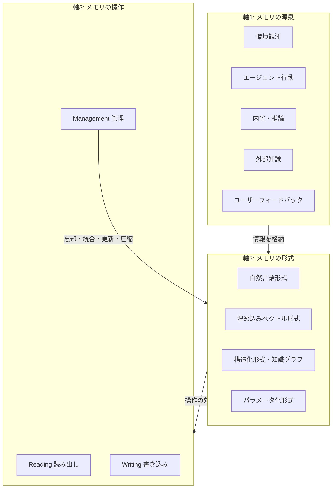

## 論文概要（Abstract）

本論文は、LLMベースのエージェントにおけるメモリ機構を包括的にサーベイした研究である。エージェントの「自己進化能力」の基盤としてメモリを位置づけ、**メモリの源泉（sources）・形式（forms）・操作（operations）**の3軸で既存研究を体系的に整理している。さらに、ロールプレイ・社会シミュレーション・パーソナルアシスタント・オープンワールドゲーム・コード生成・推薦システム・エキスパートシステムの7つの応用領域を分析し、メモリ機構の設計パターンと評価手法を提示する。ACM Transactions on Information Systems (TOIS) に採択された。

この記事は [Zenn記事: LLMエージェントのContext Engineering実践：4戦略でトークンコスト50%削減](https://zenn.dev/0h_n0/articles/e918777f3aa87c) の深掘りです。

## 情報源

- **arXiv ID**: 2404.13501
- **URL**: [https://arxiv.org/abs/2404.13501](https://arxiv.org/abs/2404.13501)
- **著者**: Zeyu Zhang, Xiaohe Bo, Chen Ma, Rui Li, Xu Chen, Quanyu Dai, Jieming Zhu, Zhenhua Dong, Ji-Rong Wen
- **発表年**: 2024年（ACM TOIS 2025年採択）
- **分野**: cs.AI
- **GitHub**: [nuster1128/LLM_Agent_Memory_Survey](https://github.com/nuster1128/LLM_Agent_Memory_Survey)

## 背景と動機（Background & Motivation）

### LLMエージェントにおけるメモリの必要性

基盤モデル（Foundation Model）としてのLLMは、学習データから獲得した広範な知識を持つが、以下の限界がある：

1. **コンテキストウィンドウの制約**: 入力として受け付けられるトークン数に上限がある
2. **知識の固定化**: 学習後の新しい情報を取り込めない（パラメータが凍結される）
3. **個別化の欠如**: ユーザー固有の知識・経験を蓄積できない

メモリ機構は、これらの制約を克服し、エージェントに**自己進化能力（self-evolving capability）**を付与する。環境との長期的で複雑なインタラクションを通じて、経験を蓄積・活用し、タスク遂行能力を向上させる。

### サーベイの範囲

本サーベイは、単にメモリの「種類」を列挙するのではなく、メモリを**動的なシステム**として捉え、以下の問いに答える：

- メモリの**情報はどこから来るか**（源泉）
- メモリの**情報はどう表現されるか**（形式）
- メモリの**情報はどう操作されるか**（操作）

## 主要な貢献（Key Contributions）

- **貢献1**: メモリの源泉・形式・操作の3軸分類フレームワークの提案
- **貢献2**: 7つの応用領域でのメモリ設計パターンの分析
- **貢献3**: メモリ機構の直接評価・間接評価手法の体系化
- **貢献4**: 今後の研究方向の提示（メモリの信頼性、スケーラビリティ、プライバシー等）

## 技術的詳細（Technical Details）

### メモリの3軸分類フレームワーク

#### 軸1: メモリの源泉（Memory Sources）

メモリに格納される情報の出所を以下に分類する：

| 源泉 | 説明 | 例 |
|------|------|-----|
| **環境観測** | ツール出力、API応答、ファイル内容 | `ReadFile("main.py")` の結果 |
| **エージェント行動** | 過去の行動履歴と結果 | "main.pyの42行目を修正 → テスト成功" |
| **内省・推論** | エージェントの思考過程や学び | "このバグはNoneチェック漏れが原因" |
| **外部知識** | ドキュメント、データベース | プロジェクトのREADME、API仕様書 |
| **ユーザーフィードバック** | ユーザーからの修正・指示 | "このアプローチではなくXを使って" |

#### 軸2: メモリの形式（Memory Forms）

メモリがどのようなデータ構造で表現されるかを分類する：

**1. 自然言語形式**

最もシンプルかつ説明可能な形式。テキストとして保存し、プロンプトに直接挿入できる。

```python
# 自然言語形式のメモリ例
memory_entry = {
    "type": "experience",
    "content": "FastAPIでCORSを設定する際、allow_originsに'*'を指定すると"
               "セキュリティリスクがある。本番環境では具体的なドメインを指定すべき。",
    "timestamp": "2026-02-18T10:00:00Z",
    "confidence": 0.95,
}
```

**2. 埋め込みベクトル形式**

テキストをベクトルに変換し、意味的類似性に基づく検索を可能にする。

$$
\mathbf{e} = \text{Embed}(t) \in \mathbb{R}^d
$$

ここで$t$はテキスト、$d$は埋め込み次元数（典型的には768〜3072）。

検索時のコサイン類似度：

$$
\text{sim}(\mathbf{e}_q, \mathbf{e}_m) = \frac{\mathbf{e}_q \cdot \mathbf{e}_m}{\|\mathbf{e}_q\| \|\mathbf{e}_m\|}
$$

**3. 構造化形式（知識グラフ）**

エンティティ間の関係をグラフとして保存し、推論に活用する。

$$
G = (V, E) \quad \text{where} \quad V = \{v_1, \ldots, v_n\}, \quad E = \{(v_i, r, v_j)\}
$$

$V$はエンティティ集合、$E$はリレーション（関係）を含むエッジ集合。

**4. パラメータ化形式（In-Weights）**

ファインチューニングによりモデルのパラメータに知識を埋め込む形式。更新コストが高いが、推論時の追加的な検索は不要。



#### 軸3: メモリの操作（Memory Operations）

**Reading（読み出し）操作**:

| 手法 | メカニズム | 適用場面 |
|------|----------|---------|
| **FIFO** | 最も古い記憶から順に取得 | 短期的な会話履歴 |
| **Recency-based** | 最近のものを優先 | セッション内のタスク |
| **Relevance-based** | クエリとの関連度で検索 | RAG、知識ベース検索 |
| **Importance-based** | 重要度スコアで選択 | 長期メモリの管理 |

Relevance-basedの実装パターン：

```python
from langchain_core.vectorstores import InMemoryVectorStore
from langchain_openai import OpenAIEmbeddings

class RelevanceBasedMemory:
    """関連度ベースのメモリ読み出し

    埋め込みベクトルのコサイン類似度で最も関連性の高い
    メモリを検索する。
    """

    def __init__(self, embedding_dim: int = 1536):
        self.store = InMemoryVectorStore(
            embedding=OpenAIEmbeddings()
        )

    def read(self, query: str, top_k: int = 5) -> list[str]:
        """クエリに関連するメモリをtop_k件取得

        Args:
            query: 検索クエリ
            top_k: 取得する件数

        Returns:
            関連度の高いメモリのリスト
        """
        results = self.store.similarity_search(
            query=query,
            k=top_k,
        )
        return [doc.page_content for doc in results]
```

**Writing（書き込み）操作**:

| 戦略 | 説明 | トリガー |
|------|------|---------|
| **即時書き込み** | 新しい情報を即座に保存 | 各ターン終了時 |
| **反省的書き込み** | 一連のタスク完了後に学びを抽出して保存 | タスク完了時 |
| **周期的合成** | 定期的にメモリを統合・要約 | N ターンごと |
| **選択的書き込み** | 重要度閾値を超えた情報のみ保存 | スコア > 閾値 |

**Management（管理）操作**:

メモリの量が増加すると、管理が不可欠になる：

1. **忘却（Forgetting）**: 古い・不要なメモリを削除
2. **統合（Consolidation）**: 類似するメモリを統合
3. **更新（Update）**: 既存のメモリを新しい情報で修正
4. **圧縮（Compression）**: メモリのサイズを削減しながら情報を保持

```python
def manage_memory(
    memory_store: list[MemoryEntry],
    max_entries: int = 1000,
    compression_threshold: float = 0.85,
) -> list[MemoryEntry]:
    """メモリ管理: 統合・圧縮・忘却を実行

    Args:
        memory_store: 現在のメモリ一覧
        max_entries: メモリの最大エントリ数
        compression_threshold: 圧縮トリガーの閾値

    Returns:
        管理後のメモリ一覧
    """
    # 1. 類似メモリの統合
    consolidated = consolidate_similar(memory_store, threshold=0.9)

    # 2. 重要度の低いメモリの忘却
    if len(consolidated) > max_entries:
        scored = [(m, importance_score(m)) for m in consolidated]
        scored.sort(key=lambda x: x[1], reverse=True)
        consolidated = [m for m, _ in scored[:max_entries]]

    # 3. 古いメモリの圧縮
    usage = len(consolidated) / max_entries
    if usage > compression_threshold:
        consolidated = compress_old_memories(consolidated)

    return consolidated
```

## 代表的なシステムの分析

### MemGPT (Packer et al., 2023)

OS（オペレーティングシステム）のメモリ管理を模倣し、LLMのコンテキストウィンドウを「主記憶」、外部ストレージを「補助記憶」として扱う。ページングアルゴリズムで情報を動的に入れ替える。

- **Core Memory**: コンテキストウィンドウ内（RAM相当）
- **Archival Memory**: 外部ベクトルDB（ディスク相当）
- **Recall Memory**: 会話履歴の検索用インデックス

### Generative Agents (Park et al., 2023)

シミュレーション環境での社会的エージェント。3段階のメモリパイプライン：

1. **Observation**: 環境からの観測を記録
2. **Reflection**: 蓄積した観測から高次の洞察を抽出
3. **Planning**: 洞察に基づいて行動計画を生成

**重要度スコア**を用いた記憶の重み付け：

$$
\text{score}(m) = \alpha \cdot \text{recency}(m) + \beta \cdot \text{importance}(m) + \gamma \cdot \text{relevance}(m, q)
$$

ここで$\alpha, \beta, \gamma$は重み係数、$q$は現在のクエリ。

### Reflexion (Shinn et al., 2023)

試行錯誤を通じた学習メカニズム。失敗した試行からの「反省（reflection）」を言語的フィードバックとして保存し、次の試行でコンテキストに注入する。

**試行内メモリ**: 1回の試行内の短期的な状態
**試行間メモリ**: 複数試行にまたがる反省と学び

## 実装のポイント（Implementation）

### メモリ階層の設計指針

本サーベイの分析から、以下の設計指針が導かれる：

1. **短期メモリ**: コンテキストウィンドウ内に直近のインタラクションを保持（FIFOまたはスライディングウィンドウ）
2. **中期メモリ**: セッション内の重要な決定・学びを構造化テキストで外部保存
3. **長期メモリ**: セッションをまたぐ知識を埋め込みベクトル+知識グラフで管理

### コンテキスト使用率70%閾値

サーベイの分析から、コンテキスト使用率が**70%を超えた時点**で外部メモリへのオフロードを開始することが推奨される。これにより、Context Rotの影響を最小化しつつ、十分な作業メモリを確保できる。

### 検索戦略のトレードオフ

| 手法 | 検索速度 | 精度 | 実装コスト |
|------|---------|------|----------|
| BM25（疎検索） | 高速 | 中 | 低 |
| FAISS（密検索） | 中速 | 高 | 中 |
| ハイブリッド | 中速 | 最高 | 高 |

## 実験結果（Results）

### メモリ管理の失敗による性能劣化

サーベイが分析した複数の研究から、コンテキスト管理の不備による性能劣化は平均**18〜35%**に達する。特に以下のパターンが顕著：

| 失敗パターン | 性能劣化 | 主な原因 |
|-------------|---------|---------|
| コンテキスト超過 | -25〜35% | ツール出力の無制限蓄積 |
| 無関連情報の混入 | -18〜25% | フィルタリングなしのメモリ読み出し |
| 古い情報の滞留 | -15〜20% | 忘却メカニズムの欠如 |

### 応用領域別のメモリ活用パターン

| 領域 | 主なメモリ形式 | 主な読み出し手法 | 特徴的な操作 |
|------|-------------|---------------|------------|
| コード生成 | 自然言語 + 構造化 | 関連度ベース | 反省的書き込み |
| ロールプレイ | 自然言語 | 重要度ベース | 周期的合成 |
| 社会シミュレーション | 構造化（グラフ） | 複合スコア | 反省→計画 |
| パーソナルアシスタント | 埋め込みベクトル | 関連度ベース | 選択的書き込み |

## 実運用への応用（Practical Applications）

### Zenn記事との関連

[Zenn記事](https://zenn.dev/0h_n0/articles/e918777f3aa87c)で紹介した4戦略（Write / Select / Compress / Isolate）は、本サーベイの3軸分類に直接対応する：

| Zenn記事の4戦略 | サーベイの分類 |
|----------------|-------------|
| Write | Writing操作（即時・反省的・周期的） |
| Select | Reading操作（関連度ベース検索） |
| Compress | Management操作（圧縮・統合） |
| Isolate | アーキテクチャレベルの設計（マルチエージェント） |

### LangGraphでの実装マッピング

本サーベイの分類をLangGraphの機能に対応させると：

- **短期メモリ**: `Checkpointer`（スレッドスコープ）
- **長期メモリ**: `InMemoryStore` / `InMemoryVectorStore`
- **Reading操作**: `store.search()` / `similarity_search()`
- **Writing操作**: `store.put()`
- **Management**: カスタムノードでの定期圧縮

## 関連研究（Related Work）

- **MemGPT** (Packer et al., 2023): OS風メモリ管理の先駆的研究。本サーベイでは「形式」と「操作」の両面から分析
- **Generative Agents** (Park et al., 2023): 社会シミュレーションでの反省メカニズム。「源泉」としての内省に着目
- **Reflexion** (Shinn et al., 2023): 試行間メモリの概念。失敗からの学習を言語的に保存
- **Voyager** (Wang et al., 2023): Minecraftでのスキルライブラリ。「パラメータ化形式」ではなく「コード形式」でスキルを蓄積

## まとめと今後の展望

### 主要な成果

本サーベイは、LLMエージェントのメモリ機構を**源泉・形式・操作**の3軸で統一的に分類するフレームワークを提案し、7つの応用領域での設計パターンを分析した。メモリ管理の不備による性能劣化が18〜35%に達するという定量的な知見は、Context Engineeringの重要性を裏付ける。

### 実務への示唆

1. メモリの**3軸**（何を・どう表現し・どう操作するか）を明確に設計する
2. **コンテキスト使用率70%**を閾値として外部メモリへのオフロードを開始
3. 応用領域に応じた**メモリ形式と読み出し手法**の組み合わせを選択
4. **忘却と統合**のメカニズムを必ず実装する（ないとメモリが肥大化）

### 今後の研究方向

- メモリの**信頼性**: 誤った記憶の検出と修正
- **スケーラビリティ**: 数百万エントリ規模でのメモリ管理
- **プライバシー**: ユーザーの個人情報を含むメモリの安全な管理
- **メモリ間転送**: 異なるタスク・エージェント間でのメモリ共有

## 参考文献

- **arXiv**: [https://arxiv.org/abs/2404.13501](https://arxiv.org/abs/2404.13501)
- **Code**: [https://github.com/nuster1128/LLM_Agent_Memory_Survey](https://github.com/nuster1128/LLM_Agent_Memory_Survey)
- **ACM TOIS**: [https://dl.acm.org/doi/10.1145/3748302](https://dl.acm.org/doi/10.1145/3748302)
- **Related Zenn article**: [https://zenn.dev/0h_n0/articles/e918777f3aa87c](https://zenn.dev/0h_n0/articles/e918777f3aa87c)
