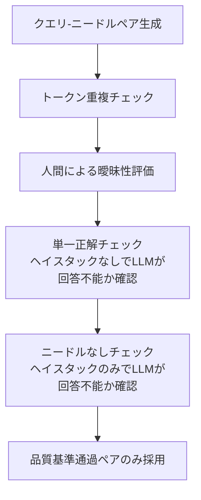

## 論文概要（Abstract）

NoLiMa（Non-Literal Matching）は、従来のNeedle-in-a-Haystack（NIAH）ベンチマークが持つ「リテラルマッチングへの依存」という根本的な問題を解決する新しい長文コンテキスト評価ベンチマークである。クエリとニードルの間に意味的には関連するが語彙的には重複しない関係を設計し、モデルに非リテラルな推論を要求する。17のLLMを1Kから128Kトークンまで系統的に評価した結果、多くのモデルで1K-2Kトークンを超えると性能が50%以上低下することが判明した。ICML 2025にポスターとして採択されている。

この記事は [Zenn記事: LLMコンテキストウィンドウ最適化：5層戦略でコスト70%削減と精度維持を両立する](https://zenn.dev/0h_n0/articles/a350e2a0103cc4) の深掘りです。

## 情報源

- **arXiv ID**: 2502.05167
- **URL**: [https://arxiv.org/abs/2502.05167](https://arxiv.org/abs/2502.05167)
- **著者**: Ali Modarressi, Hanieh Hajishirzi, Hinrich Schütze
- **発表年**: 2025
- **会議**: ICML 2025（Poster）
- **分野**: cs.CL, cs.AI
- **ライセンス**: MIT
- **データセット**: [HuggingFace](https://huggingface.co/datasets/alimodarressi/nolima)
- **コード**: [GitHub](https://github.com/adobe-research/NoLiMa)

## 背景と動機（Background & Motivation）

LLMのコンテキストウィンドウはGPT-4の4Kトークンから、Gemini 1.5 Proの1Mトークンまで急速に拡大してきた。しかし、コンテキストウィンドウの「公称サイズ」と「実効サイズ」には大きな乖離がある。

従来のNIAHベンチマークでは、クエリとニードルが同一のキーワードを共有しているため、モデルは単純な文字列マッチングで正解を導ける。最新モデルの多くがNIAHでほぼ満点を取得しているが、これは長文理解能力の証明にはならない。

NoLiMaの著者らは、この「リテラルマッチング依存」こそが既存ベンチマークの根本的な欠陥であると指摘する。実世界のタスクでは、クエリと関連情報が語彙的に一致しないケースが大半である。例えば「フランスの首都の人口は？」というクエリに対し、関連文書が「Paris」という単語を含んでいても「フランスの首都」とは語彙的に異なる。

## 主要な貢献（Key Contributions）

- **貢献1**: リテラルマッチングに依存しない新しいNIAH拡張ベンチマーク「NoLiMa」の設計と公開（MITライセンス）
- **貢献2**: 17モデルの系統的評価により、128Kトークン対応を謳うモデルでも1K-2Kトークン超で50%以上の性能低下が起きることを実証
- **貢献3**: Attention機構の希釈がボトルネックであることの機械的証拠の提示
- **貢献4**: 2つの失敗モード（ニードル探索失敗・キーワードマッチング失敗）の分離と定量化

## 技術的詳細（Technical Details）

### ベンチマーク設計

NoLiMaのコアアイデアは、クエリとニードルの間の語彙的重複を完全に排除することである。

#### ニードルの形式

ニードルは固定テンプレートに従う：

```
"The {attribute} of {entity} is {value}"
```

例: `"The lucky number of Alice is 42"`

#### 9つの関連性タイプ

クエリとニードルを結ぶ関連性を9種類設計している：

| タイプ | ニードル | クエリ | 関連性の性質 |
|--------|---------|--------|-------------|
| Antonym（対義語） | "cold" | "warm" | 意味的反対 |
| Property（属性） | "gold" | "atomic number 79の金属" | 定義的属性 |
| Category（カテゴリ） | "clarinet" | "woodwind instrument" | 上位概念 |
| Country-Capital | "Paris" | "France" | 地理的関連 |
| Occupation（職業） | "Alice" | "teacher" | 人物-職業 |
| Person（人物） | "teacher" | "Alice" | 職業-人物 |
| Color（色） | "green" | "grass" | 色-物体 |
| Paraphrase（言い換え） | "Albert Einstein" | "相対性理論の物理学者" | 同義表現 |
| Hypernym（上位語） | "dog" | "animal" | 種-属 |

#### ヘイスタック（背景テキスト）

主にPaul Grahamのエッセイを使用し、ロバストネスチェックとしてGutenberg BooksとarXiv論文も使用。ニードルは3つの位置（上位10%、中央、下位10%）に配置し、結果を平均化している。

#### データセット規模

- テンプレートベース: 9タイプ × 50例 = **450例**
- オープンエンド: **20例**（人間が設計した複雑な文化的連想を含む）
- 評価コンテキスト長: 1K, 2K, 4K, 8K, 16K, 32K, 64K, 128K トークン

### 品質管理プロセス



このプロセスにより、データ汚染のリスクを排除し、タスクの妥当性を保証している。

### Attention希釈の分析

著者らはLlama 3.1（8Bおよび70B）モデルで、最終トークン生成時のAttentionパターンを分析した。

コンテキスト長 $L$ における関連トークン集合 $\mathcal{R}$ とディストラクタートークン集合 $\mathcal{D}$ に対し、Attention重みの合計を以下のように定義する：

$$
A_{\text{relevant}}(L) = \sum_{i \in \mathcal{R}} \alpha_i, \quad A_{\text{distractor}}(L) = \sum_{j \in \mathcal{D}} \alpha_j
$$

ここで $\alpha_i$ はトークン $i$ に対するAttention重みである。

実験結果として、コンテキスト長 $L$ が増加するにつれ：
- $A_{\text{relevant}}(L)$ は単調に減少
- $A_{\text{distractor}}(L)$ は単調に増加

この現象は **Attention希釈（Attention Dilution）** と呼ばれ、Softmax正規化により全トークンのAttention重みの合計が1に制約されるため、コンテキスト長の増加に伴い個々のトークンへの重みが希薄化する構造的な問題である。

$$
\alpha_i = \frac{\exp(q \cdot k_i / \sqrt{d_k})}{\sum_{j=1}^{L} \exp(q \cdot k_j / \sqrt{d_k})}
$$

$L$ が大きくなると分母が増大し、関連トークンへの $\alpha_i$ が縮小する。

### 2つの失敗モード

著者らは「ゴールドニードル」変種を設計し、失敗モードを分離した：

1. **ニードル探索失敗**: 長いコンテキスト内でニードルの位置を特定できない
2. **キーワードマッチング失敗**: ニードルを見つけても、クエリとの非リテラルな関連を解けない

実験結果：
- **長コンテキスト**: ニードル探索失敗が支配的
- **短コンテキスト**: キーワードマッチング失敗も有意に寄与
- 特にHypernym（上位語）とParaphrase（言い換え）の関連性タイプが最も困難

## 実験結果（Results）

### 主要結果

| モデル | 1K精度 | 32K精度 | 128K精度 | 低下幅（1K→128K） |
|--------|--------|---------|----------|-------------------|
| Claude 3.5 Sonnet | 90%+ | — | **36.2%** | -54%+ |
| GPT-4o | **86.9%** | — | 49.0% | -37.9% |
| Gemini 1.5 Pro | 高い | — | **10.9%** | 大幅低下 |
| Llama-3.1-70B | — | — | 32.7% | — |
| Llama-3.1-8B | — | **22.4%**（8K） | <10% | — |
| Command R+ | — | — | <10% | — |

**従来NIAHとの比較**: Gemini 1.5 ProはNIAHでほぼ満点だが、NoLiMaでは128Kで10.9%まで低下。

### 他ベンチマークとの相関

| ベンチマーク | 相関係数 |
|-------------|---------|
| RULER | r = 0.80 |
| ZeroScrolls | r = 0.88 |

NoLiMaはRULER・ZeroScrollsと高い相関を持ちつつ、より低い性能を示すため、**より識別力の高いベンチマーク**であることが確認された。

### 関連性タイプ別の難易度

- **最も容易**: Color（色）、Antonym（対義語）
- **最も困難**: Paraphrase（言い換え）、Hypernym（上位語）

### ヘイスタック種別のロバストネス

Paul Graham Essays、Books、arXiv論文の3種類のヘイスタックで評価した結果、性能は一貫しており、課題がヘイスタック固有のものではないことを確認。

## 実装のポイント（Implementation）

### NoLiMaの利用方法

```python
# pip install nolima
from datasets import load_dataset

# HuggingFaceからデータセットをロード
dataset = load_dataset("alimodarressi/nolima")

# テンプレートベースタスクの例
for example in dataset["template"]:
    needle = example["needle"]        # "The lucky number of Alice is 42"
    query = example["query"]          # "What is the lucky number of the teacher?"
    answer = example["answer"]        # "42"
    association = example["association_type"]  # "occupation"

    # ヘイスタックにニードルを埋め込み
    haystack = construct_haystack(
        needle=needle,
        context_length=32000,  # トークン数
        position="center"      # top/center/bottom
    )

    # モデルに入力して回答を取得
    response = model.generate(haystack + "\n" + query)

    # LLM-as-a-judge評価
    is_correct = judge_answer(response, answer)
```

### 自社モデル評価への応用

NoLiMaの知見をRAGシステムに適用する際の実践的ポイント：

1. **チャンク配置戦略**: 最重要なチャンクをコンテキストの先頭または末尾に配置する
2. **コンテキスト長制限**: 公称128Kでも、精度重視なら8K-16K以内に抑える
3. **非リテラルマッチング能力のテスト**: 自社タスクでNoLiMa的な評価を実施し、モデルの実効性能を把握する

```python
def reorder_chunks_for_optimal_placement(
    chunks: list[str],
    relevance_scores: list[float],
) -> list[str]:
    """関連度に基づいてチャンクを先頭・末尾に配置する戦略

    Args:
        chunks: 検索で取得したチャンクのリスト
        relevance_scores: 各チャンクの関連度スコア

    Returns:
        最適配置されたチャンクのリスト
    """
    # 関連度でソート
    scored = sorted(
        zip(chunks, relevance_scores),
        key=lambda x: x[1],
        reverse=True,
    )

    # 上位を先頭・末尾に、中間に低関連度を配置
    high_relevance = [c for c, s in scored[:len(scored)//3]]
    mid_relevance = [c for c, s in scored[len(scored)//3:2*len(scored)//3]]
    low_relevance = [c for c, s in scored[2*len(scored)//3:]]

    # 先頭: 最重要、中間: 低重要、末尾: 次重要
    return high_relevance + low_relevance + mid_relevance
```

## 実運用への応用（Practical Applications）

### コンテキストウィンドウ最適化への示唆

NoLiMaの結果は、Zenn記事で紹介した5層最適化戦略の必要性を定量的に裏付ける：

1. **プロンプト圧縮（第1層）の正当化**: 128Kトークンを使えても性能が10-36%まで低下するなら、LLMLingua-2等で8K以下に圧縮して高精度を維持する方が合理的
2. **スマートチャンキング（第2層）の改善**: チャンクの配置順序が性能に直結。先頭・末尾優先配置の根拠
3. **RAG（第4層）のk値設計**: k=10以上では中間チャンクが「Lost in the Middle」問題を引き起こすリスクがあり、k=3-5が推奨される根拠

### スケーリング戦略

- **短期**: 既存モデルではコンテキスト長を8K-16K以内に制限し、圧縮・RAGで補完
- **中期**: NoLiMaスコアの高いモデル（Claude系、GPT系）を選定
- **長期**: Attention機構の根本的改良（Sparse Attention, Linear Attention等）を持つ次世代モデルの採用

## 関連研究（Related Work）

- **Lost in the Middle (Liu et al., 2023)**: 長文コンテキストの中間部分の情報が認識されにくいU字型性能曲線を初めて体系的に実証。NoLiMaはこの知見を非リテラルマッチング設定に拡張
- **RULER (Hsieh et al., 2024)**: 複数のNIAH変種を含むベンチマーク。ただしリテラルマッチングに依存しており、NoLiMaの方がより識別力が高い
- **LongBench v2 (Bai et al., 2024)**: 現実的な長文タスクのベンチマーク。NoLiMaとは相補的な関係にある

## まとめと今後の展望

NoLiMaは、LLMの長文理解能力に対する「厳しい現実」を突きつけるベンチマークである。128Kトークンのコンテキストウィンドウを持つモデルでも、非リテラルマッチングでは1K-2Kトークンを超えると急激に性能が低下する。

**実務への示唆**:
- コンテキストウィンドウの大きさを過信せず、**実効サイズ**を自社タスクで検証すべき
- RAGシステムでは、チャンクの内容だけでなく**配置順序**が性能を大きく左右する
- 今後のモデル選定では、公称コンテキスト長よりNoLiMaスコアを重視すべき

**今後の研究方向**:
- 多言語対応（現在は英語のみ）
- Attention機構の改良（Sparse Attention、Linear Attention、State Space Models等）
- チェーン長（推論ホップ数）と性能の関係のさらなる分析

## 参考文献

- **arXiv**: [https://arxiv.org/abs/2502.05167](https://arxiv.org/abs/2502.05167)
- **ICML 2025 Poster**: [https://icml.cc/virtual/2025/poster/46685](https://icml.cc/virtual/2025/poster/46685)
- **Code**: [https://github.com/adobe-research/NoLiMa](https://github.com/adobe-research/NoLiMa)
- **Dataset**: [https://huggingface.co/datasets/alimodarressi/nolima](https://huggingface.co/datasets/alimodarressi/nolima)
- **Related Zenn article**: [https://zenn.dev/0h_n0/articles/a350e2a0103cc4](https://zenn.dev/0h_n0/articles/a350e2a0103cc4)
