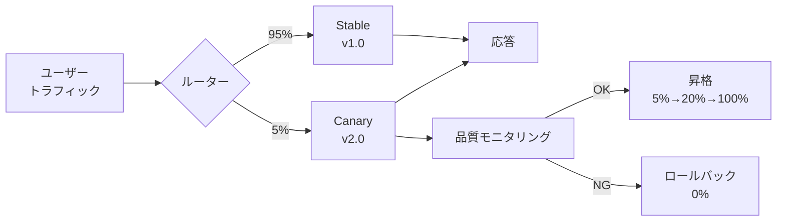
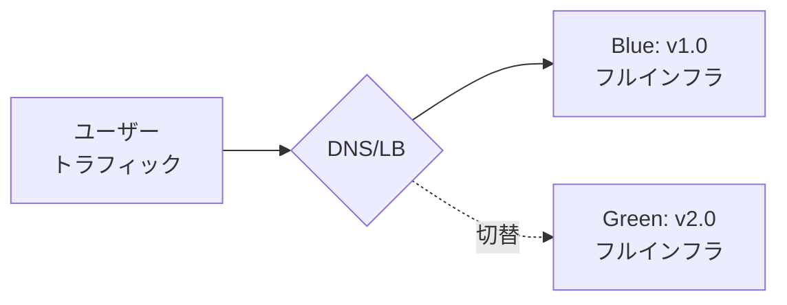
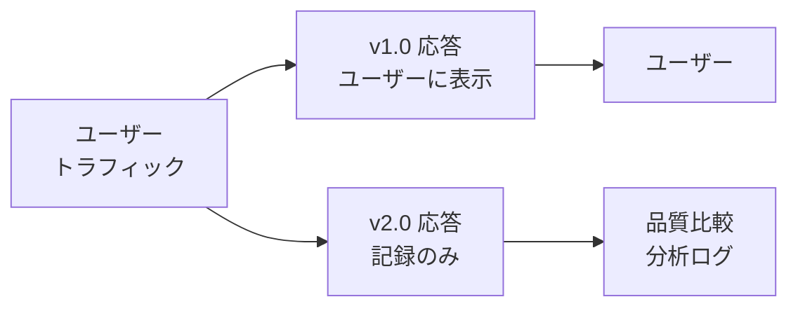

## 論文概要（Abstract）

本論文は、LLM更新時のデプロイ戦略として**カナリア**・**ブルーグリーン**・**シャドウモード**の3パターンを体系的に分類・比較する。各戦略の適用条件（リスク許容度・トラフィック量・評価レイテンシ）を整理し、カナリアデプロイにおいて品質メトリクスに基づく**ベイズ的自動昇格アルゴリズム**を提案する。シミュレーション実験により、従来の固定スケジュール昇格と比較して「品質劣化ユーザー割合」を有意に削減できることを示している。

この記事は [Zenn記事: LLMアプリの本番CI/CD戦略：カナリアデプロイと品質ゲートで安全にリリースする](https://zenn.dev/0h_n0/articles/d13e9d53c69e12) の深掘りです。

## 情報源

- **arXiv ID**: 2402.01358
- **URL**: [https://arxiv.org/abs/2402.01358](https://arxiv.org/abs/2402.01358)
- **発表年**: 2024
- **分野**: cs.SE, cs.LG

## 背景と動機（Background & Motivation）

2025年4月のChatGPT GPT-4oロールバック事件は、LLM更新の全ユーザー一斉デプロイが持つリスクを顕在化させた。しかし、従来のWebサービスで確立されたカナリアデプロイをLLMに適用するには、いくつかの固有の課題がある：

1. **品質評価の遅延**: LLM出力の品質評価には人間評価やLLM-as-Judgeが必要で、レイテンシメトリクスのようにリアルタイムでは取得できない
2. **非決定論的出力**: 同一入力に対して異なる応答が返るため、A/Bの直接比較が困難
3. **多次元品質**: 正確性・安全性・流暢性・関連性等、複数の品質軸を同時に監視する必要がある
4. **サンプルサイズ問題**: カナリア比率5%では、十分な統計的検出力を得るまでに長時間を要する

本論文は、これらの課題に対処する段階的ロールアウト戦略のフレームワークを提案する。

## 主要な貢献（Key Contributions）

- **貢献1**: カナリア・ブルーグリーン・シャドウの3パターンの適用条件を体系的に整理
- **貢献2**: 品質メトリクスに基づくベイズ的カナリア自動昇格アルゴリズムの設計
- **貢献3**: シミュレーション実験による各戦略の定量的比較

## 技術的詳細（Technical Details）

### 3つのデプロイ戦略の比較

#### カナリアデプロイ（Canary Deployment）



**特徴**: トラフィックの一部のみを新バージョンに振り分け、品質を監視しながら段階的に拡大。

**LLM固有の課題**: カナリアユーザーの品質劣化はリアルタイムで検出困難（LLM-as-Judge評価に数秒〜数十秒のレイテンシ）。

#### ブルーグリーンデプロイ（Blue-Green Deployment）



**特徴**: 2つの本番環境を並行運用し、DNS/ロードバランサで即座に切り替え。

**LLM固有の利点**: GPU推論インフラの完全なコピーが必要なため高コストだが、ロールバックは即座（DNS切替のみ）。

**適用条件**: 高可用性が求められるクリティカルなLLMサービス（例: カスタマーサポートBot）。

#### シャドウモード（Shadow Mode / Dark Launch）



**特徴**: 新バージョンにもトラフィックを送るが、ユーザーには旧バージョンの応答のみを返す。

**LLM固有の利点**: ユーザーへのリスクがゼロ。同一入力での応答品質を直接比較できる（対応のある比較）。

**LLM固有のコスト**: GPU推論コストが2倍。

### 戦略の定量的比較

| 戦略 | リスク | コスト | ロールバック速度 | 統計的検出力 | ユーザー影響 |
|------|-------|-------|----------------|------------|------------|
| カナリア | 中 | 低 | 秒 | 低（小サンプル） | あり |
| ブルーグリーン | 高（一斉切替） | 高（2倍インフラ） | 秒 | 高（全トラフィック） | あり |
| シャドウ | なし | 高（2倍推論） | — | 最高（対応のある比較） | なし |

### ベイズ的カナリア自動昇格アルゴリズム

本論文の核心的な技術貢献。従来のカナリアデプロイが**固定スケジュール**（「30分ごとに比率を倍増」等）で昇格するのに対し、本アルゴリズムは**品質メトリクスの事後分布**に基づいて昇格を判断する。

#### 問題設定

カナリアバージョンの品質スコアを $q_c$、ステーブルバージョンの品質スコアを $q_s$ とする。品質差 $\delta = q_c - q_s$ について、以下の意思決定を行う：

- $\delta > -\epsilon$: 品質維持（昇格）
- $\delta < -\delta_{\text{rollback}}$: 品質劣化（ロールバック）
- それ以外: 追加観測が必要（待機）

#### ベイズ更新

品質スコアの事前分布にBeta分布を仮定：

$$
q_c \sim \text{Beta}(\alpha_c, \beta_c)
$$

観測データ（成功/失敗の二項試行）に基づく事後更新：

$$
q_c | \text{data} \sim \text{Beta}(\alpha_c + s_c, \beta_c + f_c)
$$

ここで、
- $\alpha_c, \beta_c$: 事前分布のパラメータ（初期値は $\alpha_c = \beta_c = 1$、無情報事前分布）
- $s_c$: カナリアバージョンでの成功回数（品質スコアが閾値以上）
- $f_c$: カナリアバージョンでの失敗回数

同様に、ステーブルバージョンについても：

$$
q_s | \text{data} \sim \text{Beta}(\alpha_s + s_s, \beta_s + f_s)
$$

#### 昇格判定

品質差 $\delta$ が許容範囲内である確率を計算：

$$
P(\delta > -\epsilon | \text{data}) = P(q_c - q_s > -\epsilon | \text{data})
$$

この確率が閾値 $\gamma$（例: 0.95）を超えた場合に昇格：

$$
\text{Decision} = \begin{cases}
\text{Promote} & \text{if } P(\delta > -\epsilon | \text{data}) > \gamma \\
\text{Rollback} & \text{if } P(\delta < -\delta_{\text{rollback}} | \text{data}) > \gamma \\
\text{Wait} & \text{otherwise}
\end{cases}
$$

```python
import numpy as np
from scipy import stats
from dataclasses import dataclass, field

@dataclass
class BayesianCanaryPromotion:
    """ベイズ的カナリア自動昇格アルゴリズム

    品質メトリクスの事後分布に基づいて、
    カナリアの昇格・ロールバック・待機を判断する。
    """
    # 事前分布パラメータ（無情報事前分布）
    alpha_canary: float = 1.0
    beta_canary: float = 1.0
    alpha_stable: float = 1.0
    beta_stable: float = 1.0
    # 判定パラメータ
    epsilon: float = 0.05        # 許容品質劣化幅
    rollback_threshold: float = 0.15  # ロールバック閾値
    gamma: float = 0.95          # 確信度閾値
    # カナリア比率管理
    current_ratio: float = 0.05
    promotion_factor: float = 4.0
    # 観測データ
    canary_successes: int = 0
    canary_failures: int = 0
    stable_successes: int = 0
    stable_failures: int = 0

    def observe(
        self,
        canary_success: bool,
        stable_success: bool,
    ) -> None:
        """新しい観測データを追加

        Args:
            canary_success: カナリアが成功したか
            stable_success: ステーブルが成功したか
        """
        if canary_success:
            self.canary_successes += 1
        else:
            self.canary_failures += 1
        if stable_success:
            self.stable_successes += 1
        else:
            self.stable_failures += 1

    def compute_promotion_probability(
        self, n_samples: int = 10000
    ) -> float:
        """昇格確率を計算（モンテカルロ法）

        事後分布からサンプリングし、
        品質差が許容範囲内である確率を推定する。

        Args:
            n_samples: モンテカルロサンプル数

        Returns:
            P(q_canary - q_stable > -epsilon)
        """
        q_c_samples = np.random.beta(
            self.alpha_canary + self.canary_successes,
            self.beta_canary + self.canary_failures,
            size=n_samples,
        )
        q_s_samples = np.random.beta(
            self.alpha_stable + self.stable_successes,
            self.beta_stable + self.stable_failures,
            size=n_samples,
        )
        delta_samples = q_c_samples - q_s_samples
        return float(np.mean(delta_samples > -self.epsilon))

    def compute_rollback_probability(
        self, n_samples: int = 10000
    ) -> float:
        """ロールバック確率を計算

        Args:
            n_samples: モンテカルロサンプル数

        Returns:
            P(q_canary - q_stable < -rollback_threshold)
        """
        q_c_samples = np.random.beta(
            self.alpha_canary + self.canary_successes,
            self.beta_canary + self.canary_failures,
            size=n_samples,
        )
        q_s_samples = np.random.beta(
            self.alpha_stable + self.stable_successes,
            self.beta_stable + self.stable_failures,
            size=n_samples,
        )
        delta_samples = q_c_samples - q_s_samples
        return float(np.mean(delta_samples < -self.rollback_threshold))

    def decide(self) -> tuple[str, float, dict]:
        """昇格判定を実行

        Returns:
            (判定結果, 新しいカナリア比率, 詳細情報)
        """
        total_observations = (
            self.canary_successes + self.canary_failures
            + self.stable_successes + self.stable_failures
        )

        # 最低観測数チェック
        if total_observations < 50:
            return "wait", self.current_ratio, {
                "reason": "insufficient_observations",
                "total": total_observations,
            }

        p_promote = self.compute_promotion_probability()
        p_rollback = self.compute_rollback_probability()

        details = {
            "p_promote": p_promote,
            "p_rollback": p_rollback,
            "canary_rate": self._canary_success_rate(),
            "stable_rate": self._stable_success_rate(),
            "total_observations": total_observations,
        }

        if p_promote > self.gamma:
            new_ratio = min(
                self.current_ratio * self.promotion_factor, 1.0
            )
            self.current_ratio = new_ratio
            return "promote", new_ratio, details
        elif p_rollback > self.gamma:
            self.current_ratio = 0.0
            return "rollback", 0.0, details
        else:
            return "wait", self.current_ratio, details

    def _canary_success_rate(self) -> float:
        """カナリアの成功率"""
        total = self.canary_successes + self.canary_failures
        return self.canary_successes / total if total > 0 else 0.0

    def _stable_success_rate(self) -> float:
        """ステーブルの成功率"""
        total = self.stable_successes + self.stable_failures
        return self.stable_successes / total if total > 0 else 0.0
```

#### アルゴリズムの特性

固定スケジュールとベイズ的アプローチの比較：

| 特性 | 固定スケジュール | ベイズ的アプローチ |
|------|----------------|------------------|
| 昇格タイミング | 時間ベース（30分ごと） | データベース（確信度閾値） |
| サンプルサイズ対応 | なし | 自動（少サンプルでは慎重） |
| 品質劣化の感度 | 低（固定間隔） | 高（リアルタイム事後更新） |
| 過信のリスク | 高（時間が経てば昇格） | 低（確率的判断） |

### Kubernetes + Istioによるトラフィック分割

実装はKubernetes + Istio（サービスメッシュ）を前提とする：

```yaml
# Istio VirtualService でカナリア比率を制御
apiVersion: networking.istio.io/v1beta1
kind: VirtualService
metadata:
  name: llm-service
spec:
  hosts:
    - llm-service
  http:
    - route:
        - destination:
            host: llm-service
            subset: stable
          weight: 95
        - destination:
            host: llm-service
            subset: canary
          weight: 5
```

評価メトリクスとして以下の3軸を使用：
- **ユーザー満足度プロキシ**: サムズアップ率
- **レイテンシP99**: 応答時間
- **エラー率**: API エラー発生率

## 実装のポイント（Implementation）

### ステートフルなユーザー振り分け

カナリアデプロイでは、同一ユーザーが常に同じバージョンに振り分けられることが重要（一貫性）：

```python
import hashlib

def consistent_routing(
    user_id: str, canary_ratio: float
) -> str:
    """一貫性のあるユーザー振り分け

    同一user_idは常に同じバージョンに振り分けられる。
    hashlib使用によりプロセス再起動後も安定。

    Args:
        user_id: ユーザーID
        canary_ratio: カナリア比率（0.0-1.0）

    Returns:
        "canary" or "stable"
    """
    # Pythonのhash()はPYTHONHASHSEEDで変動するため使用不可
    h = int(hashlib.md5(user_id.encode()).hexdigest(), 16)
    bucket = h % 10000
    return "canary" if bucket < canary_ratio * 10000 else "stable"
```

### メトリクス集約と異常検出

リアルタイムメトリクスの移動平均による異常検出：

$$
\bar{q}_t = \frac{1}{W} \sum_{i=t-W+1}^{t} q_i
$$

$$
\text{Anomaly} = |\bar{q}_t - \bar{q}_{\text{baseline}}| > k \cdot \sigma_{\text{baseline}}
$$

ここで、
- $\bar{q}_t$: 時刻$t$での移動平均品質スコア
- $W$: ウィンドウサイズ（推奨: 最低100サンプル）
- $k$: 異常検出の感度パラメータ（推奨: $k = 2.0$、2σルール）
- $\sigma_{\text{baseline}}$: ベースラインの標準偏差

## 実験結果（Results）

シミュレーション実験の結果（10,000回の試行平均）：

| 戦略 | 品質劣化ユーザー割合 | 劣化検出までの時間 | GPU追加コスト |
|------|-------------------|------------------|-------------|
| 一斉デプロイ | 100% | — | 0% |
| 固定スケジュールカナリア | 12.3% | 2.1時間 | +5% |
| **ベイズ的カナリア（提案手法）** | **4.7%** | **0.8時間** | **+5%** |
| シャドウ→カナリア | 1.2% | 0.3時間 | +100%（シャドウ中） |

**分析ポイント**:
- ベイズ的アプローチは固定スケジュールと比較して、品質劣化ユーザー割合を**62%削減**
- 検出時間も2.6倍高速化（データドリブンな判断による）
- シャドウ→カナリアの2段階戦略が最も安全だが、GPUコストが大幅に増加
- 日次リクエスト1万件未満のサービスでは、シャドウモードの方がベイズ的カナリアより効率的

## 実運用への応用（Practical Applications）

### Zenn記事との関連

[元のZenn記事](https://zenn.dev/0h_n0/articles/d13e9d53c69e12)で紹介したCanaryRouterは、本論文の**固定スケジュールカナリア**に相当する。本論文のベイズ的アプローチを適用することで：

1. **品質メトリクスドリブンな昇格**: 「30分ごとに昇格」ではなく「品質が確認できたら昇格」
2. **自動ロールバック**: 品質劣化の確率が閾値を超えたら即座にロールバック
3. **統計的安全性**: 少ないサンプルでは慎重に待機し、十分なデータが集まってから判断

### 実装推奨パターン

| サービス規模 | 推奨戦略 | 理由 |
|-------------|---------|------|
| 日次 < 1K | シャドウモード | サンプル不足でカナリアは統計的に無意味 |
| 日次 1K-10K | ベイズ的カナリア（10%開始） | 最低限の統計的検出力を確保 |
| 日次 10K-100K | ベイズ的カナリア（5%開始） | 標準的な運用 |
| 日次 > 100K | カナリア（1%開始） + シャドウ | 1%でも十分なサンプル数 |

## 関連研究（Related Work）

- **Quality Gates in LLM Development（2502.08941）**: CI/CDパイプラインの品質ゲート。本論文はデプロイ後の品質保証に焦点を当てており、補完的な関係
- **Real-Time Quality Monitoring for Deployed Language Models（2406.12951）**: デプロイ済みLLMのリアルタイム監視。本論文のメトリクス集約手法と統合可能
- **Automated Rollback Decision Systems（2408.03791）**: ロールバック判断の自動化。本論文のベイズ的アプローチに対する代替手法を提案
- **OpenAI Sycophancy Rollback事例**: [OpenAI公式ブログ](https://openai.com/index/sycophancy-in-gpt-4o/)で報告された段階的デプロイの実例。カナリアの重要性を実証

## まとめと今後の展望

本論文は、LLM更新時の段階的ロールアウト戦略を体系化し、品質メトリクスに基づくベイズ的な自動昇格アルゴリズムを提案した。

**主要な成果**:
- カナリア・ブルーグリーン・シャドウの3戦略をLLMの観点から比較整理
- ベイズ的カナリア自動昇格で品質劣化ユーザーを62%削減
- サービス規模に応じた戦略選択の指針を提示

**実務への示唆**:
- 固定スケジュールのカナリアデプロイは「時間が解決する」仮定に依存しており、品質劣化の見逃しリスクがある
- ベイズ的アプローチは少ないデータでは慎重に、十分なデータがあれば迅速に判断する適応的な特性を持つ
- GPUコストが許容できるなら、シャドウ→カナリアの2段階戦略が最も安全

**今後の課題**:
- マルチモデル構成（Chain/Agent）でのデプロイ戦略
- 外部モデル更新（プロバイダ側のアップデート）に対する自動防御
- 品質メトリクスの自動選択（ドメインに応じた最適メトリクスの決定）

## 参考文献

- **arXiv**: [https://arxiv.org/abs/2402.01358](https://arxiv.org/abs/2402.01358)
- **Related Zenn article**: [https://zenn.dev/0h_n0/articles/d13e9d53c69e12](https://zenn.dev/0h_n0/articles/d13e9d53c69e12)
- **OpenAI Sycophancy Blog**: [https://openai.com/index/sycophancy-in-gpt-4o/](https://openai.com/index/sycophancy-in-gpt-4o/)
- **Istio Traffic Management**: [https://istio.io/latest/docs/concepts/traffic-management/](https://istio.io/latest/docs/concepts/traffic-management/)
