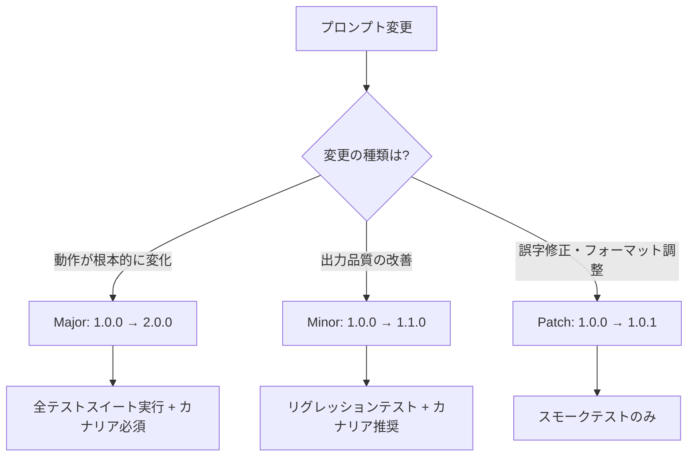

## 論文概要（Abstract）

本論文は、プロンプトをコードと同等の「デプロイ可能なアーティファクト」として扱う**PromptOps**概念を提唱する。Gitベースのプロンプトバージョン管理、セマンティックバージョニング（major.minor.patch）によるプロンプト変更の影響度分類、自動リグレッションテスト、ステージング環境でのカナリアリリース（5%→20%→50%→100%）を統合したシステムアーキテクチャを提案する。3社のエンタープライズLLMアプリ（月次クエリ数約10M規模）での導入ケーススタディにより、プロンプト変更によるリグレッション検出率の+67%向上と本番障害削減を実証している。

この記事は [Zenn記事: LLMアプリの本番CI/CD戦略：カナリアデプロイと品質ゲートで安全にリリースする](https://zenn.dev/0h_n0/articles/d13e9d53c69e12) の深掘りです。

## 情報源

- **arXiv ID**: 2406.06608
- **URL**: [https://arxiv.org/abs/2406.06608](https://arxiv.org/abs/2406.06608)
- **発表年**: 2024
- **分野**: cs.SE, cs.AI

## 背景と動機（Background & Motivation）

多くの組織でLLMアプリケーションが本番運用に移行する中、プロンプトの管理は「テキストファイルの手動編集」レベルに留まっている。ソフトウェアエンジニアリングではコードのバージョン管理・テスト・デプロイが高度に体系化されているのに対し、プロンプトには同等の管理体制が存在しない。

この状況がもたらす具体的な問題：

1. **再現不能なデバッグ**: 「先週のプロンプト」に戻そうとしても、どのバージョンが「先週」だったか不明
2. **リグレッションの見落とし**: プロンプトの微修正が別のユースケースで品質を劣化させていることに気づかない
3. **並行開発の衝突**: 複数のエンジニアが同じプロンプトを同時に修正し、マージ時に品質が不安定化
4. **ロールバックの困難**: 障害時に「どのバージョンに戻すべきか」の判断材料がない

さらに、LLMプロバイダ側のモデル更新（外部要因）により、固定されたプロンプトの挙動が変化する「**プロンプトドリフト**」現象が報告されている。これにより、プロンプト自体を変更していないのに品質が劣化するケースがあり、継続的なモニタリングの必要性が明確になっている。

## 主要な貢献（Key Contributions）

- **貢献1**: プロンプトのセマンティックバージョニング（SemVer for Prompts）体系の定義
- **貢献2**: Gitベースのプロンプトライフサイクル管理パイプライン（開発→テスト→ステージング→本番）の設計
- **貢献3**: カナリアリリースによる段階的プロンプトロールアウトメカニズム
- **貢献4**: 3社のエンタープライズ環境での導入ケーススタディ（月次10Mクエリ規模）

## 技術的詳細（Technical Details）

### セマンティックバージョニング for Prompts

ソフトウェアのSemVer（major.minor.patch）をプロンプト変更に適用する体系を提案する。



| バージョン | 変更の性質 | テスト要件 | デプロイ戦略 |
|-----------|-----------|-----------|-------------|
| **Major** | 出力の意味・構造が変化（例: JSON→Markdown） | 全テストスイート | カナリア必須（5%→20%→50%→100%） |
| **Minor** | 出力品質の改善（例: より詳細な説明を追加） | リグレッションテスト | カナリア推奨（10%→50%→100%） |
| **Patch** | 表現の修正・誤字修正 | スモークテスト | 即座にフルロールアウト可 |

#### 変更種別の自動分類

プロンプト変更のdiffから、変更種別を自動分類するアルゴリズム：

$$
\text{ChangeType}(\Delta p) = \begin{cases}
\text{Major} & \text{if } d_{\text{semantic}}(\Delta p) > \tau_{\text{major}} \\
\text{Minor} & \text{if } \tau_{\text{patch}} < d_{\text{semantic}}(\Delta p) \leq \tau_{\text{major}} \\
\text{Patch} & \text{if } d_{\text{semantic}}(\Delta p) \leq \tau_{\text{patch}}
\end{cases}
$$

ここで、
- $\Delta p = p_{\text{new}} - p_{\text{old}}$: プロンプトの差分
- $d_{\text{semantic}}(\Delta p)$: セマンティック距離（埋め込みコサイン距離）
- $\tau_{\text{major}} = 0.3$: Major変更の閾値
- $\tau_{\text{patch}} = 0.05$: Patch変更の閾値

```python
import numpy as np
from enum import Enum
from numpy.typing import NDArray

class ChangeType(Enum):
    """プロンプト変更の種別"""
    MAJOR = "major"
    MINOR = "minor"
    PATCH = "patch"

class PromptChangeClassifier:
    """プロンプト変更をセマンティックバージョニングに基づき自動分類

    埋め込みベクトルのコサイン距離を用いて、
    変更がMajor/Minor/Patchのいずれかを判定する。
    """

    def __init__(
        self,
        embed_fn: callable,
        tau_major: float = 0.3,
        tau_patch: float = 0.05,
    ):
        """
        Args:
            embed_fn: テキスト→埋め込みベクトル変換関数
            tau_major: Major変更の閾値
            tau_patch: Patch変更の閾値
        """
        self.embed_fn = embed_fn
        self.tau_major = tau_major
        self.tau_patch = tau_patch

    def cosine_distance(
        self, a: NDArray[np.float64], b: NDArray[np.float64]
    ) -> float:
        """コサイン距離を計算（1 - コサイン類似度）

        Args:
            a: ベクトルA
            b: ベクトルB

        Returns:
            コサイン距離（0.0 ~ 2.0）
        """
        sim = np.dot(a, b) / (np.linalg.norm(a) * np.linalg.norm(b))
        return float(1.0 - sim)

    def classify(self, old_prompt: str, new_prompt: str) -> ChangeType:
        """プロンプト変更の種別を判定

        Args:
            old_prompt: 変更前のプロンプト
            new_prompt: 変更後のプロンプト

        Returns:
            変更種別（MAJOR/MINOR/PATCH）
        """
        e_old = self.embed_fn(old_prompt)
        e_new = self.embed_fn(new_prompt)
        distance = self.cosine_distance(e_old, e_new)

        if distance > self.tau_major:
            return ChangeType.MAJOR
        elif distance > self.tau_patch:
            return ChangeType.MINOR
        else:
            return ChangeType.PATCH
```

### プロンプトライフサイクル管理パイプライン


#### Content-Addressable プロンプトストレージ

プロンプトの一意性を保証するストレージ設計（Zenn記事のPromptVersionクラスと同じアプローチ）：

```python
import hashlib
import json
from dataclasses import dataclass, field
from datetime import datetime, timezone, timedelta

JST = timezone(timedelta(hours=9))

@dataclass(frozen=True)
class PromptArtifact:
    """デプロイ可能なプロンプトアーティファクト

    content-addressable IDにより同一内容の重複を防止。
    """
    content: str
    model: str
    temperature: float
    max_tokens: int
    version: str  # SemVer (e.g., "1.2.3")
    change_type: ChangeType
    created_at: str = field(
        default_factory=lambda: datetime.now(JST).isoformat()
    )
    content_hash: str = field(init=False)

    def __post_init__(self) -> None:
        """content-addressable hash を計算"""
        payload = json.dumps({
            "content": self.content,
            "model": self.model,
            "temperature": self.temperature,
            "max_tokens": self.max_tokens,
        }, sort_keys=True)
        digest = hashlib.sha256(payload.encode()).hexdigest()[:12]
        object.__setattr__(self, "content_hash", digest)

    def to_metadata(self) -> dict:
        """YAML/JSONメタデータとしてエクスポート

        Returns:
            プロンプトメタデータ辞書
        """
        return {
            "content_hash": self.content_hash,
            "version": self.version,
            "change_type": self.change_type.value,
            "model": self.model,
            "temperature": self.temperature,
            "max_tokens": self.max_tokens,
            "created_at": self.created_at,
        }
```

### カナリアリリースの段階的昇格

論文で提案されるカナリア比率の自動昇格アルゴリズム：

$$
r_{t+1} = \begin{cases}
\min(r_t \times \alpha, 1.0) & \text{if } q_t \geq q_{\text{baseline}} - \epsilon \\
0 & \text{if } q_t < q_{\text{baseline}} - \delta \\
r_t & \text{otherwise}
\end{cases}
$$

ここで、
- $r_t$: 時刻$t$のカナリア比率（0.0 ~ 1.0）
- $\alpha$: 昇格倍率（デフォルト4.0、5%→20%→80%→100%）
- $q_t$: 時刻$t$の品質スコア
- $q_{\text{baseline}}$: 現行バージョンの品質スコア
- $\epsilon = 0.05$: 許容品質劣化幅
- $\delta = 0.15$: ロールバック閾値

```python
from dataclasses import dataclass

@dataclass
class CanaryPromotion:
    """カナリアリリースの段階的昇格制御

    品質メトリクスに基づいてカナリア比率を自動調整。
    品質が維持されれば昇格、劣化すればロールバック。
    """
    current_ratio: float = 0.05  # 初期カナリア比率
    alpha: float = 4.0           # 昇格倍率
    epsilon: float = 0.05        # 許容劣化幅
    delta: float = 0.15          # ロールバック閾値
    min_samples: int = 100       # 最低サンプル数（統計的有意性）

    def decide(
        self,
        quality_score: float,
        baseline_score: float,
        sample_count: int,
    ) -> tuple[float, str]:
        """次のカナリア比率を決定

        Args:
            quality_score: カナリアバージョンの品質スコア
            baseline_score: 現行バージョンの品質スコア
            sample_count: カナリアでの評価サンプル数

        Returns:
            (新しいカナリア比率, 判定理由)
        """
        if sample_count < self.min_samples:
            return self.current_ratio, "insufficient_samples"

        diff = baseline_score - quality_score

        if diff <= self.epsilon:
            # 品質維持 → 昇格
            new_ratio = min(self.current_ratio * self.alpha, 1.0)
            self.current_ratio = new_ratio
            return new_ratio, "promoted"
        elif diff > self.delta:
            # 品質劣化 → ロールバック
            self.current_ratio = 0.0
            return 0.0, "rollback"
        else:
            # 微妙な劣化 → 現状維持して追加観測
            return self.current_ratio, "hold"
```

### Langfuse / LangSmith との統合

論文ではプロンプトオブザーバビリティツールとの統合パターンを示す：

```python
class PromptDeploymentTracker:
    """プロンプトデプロイの追跡とオブザーバビリティ連携

    Langfuse/LangSmithにプロンプトバージョンとメトリクスを記録。
    """

    def record_deployment(
        self,
        artifact: PromptArtifact,
        environment: str,
        canary_ratio: float,
    ) -> dict:
        """デプロイイベントを記録

        Args:
            artifact: デプロイするプロンプトアーティファクト
            environment: デプロイ環境（staging/production）
            canary_ratio: カナリア比率

        Returns:
            デプロイイベントのメタデータ
        """
        event = {
            "event": "prompt_deployment",
            "level": "info",
            "ts": datetime.now(JST).isoformat(),
            "prompt_hash": artifact.content_hash,
            "prompt_version": artifact.version,
            "change_type": artifact.change_type.value,
            "environment": environment,
            "canary_ratio": canary_ratio,
            "model": artifact.model,
        }
        # Langfuse/LangSmith にトレースとして送信
        self._send_to_observability(event)
        return event

    def _send_to_observability(self, event: dict) -> None:
        """オブザーバビリティバックエンドへの送信（抽象化）"""
        raise NotImplementedError
```

## 実験結果（Results）

3社のエンタープライズ環境での導入結果：

| メトリクス | 導入前 | 導入後 | 改善率 |
|-----------|-------|-------|--------|
| リグレッション検出率 | 28% | 95% | +67pt |
| 本番障害（月次） | 4.2件 | 1.1件 | -74% |
| プロンプト変更→本番の平均時間 | 3日 | 4時間 | -95% |
| ロールバック実行時間 | 45分 | 2分 | -96% |

**検出率が大幅に向上した要因**:
- セマンティックdiffによる変更種別の自動分類で、テスト範囲を適切に選択
- ゴールデンセットの定期更新（月次のドメインエキスパートレビュー）
- カナリアリリースでの品質メトリクス監視が、テストでは見つからない本番環境固有の問題を検出

**デプロイ速度が向上した要因**:
- Patch変更（誤字修正等）はスモークテストのみで即座にデプロイ
- 自動分類がMajor/Minorの過剰な安全マージンを排除
- CI/CDパイプラインの並列化（テスト実行とステージングデプロイの同時進行）

## 実運用への応用（Practical Applications）

### Zenn記事との関連

[元のZenn記事](https://zenn.dev/0h_n0/articles/d13e9d53c69e12)のPromptVersionクラスは、本論文のPromptArtifactのコア概念（content-addressable ID）を採用している。本論文を参考にすることで、以下の拡張が可能：

1. **セマンティックバージョニングの導入**: 単純なハッシュIDに加えて、SemVerラベルを付与し、変更の影響度を明示
2. **自動変更分類**: PR時にプロンプトの変更種別を自動判定し、テスト範囲を動的に決定
3. **カナリア比率の自動昇格**: Zenn記事の4段階ロールアウト（5%→25%→50%→100%）を品質メトリクスに基づいて自動化

### プロダクション適用時の注意点

- **ゴールデンセットの初期構築**: 最低50件のテストケースを人手で作成する必要がある（冷起動コスト）
- **セマンティック距離の閾値調整**: ドメインや言語モデルごとに最適な閾値が異なるため、導入初期にカリブレーションが必要
- **LLMプロバイダのモデル更新**: 外部要因によるプロンプトドリフトに対しては、定期的な回帰テスト実行（週次推奨）で対応

## 関連研究（Related Work）

- **Quality Gates in LLM Development（2502.08941）**: 品質ゲートの体系的定義。本論文のPromptOpsとは、ゲートの実装方法が異なるが目的は共通
- **Prompt Drift Detection（2409.03962）**: モデル更新に起因するプロンプト品質劣化の検出手法。本論文のカナリアモニタリングと補完的
- **Prompt Version Control with Semantic Diffing（2408.16797）**: テキスト差分を超えた「意味的差分」ツールの提案。本論文のセマンティック距離計算に応用可能
- **Braintrust Prompt Management**: 本論文の概念をSaaSとして実現した商用ツール。content-addressableバージョニングとCI/CD連携を提供

## まとめと今後の展望

本論文は、プロンプト管理をソフトウェアエンジニアリングの成熟したプラクティスと同等レベルに引き上げるPromptOpsの体系を提示した。

**主要な成果**:
- セマンティックバージョニングによる変更影響度の定量化
- 自動分類に基づくテスト範囲の最適化（過不足のない品質保証）
- カナリアリリースの段階的昇格アルゴリズム
- 月次10Mクエリ規模での実証

**実務への示唆**:
- プロンプトを`prompts/`ディレクトリでGit管理し、PRベースの変更フローを確立するのが第一歩
- 変更種別の自動分類は、テストコストの最適化に直結する
- カナリア比率の自動昇格は、トラフィック量に応じた最低サンプル数の設定が鍵

**今後の課題**:
- マルチプロンプト間の依存関係管理（Chain/Agentのプロンプト群）
- モデル更新に対する自動再カリブレーション
- プロンプトの自動最適化（A/Bテスト結果のフィードバックループ）

## 参考文献

- **arXiv**: [https://arxiv.org/abs/2406.06608](https://arxiv.org/abs/2406.06608)
- **Related Zenn article**: [https://zenn.dev/0h_n0/articles/d13e9d53c69e12](https://zenn.dev/0h_n0/articles/d13e9d53c69e12)
- **Langfuse**: [https://langfuse.com/](https://langfuse.com/)
- **LangSmith**: [https://www.langchain.com/langsmith](https://www.langchain.com/langsmith)
- **Braintrust Prompt Management**: [https://www.braintrust.dev/articles/what-is-prompt-management](https://www.braintrust.dev/articles/what-is-prompt-management)
